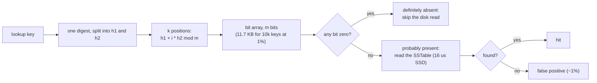
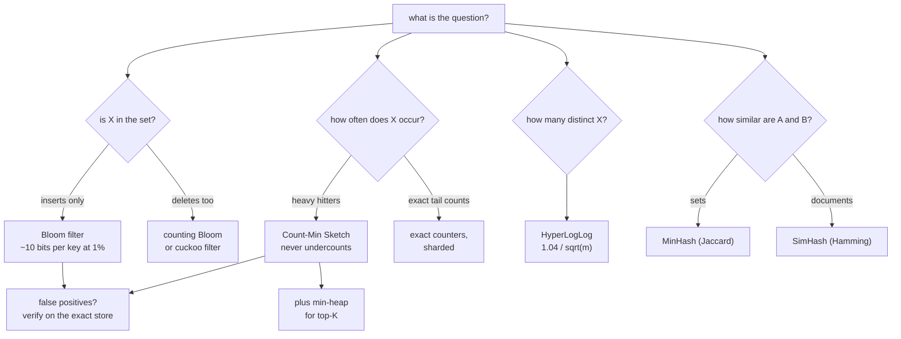

# Probabilistic data structures

## TL;DR

- Sketches trade a small, bounded error for memory that does not grow with the number of keys: membership in ~10 bits per item, frequencies in ~50 KB, distinct counts in 16 KB.
- Bloom filters never miss a member; Count-Min never undercounts; HyperLogLog's error is 1.04/sqrt(m). Know which direction each one errs in and say it.
- They appear wherever exact state would not fit one machine: SSTable lookups, crawler dedup, unique visitors, trending topics, and as the fast path in front of an exact, slower one.

## Core concepts

A sketch is a fixed-size summary that answers one kind of question approximately. The interview move is always the same: name the question (is it present, how often, how many distinct), name the error direction and its bound, and size the structure from the formula. Exact structures scale with the keys: a set of 1B crawled URLs at ~100 B each is 100 GB; a Bloom filter for the same set at 1% false positives is 1B x 9.6 bits = 1.2 GB, on one machine.

### Bloom filter: sizing m and k, false-positive rate

A Bloom filter is ``m`` bits and ``k`` hash functions. Inserting an item sets its ``k`` bits; a lookup reads them: any zero means "definitely absent", all ones mean "probably present". False positives come from other items having set the same bits; false negatives cannot happen, because bits are never cleared. After ``n`` insertions the false-positive rate is ``(1 - e^(-kn/m))^k``. Solve it backwards to size the filter: ``m = -n ln p / (ln 2)^2`` and ``k = (m/n) ln 2``. For 10,000 items at 1% that is 95,851 bits (11.7 KB) and 7 hashes, about 9.6 bits per item regardless of how long the items are; 0.1% costs ~14.4 bits per item. The optimal ``k`` leaves half the bits set, which is a quick health check: a fill ratio far above 0.5 means the filter is overfull and its real error is ``fill_ratio^k``. Size for the peak count, not the average: the demo below shows 1% turning into 16% at twice the capacity.

Two engineering details. Hash once, not ``k`` times: double hashing, ``h1 + i x h2 mod m``, derives the ``k`` positions from one digest with no loss in accuracy. And use a stable hash (MurmurHash3, xxHash; MD5 in the demo for clarity), never the language's salted ``hash()``, because every process must compute the same bits.

**One lookup, seven bit positions: a zero anywhere means the key is certainly absent.**



### Counting Bloom and cuckoo filters

A plain Bloom filter cannot delete: clearing one item's bits would erase other items that share them. A counting Bloom filter keeps a small counter (4 bits in practice) per position, increments on insert and decrements on delete, at 4-8x the memory; removing an item that was never inserted still corrupts neighbours, so only delete what you know you added. A cuckoo filter stores short fingerprints in a cuckoo hash table instead: it supports deletes, beats Bloom on space below about 3% error, and has better cache locality, at the cost of a load factor limit and occasional insertion failure when the table is nearly full. In an interview, offer the counting filter for deletes and mention cuckoo as the modern alternative.

### Count-Min Sketch: frequencies and heavy hitters

A Count-Min Sketch is ``d`` rows of ``w`` counters with a different hash per row. Each event increments one counter per row; an estimate is the minimum over the rows. Collisions only ever add, so the estimate is never below the truth, and it exceeds it by at most ``eps x N`` (``N`` is the total event count) with probability ``1 - delta`` when ``w = e/eps`` and ``d = ln(1/delta)``. For ``eps = 0.001`` and ``delta = 0.01`` that is 2,719 x 5 = 13,595 counters, ~53 KB with 4-byte counters, for any number of distinct keys. The error is relative to the whole stream, which is why the sketch is good at heavy hitters and useless for the tail: a key seen 7,000 times in a 50,000-event stream is off by at most 50, a key seen 3 times may read as 40. Sketches of the same shape merge counter by counter, so each shard keeps its own and a coordinator sums them.

Top-K is a sketch plus a min-heap of ``k`` candidates: for each event, update the sketch, read the estimate, and if it beats the smallest candidate, evict that one. Memory is the sketch plus ``k`` entries, independent of the key space, and per-shard top-K lists merge by re-ranking the union of candidates ([Design a Top-K heavy hitters service](../case-studies/top-k-heavy-hitters.md)). At the metrics scale of 1M events/s, exact counters for 100M distinct keys would be gigabytes per window; the sketch stays at 53 KB per window.

### HyperLogLog: cardinality with 1.04/sqrt(m) error

HyperLogLog counts distinct items by observing rare hash patterns. Hash each item to 64 bits; the first ``p`` bits pick one of ``m = 2^p`` registers, and the register keeps the longest run of leading zeros (plus one) seen in the rest. A run of ``r`` zeros happens once in ``2^r`` items, so a register that has seen rank 17 has probably seen ~2^16 distinct values; averaging ``m`` registers with a harmonic mean and a bias constant gives the estimate, with a relative standard error of ``1.04/sqrt(m)``. With ``p = 14`` that is 16,384 one-byte registers, 16 KB, and 0.81% error; ``p = 10`` is 1 KB and 3.25%. Note what the bound means: one standard deviation, so a third of runs sit outside it, as the ``p = 10`` line in the demo does. Duplicates are free because a repeated item sets the same register to the same rank, and for small cardinalities the estimator switches to linear counting on the empty registers, which is why 1,000 items read as 999. Registers merge by element-wise maximum, so the union of per-shard or per-day sketches is exact set union without moving items: daily sketches roll up into monthly uniques.

The arithmetic that sells it: 300M DAU as 16 B ids is 4.8 GB per day for one exact distinct count; with 1,000 breakdowns (page x country) it is 4.8 TB. HyperLogLog is 16 KB per breakdown, 16 MB in total, with an 0.81% error that analytics accepts.

### MinHash and SimHash

Two sketches answer "how similar" rather than "how many". MinHash keeps the minimum hash of a set under ``k`` hash functions; the fraction of matching minima between two sets estimates their Jaccard similarity, so near-duplicate documents or users with overlapping interests are found by comparing signatures of a few hundred bytes instead of the sets. SimHash folds a document's weighted features into one 64-bit fingerprint whose Hamming distance tracks cosine similarity; a crawler drops a page whose fingerprint is within a few bits of one it has stored. Name them when the interviewer asks about near-duplicate detection; do not derive them.

### Where they sit in a design

- **SSTables**: a point read that misses must check every level, and each check is an SSD random read of ~16 µs, so ten SSTables cost ~160 µs per miss. A Bloom filter per SSTable at ~10 bits per key answers in ~7 memory references, under 1 µs, and skips ~99% of those reads ([Storage engines and indexing](storage-engines-and-indexing.md)).
- **Cache and shortener misses**: a filter of existing keys in front of the store turns a lookup for a non-existent short code into a memory check instead of a cache miss plus a database read; since the key space only grows, rebuild the filter on a schedule and accept the 1% that go through.
- **Crawler dedup**: the URL-seen set is a Bloom filter (a 1% false positive skips a page you would have crawled, which is harmless); content dedup is SimHash.
- **Unique visitors and trending**: HyperLogLog per key and window for uniques, Count-Min plus a heap for top-K, both merged across shards and windows.

**Pick the sketch from the question, and keep an exact path when the answer must be right.**



## Trade-offs

| Structure | Question | Error direction | Size for the example | Deletes | Merge | Typical use |
|---|---|---|---|---|---|---|
| Bloom filter | membership | false positives only | 11.7 KB for 10k keys at 1% | no | bitwise OR | SSTable lookups, crawler URL-seen, cache-miss shield |
| Counting Bloom | membership | false positives only | 4-8x a Bloom filter | yes | counter sum | sets that churn |
| Cuckoo filter | membership | false positives only | below Bloom under ~3% error | yes | no | same as Bloom, with deletes |
| Count-Min Sketch | frequency | overcount by <= eps x N | 53 KB at eps 0.001, delta 0.01 | no | counter sum | heavy hitters, rate spikes, top-K with a heap |
| HyperLogLog | distinct count | +/- 1.04/sqrt(m), both ways | 16 KB at p = 14 (0.81%) | no | register max | unique visitors, distinct IPs, per-shard roll-ups |
| MinHash / SimHash | similarity | estimate of Jaccard / cosine | hundreds of bytes per item | n/a | n/a | near-duplicate detection |
| Exact set or map | any | none | grows with keys (4.8 GB for 300M ids) | yes | union | when the answer must be right |

Start from whether a wrong answer is recoverable. A Bloom filter in front of a store is always safe because the store corrects the 1%: the filter only changes cost, never correctness. A Count-Min estimate is safe for ranking and alerting, where "top 10, each within 50 of its true count" is the requirement, and unsafe for billing, where a 0.1% overcount is a dispute. HyperLogLog is fine for dashboards and capacity planning at 1% and wrong for anything contractual. When the answer must be exact but the data is too large for one machine, combine: the sketch serves the hot, approximate query and an exact, sharded path (a counter per key in a key-value store, a set in a database) reconciles asynchronously, which is the fast-path-slow-path shape of the top-K and ad-click case studies. Choose the parameters from the formula, state the memory and the error in the same sentence, and say which direction the error goes; that sentence is most of the credit.

## Python implementation

Three single-file modules, each with a seeded test that measures the error against the formula. The Bloom filter sizes itself with the closed-form ``m`` and ``k`` and derives positions by double hashing:

```python title="code/hld/bloom_filter.py — sizing and hashing"
--8<-- "code/hld/bloom_filter.py:sizing"
```

``BloomFilter`` packs bits into a ``bytearray`` and exposes the live fill ratio; ``CountingBloomFilter`` swaps bits for byte counters and refuses to remove what was never added:

```python title="code/hld/bloom_filter.py — the filters"
--8<-- "code/hld/bloom_filter.py:bloom"
```

```python title="code/hld/bloom_filter.py — counting variant"
--8<-- "code/hld/bloom_filter.py:counting"
```

`uv run python -m hld.bloom_filter` prints:

```text
sizing: 10,000 items at 1% -> m=95,851 bits (11.7 KB), k=7, 9.6 bits per item
no false negatives: 10,000/10,000 members found
false positives at capacity: 1.04% measured vs 1.00% formula, fill ratio 0.519
false positives at 2x capacity: 15.6% measured vs 15.7% formula (size for the peak, not the average)
counting filter: 93.6 KB, after remove('bob'): alice=True bob=False carol=True
```

The sketch derives width and depth from ``eps`` and ``delta``; ``estimate`` is the row minimum and ``merge`` sums shards:

```python title="code/hld/count_min_sketch.py — the sketch"
--8<-- "code/hld/count_min_sketch.py:sketch"
```

``TopK`` keeps candidates in a dict and a min-heap with lazy invalidation, so an update costs one heap push and eviction reads the heap top:

```python title="code/hld/count_min_sketch.py — CMS plus heap"
--8<-- "code/hld/count_min_sketch.py:topk"
```

`uv run python -m hld.count_min_sketch` prints (a seeded Zipf stream of 50,000 events over 10,000 keys):

```text
sketch: eps=0.001, delta=0.01 -> width=2,719 x depth=5 = 13,595 counters (53 KB) for 5,512 distinct keys
N=50,000 events, error bound eps*N=50
  k0     estimate= 7,594 exact= 7,594
  k1     estimate= 3,499 exact= 3,499
  k2     estimate= 2,214 exact= 2,214
  k3     estimate= 1,618 exact= 1,618
  k4     estimate= 1,379 exact= 1,377
overestimate over all keys: max=11, mean=0.87, never negative=True, beyond the bound: 0 (allowed: 1% of keys = 55)
top-5 by sketch == top-5 exact: True
```

HyperLogLog keeps one byte per register, switches to linear counting while most registers are empty, and merges by maximum:

```python title="code/hld/hyperloglog.py"
--8<-- "code/hld/hyperloglog.py:hll"
```

`uv run python -m hld.hyperloglog` prints:

```text
p=14: m=16,384 registers (16 KB), error bound 0.81%; p=10: m=1,024 (1 KB), bound 3.25%
p=14, 300,000 adds: estimate 200,711 vs exact 200,000 (error 0.36%)
p=10, 300,000 adds: estimate 190,663 vs exact 200,000 (error 4.67%)
p=14, small range (linear counting): estimate 999 vs exact 1,000 (error 0.10%)
merge of two shards (60k + 60k, 20k shared): estimate 101,138 vs exact 100,000 (error 1.14%)
```

## In the interview

Bring a sketch in when you have just said the exact structure does not fit: "A set of every URL we have seen is 100 GB at a billion URLs; a Bloom filter at 1% false positives is 1.2 GB in memory, and a false positive only means we skip one page."

Phrases that signal depth: "about ten bits per key at 1%, no false negatives"; "the Count-Min error is eps times the total count, so it is tight for heavy hitters and loose for the tail"; "16 KB per HyperLogLog at 0.8%, and they merge by register max, so shards and days roll up for free".

??? question "How do you size a Bloom filter for 100M keys at 0.1% false positives?"
    ``m = -n ln p / (ln 2)^2`` = 100M x 6.9 / 0.48 = ~1.44 billion bits = ~172 MB, ``k`` = 10. Fits in memory on one node; at 1% it would be ~120 MB with 7 hashes.

??? question "The filter is full and the false-positive rate has climbed to 10%. What now?"
    Bloom filters do not resize. Rebuild a larger one from the source of truth, or use scalable Bloom filters: a chain of filters with geometrically tighter error, where lookups check every filter and inserts go to the newest.

??? question "Why can a Count-Min Sketch overcount but never undercount?"
    Every event increments its counter in each row, so each counter holds the true count of its key plus collisions, which are never negative. The minimum over rows keeps the smallest pile of collisions, hence the ``eps x N`` bound with probability ``1 - delta``.

??? question "How would you get unique visitors per page per day and per month?"
    One HyperLogLog per page per day, 16 KB each; a month is the register-wise max of 30 daily sketches, which is exact set union with the same 0.81% error. Per-shard sketches merge the same way.

??? question "What breaks if two services compute the filter with different hash functions?"
    The bits no longer mean the same thing: a key inserted by one service is "absent" for the other, a false negative that the data structure promised never to give. Fix the hash function and seed in the schema, not in the code.

!!! tip "Interview tip"
    Give the error direction with the structure, every time: "Bloom: false positives only", "Count-Min: overcounts only", "HyperLogLog: about 1% either way". Interviewers use that sentence to separate candidates who have used these from candidates who have read about them.

## Common mistakes

- **Using a Bloom filter where a false positive is unsafe**: a "probably present" that skips a write or grants access. Fix: place the filter where the exact store still checks, so it changes cost, not answers.
- **Deleting from a plain Bloom filter**: clearing bits creates false negatives for other keys. Fix: a counting or cuckoo filter, or rebuild.
- **Reporting Count-Min estimates for the long tail**: a key seen three times reads as forty. Fix: use the sketch for heavy hitters and thresholds, and keep exact counts for what must be exact.
- **Quoting HyperLogLog's 1.04/sqrt(m) as a maximum error**: it is one standard deviation. Fix: say "about 1% typical, a few percent worst case" and choose ``p`` with that margin.
- **Sizing for today's key count**: the filter cannot grow, and at twice the capacity 1% becomes 16%. Fix: size for the projected peak and schedule a rebuild.

!!! warning "Common mistake"
    Saying "I'll use a Bloom filter" without the numbers. The structure is only worth mentioning with its size and error attached: "10 bits per key, 1% false positives, 1.2 GB for a billion URLs". Without them it is a buzzword, and the follow-up question will expose that.

## Self-check

??? question "Why does the optimal k leave half the bits set?"
    The false-positive rate is minimised when each bit is set with probability 1/2: fewer set bits waste space, more make every lookup collide. A fill ratio far from 0.5 means the filter is under- or over-sized.

??? question "What does eps x N mean in practice for a 1B-event stream?"
    With ``eps = 0.001`` every estimate is within 1M of the truth, which is fine for a key seen 50M times and meaningless for one seen 100 times. The bound scales with the stream, not the key.

??? question "How does HyperLogLog count 200,000 items with 16 KB?"
    Each register remembers only the longest run of leading zeros it has seen, one byte. The estimate comes from the distribution of those maxima over 16,384 registers, not from the items themselves.

??? question "When do you pick a cuckoo filter over a counting Bloom filter?"
    When you need deletes and memory matters: below ~3% error a cuckoo filter is smaller than a plain Bloom filter, while a counting filter costs 4-8x one. Accept the load-factor limit and the rare insert failure.

??? question "How do per-shard sketches become a global answer?"
    Bloom filters OR their bits, Count-Min sketches add counters, HyperLogLogs take the register maximum; all three need identical parameters and hash functions across shards. Top-K merges candidate lists and re-ranks.

## Related

- [Design a Top-K heavy hitters service](../case-studies/top-k-heavy-hitters.md) — CMS plus heap per window, merged across shards
- [Design a web crawler](../case-studies/web-crawler.md) — URL-seen Bloom filter and SimHash content dedup
- [Storage engines and indexing](storage-engines-and-indexing.md) — Bloom filters in front of SSTables
- [Design a URL shortener](../case-studies/url-shortener.md) — shielding the store from lookups of codes that do not exist
- Bloom, "Space/Time Trade-offs in Hash Coding with Allowable Errors" (CACM 1970)
- Cormode and Muthukrishnan, "An Improved Data Stream Summary: The Count-Min Sketch and its Applications" (2005)
- Flajolet, Fusy, Gandouet and Meunier, "HyperLogLog: the analysis of a near-optimal cardinality estimation algorithm" (2007)
