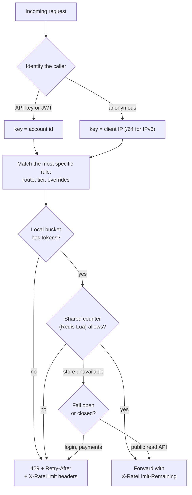
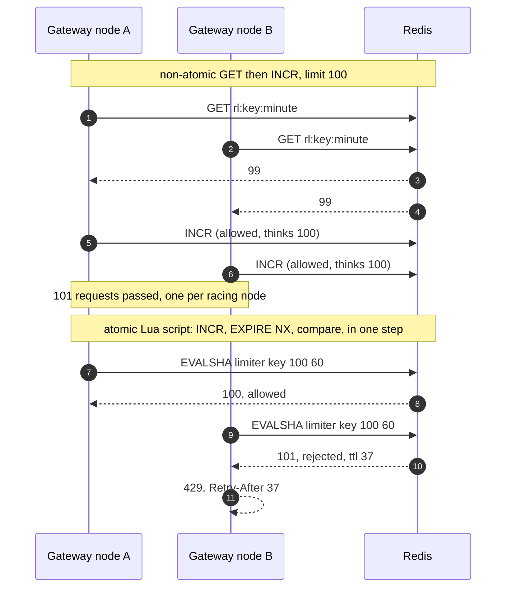

# Rate limiting

## TL;DR

- A rate limiter bounds how many requests a caller may make per unit of time, protecting capacity, cost and fairness; it answers allow or reject, plus when to retry.
- The algorithm decides burst behaviour and memory: token bucket for bursts, leaky bucket for smoothing, windows for cheap counters.
- Interviewers probe the 2x boundary burst, the check-then-increment race across gateway nodes, what the limiter does when its store is down, and how a client is supposed to behave after a 429.

## Core concepts

A limiter exists because capacity is finite and shared: one misbehaving client at a ~1k QPS app tier can take the whole tier, and a scraper can run up a bill. The limiter must be cheaper than the request it protects — an in-memory decision costs a few memory references at ~100 ns each; a remote one costs a ~500 µs round trip — and it must fail in a known direction.

### Token bucket

A bucket holds up to `capacity` tokens and refills at `rate` tokens per second; a request takes one token (or its cost) and is rejected when none is left. Refill is computed lazily from the elapsed time, so the state per key is two numbers and no timer. The capacity is the burst a quiet client may send at once, the rate is the sustained ceiling: capacity 100 and rate 10/s lets a client send 100 requests instantly, then 10/s forever. Most public APIs and cloud services describe their limits this way because it models what clients do: idle, then burst.

### Leaky bucket

Requests enter a queue of depth `capacity` that drains at a fixed `rate`; a full queue rejects. As an admission test it passes the same requests as a token bucket, but as a *shaper* it releases them at the constant rate: a burst of 5 at 5/s leaves at 0, 0.2, 0.4, 0.6 and 0.8 s. Use it when the downstream wants smooth traffic — a third-party API with a strict per-second contract, a database you are backfilling — and accept that the queue adds latency equal to the work ahead of you.

### Fixed window counter

Count requests per aligned window (`floor(now / window)`), reset at the boundary. One integer per key and a single atomic `INCR` in Redis make it the cheapest algorithm, and its flaw is the boundary: `limit` requests at 0.9 s and `limit` more at 1.0 s both pass, 2x the limit inside 100 ms. Acceptable for coarse quotas (10k per day), not for protecting a hot path.

### Sliding window log

Keep the timestamps of accepted requests and count those within the trailing window. It is exact and has no boundary effect, at O(limit) memory per key: at 8 B per timestamp, 1,000 per minute for 1M active keys is 8 GB, against a few MB for counters. Reserve it for low limits where exactness matters, such as 5 login attempts per 15 minutes.

### Sliding window counter

Keep the current window's count and the previous window's final count; estimate the trailing window as `previous x overlap + current`, where overlap is the fraction of the previous window still inside the trailing one. Two integers per key, no boundary burst, and an error that assumes the previous window's requests were spread evenly — an error of a few percent in practice, which is why gateways default to it.

### Identification, placement and rules

The key is who you are limiting. An **API key** or a **user id** is the right key once the caller is authenticated; the **client IP** is all you have before authentication and is weak both ways — a corporate NAT puts thousands of users behind one address, and IPv6 hands an attacker billions, so limit IPv6 by /64 prefix and keep IP limits loose. Sensitive endpoints combine keys: login is limited per account *and* per IP.

Placement follows the key. The **gateway** sees every request first, knows the API key, and can reject before a ~1k QPS service spends a thread; it is the place for per-client quotas. A **service** knows the cost of its own operations and protects its dependencies, so expensive endpoints get a second, cost-weighted limit there. Rules are data, not code: a list of `(route, key type, limit, window, algorithm, burst)` entries evaluated most specific first, with per-tier defaults (free 100/min, pro 10k/min) and per-customer overrides.

**One request through a gateway limiter: identify, find the rule, check, answer.**



### Distributed limiting

With N gateway nodes a per-node bucket lets a client through N times the limit, so the state lives in a shared store, usually Redis. Two rules make it correct. First, the check and the increment must be one atomic step: two nodes that each `GET` a count of 99, decide "under 100" and `INCR` both pass, and the race scales with node count. Use `INCR` and compare the returned value, or a Lua script that reads, decides and writes in one server-side step (Redis runs scripts atomically). Second, every counter needs an expiry set in the same step, or a forgotten `EXPIRE` after a crash leaves a key that never resets.

**Two gateway nodes check the same key: a read-then-write race versus an atomic script.**



The shared store is also the cost and the limit. Each decision is a ~500 µs round trip added to every request, and one Redis instance does ~100k ops/s, so a gateway at 175k QPS must shard the counters by key (consistent hashing, each key on one shard) or check less often. The common compromise is **local plus global**: each node keeps a local token bucket sized at a fraction of the limit and synchronises with the shared counter asynchronously, every 100 ms or every k requests. A burst can then overshoot by up to the sum of the local allowances during the sync lag — say so, and size the local share accordingly. When the store is unreachable, decide in advance: **fail open** for public read APIs (serve, log, alert) and **fail closed** for login, signup and payments, where the limiter is a security control.

### Responses and client behaviour

Reject with `429 Too Many Requests` and tell the client what to do: `Retry-After` in seconds, `X-RateLimit-Limit`, `X-RateLimit-Remaining` and `X-RateLimit-Reset` on every response so a well-behaved client slows down *before* the first 429 (the IETF `RateLimit` header fields standardise the same idea). Distinguish 429, the client exceeded its quota, from 503, the server is shedding load, because clients should back off differently. A client that retries a 429 immediately is a retry storm; your SDKs should honour `Retry-After` and add jitter, as in [Resilience patterns](resilience-patterns.md).

### Fairness and burst handling

A single global limit is first come, first served, and one heavy tenant starves the rest. Fairness means a bucket per tenant, then per user within it, and a global cap enforced by **hierarchical** buckets: a request spends a token at each level. Under a global cap, shed the low-priority traffic first (batch exports before interactive reads). Bursts are a dial, not a bug: capacity decides how many requests a quiet client may fire at once, so set it from the client's natural pattern — a page load that fans out into 20 API calls needs a capacity of at least 20 — and let the rate, not the capacity, express the sustained contract.

## Trade-offs

| Algorithm | State per key | Bursts | Boundary error | Accuracy | Redis cost | Use it for |
|---|---|---|---|---|---|---|
| Token bucket | 2 numbers | Up to capacity, at once | None | Exact for rate + burst | One Lua call | Public APIs, per-client quotas |
| Leaky bucket | 2 numbers | Queued, released at the rate | None | Exact | One Lua call | Smoothing calls to a strict downstream |
| Fixed window | 1 integer | Up to 2x limit at the boundary | 2x | Coarse | One INCR | Daily quotas, billing counts |
| Sliding window log | O(limit) timestamps | None beyond the limit | None | Exact | Sorted set ops | Low limits: login, OTP, resets |
| Sliding window counter | 2 integers | Up to the limit, smoothed | Small, assumes even spread | Approximate | Two counters | Gateway defaults at scale |

Choose by what the limit is for. A public API quota is a token bucket: clients burst, the capacity says how much, the rate says how long they can keep it up, and the two numbers are easy to document. A downstream with a hard per-second contract wants a leaky bucket in front of the calls you make to it, because smoothing is the point and the added queueing delay is the price. A daily or monthly quota can be a fixed window; nobody cares about a 2x burst at midnight on a 10k-per-day plan. Security limits on login, signup and password reset are low and must be exact, so a sliding log is affordable and right. Everything else at a busy gateway is a sliding window counter: two integers per key, no boundary burst, and an approximation error that nobody can measure from outside. Whatever you pick, make the check atomic in the shared store, set the expiry in the same step, and decide the fail-open-or-closed policy per endpoint before the store has its first outage.

## Python implementation

`Decision` carries what the HTTP layer needs; `RateLimiter` is the one-method protocol every algorithm implements:

```python title="code/hld/rate_limiters.py — decision and protocol"
--8<-- "code/hld/rate_limiters.py:protocol"
```

Both buckets keep one level and one timestamp per key and compute refill or drain lazily from the elapsed time. The leaky bucket reports the queueing delay of an admitted request:

```python title="code/hld/rate_limiters.py — token and leaky buckets"
--8<-- "code/hld/rate_limiters.py:buckets"
```

The three window algorithms differ only in what they remember: a counter, a log of timestamps, or a counter plus the previous window's total:

```python title="code/hld/rate_limiters.py — window algorithms"
--8<-- "code/hld/rate_limiters.py:windows"
```

`uv run python -m hld.rate_limiters` prints:

```text
limit 5 per second; 7 requests arrive at once at t=0:
  token bucket    : 5 allowed, 2 rejected, Retry-After 0.2 s
  leaky bucket    : 5 allowed, 2 rejected, Retry-After 0.2 s; served at t=0.0, 0.2, 0.4, 0.6, 0.8
  fixed window    : 5 allowed, 2 rejected, Retry-After 1.0 s
  sliding log     : 5 allowed, 2 rejected, Retry-After 1.0 s
  sliding counter : 5 allowed, 2 rejected, Retry-After 1.0 s
boundary burst: 5 requests at t=0.9, 5 at t=1.0, 5 at t=1.5 (allowed counts):
  token bucket    : t=0.9 -> 5  t=1.0 -> 0  t=1.5 -> 3
  leaky bucket    : t=0.9 -> 5  t=1.0 -> 0  t=1.5 -> 3
  fixed window    : t=0.9 -> 5  t=1.0 -> 5  t=1.5 -> 0
  sliding log     : t=0.9 -> 5  t=1.0 -> 0  t=1.5 -> 0
  sliding counter : t=0.9 -> 5  t=1.0 -> 0  t=1.5 -> 2
429 headers after the 6th request in a minute: {'X-RateLimit-Limit': '5', 'X-RateLimit-Remaining': '0', 'Retry-After': '48'}
8 threads x 100 requests, capacity 100, frozen clock: allowed=100 rejected=700
```

The second block is the whole algorithm comparison in three lines: the fixed window lets 10 through in 100 ms, the log lets nothing more through until the first five age out, and the buckets and the sliding counter refill gradually.

## In the interview

Name the limiter as part of the gateway, with its numbers: "Per-API-key token bucket at the gateway, capacity 100, refill 10/s, state in Redis behind a Lua script so the check is atomic, 429 with Retry-After; expensive endpoints get a second, cost-weighted limit in the service." Then say which way it fails when Redis is down.

Phrases that signal depth: "token bucket for bursts, leaky bucket for shaping"; "atomic check-and-increment in one script, never GET then INCR"; "local buckets with global sync, so the overshoot during sync lag is bounded and known".

??? question "Why not a fixed window? It is one INCR."
    The boundary: limit at 0.9 s plus limit at 1.0 s is 2x in 100 ms, which is exactly the burst a hot path cannot take. A sliding window counter is two integers and removes it; a token bucket also gives you an explicit burst size.

??? question "Redis is down. Does the limiter fail open or closed?"
    Per endpoint, decided in advance. Public read APIs fail open: serve, log, alert, fall back to a local bucket. Login, signup and payments fail closed, because there the limiter is a security control and a minute of 429s is cheaper than a credential-stuffing run.

??? question "The gateway does 175k QPS and one Redis does ~100k ops/s. Now what?"
    Shard the counters by key with consistent hashing so each key lives on one shard and the decision stays atomic, or keep a local bucket per node and synchronise with the shared counter asynchronously, accepting a bounded overshoot during the lag.

??? question "Thousands of users share one office IP. How do you avoid limiting them all?"
    Key by account once authenticated and keep IP limits loose and high; for anonymous endpoints, combine IP with a device or session token. For IPv6, limit by /64 so one user cannot rotate through addresses.

??? question "A client hits the limit. What exactly do you return?"
    429 with Retry-After and the X-RateLimit headers, and those headers on successful responses too so the client can slow down before the first rejection. Never queue the request silently at the gateway; the client owns the backoff.

!!! tip "Interview tip"
    Say the fail-open-or-closed policy and the atomicity of the check without being asked. Both are questions every interviewer has ready, and answering them up front turns the limiter from a box into a design.

## Common mistakes

- **GET then INCR**: two nodes read the same count and both allow. Fix: `INCR` and compare the returned value, or a Lua script.
- **INCR without an expiry in the same step**: a crash between `INCR` and `EXPIRE` leaves a key that never resets. Fix: set the TTL atomically (`SET NX EX` or in the script).
- **A fixed window on a hot path**: 2x the limit at every boundary. Fix: sliding window counter or token bucket.
- **Limiting by IP only**: offices and carriers share addresses, attackers do not. Fix: key by account; IP as a loose outer bound.
- **No Retry-After**: clients retry immediately and the rejection traffic exceeds the original. Fix: always send it, and ship SDKs that honour it with jitter.
- **Limiting after the expensive work**: authenticating, parsing and routing a request, then rejecting it. Fix: identify cheaply and limit first.

!!! warning "Common mistake"
    A read-then-write check against the shared counter. It looks correct in a single-node test and quietly lets through one extra request per racing node under load, which is precisely when the limit matters. The check and the increment must be one atomic operation in the store.

## Self-check

??? question "Capacity 100, rate 10/s. What can an idle client do?"
    Send 100 requests at once, then 10 per second; after 10 idle seconds it has 100 again.

??? question "Why does the sliding window counter need only two integers, and where is it wrong?"
    It keeps the current count and the previous window's total, weighted by overlap. It assumes the previous window's requests were evenly spread, so a burst at its very end is under-counted.

??? question "What does a sliding log cost for 1M keys at 1,000 per minute?"
    1M x 1,000 x 8 B timestamps = 8 GB, against a few MB for counters, which is why it suits low limits only.

??? question "Why must the counter's expiry be set in the same step as the increment?"
    A crash or timeout between the two leaves a counter without a TTL; it never resets and the key is limited forever, or it leaks memory across millions of keys.

??? question "What is the difference between 429 and 503 for the client?"
    429 means this caller exceeded its quota: back off for Retry-After. 503 means the server is shedding load for everyone: back off with exponential delay and jitter, and expect it to clear.

## Related

- [Design a distributed rate limiter](../case-studies/rate-limiter.md) — the full system around these algorithms
- [Design a rate limiter (LLD)](../../lld/problems/rate-limiter-lld.md) — the class design and strategy pattern
- [API design for HLD rounds](api-design.md) — where 429 and the headers fit in the contract
- [Resilience patterns](resilience-patterns.md) — backoff, jitter and retry budgets on the client side
- [Load balancing, reverse proxies and API gateways](load-balancing-and-api-gateway.md) — the gateway that hosts the limiter
- RFC 6585, "Additional HTTP Status Codes" (429 Too Many Requests)
- IETF draft, "RateLimit header fields for HTTP"
- Redis documentation, "INCR" (the rate limiter pattern) and "Scripting with Lua"
