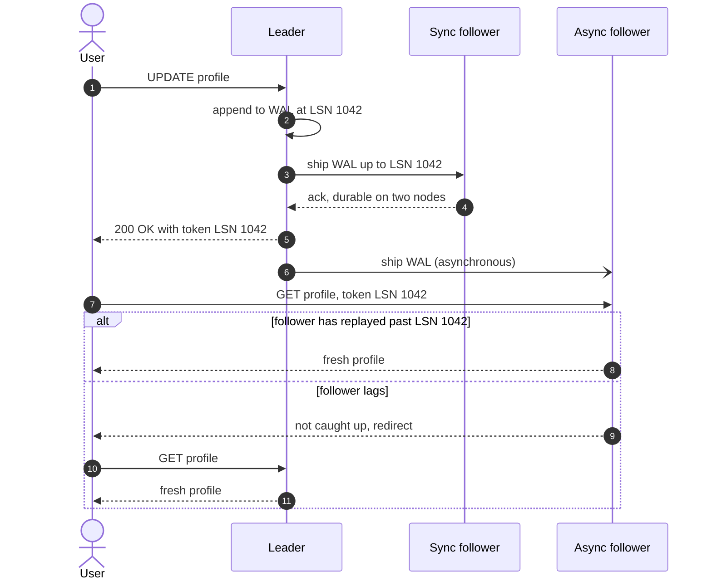
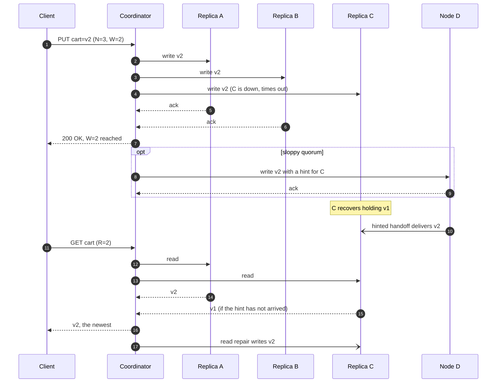
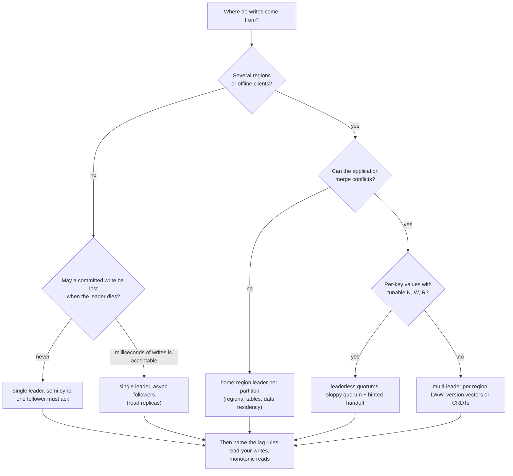

# Replication

## TL;DR

- Replication copies data to several nodes to survive failures, serve reads nearby and scale reads; writes scale by partitioning, not by replication.
- The topology decides who orders writes: one leader, a leader per region, or nobody, with quorums.
- Every asynchronous copy lags; read-your-writes, monotonic reads and consistent prefix are the anomalies you must name and route around.
- Interviewers probe lag, failover, conflicts and the quorum arithmetic.

## Core concepts

### Three topologies: single-leader, multi-leader, leaderless

Replicas must agree on the order of writes, and the three topologies are three answers to who decides it.

- **Single-leader**: one node takes every write and ships its log to followers (PostgreSQL, MySQL, MongoDB, a Kafka partition). Ordering is free, reads scale on followers, and the leader is the write ceiling: ~5k-20k writes/s on one primary.
- **Multi-leader**: one leader per datacenter, replicating to the others asynchronously. A write commits locally in ~0.5 ms instead of after a 70 ms US east-west round trip and survives a cut inter-region link, at the price of write conflicts.
- **Leaderless**: any replica accepts writes; the client or a coordinator sends each write to all N home replicas and waits for W acknowledgements (Dynamo, Cassandra, Riak). Availability and per-request tunable latency, with stale reads and conflicts handled by quorums, versions and repair.

### Sync, async and semi-sync

A synchronous follower must confirm a write before the leader acknowledges it, so a commit costs a round trip to the farthest sync follower, ~0.5 ms in one datacenter and ~70 ms across US regions, and one slow or dead follower blocks every write. Asynchronous followers confirm nothing: the leader never waits, and a leader crash loses the writes they had not received. Semi-synchronous replication (MySQL semisync, PostgreSQL's `synchronous_standby_names`) is the production default: one follower synchronous, the rest asynchronous, so every committed write is on two nodes and the system keeps running when any single node dies.

**Semi-sync commit, then a read-your-writes check against an asynchronous follower.**



### Replication lag: three anomalies and their fixes

Asynchronous followers lag, usually by milliseconds and under load or after a network blip by minutes, and in that window a reader can see three anomalies:

- **Read-your-writes**: a user updates their profile, refreshes, and sees the old one from a lagging follower. Fix: read data the user may have modified from the leader; or have the client carry the log position (LSN) of its last write and route reads to a follower that has replayed past it, falling back to the leader.
- **Monotonic reads**: two refreshes hit two followers, the second further behind, so a comment appears and then vanishes. Fix: pin each user to one follower (hash of the user id), so their view only moves forward.
- **Consistent prefix**: a question and its answer live on different partitions replicating at different speeds, so an observer sees the answer before the question. Fix: write causally related rows to one partition, or carry causal tokens ([Time, clocks and ordering](time-and-ordering.md)).

"Eventually consistent" is not a design; each anomaly needs a routing rule you can name.

### Failover and split brain

When the leader dies, something must notice (heartbeats time out after tens of seconds: shorter invites failovers on load spikes, longer extends the outage), promote the most up-to-date follower, and repoint clients and followers. Two things go wrong. With asynchronous replication the new leader lacks the old leader's last writes; discarding them is the usual choice, and in one well-known incident the new leader reused auto-increment ids that an external cache still mapped to other users' rows. And the old leader may not know it was demoted: two nodes accepting writes is split brain, prevented by fencing (an epoch or token that every downstream system checks and that increases on each election) or by powering the old leader off. Safe automatic election is a consensus problem: [Consensus and coordination](consensus-and-coordination.md).

### Conflict resolution: LWW, version vectors, merge, CRDTs

Multi-leader and leaderless systems accept concurrent writes to one key and must converge.

- **Last-writer-wins**: keep the write with the highest timestamp (Cassandra's cell timestamps). Simple and lossy: the loser is discarded silently, and clocks skewed by more than the interval between the writes pick the wrong winner.
- **Version vectors**: each replica counts its own writes per key; a write that descends from another replaces it, two that do not are concurrent and both are kept as siblings for the application to merge (Dynamo's shopping cart, Riak).
- **Application merge**: union the cart items, keep the larger counter, ask the user. Works where the data has a natural merge; deletes need tombstones to survive a union.
- **CRDTs**: types whose merge is commutative, associative and idempotent (counters, grow-only and observed-remove sets, registers) converge without coordination; Riak data types and Redis active-active use them, collaborative editors build on them.

### Quorums: N, W, R, sloppy quorums and hinted handoff

A leaderless write goes to all N home replicas of a key and succeeds after W acknowledgements; a read asks the replicas and takes the newest of the first R answers. With W + R > N every read quorum shares at least one replica with the latest successful write's quorum, so the read includes the newest version: N=3, W=2, R=2 is the common setting, and W=1, R=1 is fast but allows the stale read the demo shows. W and R are also fault budgets: writes survive N - W failed replicas, reads N - R. Two caveats keep the rule honest. It covers the newest *acknowledged* write: a write that failed with fewer than W acks is not rolled back and may still be read. And it is not linearizability: concurrent writes, a read overlapping an in-flight write, or a read repair that reached only some replicas can still produce an order no single copy would.

A strict quorum refuses a write when fewer than W home replicas are reachable. A sloppy quorum (Dynamo; Cassandra's hinted handoff) writes instead to the next healthy nodes on the ring, which store the value with a hint naming the home replica and hand it back when that replica returns. Writes keep succeeding through a partition, at the price of the overlap guarantee: the W acks may have come from stand-ins the read quorum never asks.

**Leaderless write with one replica down, hinted handoff on recovery, then a quorum read with read repair.**



### Read repair and anti-entropy with Merkle trees

Replicas drift: writes missed during an outage, lost hints, a node rebuilt from an old backup. Read repair catches drift on hot keys: when a quorum read sees different versions, the coordinator writes the newest back to the stale replicas. Cold keys need anti-entropy, a background comparison of whole key ranges. Comparing key by key would ship every key; a Merkle tree hashes buckets of keys and folds the hashes up to a root, so equal roots mean identical data and differing roots are resolved by descending only into differing subtrees. In the demo, 3 differing keys among 10,000 are located with 51 hash comparisons: 51 x 32 B = ~1.6 KB on the wire instead of 10,000 keys. Cassandra's repair streams the differing ranges, and it must run within the tombstone grace period or deleted rows resurrect ([Storage engines and indexing](storage-engines-and-indexing.md)).

### Multi-region active-active and data residency

Active-active means every region accepts writes. Synchronous cross-region replication costs a round trip per commit, 70 ms US east-west and 150 ms California to the Netherlands, so active-active replicates asynchronously and either resolves conflicts as above or avoids them by giving each row a home region: partition users by region, run the leader for each partition in its home region, and replicate asynchronously elsewhere for local reads and disaster recovery. Home regions also answer data residency: "EU users' personal data stays in EU datacenters" is a partitioning rule (the home region) plus a replication rule (no full copies outside it), with only non-personal metadata replicated globally.

**Pick the topology from where writes come from and what a conflict would cost.**



## Trade-offs

| Criterion | Single-leader | Multi-leader | Leaderless (quorums) |
|---|---|---|---|
| Write ordering | total order from the leader | per leader; conflicts across leaders | per key by version; concurrent writes need merging |
| Write latency | one leader, ~0.5 ms local; cross-region clients pay the RTT | local commit in every region | W fastest replicas; tunable per request |
| Write scale | one node, ~5k-20k writes/s per partition | one node per region | all replicas, linear with nodes |
| Read scale | followers | followers in every region | any replica, R per read |
| Leader failure | detect, elect, repoint; risk of lost tail and split brain | region keeps working | no election; sloppy quorum rides through |
| Consistency you get | strong on the leader; lag on followers | eventual, with conflicts | tunable: W + R > N for newest acknowledged write |
| Examples | PostgreSQL, MySQL, MongoDB, Kafka | multi-DC MySQL, CouchDB, collaborative editors | Dynamo, Cassandra, Riak |

Default to a single leader with one semi-synchronous follower in the same region and asynchronous read replicas: total order for free, no conflicts, and the ~5k-20k writes/s ceiling is above most products for years. Add the lag rules the moment you add the first read replica. Go multi-leader only when writes must commit in several regions or offline, and say how conflicts are resolved before the interviewer asks; if the data has no natural merge, prefer a home-region leader per partition, which gives local writes and data residency without conflicts. Choose leaderless when availability of single-key writes matters more than ordering: shopping carts, session stores, sensor data. Then state N, W, R, whether the quorum is sloppy, and how repair works, because each of those three changes what a read can return. Whatever you pick, synchronous cross-region replication is a 70-150 ms tax per commit that almost nobody pays for every write.

## Python implementation

`code/hld/quorum.py` is the N/W/R arithmetic as a cluster you can break. Values carry a last-writer-wins version; `quorum_overlaps` is the W + R > N rule:

```python title="code/hld/quorum.py — versions, replicas, the overlap rule"
--8<-- "code/hld/quorum.py:model"
```

`Cluster.put` writes to the N home replicas and needs W acks (sloppy mode writes to stand-ins with hints); `get` takes the R fastest answers, returns the newest and repairs the stale ones; `recover` delivers hints:

```python title="code/hld/quorum.py — the cluster"
--8<-- "code/hld/quorum.py:cluster"
```

`uv run python -m hld.quorum` prints:

```text
N=3 W=2 R=2 over 5 nodes; home replicas of cart:42: ['A', 'B', 'C']
put v1 'apple'              -> versions {'A': 1, 'B': 1, 'C': 1}
C down, put v2 'apple,bread' -> versions {'A': 2, 'B': 2, 'C': 1} (W=2 acks were enough)
C back and fastest; read with R=1 -> 'apple' v1 from ('C',): STALE, W+R = 3 is not > N
read with R=2 -> 'apple,bread' v2 from ('C', 'A'), read repair fixed ('C',)
after read repair           -> versions {'A': 2, 'B': 2, 'C': 2}
strict quorum, A and B down: write of 'cart:42' got 1 acks, needed W=2
sloppy quorum, same outage: write accepted, copies on ['C', 'D', 'E'] (hints for ['A', 'B'])
A recovers: 1 hinted write handed off, A now holds v1
overlap table: N=3 W=1 R=1: no, N=3 W=2 R=2: yes, N=3 W=1 R=3: yes, N=3 W=3 R=1: yes, N=5 W=2 R=3: no
```

`code/hld/merkle_tree.py` buckets keys by hash, hashes each bucket and folds the hashes to a root; `diff` descends only where the hashes differ:

```python title="code/hld/merkle_tree.py — build and diff"
--8<-- "code/hld/merkle_tree.py:tree"
```

`uv run python -m hld.merkle_tree` prints:

```text
10,000 keys per replica, Merkle tree with 1,024 leaves (11 levels)
roots equal: False  (A 656bd61d300e..., B db39c9263213...)
diff: 3 buckets differ, found with 51 hash comparisons instead of exchanging 10,000 keys
  bucket  152: 8 keys to compare, mismatched ['user:99999']
  bucket  291: 12 keys to compare, mismatched ['user:4567']
  bucket  470: 8 keys to compare, mismatched ['user:123']
after repairing those buckets: roots equal: True, diff comparisons: 1
```

## In the interview

Say the replication plan when you draw the database: "One primary with a semi-synchronous follower in the same region and asynchronous read replicas; a user's reads after a write go to the primary for a short window."

Phrases that signal depth: "W + R > N gives me the newest acknowledged write, not linearizability"; "a sloppy quorum trades the overlap guarantee for write availability"; "failover needs fencing or it becomes split brain".

??? question "A user updates their avatar and still sees the old one. What happened and how do you fix it?"
    The read hit an asynchronous follower that had not replayed the write. Route the user's own reads to the leader for a short window after a write, or carry the write's log position and read from a follower that has reached it.

??? question "N=3, W=1, R=1 on Cassandra: what can a read return?"
    Any replica's version, including one that missed the last write: W + R = 2 does not exceed N, so overlap is not guaranteed. Use W=2, R=2 where the product reads its own writes.

??? question "The leader's heartbeat stops for 20 seconds. Do you fail over?"
    Only with fencing: promote a follower and bump the epoch so the old leader's writes are rejected when it returns; without it a paused leader comes back and you have two leaders. Weigh the timeout against the cost of a spurious failover.

??? question "Two regions both updated the same profile field. Who wins?"
    Last-writer-wins picks the higher timestamp and silently drops the other, which is acceptable for a profile field and not for a cart or a counter; there you keep both versions (version vectors) and merge, or use a CRDT.

??? question "How does a replica that was down for an hour catch up?"
    Hinted handoff delivers the writes a stand-in held for it; read repair fixes hot keys as they are read; Merkle-tree repair streams only the differing buckets for the rest.

!!! tip "Interview tip"
    Whenever you say "read replica", say the lag rule in the same breath: "replicas for reads, the user's own recent writes from the primary" costs five seconds and pre-empts the most common follow-up.

## Common mistakes

- **Replicating to scale writes**: every replica applies every write, so the leader's ~5k-20k writes/s is still the ceiling. Fix: partition for write scale, replicate for availability and reads.
- **"Eventually consistent" with no lag rule**: the avatar bug, the vanishing comment. Fix: name read-your-writes and monotonic reads and the routing that prevents each.
- **Synchronous replication across regions by default**: every commit pays 70-150 ms and stalls on one slow region. Fix: semi-sync in the region, asynchronous across regions, or a home region per partition.
- **Treating a sloppy quorum as a quorum**: the W acks may be on stand-ins, so W + R > N no longer guarantees overlap. Fix: say sloppy when you mean it and rely on hinted handoff and repair for convergence.

!!! warning "Common mistake"
    Claiming "quorum reads and writes give strong consistency". W + R > N returns the newest acknowledged write, barring concurrent writes, failed partial writes and sloppy quorums; linearizability needs consensus or a single leader with synchronous replication.

## Self-check

??? question "What does semi-synchronous replication guarantee that asynchronous does not?"
    A committed write exists on two nodes, so one leader crash loses nothing, while the other followers stay asynchronous and commit latency stays local.

??? question "Why is a read with R=1 possibly stale even though the write used W=2 of N=3?"
    W + R = 3 is not greater than N, so the one replica read may be the one that missed the write.

??? question "What stops a demoted leader from accepting writes?"
    Fencing: an epoch or token that increases on each election and that every downstream component checks, rejecting requests from the old epoch.

??? question "Which repair mechanism finds a stale key that nobody reads?"
    Anti-entropy: a background Merkle-tree comparison of key ranges, descending only into buckets whose hashes differ, then streaming those keys.

??? question "How do you get active-active writes without conflict resolution?"
    Give each partition a home region whose leader takes its writes; other regions serve reads from asynchronous copies, and the home region doubles as the data-residency boundary.

## Related

- [CAP, PACELC and consistency models](cap-pacelc-and-consistency-models.md) — what quorums guarantee
- [Design a Dynamo-style key-value store](../case-studies/key-value-store.md) — quorums end to end
- [Consensus and coordination](consensus-and-coordination.md) — leader election and fencing
- [Time, clocks and ordering](time-and-ordering.md) — version vectors and causality
- [Partitioning, sharding and consistent hashing](partitioning-and-consistent-hashing.md) — the ring behind the home replicas
- [Storage engines and indexing](storage-engines-and-indexing.md) — tombstones and the repair deadline
- DeCandia et al., "Dynamo: Amazon's Highly Available Key-value Store" (SOSP 2007)
- Shapiro et al., "Conflict-free Replicated Data Types" (SSS 2011)
- PostgreSQL documentation, "High Availability, Load Balancing, and Replication"
