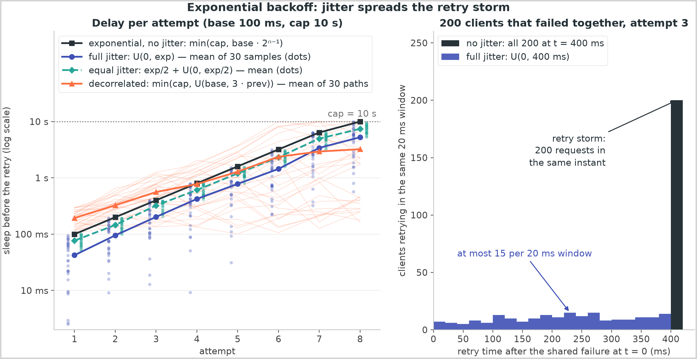
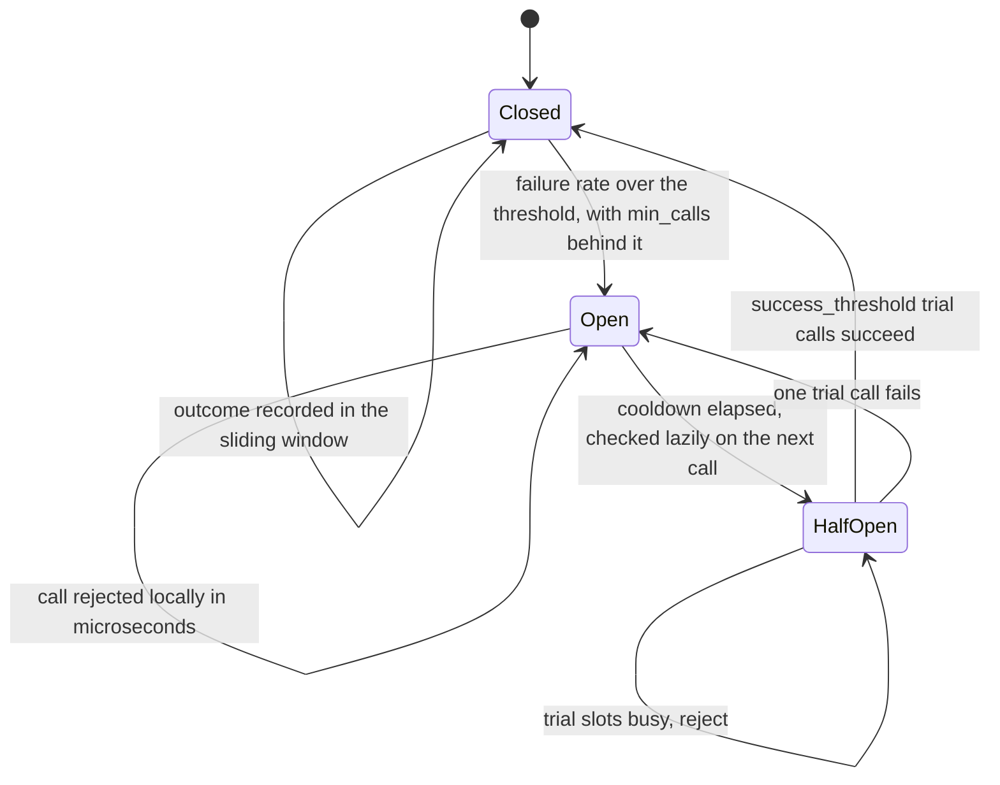
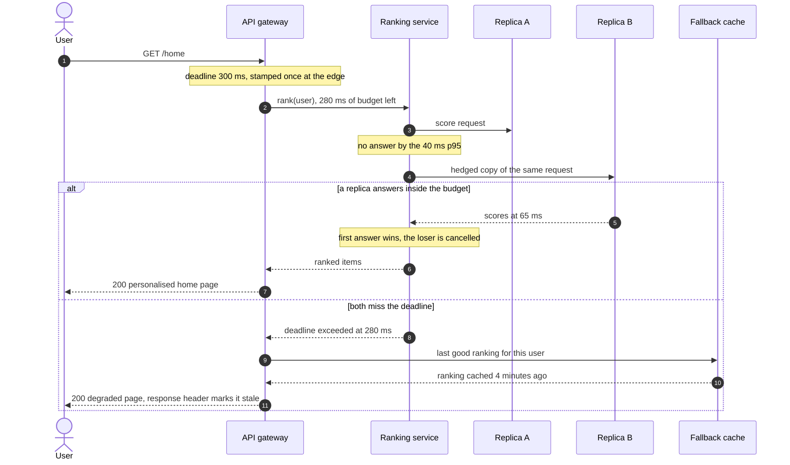

# Resilience patterns

## TL;DR

- Failures are not the problem; amplification is: retries multiply load and slow calls hold threads until one dependency's bad minute is everyone's outage.
- The core set is timeouts with a deadline budget, retries with jitter and a budget, a circuit breaker, bulkheads, load shedding and a fallback.
- Retries are only safe on idempotent operations, so the idempotency key comes first.
- Interviewers raise it the moment you draw a synchronous call to something you do not own.

## Core concepts

Every remote call has three outcomes, not two: success, failure, and the one that hurts — no answer yet. A dependency that fails fast is survivable; one that answers in 30 seconds holds a thread for each of them. Every pattern below turns that into a fast, local decision.

### Timeouts and deadline budgets

An unbounded call is a resource leak with a friendly name. Set two: a connect timeout, small because a handshake inside a datacenter is one 500 µs round trip, so 100 ms is already 200x the expected cost; and a read timeout from the measured p99, so a 40 ms p99 gets ~200 ms.

Per-call timeouts compose badly: three services in a chain, each with a 1-second timeout and one retry, hold the user for 1 x 2 x 2 x 2 = 8 seconds after the edge gave up. Use a **deadline budget** — the edge stamps a deadline (`grpc-timeout`), each hop passes the *remaining* time down, and a hop with 20 ms left fails at once instead of starting work nobody will read.

Little's law shows why the timeout is load-bearing: concurrency = rate x latency. At 1k QPS a 50 ms dependency holds 1,000 x 0.05 = 50 requests in flight; slowed to 5 s it needs 1,000 x 5 = 5,000, so a 200-thread pool fills in 200 ms. Nothing crashed, and the service is down.

### Retries, backoff and jitter

A retry turns a transient failure into a success and a systematic one into a DDoS on your own dependency. Three rules keep it on the useful side.

**Retry only what is safe to repeat.** A timeout says nothing about whether the write committed, and a retried charge is a duplicate charge, so a retryable write carries an idempotency key the server deduplicates on ([Transactions, 2PC, sagas and idempotency](transactions-and-distributed-transactions.md)). Never retry a 400.

**Back off, and add jitter.** Capped exponential backoff (100 ms, 200 ms, 400 ms...) spreads one client's attempts over time. Jitter spreads all clients over each other, the part candidates forget: 200 clients that failed against the same node retry in the same instant unless something breaks the symmetry. Full jitter draws from `U(0, exp)`, equal jitter from `exp/2 + U(0, exp/2)`, decorrelated jitter from `U(base, 3 x previous)`.

{ width="800" }

**Bound the total, not the per-call count.** Three attempts per call is 3x load exactly when the dependency is failing. A **retry budget** caps retries as a fraction of traffic: a failed attempt spends a token, a success earns a fraction back, retries stop below half full. With the gRPC defaults (100 tokens, ratio 0.1) a dead dependency gets ~50 retries before the throttle closes — 1.37x amplification in the demo instead of 4x. And **retry at one layer only**.

### Circuit breakers

Retries help when the failure is transient. When the dependency is genuinely down, the useful behaviour is to stop calling it: fail in microseconds, free the threads, give it room to recover. Closed, calls pass and outcomes land in a sliding window; once the failure rate crosses a threshold with enough volume behind it the breaker opens and rejects locally; after a cooldown it admits a few trial calls.

Trip on a **failure rate over a window with a minimum call count**, never on N consecutive failures — at 1k QPS five in a row is 5 ms of noise, while a bare rate opens on the first failure of a quiet minute. Count slow calls as failures: answering at 10x the p99 exhausts pools just as surely as returning 500s.

**Closed, open, half-open: the only timed transition is the cooldown.**



### Bulkheads and shuffle sharding

A bulkhead partitions a resource so one failure cannot consume all of it: a connection or thread pool per dependency, so a recommendation service holding 20 of 200 threads can be dead while checkout still has 180. Across a fleet it is instance pools per tenant class.

Shuffle sharding is the cheap version at scale: give each customer a random 2 of 8 workers and there are 28 such pairs, so a poisoned pair takes down 1-in-28 of customers instead of everyone — a blast radius that shrinks combinatorially without dedicated capacity.

### Load shedding and admission control

When demand exceeds capacity something gets dropped; the only choice is whether you choose. Shedding rejects excess work at the door with 429 or 503 and `Retry-After`, by priority — health checks before background sync — triggered on saturation (queue depth or wait time) rather than CPU, because a growing queue is already failing its callers. The rule that makes it work is **the cheapest possible rejection**: if rejecting costs as much as serving, you have not shed load.

### Graceful degradation, fallbacks and hedged requests

Decide up front which parts of a response are essential. A product page without recommendations is a product page; without the price it is a bug. Every non-essential dependency gets a fallback — a stale cache entry, a default, a hidden section — labelled, with a cap on staleness.

Hedged requests attack the tail rather than the failure: send to one replica, and if there is no answer by the p95 send a second copy elsewhere and take the first. Only 5% of requests are hedged, so the extra load is ~5% while p99 collapses towards p95. Hedge idempotent reads only, cap the rate, cancel the loser.

**A deadline set once at the edge, a hedge at the p95, a labelled stale fallback when both miss.**



### Backpressure

Backpressure is the signal that flows backwards: a consumer that cannot keep up slows its producer instead of buffering. An unbounded queue is not a buffer but a delay pump — at 10k messages/s arriving and 8k/s consumed it grows 2k/s until memory runs out. Bound every queue and choose the policy when it fills: block the producer (TCP's own mechanism), drop the oldest, or reject. In a streamed system the queue is the log and the signal is consumer lag.

### Cascading failures and chaos engineering

The failure mode that takes down whole systems is a loop: a slow dependency fills caller pools, callers time out and retry, retries add load, the dependency slows further. Every pattern above cuts that loop somewhere. Restart is its own trap: a service that survived at a 95% cache hit rate sends 20x the traffic to the database while cold.

The availability arithmetic explains the urgency: dependencies in series multiply, so four at 99.9% give 99.6% — 3.5 hours a month instead of 43.8 minutes — and breakers and fallbacks are what remove a dependency from that product. None of it is real until injected deliberately: kill an instance, add 500 ms of latency, blackhole a dependency, first in staging and then in production with a small blast radius and an abort switch.

## Trade-offs

| Pattern | Protects against | Cost when wrong | Key setting |
|---|---|---|---|
| Timeout + deadline | Threads held by slow calls | Healthy calls fail | p99 x 2-5, propagated |
| Retry with jitter | Blips, a bad replica | Amplifies an outage | Attempts, jitter, budget |
| Circuit breaker | A dependency that is down | Flaps, hides capacity | Rate + volume + cooldown |
| Bulkhead | One dependency eating the pool | Idle capacity | Pool per dependency |
| Load shedding | Overload, queue collapse | Rejects servable work | Queue depth, priorities |
| Fallback | Non-essential dependency down | Silent stale data | Staleness cap, label |
| Hedged request | Tail latency | Extra load if uncapped | Hedge at p95, cap it |
| Backpressure | Producers outrunning consumers | Blocks the wrong caller | Bounded queue, policy |

Start with timeouts everywhere: they cost nothing and every other pattern assumes them. Add a deadline budget once the call chain is deeper than two hops. Retries with jitter come next, on idempotent operations only, at one layer, with a budget. Reach for a circuit breaker when failure is *sustained* rather than random — in front of a dependency that fails 1% of calls at random, a breaker only flaps. Bulkheads matter when one process calls several dependencies of unequal importance; if it calls exactly one, the timeout already is your bulkhead. Load shedding is mandatory for anything with an open front door, because the alternative is deciding by queueing, which serves nobody. Fallbacks are a product decision as much as a technical one: ask the interviewer which fields the page can live without. Hedging is the specialist tool for high fan-out idempotent reads with a tail problem. Backpressure is not optional anywhere a queue exists.

## Python implementation

`BackoffPolicy` yields the sleep before each retry; the jitter schemes differ only in how they draw from the capped exponential:

```python title="code/hld/retry.py — backoff and jitter"
--8<-- "code/hld/retry.py:backoff"
```

`RetryBudget` is the gRPC and Envoy throttle: a token bucket over outcomes, so retries switch themselves off during a real outage:

```python title="code/hld/retry.py — the retry budget"
--8<-- "code/hld/retry.py:budget"
```

`Retrier.call` draws the delay sequence in one locked step and re-raises the last failure:

```python title="code/hld/retry.py — the retry loop"
--8<-- "code/hld/retry.py:retrier"
```

Running `uv run python -m hld.retry`:

```text
backoff from base 100 ms, cap 10 s, 6 attempts
  none              100     200     400     800    1600   total  3.10 s
  full               64       5     110     179    1178   total  1.54 s
  equal              82     103     255     489    1389   total  2.32 s
  decorrelated      228     115     167     190     445   total  1.14 s

200 clients fail together; attempt 3 sleeps 400 ms; count the worst 20 ms window
  none          at most 200 of 200 clients retry in the same 20 ms
  full          at most  20 of 200 clients retry in the same 20 ms
  equal         at most  32 of 200 clients retry in the same 20 ms

two transient timeouts then success -> 'ok'
  3 attempts for 1 call (amplification 3.0x), slept 63 ms

total outage, 100-token budget, 100 calls: the throttle closed on call 13, at 0 tokens left
  137 attempts for 100 calls = 1.37x load on a dying dependency, instead of 4x without a budget
```

That last block is the argument for budgets: same code, same policy, 400 attempts without one and 137 with it.

`CircuitBreaker` holds one lock over every field and never calls the dependency while holding it. Each admitted call gets a `Permit` stamped with the current generation, so a result arriving after a reopen cannot corrupt the new episode:

```python title="code/hld/circuit_breaker.py — the state machine"
--8<-- "code/hld/circuit_breaker.py:breaker"
```

Running `uv run python -m hld.circuit_breaker`:

```text
policy: open at >= 50% failures over the last 10 s (min 10 calls); open for 5 s; 1 trial call at a time; 2 trial successes close
t=0 s: 10 calls, 6 of them time out
    payments: closed -> open at t=0 s
  4 ok, 6 failed; failure rate 60% over 10 calls -> open
t=0 s: 5 more calls: 5 x 'rejected, retry after 5 s'; the dependency saw 10 calls
t=5 s: the first call after open_seconds is the trial call, and it times out
    payments: open -> half_open at t=5 s
    payments: half_open -> open at t=5 s
  failed
t=10 s: two trial calls succeed
    payments: open -> half_open at t=10 s
    payments: half_open -> closed at t=10 s
  ok, ok
a ValidationError passes through uncounted: window holds 0 calls
a 1.5 s call against a 1.0 s slow-call threshold returns 'ok' but counts as a failure: window 1 call, 1 failure
nine more timeouts reopen the breaker, then 1,600 calls arrive at once
    payments: closed -> open at t=12 s
16 threads x 100 calls while open: 1600 rejected in microseconds, the dependency saw 0 of them
```

The last line is the point: 1,600 concurrent calls, none reaching a dependency that cannot serve them, each rejection costing an uncontended lock (~17 ns) rather than a 500 µs round trip.

## In the interview

Introduce it at the first synchronous arrow to something you do not own: "200 ms timeout from its 40 ms p99, retries on timeouts only with full jitter behind a shared budget, a breaker so an outage costs microseconds instead of threads, and the last good cached value, marked stale, while it is down."

Phrases that signal depth: "the deadline is stamped at the edge and every hop passes the remaining budget down"; "retry at one layer, with a budget, on idempotent calls only"; "count slow calls as failures".

??? question "What timeout do you set, and how do you choose the number?"
    From the measured distribution, not a round number: p99 x 2-5, so a 40 ms p99 gets ~200 ms. Then check it against the caller's deadline — anything longer than the remaining budget is decoration.

??? question "A dependency's p99 goes from 40 ms to 5 s. Walk me through what happens."
    Little's law: in-flight goes from 1,000 x 0.04 = 40 to 1,000 x 5 = 5,000, so a 200-thread pool saturates in ~200 ms. The timeout caps the hold, the bulkhead confines it, the breaker opens on the slow-call rate.

??? question "Why is jitter more important than the backoff itself?"
    Backoff spreads one client's attempts over time; jitter spreads all clients over each other. Without it, 200 clients that failed together retry in the same millisecond and knock the recovering dependency over.

??? question "How do you keep retries from amplifying an outage?"
    A retry budget: retries as a fraction of traffic, spent per failure and earned per success, off below half full. Plus one retrying layer only.

??? question "The breaker is open but the dependency has recovered. How long until you notice?"
    At most the cooldown: the first call after it elapses becomes the trial call, checked lazily so no timer thread is needed. Limit trials to one or two.

!!! tip "Interview tip"
    Give the numbers, not the vocabulary. "Circuit breaker, retries, bulkhead" is a word list; "200 ms timeout from a 40 ms p99, three attempts with full jitter behind a 10% retry budget, breaker at a 50% failure rate over 10 s" is someone who has run it.

## Common mistakes

- **No timeout, or the library default**: a 30-second default plus a slow dependency exhausts the pool and takes down endpoints that never touched it. Fix: set both timeouts from measured percentiles.
- **Retrying every error class**: a retried 400 repeats a request guaranteed to fail. Fix: retry timeouts, connection errors, 429 and 503; never a 4xx that describes the request.
- **Thresholds that never trip or always trip**: "5 consecutive failures" is 5 ms of noise at 1k QPS; a bare rate opens on the first error of a quiet minute. Fix: a rate, a minimum call count and a window.
- **Unbounded queues before a slow consumer**: latency grows without limit and the process dies on memory. Fix: bound every queue and alert on lag.
- **A fallback that fails or lies**: one calling the same database is not a fallback, and unlabelled stale data is a correctness bug. Fix: keep fallbacks local, mark degraded responses.

!!! warning "Common mistake"
    Retrying at every layer. Browser, gateway, service and client library each retry: three attempts at three layers is 27 requests for one user action, in a synchronised burst exactly when the dependency is weakest. Pick one layer — the one closest to the dependency, which knows what is idempotent — and make the rest fail fast.

## Self-check

??? question "Why does a deadline budget beat per-call timeouts in a chain of services?"
    Per-call timeouts multiply down the chain, so the user waits far longer than any single limit. A deadline is stamped once and decremented at each hop, so a hop with no time left fails at once.

??? question "What must be true before you may retry a write?"
    It must be idempotent, usually via an idempotency key the server deduplicates on. A timeout does not say whether the write committed, so without dedup a retry risks duplicating it.

??? question "Full, equal or decorrelated jitter: what actually differs?"
    Full jitter (`U(0, exp)`) spreads best and waits least but can retry almost immediately. Equal jitter keeps a minimum pause at half the spread. Decorrelated jitter derives each sleep from the last. Any beats none.

??? question "Why must a circuit breaker count slow calls as failures?"
    Thread exhaustion comes from calls that answer late, not from calls that fail fast: a dependency answering correctly at 10x its p99 fills every caller's pool while a success-rate breaker stays closed.

??? question "Your queue fills faster than the consumer drains it. Name three legitimate policies."
    Block the producer, drop the oldest or lowest-priority items, or reject new work with a retryable status. Letting it grow is the illegitimate answer.

## Related

- [Messaging, queues and Kafka internals](messaging-and-event-streaming.md) — consumer lag as the backpressure signal
- [Observability, SLOs and error budgets](observability-and-slos.md) — the saturation signals these patterns key off
- [Load balancing, reverse proxies and API gateways](load-balancing-and-api-gateway.md) — health checks, outlier ejection and where shedding lives
- [Rate limiting](rate-limiting.md) — admission control per caller
- [Design a notification system](../case-studies/notification-system.md) — retries, DLQs and provider failover end to end
- Marc Brooker, "Exponential Backoff and Jitter" (AWS Architecture Blog, 2015)
- Dean and Barroso, "The Tail at Scale" (CACM, 2013)
- Google SRE Book, "Addressing Cascading Failures" (2016)
