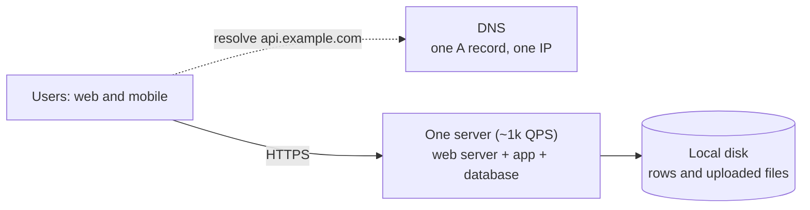
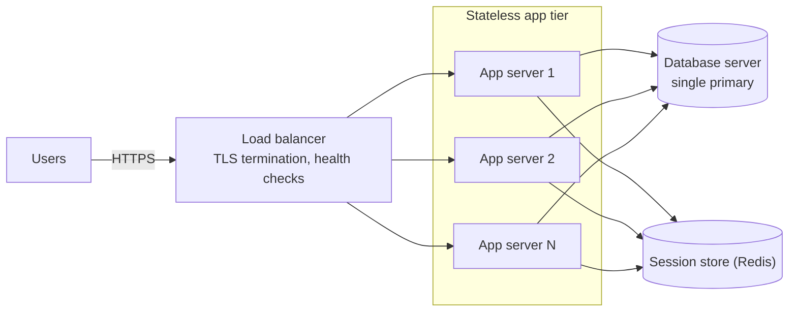
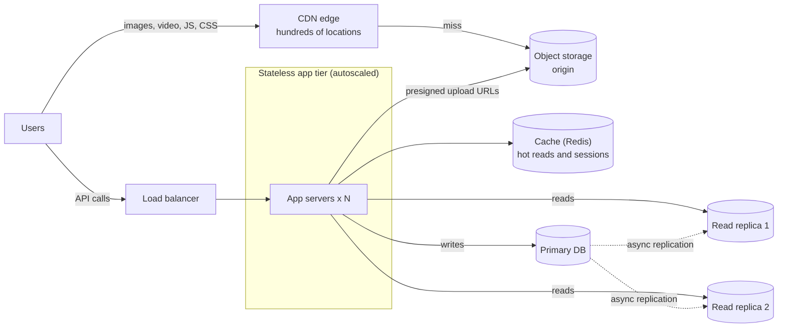

# From one server to millions of users

## TL;DR

- Bottlenecks arrive in a fixed order, so systems grow in a fixed order: one box's CPU, database reads, database writes, bytes on the wire, the speed of light.
- Each stage is forced by a number: ~1k QPS per app server, 5k-20k writes/s and 2-20 TB per primary, ~100k ops/s per cache node, 70-150 ms per cross-region round trip.
- The stage-7 shape — CDN, load balancer, stateless services, cache, primary with replicas, queue and workers — is the baseline for every case study.

## Core concepts

Take a product growing from 10k to 100M daily users, each making ~20 requests a day at a 10:1 read/write ratio: 200k requests a day (~2 QPS) at the start, 2B a day (~23k QPS average, ~70k at a 3x peak) at the end. The skill is saying which number breaks which component and what you add when it does.

### Stages 1 and 2: one box, then a separate database

**Stage 1: everything on one machine, which serves more traffic than candidates expect.**

One server running web tier, application and database handles ~1k QPS of real work, ~86M requests a day — enough for ~1M DAU in our example (~700 QPS at peak). Its problem is blast radius, not capacity: a deploy restarts the database, a full disk takes down the app, a dead disk loses everything since the last backup. Stage 2 moves the database to its own machine so the two scale, fail and upgrade independently, at the cost of a ~500 µs round trip per query, so an N+1 loop of 100 rows now costs 50 ms.

### Stage 3: a load balancer and a stateless web tier

**Stage 3: the app tier scales horizontally; state leaves the servers so any of them can answer any request.**

As peak traffic nears ~1k QPS per server you add servers behind a load balancer, which is not the bottleneck for a long time: an Nginx-class L7 balancer sustains ~10k-100k QPS. The precondition is stateless app servers: sessions, uploads and local caches move to a session store, object storage and a shared cache, so any server can take any request, a crash loses nothing and autoscaling is adding instances. Sticky sessions are a trap: a hot server cannot be relieved and a dead one logs out its users. Two servers behind health checks also survive one failure, which no single box can.

### Stages 4 and 5: read replicas and a cache

At 10M DAU the example does ~2.3k QPS average, ~7k at peak, 90% reads, and the primary becomes the bottleneck. Read replicas (stage 4) stream the primary's write-ahead log and serve reads: three replicas take the read load while the primary keeps ~640 writes/s at peak, well inside its 5k-20k. The price is replication lag — milliseconds usually, seconds sometimes — so a user may not see their own post; route reads to the primary for a few seconds after a write.

A cache (stage 5) removes reads altogether: a memory reference is 100 ns against ~500 µs for any database round trip, one Redis node serves ~100k ops/s against ~50k indexed reads/s for a primary, and by the 80/20 rule 100M reads a day of 1 KB objects need 100M x 1 KB x 0.2 = 20 GB, which fits one 64 GB node. At a 90% hit ratio the database sees a tenth of the reads, so one cache node is worth ten replicas — at the price of invalidation, stampedes and hot keys ([Caching and CDNs](caching-and-cdn.md)).

### Stage 6: a CDN for the bytes

**Stage 6: static assets and media leave the application path; the data tier gains a cache and replicas.**

API responses are 1-10 KB; a compressed photo is 200 KB-2 MB and a minute of 1080p video 50-100 MB, so media bytes dwarf the requests: 10k API calls/s at 10 KB is 100 MB/s (0.8 Gbps), while 1k photo loads/s at 1 MB is 1 GB/s, most of a 10 Gbps NIC (1.25 GB/s). A CDN caches those bytes at edge locations near the user, cutting egress and latency: a cross-region round trip is 70-150 ms, an edge hit a few milliseconds. Uploads go straight from the client to object storage through presigned URLs, so the app tier never proxies a 2 MB body.

### Stage 7: queues and workers

Some work should not happen while the user waits: notifications, fan-out to 200 followers, transcoding. A queue decouples the request from the work: the API writes the row, publishes an event and returns in tens of milliseconds; workers consume at their own pace, retry on failure and scale independently. The queue also absorbs peaks — a 3x spike becomes a backlog that drains in minutes — and a Kafka broker takes ~100 MB/s of events. The price is eventual consistency, said out loud: the feed lags by seconds, and every consumer must be idempotent because delivery is at-least-once.

### Stage 8: sharding

At 100M DAU the example writes ~6.4k/s at peak, inside one primary's 5k-20k but not for long, and at 1 KB per write stores ~6.4 TB a year, crossing a server's 2-20 TB within a few years. Replicas do not help; every replica holds every write. Sharding splits the data across primaries by a partition key — `user_id`, hashed, so a user's rows stay together and the load spreads — each shard with its own replicas and cache. The cost is every query without the key, every cross-shard transaction and every rebalance ([Partitioning, sharding and consistent hashing](partitioning-and-consistent-hashing.md)). Shard last, after replicas, caching, scaling up and archiving cold data, because sharding alone changes the application.

### Stage 9: multiple datacenters and GeoDNS

Two forces push past one region: latency, because a European user talking to a US datacenter pays 150 ms per round trip; and availability, because 99.99% allows 52.6 minutes of downtime a year and one region cannot promise that. GeoDNS answers each resolver with the nearest region, every region runs the full stateless stack, and the hard part is the data: active-passive with one writable region is simple and survives a region loss by failover; active-active with writes everywhere needs conflict resolution, the hard part of [Replication](replication.md).

### Stateless vs stateful, horizontal vs vertical, and the scale cube

Stateless tiers — balancers, app servers, workers — scale by adding identical copies; stateful tiers — databases, caches, queues — hold data that must be replicated, partitioned and recovered, which is why every stage above moves state out of the stateless tier or adds machinery around the stateful one. Vertical scaling is the right first move for a stateful tier because it changes nothing in the application: a primary grows to 64-512 GB of RAM and 2-20 TB of disk with no lag and no cross-shard queries; horizontal scaling has no ceiling but costs coordination. The scale cube names the axes: X is cloning (app servers, replicas), Y is functional decomposition (services for posts, feeds, media), Z is data partitioning (shards). Stages 3-6 are X, stage 7 starts Y, stage 8 is Z.

### The default architecture all case studies inherit

By stage 7 the shape is fixed: CDN and load balancer at the edge, a stateless service tier, a cache, a primary with read replicas, object storage for bytes, a queue with workers for anything asynchronous. It is the baseline skeleton in [The 45-minute HLD framework](interview-framework.md); every case study draws it first and spends its time on what is specific — the feed cache, the WebSocket tier, the payment ledger. Say you are starting from the standard shape and will add what the problem needs.

## Trade-offs

| Way to add capacity | What it scales | Ceiling | Application change | Reach for it when |
|---|---|---|---|---|
| Scale up (bigger box) | Everything on that box | 64-512 GB RAM, 2-20 TB, one failure domain | None | A stateful tier is under pressure, ceiling years away |
| Scale out the stateless tier | Request handling | The balancer, ~10k-100k QPS | State must leave the servers | Peak nears ~1k QPS per server |
| Read replicas | Reads | Primary still takes every write | Read routing, lag handling | Diverse or fresh reads dominate |
| Cache | Reads and latency | ~100k ops/s and memory per node | Cache-aside, invalidation | Hot repeated reads, latency targets |
| CDN and object storage | Bytes and egress | Effectively none | Media out of the app path | Media or assets dominate bandwidth |
| Queue and workers | Background work, peaks | ~100 MB/s per broker | Async flows, idempotent consumers | Work can finish after the response |
| Sharding | Writes and storage | Linear with shards | Partition key in every query | Writes or data exceed one primary |
| Another region | Latency and availability | Conflict resolution | Region-aware routing | Global users or a 99.99% target |

Pick the cheapest fix for the component that is actually failing, and say the number that names the component. If the app tier is at its QPS limit, add servers, which changes nothing else. If the primary is busy with reads, a cache wins when the same objects are read repeatedly and replicas win when reads are diverse or must be fresh; most systems use both. Scale the primary up before you shard it: a bigger box keeps transactions, joins and a single source of truth, and sharding gives all three away. Reach for a queue whenever a response is waiting on work the user does not need to see, because it moves that work off the peak. Go multi-region for latency or for an availability target one region cannot meet, never for capacity alone, because the data problems it creates are harder than the ones it solves. The interview answer is the order of the stages plus the number that triggers each, not the final diagram.

## In the interview

Draw the stage-7 shape and say where the numbers put you: "At 1.7k writes/s one primary is fine; at 500k reads/s the cache and CDN do the work; I will shard the post store for storage, not write rate." That shows you know the order of the fixes and which one this prompt needs.

Phrases that signal depth: "the app tier is stateless, so scaling it is a number, not a design"; "replicas fix reads, a cache fixes reads and latency, only sharding fixes writes"; "I will scale the primary up before I shard it".

??? question "Why not start with microservices and shards on day one?"
    Each stage costs something the product may never need: sharding removes transactions and joins, services add hops and deploy coordination. At 230 QPS one box and one primary are correct; the skill is knowing when each addition pays for itself.

??? question "A primary handles 50k+ indexed reads/s. Why a cache at 7k reads/s?"
    The 50k figure is for indexed point lookups; real reads are joins and aggregations costing ten to a hundred times more, and the primary also takes the writes. A cache serves hot reads at 100 ns instead of ~500 µs and shields the primary during a spike.

??? question "Replicas lag by two seconds and a user cannot see their own post. What now?"
    Read-your-writes: route that user's reads to the primary for a few seconds after a write, or serve the new post from the cache or the client's own state. Lag is the price of asynchronous replication; synchronous would cost every write a round trip.

??? question "When does a load balancer become the bottleneck, and what then?"
    Around 10k-100k QPS for an L7 balancer terminating TLS. Then DNS or an L4 balancer spreads traffic over several L7 balancers, and GeoDNS over regions; the balancer tier is stateless, so it scales like the app tier.

??? question "How does the architecture change between 10M and 100M DAU?"
    The shape stays; the data tier changes. Reads at ~70k/s peak need the cache and replicas to carry nearly everything, writes at ~6.4k/s peak and ~6.4 TB a year bring sharding into view, and global users push toward a second region.

!!! tip "Interview tip"
    Narrate the stages as numbers, not boxes: "one server to ~1k QPS, one primary to 5k-20k writes a second and 2-20 TB, one cache node to ~100k ops a second". An interviewer who hears the thresholds trusts every box you draw.

## Common mistakes

- **Sticky sessions instead of a stateless tier**: a hot server cannot be relieved, a dead one logs out its users, autoscaling is useless. Fix: sessions in a store or a signed token, files in object storage.
- **Sharding before replicating and caching**: the hardest fix applied first, to a primary that was busy with reads. Fix: replicas, then a cache, then a bigger box, shards last.
- **Forgetting the bytes**: sizing for QPS and discovering that 1k photo loads a second is 1 GB/s on the app tier's NICs. Fix: media to object storage and a CDN in the first diagram.
- **Synchronous work in the request path**: emails and feed fan-out while the user waits, so p99 follows the slowest dependency. Fix: a queue and idempotent workers for anything the response does not need.

!!! warning "Common mistake"
    Drawing the final diagram for a prompt whose numbers fit on one primary. Ten shards and three regions for 230 QPS says you memorised a picture and cannot size a system; the design that scores justifies every box with a number, and at that scale it is a load balancer, two app servers, one primary and a cache.

## Self-check

??? question "What is the first problem a single box hits, and the first change you make?"
    Blast radius, not capacity: deploys, disk and failures are shared. Move the database to its own machine, then add a load balancer and a second stateless server as peak nears ~1k QPS.

??? question "Why must app servers be stateless before you add a load balancer?"
    So any server can answer any request: load spreads evenly, a dead server loses nothing, capacity is just instances. State left on servers forces sticky sessions and defeats all three.

??? question "Replicas or cache for a read-heavy primary?"
    Cache when the same objects are read repeatedly and latency matters (100 ns vs ~500 µs); replicas when reads are diverse, must be fresh, or are complex queries a key-value cache cannot serve. Usually both.

??? question "What number forces sharding, and what does it cost?"
    Writes above 5k-20k/s or data beyond 2-20 TB on one primary. It costs every query without the partition key, every cross-shard transaction and every rebalance, so it comes last.

??? question "What does a second region buy, and what does it not?"
    Latency for nearby users (a cross-region round trip is 70-150 ms) and surviving a region failure for a 99.99% target. Not cheap capacity: writes in two regions need conflict resolution or a single writable region.

## Related

- [Load balancing, reverse proxies and API gateways](load-balancing-and-api-gateway.md) — stage 3 in depth
- [Caching and CDNs](caching-and-cdn.md) — stages 5 and 6 in depth
- [Replication](replication.md) — stages 4 and 9 in depth
- [Partitioning, sharding and consistent hashing](partitioning-and-consistent-hashing.md) — stage 8 in depth
- [The 45-minute HLD framework](interview-framework.md) — the baseline architecture
- Abbott and Fisher, *The Art of Scalability* (2nd ed., 2015) — the scale cube
