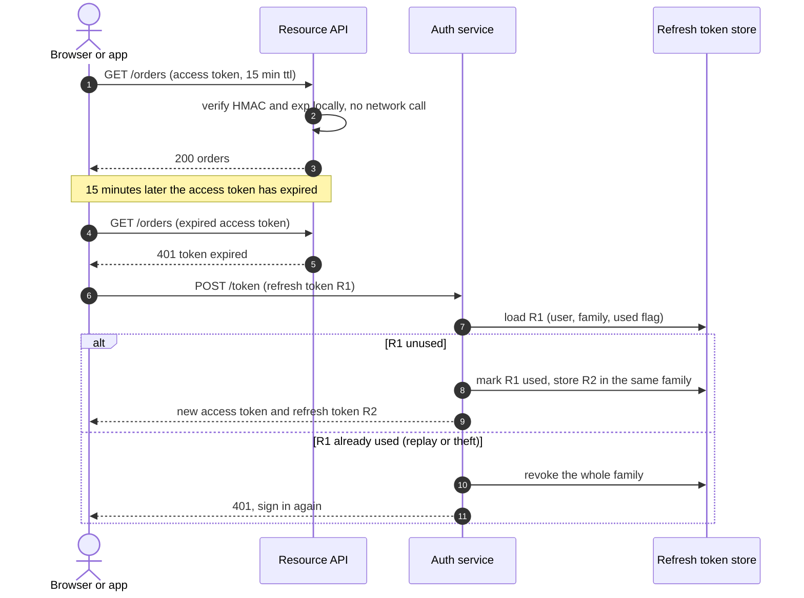
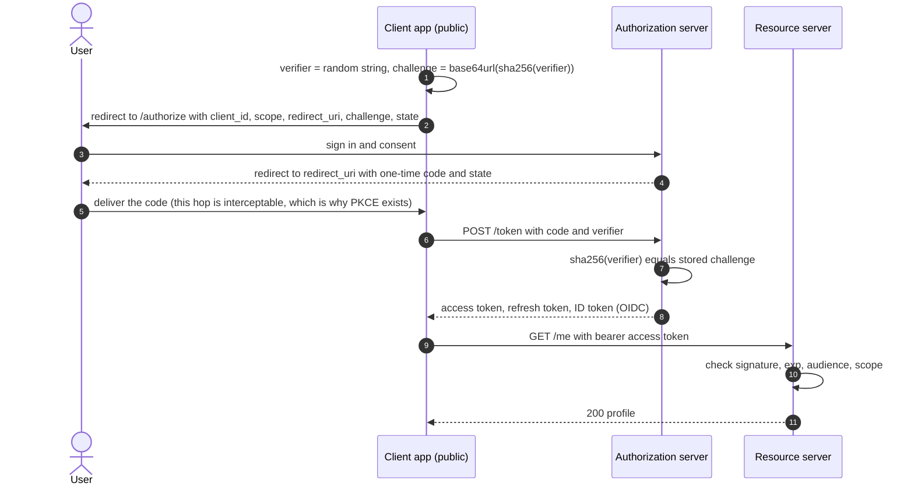
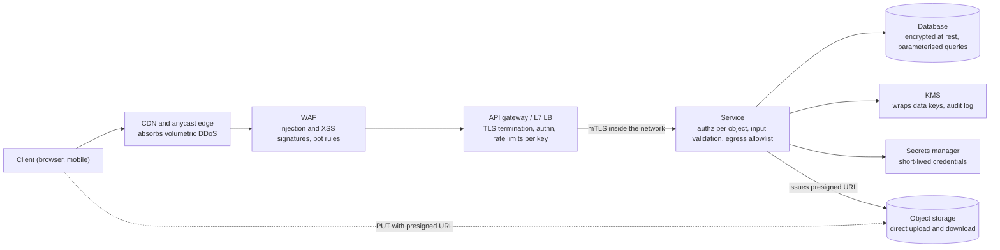

# Security essentials

## TL;DR

- Authentication proves who is calling; authorization decides what that caller may do to *this* object. Most production breaches are missing authorization checks, not broken crypto.
- Sessions are revocable and cost a lookup per request; JWTs verify locally and cannot be recalled, so pair short-lived access tokens with rotated refresh tokens.
- Encrypt in transit (TLS, mTLS inside), at rest (envelope encryption under a KMS), and hash passwords with a slow, salted function.
- Interviewers expect these decisions volunteered, not extracted.

## Core concepts

Security in a design round is a set of placements: where identity is established, where each permission is checked, where keys live, where untrusted bytes are stopped. The skill is putting the right control at the right hop and knowing its cost.

### Authentication, authorization and API keys

Authentication (authn) answers "who is this?" — a password, a one-time code, a signed token, a client certificate. Authorization (authz) answers "may this principal do this to this resource?" and must run on every request inside the service that owns the data, because only that service knows who owns the object. An API key is the simplest credential: a random string identifying a *client application*, not a person, so the gateway can meter and rate-limit per key. Store only its hash, prefix it so leaks are recognisable in logs, and never let a key stand in for user authorization.

### Sessions vs JWTs: revocation, refresh tokens and rotation

A server-side session stores state keyed by an opaque cookie. Logout is one delete, but every request pays a lookup: a Twitter-like ~500k reads/s peak means 500k session reads/s, about 5 Redis instances at ~100k ops/s, plus a ~500 µs hop per call.

A JWT moves that state into the token: `header.payload.signature`, the signature an HMAC (or asymmetric signature) over the first two segments. Any service holding the key verifies it in microseconds with no network call — why gateways and microservices favour them. The payload is base64, not encrypted: identifiers and roles, never secrets. The price is revocation: a token is valid until `exp` whatever happens to the account. Hence two tokens — a short-lived access token (minutes) verified statelessly, and a long-lived refresh token held server-side and exchanged for new ones. Rotate refresh tokens on every use: a replay means theft, so revoke the whole family. For instant revocation keep a denylist of revoked token ids, each with a TTL equal to its remaining lifetime, so it stays tiny.

**Refresh-token rotation with reuse detection: only the refresh touches the store.**



### OAuth 2.0 and OIDC: authorization code with PKCE, client credentials

OAuth 2.0 is delegated authorization: a user lets a client act on their behalf at a resource server without sharing a password. The authorization-code flow below is the one to draw; PKCE (proof key for code exchange) makes it safe for public clients — mobile and single-page apps that cannot hold a secret — because an intercepted code is useless without the verifier. Client credentials is the machine-to-machine flow: a backend job presents its own id and secret and gets a token, no user involved. OIDC sits on top and adds an ID token — a signed JWT describing the user — which is what "log in with Google" delivers.

**Authorization code with PKCE: the verifier proves the client finishing the exchange started it.**



### TLS, certificate chains and mTLS

TLS gives confidentiality and integrity on the wire and authenticates the server through a certificate chain: its certificate is signed by an intermediate, the intermediate by a root the client trusts. The handshake round trips are priced in [Networking for system design](networking-essentials.md); placement is what matters here. Terminate TLS at an edge close to the user and keep connections alive. Inside the datacenter a hop is ~500 µs, so mTLS between services, both presenting certificates, is affordable, and a mesh issues short-lived workload certificates automatically. Terminating at the load balancer and running plaintext behind it is the common shortcut; say whether you take it.

### Passwords and encryption: hashing, KMS and envelope encryption

Passwords are never encrypted, only hashed with a slow, salted function — argon2id (also memory-hard) or bcrypt — because a leaked table must resist offline guessing. Tune the work factor so one hash costs a cross-region round trip, ~70 ms: invisible once per login, but it caps an attacker at 1 s / 70 ms = ~14 guesses per second per core. A per-user salt defeats precomputed tables; a pepper kept outside the database defeats a dump of the table alone.

Encryption at rest protects against stolen disks and snapshots; it is where key management lives. A KMS holds root keys in hardware and never exports them, but a KMS call is a rate-limited network round trip. Envelope encryption fixes that: encrypt each object with its own data key, wrap that key with the KMS key, store it beside the object. Rotating the KMS key re-wraps small data keys, not petabytes, and destroying a key deletes everything it protected.

### RBAC vs ABAC

Role-based access control maps users to roles and roles to permissions, usually with inheritance (`admin` includes `editor` includes `viewer`), which makes "who can refund?" a query and suits most internal tools. Attribute-based access control evaluates rules over subject, resource and environment attributes: the owner of a document may delete it; payments above a limit need a second approver; access only from the corporate network. RBAC cannot express ownership without one role per object, so real systems are RBAC for the coarse grain plus a few attribute conditions for the fine grain.

### OWASP highlights: injection, XSS, CSRF, SSRF, IDOR

- **Injection**: untrusted input concatenated into a query or command. Parameterised queries and typed APIs, never string building.
- **XSS**: attacker-supplied script rendered in a victim's page. Output encoding by default, a content security policy, tokens in `httpOnly` cookies where scripts cannot read them.
- **CSRF**: a victim's browser sends an authenticated request to your site from another. `SameSite` cookies, anti-CSRF tokens, no state change on GET.
- **SSRF**: your server is tricked into fetching an attacker's URL, often the cloud metadata endpoint. Allowlist outbound destinations, resolve and check addresses, run fetchers with no internal reach.
- **IDOR**: the request names an object id and the service never checks the caller owns it. Fix: authorize every object access in the owning service, not only at the gateway.

### Edge defenses, secrets and presigned URLs

Volumetric DDoS is absorbed before your servers: an anycast CDN spreads it across points of presence, and an L7 load balancer handles ~10k-100k QPS per node against an application server's ~1k, so anything reaching the application tier is already filtered and rate-limited per key, user and IP ([Rate limiting](rate-limiting.md)). A WAF blocks known injection and XSS signatures; treat it as a net, not the fix. Secrets — database passwords, API keys, signing keys — live in a secrets manager that issues and rotates short-lived credentials, never in a repository. Presigned URLs move bulk bytes off your servers: sign a URL permitting one method on one object key until an expiry, and a YouTube-like 500k uploads/day x 300 MB = 150 TB/day never transits the application tier.

**Defence in depth: each hop removes one class of attack before the request reaches data.**



### Privacy and GDPR deletion

Personal data must be deletable on request within a statutory deadline of weeks, across every copy: primary store, replicas, caches, search indexes, analytics tables, backups and logs. Design for it up front: key personal data by user id so deletion is one query per store, keep a registry of which systems hold it, run deletion as an asynchronous job with a verification pass, and crypto-shred immutable stores — backups, event logs — by deleting a per-user key. Collect the minimum, set retention periods, log access to sensitive fields.

## Trade-offs

| Credential | Revocation | Per-request cost | Server state | Best for | Main risk |
|---|---|---|---|---|---|
| Server-side session | Immediate, one delete | One store lookup (~500 µs hop) | Session per user | Browser apps, admin tools | Session store is a hot dependency |
| JWT access + refresh token | Access token lives to `exp`; refresh revocable | Local HMAC check, no I/O | Refresh tokens and a small denylist | Microservices, mobile, third-party APIs | Long TTLs, secrets in payload |
| API key | Immediate, flip a flag | Hash lookup, cacheable | Key table | Server-to-server, metering | Leaks in code and logs |
| mTLS client certificate | Revocation lists or short lifetimes | Handshake once per connection | CA and certificate inventory | Service-to-service inside a mesh | Operating the CA |
| OAuth 2.0 delegation | Revoke grant at the authorization server | Token check as above | Grants and consents | Third-party access on a user's behalf | Misconfigured redirect URIs |

Choose sessions when one backend serves a browser and instant logout matters more than a lookup: the store is a Redis hop you already pay for elsewhere. Choose JWTs when many services must authenticate the same caller without a shared store, paired with refresh rotation so the access token can be short. API keys identify applications and belong at the gateway, where they meter and rate-limit; they never replace user authorization. Use mTLS between services once you cannot enumerate who may call whom by network rules alone. Use OAuth 2.0 whenever a third party acts for a user, OIDC when you only want to outsource login. In every case the authorization decision happens in the owning service, per object, with a logged reason, and every secret behind it is issued, rotated and revoked by a secrets manager rather than copied into configuration.

## Python implementation

The encoding helpers: base64url without padding, compact key-sorted JSON, and an HMAC-SHA256 signature over `header.payload`:

```python title="code/hld/jwt_minimal.py — encoding and signing"
--8<-- "code/hld/jwt_minimal.py:encoding"
```

`JwtCodec.verify` checks algorithm, key id and signature in constant time, then `exp`, `nbf` and issuer, before returning any claims; `rotate` adds a key, `retire` invalidates every token an old key signed:

```python title="code/hld/jwt_minimal.py — issue, verify, rotate"
--8<-- "code/hld/jwt_minimal.py:codec"
```

`RevocationList` gives stateless tokens a logout: one entry per revoked token id, forgotten once the token would have expired anyway:

```python title="code/hld/jwt_minimal.py — revocation"
--8<-- "code/hld/jwt_minimal.py:revocation"
```

`uv run python -m hld.jwt_minimal` prints:

```text
token: 232 chars in 3 segments
header:  {'alg': 'HS256', 'kid': 'k1', 'typ': 'JWT'}
payload: {'exp': 1700000900, 'iat': 1700000000, 'iss': 'auth.example', 'jti': 'jti-1', 'role': 'editor', 'sub': 'user:42'}
fresh token:          ok, sub=user:42 role=editor
payload edited:       rejected (signature mismatch)
alg=none, no sig:     rejected (unsupported alg 'none')
after rotate to k2:   old ok, new ok
after retire k1:      old rejected (unknown key id 'k1')
after revoke jti:     new rejected (token has been revoked); denylist size=1
901 s later (ttl 900): new rejected (token expired 1 s ago); denylist size=0
```

The role evaluator keeps permissions as `resource:action` strings with `*` wildcards and lets a grant carry a condition over request attributes — the hook that takes RBAC into ABAC:

```python title="code/hld/rbac.py — permissions, grants, decisions"
--8<-- "code/hld/rbac.py:grants"
```

`RbacPolicy` resolves role inheritance as a transitive closure, refuses cycles, and returns a `Decision` naming the role and grant behind every allow, so the audit log explains itself:

```python title="code/hld/rbac.py — the policy"
--8<-- "code/hld/rbac.py:policy"
```

`uv run python -m hld.rbac` prints:

```text
roles: viewer <- editor <- admin (arrow = inherits)
bob's effective roles: ['editor', 'viewer']
bob's unconditional permissions: ['doc:read', 'doc:write']
checks:
  ALLOW carol  doc:read                              via viewer [doc:read]
  DENY  carol  doc:write                             no role grants it
  ALLOW bob    doc:write                             via editor [doc:write]
  ALLOW bob    doc:delete      ctx={'owner': 'bob'}  via editor [doc:delete if owner]
  DENY  bob    doc:delete      ctx={'owner': 'alice'} condition not met for [doc:delete if owner]
  ALLOW alice  doc:delete      ctx={'owner': 'bob'}  via admin [*]
  ALLOW alice  billing:refund                        via admin [*]
  DENY  dave   doc:read                              user has no roles
cycle refused: 'admin' already inherits 'viewer'; that would be a cycle
  DENY  bob    doc:read                              user has no roles
```

## In the interview

Introduce security while drawing the request path, one sentence per hop: "TLS terminates at the edge, the gateway authenticates the JWT and rate-limits per API key, the order service authorises per order id, secrets come from the secrets manager and the database is encrypted under envelope keys."

Phrases that signal depth: "short-lived access token, rotated refresh token, reuse detection"; "authorization in the owning service, per object"; "envelope encryption, so rotation re-wraps data keys, not data".

??? question "You chose JWTs. How do you log a user out?"
    Access tokens live minutes, so logout revokes the refresh token family and the access token dies on its own. For immediate effect add its `jti` to a denylist with a TTL equal to its remaining lifetime. Admin lockout revokes every family.

??? question "Where does the browser keep the token?"
    In an `httpOnly`, `Secure`, `SameSite` cookie: a script cannot read it, and `SameSite` plus an anti-CSRF token stops cross-site requests. Local storage is readable by any script, so one XSS bug leaks every session.

??? question "Why does a mobile app need PKCE?"
    A mobile app is a public client: any secret compiled into it can be extracted. PKCE binds the code to a one-time verifier only that app instance knows, so an intercepted code cannot be exchanged.

??? question "How does a client upload a 2 GB video without streaming it through your servers?"
    The service authorises the upload and returns a presigned URL bound to one object key, one method and an expiry; the client PUTs straight to object storage, then tells the service it finished. Metadata only touches your servers.

??? question "Your service stores encrypted PII. How do you rotate keys and honour a deletion request?"
    Envelope encryption: each object's data key is wrapped by a KMS key, so rotation re-wraps keys and the data stays put. For deletion, crypto-shred — destroy the per-user key — then a registry-driven job deletes live rows and verifies.

!!! tip "Interview tip"
    Say "authorization per object in the owning service" once, early, and show it on the diagram. Candidates who only say "auth at the gateway" get the IDOR follow-up — the commonest real vulnerability class.

## Common mistakes

- **Trusting the token header**: accepting whatever `alg` the token declares lets an attacker send `alg: none`. Fix: pin the algorithm and key id server-side, as the codec above does.
- **Day-long access tokens with no revocation**: a stolen token works until it expires. Fix: minutes for access tokens, rotated refresh tokens, a denylist for emergencies.
- **Secrets in the payload or the repository**: JWT payloads are readable by anyone; environment files get committed. Fix: identifiers only in tokens, a secrets manager for the rest.
- **Plaintext inside the network**: TLS ends at the load balancer and every internal hop is readable inside the VPC. Fix: mTLS through a mesh, or say you accept the risk.
- **Comparing signatures with `==`**: early-exit comparison leaks how many bytes matched. Fix: a constant-time compare such as `hmac.compare_digest`.

!!! warning "Common mistake"
    Checking *who* the caller is and never *whether they own the object*: `GET /orders/1234` returns any order to any authenticated user. Authentication at the gateway is not authorization; the owning service must check ownership on every access, and log it.

## Self-check

??? question "What does a JWT signature protect, and what does it not?"
    Integrity and origin of the header and payload; not confidentiality — the payload is plain base64 — and not revocation before `exp`.

??? question "Why rotate refresh tokens on every use?"
    A rotated token is single-use, so a replay reveals theft; revoking the family evicts attacker and client, and the user signs in again.

??? question "Why is envelope encryption cheaper than encrypting everything under the KMS key?"
    A KMS call is a round trip to a rate-limited service. Wrapping each object's own data key makes it one small call per object, and rotation re-wraps keys, not data.

??? question "Why hash passwords slowly when every other hash is optimised for speed?"
    A fast hash lets a leaked table be guessed billions of times a second. Tens of milliseconds per hash caps that at a handful per core and costs a login nothing.

??? question "What is the difference between RBAC and ABAC in one sentence each?"
    RBAC grants permissions to roles and roles to users, so "who can refund?" is a query. ABAC evaluates rules over subject, resource and environment attributes.

## Related

- [API design for HLD rounds](api-design.md) — idempotency keys and auth headers
- [Load balancing, reverse proxies and API gateways](load-balancing-and-api-gateway.md) — where TLS terminates and keys are metered
- [Rate limiting](rate-limiting.md) — the per-key and per-IP limits behind the edge
- [Design Dropbox or Google Drive](../case-studies/cloud-file-storage.md) — presigned URLs and encryption at rest
- [Design a payment system and digital wallet](../case-studies/payment-system.md) — audit and PCI-style isolation
- RFC 7519, "JSON Web Token (JWT)" and RFC 7518, "JSON Web Algorithms"
- RFC 6749, "The OAuth 2.0 Authorization Framework" and RFC 7636, "Proof Key for Code Exchange"
- OWASP Foundation, "OWASP Top 10" (2021)
