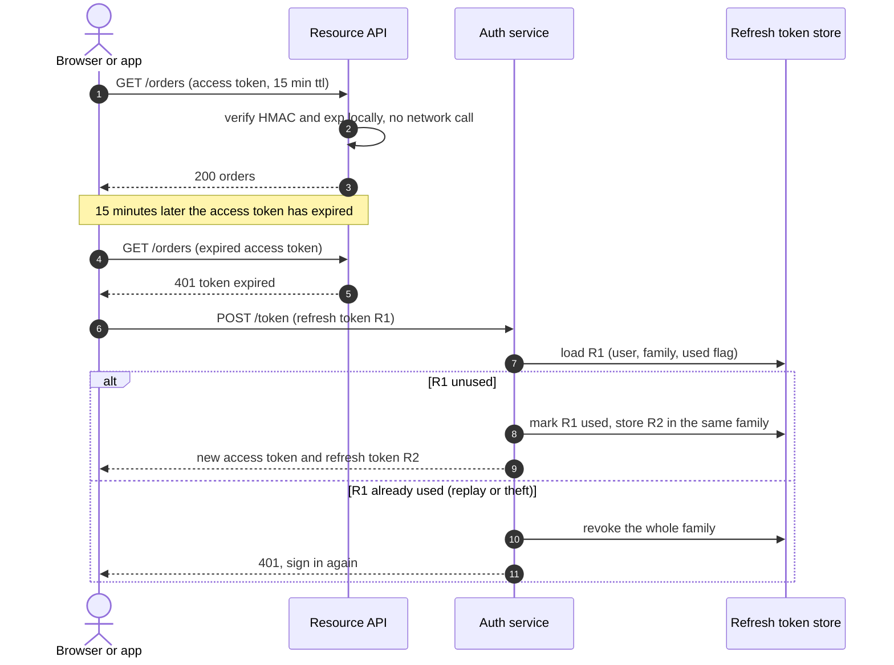
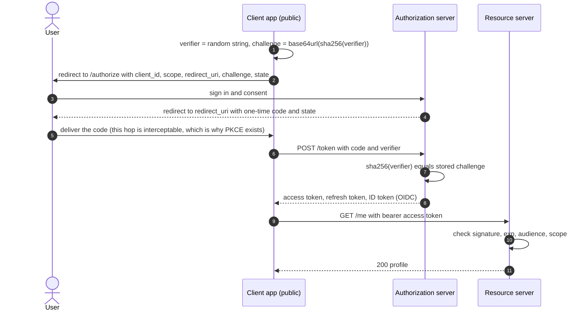
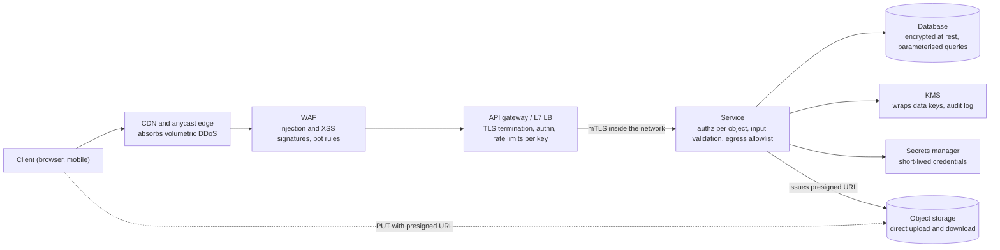

# Security essentials

## TL;DR

- Authentication proves who is calling; authorization decides what that caller may do to *this* object. Most production breaches are missing authorization checks, not broken crypto.
- Sessions are revocable and cost a lookup per request; JWTs verify locally and cannot be recalled, so pair short-lived access tokens with rotated refresh tokens.
- Encrypt in transit (TLS, mTLS inside), at rest (envelope encryption under a KMS), and hash passwords with a slow, salted function.
- Interviewers expect these decisions volunteered, not extracted.

## Core concepts

Security in a design round is a set of placements: where identity is established, where each permission is checked, where keys live and where untrusted bytes are stopped. You are not asked to derive ciphers; you are asked to put the right control at the right hop and to know what each one costs.

### Authentication, authorization and API keys

Authentication (authn) answers "who is this?" — a password, a one-time code, a signed token, a client certificate. Authorization (authz) answers "may this principal perform this action on this resource?" and must run on every request, inside the service that owns the data, because only that service knows who owns the object. API keys are the simplest credential: a random string that identifies a *client application*, not a person, so the gateway can meter and rate-limit per key. Store only a hash of the key, prefix it so leaked keys are recognisable in logs, and never let a key stand in for user-level authorization.

### Sessions vs JWTs: revocation, refresh tokens and rotation

A server-side session stores state keyed by an opaque cookie. Logout and forced sign-out are one delete, but every request pays a lookup: at a Twitter-like peak of ~500k reads/s that is 500k session reads/s, about 5 Redis instances at ~100k ops/s each, plus a ~500 µs in-datacenter hop on every call.

A JWT moves that state into the token: `header.payload.signature`, where the signature is an HMAC (or an asymmetric signature) over the first two segments. Any service holding the key verifies it in microseconds with no network call, which is why gateways and microservices favour them. The payload is base64, not encrypted, so it carries identifiers and roles, never secrets. The price is revocation: a token is valid until `exp` whatever happens to the account. The standard answer is two tokens: a short-lived access token (minutes) verified statelessly, and a long-lived refresh token stored server-side and exchanged for new access tokens. Rotate refresh tokens on every use and detect reuse — a replayed refresh token means theft, so revoke the whole family. For instant access-token revocation keep a denylist of revoked token ids with a TTL equal to their remaining lifetime; it holds only revoked tokens, so it stays tiny.

**Refresh-token rotation with reuse detection: the access token is verified locally; only the refresh touches the store.**



### OAuth 2.0 and OIDC: authorization code with PKCE, client credentials

OAuth 2.0 is delegated authorization: a user lets a client application act on their behalf at a resource server without sharing a password. The authorization-code flow is the one to draw: the client redirects the user to the authorization server, the user signs in and consents, the client receives a one-time code and exchanges it for tokens. PKCE (proof key for code exchange) protects public clients — mobile and single-page apps that cannot hold a client secret — by having the client hash a random verifier into the first request and present the verifier at the exchange, so an intercepted code is useless. Client credentials is the machine-to-machine flow: a backend job presents its own id and secret and receives a token with no user involved. OIDC sits on top of OAuth 2.0 and adds an ID token — a signed JWT describing the user — which is what "log in with Google" actually delivers.

**Authorization code with PKCE: the verifier proves the client that finishes the exchange is the one that started it.**



### TLS, certificate chains and mTLS

TLS gives confidentiality and integrity on the wire and authenticates the server through a certificate chain: the server's certificate is signed by an intermediate, the intermediate by a root the client already trusts. A TLS 1.3 handshake costs one round trip on top of TCP's, so for a user in Europe talking to a Californian origin that is 2 x 150 ms = 300 ms before the first byte — terminate TLS at an edge close to the user and keep connections alive. Inside the datacenter the hop is ~500 µs, so service-to-service mTLS, where both sides present certificates, is affordable; a service mesh issues short-lived workload certificates automatically. Terminating TLS at the load balancer and running plaintext inside the network is the common shortcut; say explicitly whether you take it.

### Passwords and encryption: hashing, KMS and envelope encryption

Passwords are never encrypted, only hashed with a slow, salted function — argon2id, which is also memory-hard, or bcrypt — because a leaked table must resist offline guessing. Tune the work factor so one hash costs about as much as a cross-region round trip, ~70 ms: invisible once per login, but it caps an attacker at 1 s / 70 ms = ~14 guesses per second per core. A per-user salt defeats precomputed tables; a server-side pepper kept outside the database defeats a dump of the table alone.

Encryption at rest protects against stolen disks and snapshots, and it is where key management lives. A KMS holds root keys in hardware and never exports them, but a KMS call is a network round trip and a rate-limited service. Envelope encryption fixes that: encrypt each object with its own data key, encrypt the data key with the KMS key, store the wrapped key beside the object. Rotating the KMS key re-wraps small data keys, not petabytes of data, and destroying a key is a deletion of everything it protected.

### RBAC vs ABAC

Role-based access control maps users to roles and roles to permissions, usually with inheritance (`admin` includes `editor` includes `viewer`). It is easy to audit — "who can refund?" is a query — and it is what most internal tools need. Attribute-based access control evaluates rules over attributes of the subject, the resource and the environment: the owner of a document may delete it; payments above a limit need a second approver; access only from the corporate network. RBAC cannot express ownership without one role per object, so real systems are RBAC for the coarse grain plus a few attribute conditions for the fine grain. Evaluate authorization in the service that owns the resource and log every decision with the role or rule that granted it.

### OWASP highlights: injection, XSS, CSRF, SSRF, IDOR

- **Injection**: untrusted input concatenated into a query or command. Parameterised queries and typed APIs, never string building.
- **XSS**: attacker-supplied script rendered in a victim's page. Output encoding by default, a content security policy, and tokens in `httpOnly` cookies where scripts cannot read them.
- **CSRF**: a victim's browser sends an authenticated request to your site from another site. `SameSite` cookies, anti-CSRF tokens, and no state change on GET.
- **SSRF**: your server is tricked into fetching an attacker's URL, often the cloud metadata endpoint. Allowlist outbound destinations, resolve and check addresses, and run fetchers in a network with no internal reach.
- **IDOR**: the request names an object id and the service never checks the caller owns it. The fix is the authorization call on every object access, which is why authz belongs in the service, not only at the gateway.

### Edge defenses, secrets and presigned URLs

Volumetric DDoS is absorbed before your servers: an anycast CDN spreads traffic across points of presence, and an L7 load balancer handles ~10k-100k QPS per node where an application server does ~1k, so anything that reaches the application tier must already be filtered and rate-limited per key, per user and per IP. A WAF in front of the gateway blocks known injection and XSS signatures and bot patterns; treat it as a net, not the fix. Secrets — database passwords, API keys, signing keys — live in a secrets manager that issues short-lived credentials and rotates them, never in environment files checked into a repository. Presigned URLs move bulk bytes off your servers: the service signs a URL that permits one method on one object key until an expiry, and the client talks to object storage directly. A YouTube-like 500k uploads/day x 300 MB = 150 TB/day never transits the application tier.

**Defence in depth: each hop removes one class of attack before the request reaches data.**



### Privacy and GDPR deletion

Personal data must be deletable on request within a statutory deadline measured in weeks, across every copy: primary store, replicas, caches, search indexes, analytics tables, backups and logs. Design for it up front: key personal data by a user id so deletion is a query per store, keep a registry of which systems hold it, make deletion an asynchronous job with a verification pass, and for immutable stores such as backups and event logs use crypto-shredding — encrypt each user's data under a per-user key and delete the key. Collect the minimum, set retention periods, and log access to sensitive fields.

## Trade-offs

| Credential | Revocation | Per-request cost | Server state | Best for | Main risk |
|---|---|---|---|---|---|
| Server-side session | Immediate, one delete | One store lookup (~500 µs hop) | Session per user | Browser apps, admin tools | Session store is a hot dependency |
| JWT access + refresh token | Access token lives to `exp`; refresh revocable | Local HMAC check, no I/O | Refresh tokens and a small denylist | Microservices, mobile, third-party APIs | Long TTLs, secrets in payload |
| API key | Immediate, flip a flag | Hash lookup, cacheable | Key table | Server-to-server, metering | Leaks in code and logs |
| mTLS client certificate | Revocation lists or short lifetimes | Handshake once per connection | CA and certificate inventory | Service-to-service inside a mesh | Operating the CA |
| OAuth 2.0 delegation | Revoke grant at the authorization server | Token check as above | Grants and consents | Third-party access on a user's behalf | Misconfigured redirect URIs |

Choose sessions when one backend serves a browser and instant logout matters more than a lookup: the store is a Redis hop you already pay for elsewhere. Choose JWTs when many services must authenticate the same caller without a shared store, and pair them with refresh rotation so the access token can be short. API keys identify applications and belong at the gateway, where they meter and rate-limit; they never replace user authorization. Use mTLS between services once you have more than a handful of them and cannot enumerate who may call whom by network rules alone. Use OAuth 2.0 whenever a third party acts for a user, and OIDC when you just want to outsource login. In every case the authorization decision happens in the owning service, per object, with a logged reason, and the secrets that make any of it work are issued, rotated and revoked by a secrets manager rather than copied into configuration.

## Python implementation

The codec starts with the encoding helpers: base64url without padding, compact key-sorted JSON, and an HMAC-SHA256 signature over `header.payload`:

```python title="code/hld/jwt_minimal.py — encoding and signing"
--8<-- "code/hld/jwt_minimal.py:encoding"
```

`JwtCodec.verify` checks the algorithm, the key id, the signature in constant time, then `exp`, `nbf` and the issuer, and only then returns the claims. `rotate` adds a key and signs with it; `retire` invalidates every token an old key signed:

```python title="code/hld/jwt_minimal.py — issue, verify, rotate"
--8<-- "code/hld/jwt_minimal.py:codec"
```

`RevocationList` is the small piece of state that gives stateless tokens a logout: an entry per revoked token id, forgotten once the token would have expired anyway:

```python title="code/hld/jwt_minimal.py — revocation"
--8<-- "code/hld/jwt_minimal.py:revocation"
```

`uv run python -m hld.jwt_minimal` prints:

```text
token: 232 chars in 3 segments
header:  {'alg': 'HS256', 'kid': 'k1', 'typ': 'JWT'}
payload: {'exp': 1700000900, 'iat': 1700000000, 'iss': 'auth.example', 'jti': 'jti-1', 'role': 'editor', 'sub': 'user:42'}
fresh token:          ok, sub=user:42 role=editor
payload edited:       rejected (signature mismatch)
alg=none, no sig:     rejected (unsupported alg 'none')
after rotate to k2:   old ok, new ok
after retire k1:      old rejected (unknown key id 'k1')
after revoke jti:     new rejected (token has been revoked); denylist size=1
901 s later (ttl 900): new rejected (token expired 1 s ago); denylist size=0
```

The role evaluator keeps permissions as `resource:action` strings with `*` wildcards, and lets a grant carry a condition over request attributes — the one hook that takes RBAC into ABAC territory:

```python title="code/hld/rbac.py — permissions, grants, decisions"
--8<-- "code/hld/rbac.py:grants"
```

`RbacPolicy` resolves role inheritance as a transitive closure, refuses cycles, and returns a `Decision` that names the role and grant behind every allow, so the audit log can explain itself:

```python title="code/hld/rbac.py — the policy"
--8<-- "code/hld/rbac.py:policy"
```

`uv run python -m hld.rbac` prints:

```text
roles: viewer <- editor <- admin (arrow = inherits)
bob's effective roles: ['editor', 'viewer']
bob's unconditional permissions: ['doc:read', 'doc:write']
checks:
  ALLOW carol  doc:read                              via viewer [doc:read]
  DENY  carol  doc:write                             no role grants it
  ALLOW bob    doc:write                             via editor [doc:write]
  ALLOW bob    doc:delete      ctx={'owner': 'bob'}  via editor [doc:delete if owner]
  DENY  bob    doc:delete      ctx={'owner': 'alice'} condition not met for [doc:delete if owner]
  ALLOW alice  doc:delete      ctx={'owner': 'bob'}  via admin [*]
  ALLOW alice  billing:refund                        via admin [*]
  DENY  dave   doc:read                              user has no roles
cycle refused: 'admin' already inherits 'viewer'; that would be a cycle
  DENY  bob    doc:read                              user has no roles
```

## In the interview

Introduce security while drawing the request path, one sentence per hop: "TLS terminates at the edge, the gateway authenticates the JWT and rate-limits per API key, the order service authorises per order id, secrets come from the secrets manager and the database is encrypted under envelope keys." That places every control without a separate "security section" that interviewers rarely have time for.

Phrases that signal depth: "short-lived access token, rotated refresh token, reuse detection"; "authorization happens in the owning service, per object, not only at the gateway"; "envelope encryption, so rotating the KMS key re-wraps data keys instead of re-encrypting the data".

??? question "You chose JWTs. How do you log a user out?"
    Access tokens live minutes, so logout revokes the refresh token family in the store and the access token dies on its own. For immediate effect, add the token id to a denylist with a TTL equal to its remaining lifetime; it holds only revoked tokens, so it is a tiny cache lookup. Admin lockout revokes every family for the user.

??? question "Where does the browser keep the token?"
    In an `httpOnly`, `Secure`, `SameSite` cookie: an injected script cannot read it, and `SameSite` plus an anti-CSRF token stops cross-site requests. Local storage is readable by any script on the page, so one XSS bug leaks every session.

??? question "Why does a mobile app need PKCE?"
    A mobile app is a public client: any secret compiled into it can be extracted. PKCE binds the authorization code to a one-time verifier only the app instance knows, so a code intercepted through a custom URL scheme cannot be exchanged.

??? question "How does a client upload a 2 GB video without streaming it through your servers?"
    The service authorises the upload and returns a presigned URL bound to one object key, one method, a content type and an expiry; the client PUTs straight to object storage and then tells the service it finished. Your servers handle metadata only; the bytes take the storage network's path.

??? question "Your service stores encrypted PII. How do you rotate keys and honour a deletion request?"
    Envelope encryption: each record or object has a data key wrapped by a KMS key. Rotation re-wraps the data keys; the data stays put. Deletion across backups is crypto-shredding: encrypt each user's data under a per-user key and destroy that key, then let a registry-driven job delete the live rows and verify.

!!! tip "Interview tip"
    Say "authorization per object in the owning service" once, early, and show it on the diagram. Candidates who only mention "auth at the gateway" get the IDOR follow-up, and it is the most common real-world vulnerability class.

## Common mistakes

- **Trusting the token header**: accepting whatever `alg` the token declares lets an attacker send `alg: none` or swap algorithms. Fix: pin the algorithm and the key id server-side, as the codec above does.
- **Day-long access tokens with no revocation**: a stolen token works until it expires. Fix: minutes for access tokens, rotated refresh tokens with reuse detection, a denylist for emergencies.
- **Secrets in the payload or in the repository**: JWT payloads are readable by anyone; environment files get committed. Fix: identifiers only in tokens, a secrets manager with rotation for everything else.
- **Plaintext inside the network**: TLS ends at the load balancer and every internal hop is readable by anything in the VPC. Fix: mTLS through a mesh, or say explicitly that you accept the risk.
- **Comparing signatures with `==`**: early-exit comparison leaks how many bytes matched. Fix: a constant-time compare such as `hmac.compare_digest`.

!!! warning "Common mistake"
    Checking *who* the caller is and never *whether they own the object*: `GET /orders/1234` returns any order to any authenticated user. Authentication at the gateway is not authorization; the service must check ownership on every object access, with the decision logged.

## Self-check

??? question "What does a JWT signature protect, and what does it not?"
    Integrity and origin of the header and payload: nobody without the key can alter or forge them. It does not hide the payload, which is plain base64, and it cannot be recalled before `exp`.

??? question "Why rotate refresh tokens on every use?"
    A rotated token is single-use, so a replay reveals theft; revoking the whole family then evicts the attacker and the legitimate client together, and the user simply signs in again.

??? question "Why is envelope encryption cheaper than encrypting everything under the KMS key?"
    A KMS call is a network round trip to a rate-limited service; encrypting each object locally with its own data key and wrapping only that key makes KMS traffic one small call per object, and rotation re-wraps keys instead of data.

??? question "Why hash passwords slowly when every other hash is optimised for speed?"
    A fast hash lets an attacker with a leaked table test billions of guesses per second. A slow, salted, memory-hard hash tuned to tens of milliseconds costs a login nothing and caps guessing at a handful per second per core.

??? question "What is the difference between RBAC and ABAC in one sentence each?"
    RBAC grants permissions to roles and roles to users, so questions like "who can refund?" are queries. ABAC evaluates rules over attributes of subject, resource and environment, which is how you express ownership and limits.

## Related

- [API design for HLD rounds](api-design.md) — idempotency keys, versioning and auth headers on the API surface
- [Load balancing, reverse proxies and API gateways](load-balancing-and-api-gateway.md) — where TLS terminates and keys are metered
- [Rate limiting](rate-limiting.md) — per-key and per-IP limits that back the edge defenses
- [Design Dropbox or Google Drive](../case-studies/cloud-file-storage.md) — presigned URLs and encryption at rest in practice
- [Design a payment system and digital wallet](../case-studies/payment-system.md) — idempotency, audit and PCI-style isolation
- RFC 7519, "JSON Web Token (JWT)" and RFC 7518, "JSON Web Algorithms"
- RFC 6749, "The OAuth 2.0 Authorization Framework" and RFC 7636, "Proof Key for Code Exchange"
- OWASP Foundation, "OWASP Top 10" (2021)
