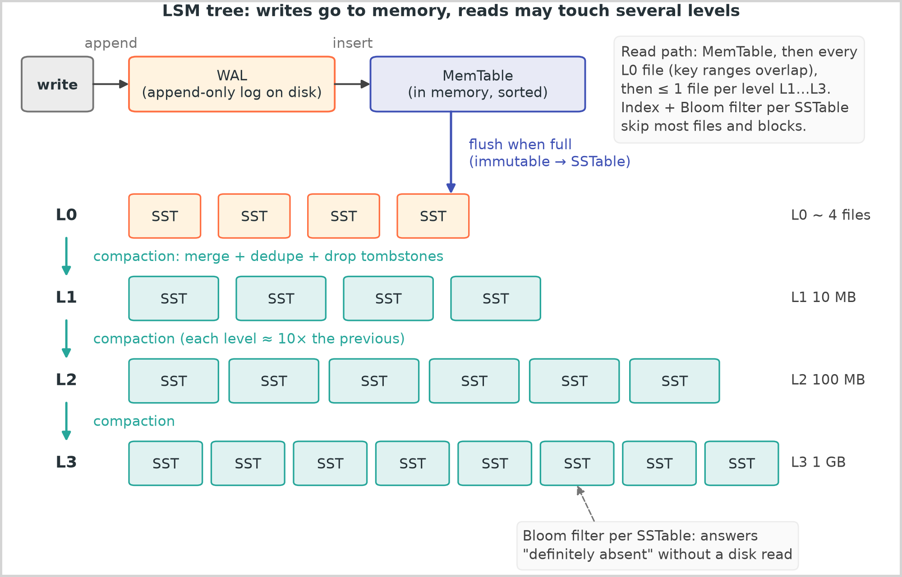
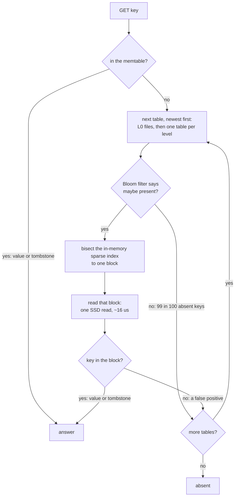

# Storage engines and indexing

## TL;DR

- A storage engine decides how a write reaches disk and how a read finds it: B-trees update pages in place (read-optimized); LSM trees append and merge (write-optimized).
- Every engine pays in read, write or space amplification; name which one you pay.
- Indexes trade write cost for read cost: column order and covering columns decide whether a query is one page read or a scan.
- Interviewers raise it when you say "Postgres" or "Cassandra".

## Core concepts

The engine under a database sets the shape of every cost you will be asked about: disk reads per lookup, bytes moved per write, space a deleted row still holds.

### B-trees and B+trees: pages, splits and writes in place

A B-tree keeps keys in fixed-size pages (4-16 KB): a sorted list of separator keys and child pointers. Relational engines use the B+tree variant: internal pages hold only keys and pointers, rows live in the leaves, and leaves are linked so a range scan walks siblings. A 16 KB page with 16 B per key-pointer slot holds ~1,000 separators, so 3 levels address 1,000^3 = 10^9 leaf pages; a table of billions of rows is 3-4 levels deep, its top two levels stay in the buffer pool, and a cold point read is 1-2 SSD random reads at 16 µs each.

Writes go in place: descend to the leaf, latch the page, modify it. A full page splits: allocate a new page, move half the keys across, add a separator to the parent, which may split in turn. The engine logs a redo record to the WAL before touching the page, protects against torn pages (InnoDB's doublewrite buffer, PostgreSQL's full-page writes) and writes dirty pages back at checkpoints. The cost is random I/O and a page-sized write for a row-sized change: a 100 B update dirties a 16 KB page, ~160x the payload, hidden only while the dirty pages fit in memory. PostgreSQL's MVCC adds a new tuple version per update and, unless it is heap-only, an entry in every index.

**Two write paths: a B-tree finds and overwrites a page, an LSM tree appends and sorts later.**

```mermaid
flowchart TD
    subgraph sg_btree["B-tree: write in place"]
        b_w["UPDATE one row"] --> b_log["append redo record to the WAL"]
        b_log --> b_desc["descend root to leaf:<br/>3-4 page reads, top levels cached"]
        b_desc --> b_fit{"leaf page has room?"}
        b_fit -->|"yes"| b_mod["modify the page in the buffer pool"]
        b_fit -->|"no"| b_split["split: new page, move half the keys,<br/>insert a separator in the parent"]
        b_split --> b_mod
        b_mod --> b_ckpt["checkpoint writes dirty pages back later"]
    end
    subgraph sg_lsm["LSM tree: append only"]
        l_w["PUT one key"] --> l_log["append to the WAL"]
        l_log --> l_mem["insert into the memtable<br/>(sorted, in memory)"]
        l_mem --> l_full{"memtable full?"}
        l_full -->|"no"| l_ack["acknowledge"]
        l_full -->|"yes"| l_flush["flush: write one sorted SSTable<br/>sequentially, then acknowledge"]
        l_flush --> l_comp["compaction merges tables<br/>in the background"]
    end
```



### LSM trees: WAL, memtable, SSTables and tombstones

An LSM tree never modifies a file. A write is appended to the WAL, inserted into the memtable (a sorted in-memory skip list) and acknowledged. When the memtable reaches its limit it becomes immutable and a background thread writes it out as an SSTable: a sorted string table of key-value blocks with a sparse index (the first key of each block) and a Bloom filter. The flush is one sequential write, so the disk streams ~2 GB/s instead of absorbing ~100k random 4 KB writes (~400 MB/s); on HDDs the gap is ~150 MB/s against ~100 IOPS.

A delete cannot remove bytes from an immutable file, so it writes a tombstone. A read that meets one stops searching; compaction drops it only when no older table can hold a version of the key, which in Cassandra means waiting out `gc_grace_seconds` so every replica has seen the delete.

{ width="800" }

### Compaction: size-tiered vs leveled

Compaction merges tables so reads touch fewer files and overwritten versions are reclaimed.

- **Size-tiered** (Cassandra's default): merge several tables of similar size into one, repeat at the next tier. Each byte is rewritten about once per tier, so write amplification is low, but a key can exist in every tier: space amplification reaches 2x and a read probes one table per tier.
- **Leveled** (LevelDB, RocksDB's default): L0 holds raw flushes; each level below is a run of non-overlapping tables ten times the size of the level above (the figure's L1 10 MB, L2 100 MB, L3 1 GB). Compacting one L(n) table merges it with the ~10 L(n+1) tables it overlaps: every byte is rewritten ~10x per level, 30-40x over 3-4 levels, but a key lives in at most one table per level, space overhead stays ~10% and a read checks one table per level plus L0.

Time-window compaction (Cassandra's TWCS) groups tables by write time, so TTL data expires by deleting whole files.

### Bloom filters and the read path

A read checks the memtable, each L0 table newest first, then one table per level. With a Bloom filter per table (10 bits per key and 7 hash functions: (1 - e^(-0.7))^7 = ~0.8% false positives) a miss costs ten memory probes at ~100 ns instead of ten SSD reads at 16 µs, and a hit pays one block read in the table that holds the key. The filter cannot help a range scan, which merges every table's slice of the range: that merge is the LSM's real read tax.

**An LSM point read: the Bloom filter turns most table probes into a memory lookup.**



### Read, write and space amplification

Every engine pays in three currencies:

- **Read amplification**: disk reads per logical read. B-tree: 1-2 with the upper levels cached. LSM: tables probed minus Bloom skips.
- **Write amplification**: bytes written to disk per byte the application wrote. B-tree: the WAL record plus a page rewrite per checkpoint. LSM: WAL + flush + one rewrite per compaction pass, 2-4x size-tiered, ~10x per level leveled.
- **Space amplification**: bytes on disk per live byte. B-tree pages run 50-70% full after splits (~1.5x); size-tiered up to 2x during a merge; leveled ~1.1x.

You can minimise two of the three, never all three: a B-tree buys reads with writes, size-tiered buys writes with space, leveled buys space with writes.

### Secondary indexes: local vs global, column order, covering

Three decisions set a secondary index's cost:

- **Local vs global** (sharded stores): a local index covers one shard's rows, so a write stays local and a lookup by the indexed value fans out to every shard, p99 = the slowest. A global index is partitioned by the indexed value: two hops per lookup (~1 ms) and, since a write now touches two shards, usually asynchronous updates.
- **Composite column order**: an index on `(a, b, c)` serves any left prefix. Equality columns first, the range column next, then output columns: `(tenant_id, created_at)` answers "this tenant's last 24 hours" with one contiguous slice; `(created_at, tenant_id)` scans every tenant's rows in the window.
- **Covering indexes**: when the index holds every column the query reads (`INCLUDE` in PostgreSQL; the primary key InnoDB stores in every secondary index), the query is an index-only scan and skips the heap page and its 16 µs.

The bill is on the write path: six indexes make roughly seven page writes per row, and in an LSM engine each index is a separate tree with its own compaction.

### Column stores: Parquet, ORC and why OLAP differs

A row store keeps a row's columns together. Analytics asks for the sum of one column over a billion rows, and a row store reads every other column to get it: 1B rows x 1 KB = 1 TB scanned for an 8 B column that is 8 GB on its own, 125x the bytes, ~8 min instead of ~4 s at ~2 GB/s. Column stores (Parquet and ORC files; ClickHouse and BigQuery engines) store each column contiguously inside row groups, keep min and max per group so a filter skips whole groups, and compress far better because adjacent values are alike. The trade is the write path: no point updates, append-only parts merged in the background, and single-row reads that reassemble the row from every column file. So the system of record stays in a row store and change data capture feeds the columnar copy.

### Which engines use which

| Product | Engine | What to say about it |
|---|---|---|
| MySQL (InnoDB) | B+tree clustered on the primary key | secondary indexes store the primary key: two descents per lookup |
| PostgreSQL | heap table plus B-tree indexes, MVCC tuples | an update writes a new tuple and, unless heap-only, every index |
| LevelDB, RocksDB | LSM, leveled by default | under CockroachDB, TiKV, MyRocks |
| Cassandra, ScyllaDB, HBase | LSM | size-tiered by default in Cassandra; leveled and time-window as options |
| Lucene (Elasticsearch) | immutable segments merged in the background | deletes are markers until a merge |

## Trade-offs

| Criterion | B+tree (InnoDB, PostgreSQL) | LSM, size-tiered (Cassandra) | LSM, leveled (RocksDB) | Column store (Parquet, ClickHouse) |
|---|---|---|---|---|
| Point read | 1-2 page reads, 16-32 µs cold | one probe per tier, Bloom-filtered | one probe per level, Bloom-filtered | poor: reassemble from every column |
| Range scan | leaf chain, cheap | merge across tiers | merge across levels, one table each | excellent on few columns |
| Write path | random page writes, splits | sequential append, few rewrites | sequential append, ~10x rewrite per level | batch or append-only parts |
| Write amplification | page size / row size, buffered | 2-4x | 30-40x at 3-4 levels | low: bulk rewrites |
| Space amplification | ~1.5x (half-full pages) | up to 2x | ~1.1x | lowest: columnar compression |
| Best for | mixed OLTP, secondary indexes, transactions | write-heavy ingest, TTL data | write-heavy with read and space limits | analytics, scans, aggregates |

Choose a B-tree engine whenever the workload is mixed and fits one box: point reads and short ranges in 1-2 page reads, several secondary indexes, transactions across rows. At ~5k-20k writes/s per primary that is the relational default and covers most products for years. Move to an LSM engine when writes dominate or arrive faster than random page I/O can absorb: event logs, chat messages, metrics, anything with a TTL. Within LSM, take size-tiered when ingest is the whole story and disk is cheap, leveled when reads and space matter and you can afford the rewrites. Use a column store for the analytics copy, never as the system of record: it answers "sum over a billion rows" in seconds and "fetch one order" badly. The index decision is separate: one composite index per dominant query, equality columns first, covering columns when the read is hot enough to pay for the write.

## Python implementation

The Bloom filter in `code/hld/lsm_tree.py` is the production recipe in miniature: 10 bits per key, k = 7 positions from one double-hashed digest:

```python title="code/hld/lsm_tree.py — Bloom filter"
--8<-- "code/hld/lsm_tree.py:bloom"
```

An `Entry` with `value=None` is a tombstone; the WAL is a list here and a fsync-ed file in production:

```python title="code/hld/lsm_tree.py — WAL and memtable"
--8<-- "code/hld/lsm_tree.py:wal_memtable"
```

An `SSTable` rejects unsorted or duplicate keys, builds its sparse index and filter, and answers `get` with one block scan:

```python title="code/hld/lsm_tree.py — SSTable"
--8<-- "code/hld/lsm_tree.py:sstable"
```

`LsmTree` ties them together under one lock; `compact` is a stable `heapq.merge` over the tables newest-first, so the first entry seen for a key is the newest:

```python title="code/hld/lsm_tree.py — the tree"
--8<-- "code/hld/lsm_tree.py:tree"
```

`uv run python -m hld.lsm_tree` prints:

```text
12 writes with memtable_limit=4 -> 3 flushes, tables #1 user:1..user:4, #2 user:5..user:8, #3 user:2..user:9
get user:2   -> v2    from sstable 3 (1 block read(s), 0 table(s) skipped by Bloom)
get user:7   -> v1    from sstable 2 (1 block read(s), 1 table(s) skipped by Bloom)
get user:3   -> None  from sstable 3 (1 block read(s), 0 table(s) skipped by Bloom)
get user:42  -> None  from absent    (0 block read(s), 3 table(s) skipped by Bloom)
put user:10, not flushed: memtable=1, wal=1 entry, tables=3
crash and recover: WAL replayed, get user:10 -> v1, get user:3 -> None
before compaction: 3 tables, 12 entries for 8 live keys, space amplification 1.47x
after compaction:  1 table, 8 entries for 8 live keys, space amplification 1.00x
write amplification: 261 B on disk (WAL + flushes + compaction) / 103 B written by the app = 2.5x
get user:7   -> v1    from sstable 4 (1 block read(s), 0 table(s) skipped by Bloom)
scan user:4..user:7 -> [('user:4', 'v1'), ('user:5', 'v2'), ('user:6', 'v1')]
```

`user:3` is `None` because the tombstone in table 3 is met before the value in table 1; write amplification is 103 B of WAL + 94 B flushed + 64 B merged over 103 B written.

## In the interview

Name the engine with the store, in one sentence that carries the workload: "Messages are append-heavy and read by conversation, so an LSM-backed wide-column store: sequential writes, one partition per range read."

Phrases that signal depth: "a B-tree is read-optimized and writes in place, an LSM tree is write-optimized and merges later"; "leveled compaction pays ~10x write amplification per level to keep one table per level".

??? question "Why does an LSM tree write faster than a B-tree if both write a WAL first?"
    The B-tree then overwrites a random page per update, a page-sized write for a row-sized change. The LSM tree inserts into memory and writes sorted files sequentially, deferring the rewrite to compaction.

??? question "A point read on Cassandra is slower than on MySQL. Why, and what helps?"
    The read probes one table per tier, each a Bloom check and, on a maybe, a block read. Help: compaction that keeps up, leveled compaction, a row cache, one entity per partition.

??? question "You indexed `(created_at, tenant_id)` and the query is one tenant's last day. Is the index used?"
    Badly: the leading column is the range, so the engine scans every tenant's rows in the window. Reverse it to `(tenant_id, created_at)`: equality first, then one contiguous range.

??? question "When is a tombstone removed, and what goes wrong if you remove it early?"
    Only when no older data for the key can survive (a full merge or the bottom level) and every replica has seen the delete; earlier, a replica that missed the delete repairs its old value back.

??? question "Why not run analytics on the production Postgres?"
    A row store reads every column to sum one: 1B rows x 1 KB is 1 TB scanned for an 8 GB column. A column store reads only that column; feed it by change data capture.

!!! tip "Interview tip"
    Say the amplification you are choosing: "leveled RocksDB, ~10x write amplification per level, one table per level on reads, ~10% space overhead" tells the interviewer you have operated the engine.

## Common mistakes

- **"LSM is faster"**: at writes, yes; point reads cost a Bloom check per table and range scans merge every table. Fix: state the workload, then the engine, then the amplification.
- **Treating a delete as free space**: in an LSM store a delete is a write, and tombstone-heavy tables read slowly until compaction. Fix: time-window compaction for TTL data; bulk deletes by dropping partitions.
- **An index per column**: each index is a page write per insert and another structure to compact. Fix: one composite index per dominant query shape.
- **Counting levels, forgetting L0**: a read checks every L0 file, and a write burst that outruns compaction stalls writes. Fix: mention the L0 trigger and write stalls.

!!! warning "Common mistake"
    Calling a secondary index cheap because "it's just a B-tree": on a sharded store a local index makes every lookup a scatter-gather over all shards, and a global index makes every write a two-shard, usually asynchronous update. Say which one you want.

## Self-check

??? question "What does a B+tree page split do, and why can it cascade?"
    A new page takes half the keys and the parent gets a separator; a full parent splits the same way, up to the root.

??? question "Name the components an LSM write touches, in order."
    WAL (durable append), memtable (sorted, in memory), SSTable (immutable, with sparse index and Bloom filter); compaction merges tables later.

??? question "Size-tiered vs leveled: which writes less, which stores less?"
    Size-tiered: lower write amplification (about once per tier) but up to 2x space; leveled: ~10x rewrites per level but ~1.1x space and one table per level.

??? question "What does a Bloom filter guarantee, and what does it not?"
    A "no" is certain; a "yes" is probable, ~1% false positives at 10 bits per key. It answers point lookups only, never range scans.

??? question "Why is a column store bad at `SELECT * WHERE id = 42`?"
    The row is spread across one file per column, so one row means decoding every column.

## Related

- [Choosing a database](databases-sql-vs-nosql.md) — the store decision
- [Design a Dynamo-style key-value store](../case-studies/key-value-store.md) — an LSM engine per node
- [Probabilistic data structures](probabilistic-data-structures.md) — Bloom filter sizing
- [Partitioning, sharding and consistent hashing](partitioning-and-consistent-hashing.md) — local vs global indexes
- [Replication](replication.md) — tombstones and repair
- O'Neil et al., "The Log-Structured Merge-Tree (LSM-Tree)" (Acta Informatica 1996)
- Chang et al., "Bigtable: A Distributed Storage System for Structured Data" (OSDI 2006)
