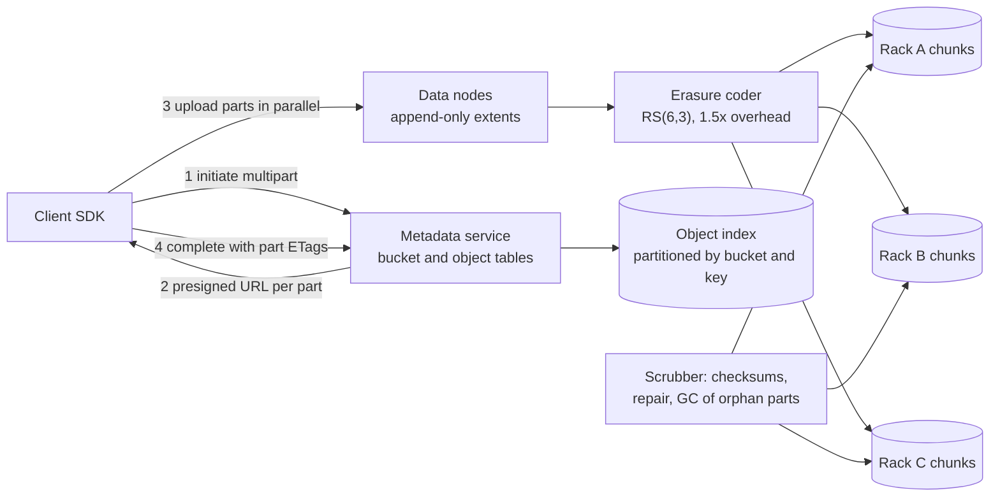
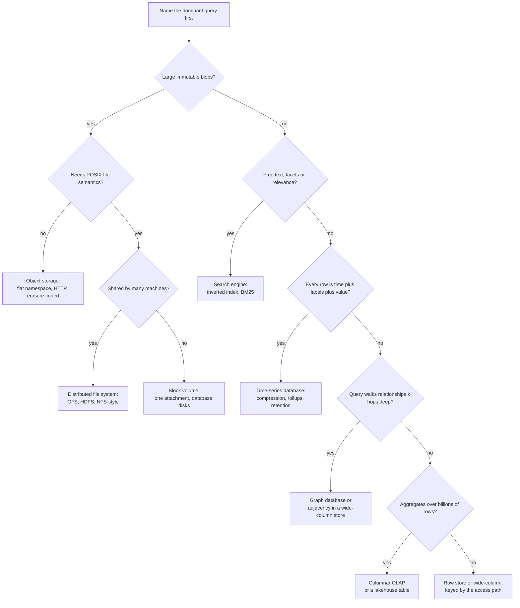

# Object, file, search, time-series and graph storage

## TL;DR

- Past a certain size or shape, data stops fitting a row store: blobs go to object storage, text to an inverted index, metrics to a time-series database, walks to a graph, scans to a columnar engine.
- Each buys one access pattern cheaply and makes the rest expensive, so name the dominant query first.
- A blob store is a metadata service plus dumb data nodes; its consistency lives in the metadata.
- Interviewers use it to see whether you bolt everything onto Postgres.

## Core concepts

### Object storage

An object store keeps immutable blobs in buckets under a flat namespace: the key `2026/08/report.pdf` contains slashes but there are no directories, so listing a prefix is a range scan of a sorted index, not a tree walk. Objects are written whole and replaced whole, which is what lets the system be so simple and so durable.

Durability comes from redundancy, and the choice is replication or erasure coding. Three replicas cost 3x the bytes and survive two losses. Reed-Solomon RS(6,3) splits an object into 6 data and 3 parity chunks and rebuilds the object from any 6 of the 9: 1.5x the bytes and it survives three losses, so it beats replication on both counts — paid for with encode CPU and a reconstruct read (6 chunk fetches) whenever a chunk is missing. Erasure-code the cold bulk, replicate the small and hot: at 500k videos/day x 300 MB = 150 TB/day of ingest, that is 225 TB/day of disk instead of 450 TB/day.

Three mechanics come up in every interview. **Multipart upload** splits a large object into parts uploaded in parallel and retried individually; a `complete` call lists the part numbers and ETags and the object appears atomically, so a 5 GB upload no longer restarts from zero. **Presigned URLs** let the client upload straight to the store over a time-limited signed link, keeping terabytes off your application servers. **Consistency** is metadata consistency: new keys are read-after-write consistent because the metadata write commits before the 200; listings and cross-region replication lag.

**A blob store is a metadata service, dumb data nodes and a scrubber that never stops.**



### Distributed file systems and block storage

GFS and HDFS answer a different question: one enormous file, written once, appended to, read sequentially by hundreds of workers. A file is split into fixed 64 MB chunks (HDFS defaults to 128 MB) across chunk servers, each chunk replicated three times over at least two racks. A single coordinator (HDFS calls it the NameNode) holds the namespace and chunk map in memory and hands clients the chunk locations; the data never passes through it, which is why one node can serve a cluster. The cost is a memory ceiling — at roughly 150 B per chunk, 100M files of 1 MB need 100M entries where the same bytes in 64 MB chunks need 1.6M.

Block storage is the third shape: a raw device attached to one machine, which puts a filesystem on it. It is what a database volume needs — random 4 KB IO at 16 µs on NVMe, real POSIX semantics — and it does not scale out. Block for one machine's filesystem, distributed file system for a shared namespace, object storage for anything addressable by key.

### Search engines

A search engine inverts the table: instead of a row pointing at its terms, every term points at a postings list of the documents containing it. The **analyzer** turns text into terms (lowercase, tokenize, drop stop words, stem) and must be identical at index and query time, or queries silently miss documents. Boolean AND is then a linear intersection of sorted postings lists, OR a merge.

Ranking separates search from a filter. TF-IDF scores a document by term frequency times `log(N/df)`, so a term in every document contributes zero. BM25 refines it: term frequency saturates, long documents get a length penalty. Index layout mirrors partitioning: shard by document so each shard holds complete postings for its own documents, query all shards, merge the top-K, with replicas per shard for throughput and failover. Budget ~5k-10k documents/s per data node, and note that segments are immutable: writes land in a new segment, deletes are tombstones, merges reclaim space.

### Time-series databases

A metric series is `(name, labels) -> [(timestamp, value)]`, appended in time order, queried as ranges and aggregates, almost never updated. That shape allows compression a general store cannot touch: delta-of-delta timestamps (a 10-second scrape is the same delta every time) and XOR-encoded floats squeeze a 16 B point to ~1.4 B, so 100k hosts x 100 metrics every 10 s = 1M points/s falls from ~1.4 TB/day raw to ~120 GB/day.

The other levers are retention and downsampling: keep raw resolution for days, roll up to per-minute and per-hour aggregates for months, delete the rest. The failure mode is cardinality, not volume — each label combination is a series, so a user id in a label creates millions of them and takes the database down. Cardinality is a budget you enforce, not a limit you discover.

### Graph databases

A graph store keeps adjacency directly: each node holds pointers to its edges, so "friends of friends" is a pointer chase, not a join. Relationally that is a self-join per hop, and at three hops over an edge table it becomes an unbounded scan. If the dominant query is variable-depth traversal, shortest path or pattern match, a graph engine is the right shape.

Its weakness is partitioning: graphs have no clean cut, so a traversal crossing shards pays a network hop per hop — at 500 µs each, a 4-hop cross-shard walk is 2 ms before any work. Large systems therefore keep the graph in a wide-column or key-value store behind a heavy cache (Facebook's TAO), reserving graph engines for datasets that fit a replicated cluster.

### Wide-column, columnar OLAP, and the lake

Wide-column stores (Cassandra, HBase, Bigtable) look like tables but model as *nested maps*: a partition key picks the node, clustering columns sort rows inside it, and you design one table per query rather than normalising. Every read is a single-partition seek; an unmodelled query costs a second table and a second write.

Columnar OLAP engines (ClickHouse, BigQuery, Redshift) store each column separately, so a query touching 3 of 200 columns reads 1.5% of the bytes, and each column compresses well because neighbouring values are alike. With vectorised execution a billion-row scan becomes seconds — but a point lookup is slower than in a row store and updates are rewrites. Row store for OLTP, column store for OLAP, a stream or nightly job in between.

A data **warehouse** stores modelled, schema-on-write tables analysts query directly. A data **lake** is object storage holding raw files (Parquet, Avro) with schema-on-read and an external catalogue: cheap, format-flexible, easy to turn into a swamp. The lakehouse pattern (Iceberg, Delta) adds table metadata, ACID commits and time travel over lake files, which is why "ELT into a lakehouse" has largely replaced "ETL into a warehouse".

**Follow the dominant query to a store, not the other way round.**



## Trade-offs

| Store | Data model | Wins at | Loses at | Cost signal |
|---|---|---|---|---|
| Object storage | Key to blob | Durability, cost, scale | Small objects, updates | GB-month plus requests |
| Distributed file system | Files in chunks | Big sequential scans | Many small files | Chunk metadata in memory |
| Block volume | Raw device | Random 4 KB IO, POSIX | Sharing, scale-out | Provisioned IOPS |
| Search engine | Inverted index | Text, facets, relevance | Writes, truth of record | RAM per shard |
| Time-series DB | Series plus points | Range aggregates, rollups | Label cardinality | Active series |
| Graph database | Nodes and edges | Multi-hop traversal | Sharding, scans | Traversals per second |
| Wide-column | Nested maps | Single-partition reads | Unplanned queries | Partition size |
| Columnar OLAP | Column segments | Billion-row scans | Point lookups, updates | Bytes scanned |

Pick by the dominant query, then check the second one. Blobs are the easy call: anything over a megabyte written once belongs in object storage, with the database holding key, size and checksum — a 2 MB image in a row makes every backup and replica pay for it. Search is a derived index, never the source of truth: write to the database, project into the index asynchronously, accept seconds of lag. Time-series earns its own store once you store millions of points a second, because compression and rollups are the whole product; below that a partitioned table is fine. Graphs are the most over-chosen: a two-hop query with an index is a join, so reach for a graph engine only when depth is variable or the pattern is the query. Columnar is unambiguous — `GROUP BY` over a billion rows defeats any row store — but resist running OLTP and OLAP on one engine, because their access patterns fight over the same memory.

## Python implementation

The analyzer is the contract between indexing and querying: the same lowercase, tokenize, stop-word and stemming pipeline runs on both sides, or `Chunks` never finds `chunk`.

```python title="code/hld/inverted_index.py — the analyzer"
--8<-- "code/hld/inverted_index.py:analyzer"
```

Postings lists stay sorted by document id, which turns AND into a linear intersection (shortest list first, so the running result stays small) and OR into a k-way merge:

```python title="code/hld/inverted_index.py — postings and boolean merges"
--8<-- "code/hld/inverted_index.py:postings"
```

`InvertedIndex` adds the document lengths TF-IDF needs and scores `tf / len(d) x log(N / df)` per query term, ties broken by document id so ranking is deterministic:

```python title="code/hld/inverted_index.py — the index and TF-IDF"
--8<-- "code/hld/inverted_index.py:index"
```

Running `uv run python -m hld.inverted_index`:

```text
indexed 7 documents, 64 distinct terms
analyze 'Search engines build an inverted index: every term maps to the documents that contain it.'
  -> ['search', 'engin', 'build', 'invert', 'index', 'every', 'term', 'map', 'document', 'contain']
postings('Chunks') -> term 'chunk': doc 2 (tf=2), doc 7 (tf=1)
idf: chunk=log(7/2)=1.25  storage=log(7/2)=1.25  index=log(7/1)=1.95  file=log(7/2)=1.25
AND 'storage chunks' -> [7]
OR  'storage chunks' -> [1, 2, 7]
ranked OR 'storage chunks':
  doc 7  score 0.228  (storag x1, chunk x1 in 11 terms)
  doc 2  score 0.209  (chunk x2 in 12 terms)
  doc 1  score 0.139  (storag x1 in 9 terms)
ranked AND 'replicated chunks' -> doc 2 (0.371)
match('the') -> [] (every query term was a stop word)
add doc 3 again -> ConflictError: document 3 is already indexed; delete and re-add instead
```

Read the ranking: document 7 matches both terms and wins; document 2 has `chunk` twice but is longer; `index` scores highest per occurrence because it appears in one document of seven. BM25 adds saturation, so the twentieth occurrence stops counting, plus a length norm gentler than dividing by document length.

## In the interview

Reach for it when you name a component's storage: "the video bytes go to object storage via a presigned multipart upload, the metadata row keeps the key and checksum, and the search index is a projection off the change stream — so the database never holds a blob and never serves a text query."

Phrases that signal depth: "the index is derived state, not the source of truth"; "erasure coding gives 1.5x instead of 3x for the same durability, at reconstruct cost"; "cardinality, not points per second, kills a time-series database".

??? question "Where do the bytes of an uploaded video live, and what does the database hold?"
    Bytes go to object storage via a presigned multipart upload, so they never traverse the application tier. The database holds key, size, content hash, owner and status — small rows, fast backups, cheap replicas, durability delegated.

??? question "Replication or erasure coding?"
    Replication for small, hot or latency-sensitive objects, where a read is one fetch. Erasure coding for cold bulk: RS(6,3) is 1.5x the bytes instead of 3x and tolerates three losses instead of two, paid for with encode CPU and reconstruct reads that touch six nodes instead of one.

??? question "Why is a distributed file system bad at small files?"
    The coordinator holds every chunk's metadata in memory, roughly 150 B per chunk, so a million tiny files cost as much metadata as a million chunks of one huge file while wasting the sequential design. Pack them into containers, or use object storage.

??? question "How do you keep a search index consistent with the database?"
    You do not, exactly. Write to the database, emit a change event (outbox or CDC), project asynchronously, and treat the index as eventually consistent: seconds of lag, reindexable from the source. Dual writes without a log lose documents when the second write fails.

??? question "A dashboard query over a billion rows takes minutes. What changes?"
    Move it to a columnar engine: reading 3 of 200 columns touches ~1.5% of the bytes, and per-column compression plus vectorised execution does the rest. Feed it from the OLTP store through a stream or nightly job, and pre-aggregate fixed dashboards.

!!! tip "Interview tip"
    Say which store owns the truth and which are projections, out loud, once. Candidates who describe a search index and a warehouse without saying they are derived get asked how they keep three databases consistent — and there is no good answer if all three are authoritative.

## Common mistakes

- **Blobs in the database**: a 2 MB image in a row inflates every backup, replica and buffer-pool page. Fix: object storage for the bytes, key and checksum in the row.
- **The search index as the source of truth**: it has no transactions, and a reindex loses whatever only lived there. Fix: index from the change stream, keep it rebuildable.
- **Unbounded labels on metrics**: a user id in a label turns 100 series into millions. Fix: a cardinality budget, ids in logs or traces instead.
- **A graph database for a two-hop query**: an indexed join does that fine, and you have added an engine that does not shard. Fix: graph stores for variable-depth traversal only.
- **Wide-column tables modelled relationally**: a query without the partition key becomes a cluster-wide scan. Fix: one table per access path, denormalise deliberately.

!!! warning "Common mistake"
    Treating a data lake as a storage decision rather than a governance one. Raw files in object storage with no catalogue, no schema contract and no ownership stay cheap for a quarter, then nobody can tell which of four `events_v2_final` prefixes is current. Fix the table format and the catalogue (Iceberg or Delta, with schemas and retention) on day one, or accept that queries will read files nobody can vouch for.

## Self-check

??? question "Why is an object store's namespace flat when keys contain slashes?"
    The key is one opaque string in a sorted index, so a prefix listing is a range scan. There are no directories to rename or lock, which is what lets the metadata layer scale horizontally.

??? question "Why must the analyzer be identical at index and query time?"
    Matching is exact-string on analyzed terms. If indexing stems `chunks` to `chunk` but the query does not, the term is absent from the index and the document is missed with no error.

??? question "What does `log(N/df)` do in TF-IDF, and what happens when df equals N?"
    It weights rarity: a term in few documents discriminates, a term everywhere does not. When `df = N` the log is 0 and the term contributes nothing — exactly how stop words behave even if you keep them.

??? question "Give the arithmetic for compressing a metrics stream."
    100k hosts x 100 metrics every 10 s = 1M points/s. At 16 B raw that is 16 MB/s, ~1.4 TB/day. Delta-of-delta timestamps plus XOR values reach ~1.4 B per point, so ~120 GB/day — before downsampling drops old resolution.

??? question "When is a columnar store the wrong answer?"
    When the workload is point reads and updates by primary key. Column stores fetch per-column segments and rewrite rather than update, so single-row operations are slower; they win only when a query touches few columns and many rows.

## Related

- [Design S3 (with a GFS/HDFS variant)](../case-studies/object-storage.md) — metadata service, durability, multipart
- [Design a search engine (with Twitter real-time search)](../case-studies/search-engine.md) — indexing and serving at scale
- [Design a metrics monitoring and alerting system](../case-studies/metrics-monitoring.md) — the time-series path in full
- [Storage engines and indexing](storage-engines-and-indexing.md) — LSM trees and B-trees underneath
- [Off-the-shelf building blocks](../../cheatsheets/building-blocks-quick-reference.md) — one card per technology
- Ghemawat, Gobioff and Leung, "The Google File System" (SOSP 2003)
- Robertson and Zaragoza, "The Probabilistic Relevance Framework: BM25 and Beyond" (2009)
- Pelkonen et al., "Gorilla: A Fast, Scalable, In-Memory Time Series Database" (VLDB 2015)
