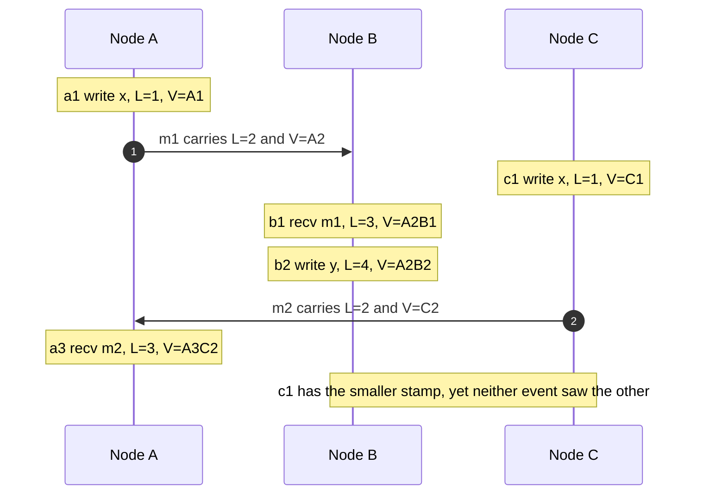
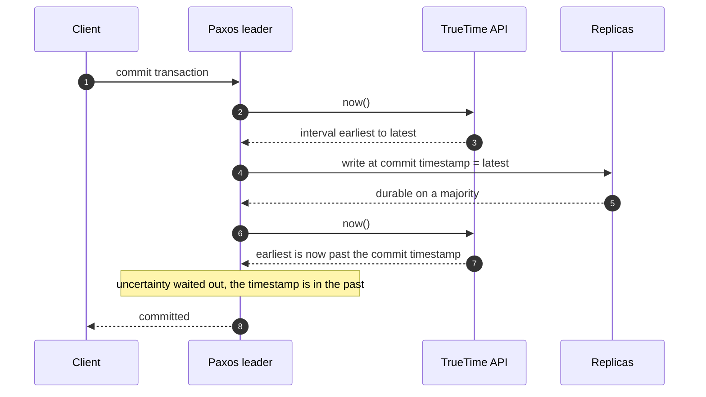
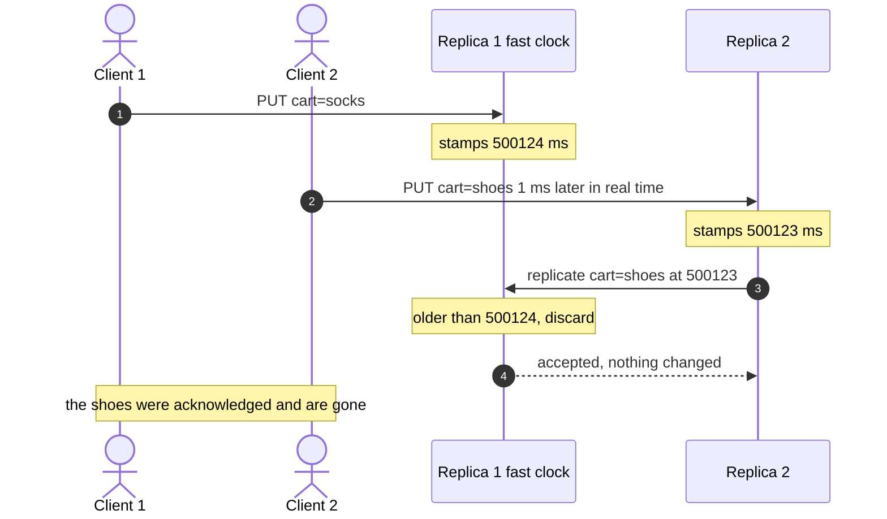

# Time, clocks and ordering

## TL;DR

- Two machines never agree on the time, so a timestamp cannot decide which of two writes happened first.
- Lamport clocks give one order consistent with causality; vector clocks additionally detect *concurrent*, which is the answer a replicated store needs.
- Last-writer-wins silently discards a write whenever two clocks disagree — measure how often before you accept it.
- Hybrid logical clocks and TrueTime buy readable timestamps: one by construction, one by waiting out the uncertainty.

## Core concepts

### Wall clock, monotonic clock, NTP and leap seconds

Every machine has two clocks and they answer different questions. The **wall clock** reports time-of-day, is compared across machines, and is corrected by NTP — which may **step** it backwards or **slew** it to run slow. The **monotonic clock** counts since an arbitrary origin, never jumps, and is the only correct source for durations: timeouts, latency measurement, rate limiters, lease expiry.

The rule: use the monotonic clock for "how long", the wall clock for "when", and never subtract two wall-clock readings taken on different machines. A same-datacenter round trip is 500 µs, so two events half a millisecond apart on two machines cannot be ordered by clocks that disagree by even one millisecond — and NTP-synchronised clocks routinely do. Across US regions the round trip alone is 70 ms, which is longer than most skew, so ordering there is a different problem: the network, not the clock.

**Leap seconds** are the pathological case: a repeated or skipped second breaks code that assumes time advances. Modern practice is to *smear* the leap second over hours so no clock ever repeats a value, which is what the major cloud NTP services do. Say that when asked; it is a one-line answer that shows you have operated systems.

### Lamport timestamps

Lamport's insight is that you only need the **happens-before** relation, not real time. Event `a` happens before `b` if they are on the same node in that order, or `a` is a send and `b` its receive, or by transitivity. Everything else is **concurrent**.

A Lamport clock is a counter per node with three rules: tick on a local event, attach the value to every message, and on receipt take `max(local, received) + 1`. That guarantees `a -> b` implies `L(a) < L(b)` — and deliberately nothing in the other direction. A smaller number is not evidence of causality; it just means someone counted less. Break ties by node id and you get a total order, which is enough to sequence a log deterministically but not enough to detect a conflict.

**One message each way; b2 has the largest Lamport stamp and is still concurrent with c1.**



### Vector clocks and version vectors

A vector clock keeps one counter per node. Tick your own on an event, take the pointwise maximum on receipt, and compare two vectors elementwise: all counters less-or-equal with at least one strictly smaller means **before**, the mirror means **after**, equal means **equal**, and anything else means **concurrent**. That fourth answer is the whole point — it is how a store knows two writes conflict instead of guessing which is newer.

A **version vector** is the same structure counted per *replica* rather than per event, which is what Dynamo-style stores hand back as an opaque context: read returns the vector, the client returns it with the write, and a write whose vector dominates every stored sibling replaces them. Concurrent writes are kept as **siblings** and resolved by the application — shopping carts union, counters add, documents merge.

The cost is size. Three replicas at 16 B of node id plus an 8 B counter is 72 B against a ~1 KB value: under 10%, fine. Per-client vectors on a million clients are not, which is why production systems count replicas, cap the vector and prune the oldest entries with a timestamp — accepting a rare false conflict rather than unbounded metadata.

### Hybrid logical clocks

A Lamport counter is causally correct and humanly useless: you cannot ask "what did this table look like at 09:00?" with it. A hybrid logical clock is the pair `(physical_ms, logical)`, compared lexicographically. Physical time drives it whenever it moves; the logical counter only advances while physical time stands still or while catching up to a message from a node slightly ahead.

The result is a timestamp that respects causality *and* never drifts further from wall-clock time than the worst skew in the cluster, so it doubles as an event time for snapshot reads and time-travel queries. It also needs a guard: a remote timestamp further ahead than the drift bound is rejected rather than adopted, or one broken clock drags the cluster into the future permanently. CockroachDB, YugabyteDB and MongoDB use HLC for exactly this.

### TrueTime and commit-wait

Spanner takes the opposite route: instead of hiding clock uncertainty, it exposes it. `TT.now()` returns an *interval* — earliest and latest — guaranteed to contain true time, kept a few milliseconds wide by GPS and atomic-clock references in every datacenter. A transaction picks the interval's upper bound as its commit timestamp, then **waits out** the uncertainty before acknowledging, so by the time the client hears "committed", the timestamp is certainly in the past. Any later transaction therefore gets a larger timestamp, and timestamp order equals real order.

**Commit-wait: the write is durable first, then the leader waits until the timestamp is safely past.**



Price it before you propose it. A few milliseconds of commit-wait is roughly ten times a 500 µs same-datacenter round trip, so it dominates a local commit — but it disappears inside the 70 ms round trip a cross-region majority already costs. That is why commit-wait is affordable for a globally distributed database and absurd for a single-datacenter one, and why the hardware is the hard part: you cannot buy this with software alone.

### Why last-writer-wins loses data

Last-writer-wins keeps the value with the higher timestamp. It is the default in Cassandra and in most caches because it needs no coordination and no metadata beyond 8 B. It also discards a write every time two clocks disagree, and it does so silently: no error, no sibling, no metric.

**A one-millisecond skew is enough to throw away an acknowledged write.**



Quantify the exposure rather than arguing about it. A chat system at 50M DAU x 40 messages/day = 2B messages/day, about 23k/s, loses ~2,000 writes a day at a one-in-a-million collision rate. For a "seen" marker that is noise; for a shopping cart or a balance it is a bug report a day. Use last-writer-wins where the value is idempotent or the loser is genuinely uninteresting, and version vectors or a CRDT anywhere a lost write is visible.

### Ordering in a log versus ordering per key

Total order is expensive: it needs consensus, which costs a majority round trip on every write ([Consensus and coordination](consensus-and-coordination.md)). Almost no system needs it. What applications actually need is order **per key** — one conversation's messages, one account's transactions, one document's edits — and that is nearly free.

A partitioned log gives it structurally: Kafka guarantees order within a partition and nothing across partitions, so keying by `conversation_id` puts one conversation on one partition in one order. At 23k messages/s over 100 partitions that is 230/s per partition, far inside a broker's ~100 MB/s. The same idea appears as a single leader per shard, a per-entity sequence number the client can check for gaps, and a per-document operation log in a collaborative editor. State the guarantee you need in those terms — "per conversation, not global" — and the expensive question never comes up.

## Trade-offs

| Scheme | Detects concurrency | Metadata per value | Comparable to wall time | Typical use |
|---|---|---|---|---|
| Wall-clock timestamp | No | 8 B | Yes, but wrong | Caches, low-stakes LWW |
| Lamport timestamp | No | 8 B | No | Log sequencing, tie-breaks |
| Vector or version vector | Yes | ~24 B per replica | No | Dynamo, Riak, Voldemort |
| Hybrid logical clock | Partly, via the pair | 12-16 B | Yes, within the drift bound | CockroachDB, MongoDB |
| TrueTime plus commit-wait | Not needed, order is real | 8 B plus a wait | Yes, exactly | Spanner |
| Per-partition log offset | No, order is imposed | 8 B | No | Kafka, event sourcing |

Start from what breaks. If two concurrent writes to one key must both survive, you need concurrency detection: version vectors with siblings, or a CRDT that merges without asking. If one of them may lose, last-writer-wins is fine — say so explicitly and name the value ("presence flags, and I accept losing a flip").

If you also need to *query* by time — snapshot reads, "as of 09:00", ordering events from different services in a trace — a logical counter is not enough and you want an HLC, which costs a few extra bytes and a drift guard. TrueTime is the same guarantee bought with hardware and a few milliseconds of latency per commit; propose it only when the design is already paying a cross-region round trip, and be ready to say what you would do without the atomic clocks.

Above all, prefer imposing order to inferring it. A single writer per key, a partitioned log, or a per-entity sequence number turns the ordering question into a routing question, which is much cheaper than any clock.

## Python implementation

The Lamport clock is three rules and a lock. Note that `receive` takes `max(local, stamp) + 1`, so a message from the future drags the clock forward and a stale one still counts as a local event.

```python title="code/hld/logical_clocks.py — Lamport clock"
--8<-- "code/hld/logical_clocks.py:lamport"
```

`VectorClock` is a frozen, hashable value: `tick` and `merge` return new clocks, so one can be handed to a client as opaque context. `compare` returns the four-way `Ordering`, and `happens_before` and `concurrent` are the two questions a store asks.

```python title="code/hld/logical_clocks.py — vector clocks"
--8<-- "code/hld/logical_clocks.py:vector"
```

The two stores are the same register with different conflict policies: one keeps siblings, the other keeps the higher timestamp and counts what it dropped.

```python title="code/hld/logical_clocks.py — siblings versus last-writer-wins"
--8<-- "code/hld/logical_clocks.py:store"
```

The hybrid logical clock advances its logical counter only while physical time stands still, and refuses a remote timestamp beyond `max_drift_ms`.

```python title="code/hld/logical_clocks.py — hybrid logical clock"
--8<-- "code/hld/logical_clocks.py:hlc"
```

`uv run python -m hld.logical_clocks` prints:

```text
three nodes, one message A->B and one C->A; Lamport stamp and vector clock per event
  A  a1 write x   L=1   V={A:1}
  A  a2 send m1   L=2   V={A:2}
  C  c1 write x   L=1   V={C:1}
  B  b1 recv m1   L=3   V={A:2, B:1}
  B  b2 write y   L=4   V={A:2, B:2}
  C  c2 send m2   L=2   V={C:2}
  A  a3 recv m2   L=3   V={A:3, C:2}
b2 L=4 vs c1 L=1: Lamport says c1 is smaller, vectors say concurrent (neither saw the other)
a1 vs b1: happens_before=True, concurrent=False
two clients write cart:7 concurrently; A's clock runs 1 ms fast, B writes later
  vector clocks: 2 siblings kept ['add socks', 'add shoes']; concurrent=True
  client merges -> 'add socks + shoes' with clock {A:2, B:1}
  last-writer-wins: kept='add socks' (B's write accepted=False), 1 write silently discarded -- the shoes are gone
HLC: A stamps 500000:0 then 500000:1 in the same millisecond; B is 2 ms behind, receives and stamps 500000:2, then 500000:3
  causality holds: True; B never rewinds below A's physical ms
```

Two lines carry the argument. `b2` has the largest Lamport stamp and is still concurrent with `c1`, so a bigger number proves nothing. And the same pair of writes produces two siblings under vector clocks and one surviving value under last-writer-wins — with the *later* write discarded, because the other replica's clock was one millisecond fast.

## In the interview

Raise it when you draw the write path of anything replicated, in one sentence: "Two replicas can accept writes for this key, so I need a conflict policy. I'll carry a version vector and keep siblings, because losing a cart item is visible; presence flags stay last-writer-wins."

Phrases that signal depth: "a bigger timestamp is not evidence that it happened later"; "I need per-key order, not total order, so a partition key is enough".

??? question "Two writes arrive with the same timestamp. What does your store do?"
    With last-writer-wins, one is dropped by an arbitrary tie-break — node id or value hash — and the client is never told. With version vectors both are kept as siblings and merged on the next read.

??? question "Why not just synchronise clocks better?"
    Better synchronisation shrinks the window, it does not close it, and no protocol tells you the window is currently small. TrueTime is the exception because it *reports* its uncertainty and the commit waits it out.

??? question "How do vector clocks stay small?"
    Count replicas, not clients: a preference list of 3 keeps 3 entries. Cap the vector, prune the oldest entry by its last-updated timestamp, and accept the rare false conflict.

??? question "You need events from three services ordered in a trace. What do you use?"
    Propagate a causal token: a trace context plus an HLC timestamp taken at each hop. Wall-clock timestamps from three hosts interleave wrongly at the sub-millisecond scale, and a Lamport counter cannot be shown on a time axis.

??? question "How do you give one chat conversation a strict order without global consensus?"
    Route every message for a conversation through one partition or owner and assign a monotonic per-conversation sequence number; clients detect gaps and refetch. Order across conversations is never promised.

!!! tip "Interview tip"
    Name the conflict policy per data type, not per system. "Version vectors for the cart, last-writer-wins for presence, a CRDT counter for likes" is a senior answer; "we use last-writer-wins" invites the question about the write you just lost.

## Common mistakes

- **Measuring durations with the wall clock**: an NTP step makes an elapsed time negative, so a timeout fires immediately or never. Fix: monotonic clock for every duration, wall clock only for display and storage.
- **Treating a timestamp as an ordering**: "the newer row wins" quietly loses whichever write came from the machine with the slower clock. Fix: version vectors where the loss is visible, and measure the collision rate where it is not.
- **Per-client vector clocks**: the metadata grows without bound and eventually dwarfs the value. Fix: one counter per replica, capped and pruned.
- **Demanding total order**: asking for one global sequence turns every write into a consensus round and caps throughput at one group. Fix: state the guarantee as per key or per partition.

!!! warning "Common mistake"
    Reporting a write as durable and then letting replication discard it because another replica's clock was ahead. The client saw a 200 and the value is gone, with nothing in the logs. If the store is last-writer-wins, say out loud which writes you are willing to lose.

## Self-check

??? question "Give an example where L(a) < L(b) but a did not happen before b."
    Two nodes that never exchanged a message: the one that did less work has smaller stamps regardless of real time. In the demo `c1` has L=1 and `b2` has L=4, yet the vectors show they are concurrent.

??? question "What does a vector clock let you do that a Lamport clock does not?"
    Detect concurrency. Elementwise comparison distinguishes before, after, equal and concurrent; a single counter collapses all four onto one axis, so conflicts become invisible.

??? question "Why does an HLC need a bound on how far ahead a remote timestamp may be?"
    Because it adopts the maximum it sees. One node with a clock a year fast would push every node's physical component a year forward permanently. Rejecting beyond the bound turns that into a loud error.

??? question "What does commit-wait actually wait for?"
    For the uncertainty interval to pass, so the chosen commit timestamp is definitely in the past when the client is told the transaction committed. Any later transaction then gets a strictly larger timestamp.

??? question "When is last-writer-wins the right answer?"
    When the value is idempotent or the loser carries no information: a presence flag, a cached render, a heartbeat. Anywhere a user can notice the missing write, you need siblings or a merge function.

## Related

- [Replication](replication.md) — where conflicts come from
- [Consensus and coordination](consensus-and-coordination.md) — what total order costs
- [Design a Dynamo-style key-value store](../case-studies/key-value-store.md) — version vectors end to end
- [Design Google Docs](../case-studies/collaborative-editor.md) — ordering concurrent edits
- Lamport, "Time, Clocks, and the Ordering of Events in a Distributed System" (CACM 1978)
- Corbett et al., "Spanner: Google's Globally-Distributed Database" (OSDI 2012)
- Kulkarni et al., "Logical Physical Clocks and Consistent Snapshots in Globally Distributed Databases" (2014)
