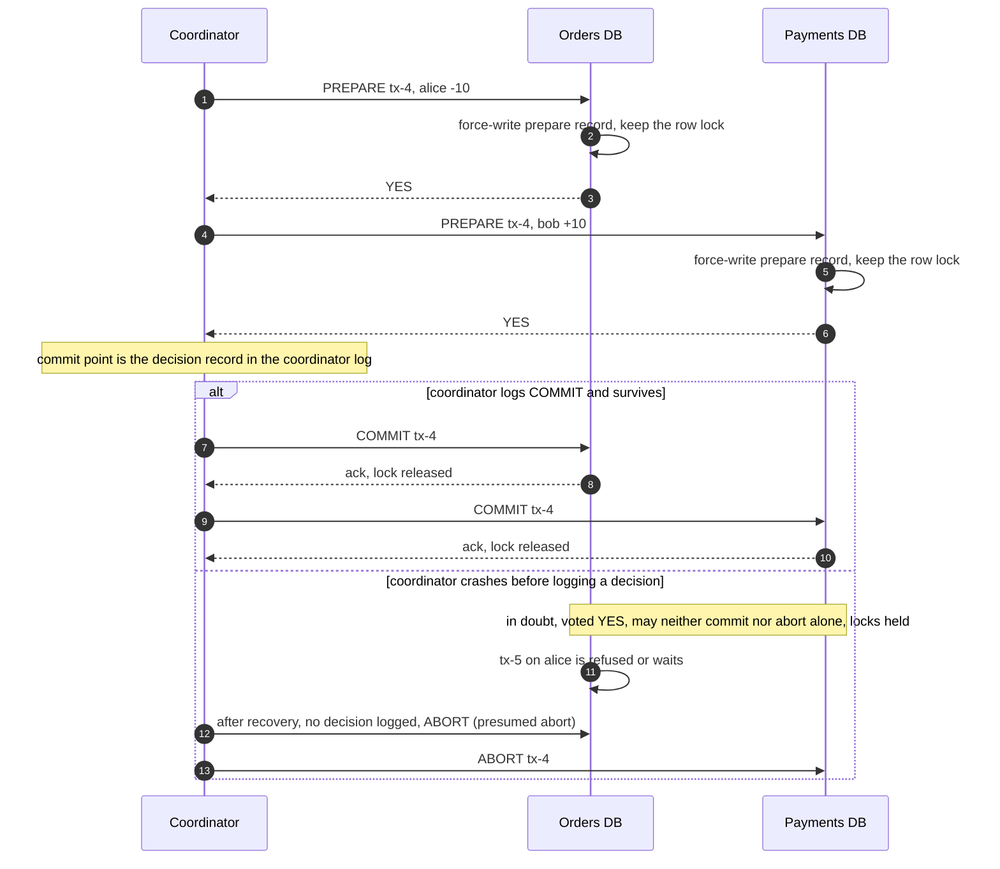
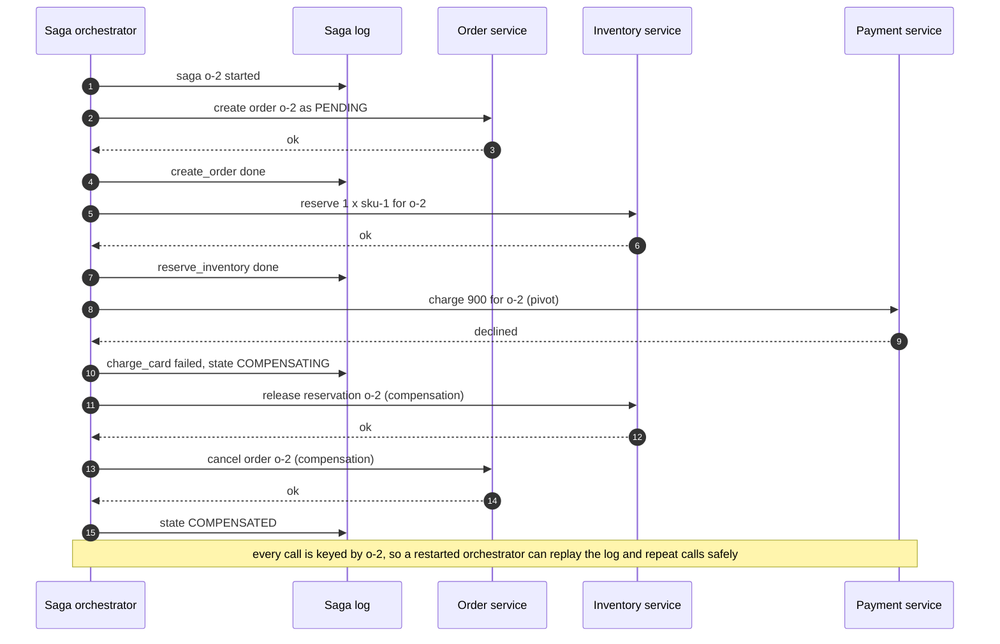
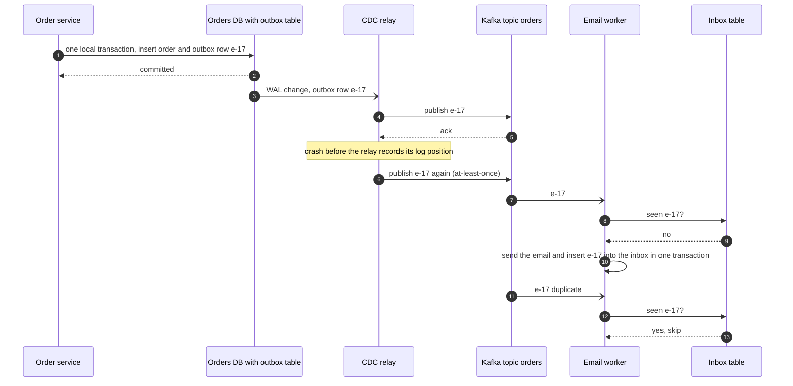

# Transactions, 2PC, sagas and idempotency

## TL;DR

- A transaction makes writes atomic, isolated and durable on one node; across services you pick an atomic commit (2PC) or a saga of local transactions with compensations.
- Isolation is a dial: read committed allows lost updates, snapshot isolation allows write skew, serializable costs aborts or locks.
- Exactly-once processing is at-least-once delivery plus idempotency.
- Interviewers probe your isolation anomalies, a coordinator dying mid-commit, and a retry that must not charge twice.

## Core concepts

### ACID: what each letter buys you

Atomicity: all of a transaction's writes become visible or none do; recovery uses the write-ahead log (WAL) to roll an unfinished one back. Consistency: the database's invariants hold at commit; the application's stay the application's job. Isolation: concurrent transactions do not see each other's intermediate state. Durability: the commit record is forced to the WAL, or to a quorum of replicas, before the client hears "ok"; that forced write bounds a primary at ~5k-20k writes/s, so engines batch commits per fsync (group commit).

### Isolation levels and the anomalies they allow

A **dirty read** sees an uncommitted write. A **non-repeatable read** reads a row twice and gets two values. A **phantom** re-runs a predicate query and finds rows appeared or vanished. A **lost update** is two read-modify-write cycles on one row: both read `qty = 1`, both write `qty = 0`, two customers own the last item. **Write skew**: two transactions read an overlapping set, each writes a different row, both commit, and a cross-row invariant breaks; two on-call doctors each see two on call and both leave.

| Anomaly | Read uncommitted | Read committed | Snapshot isolation (repeatable read) | Serializable |
|---|---|---|---|---|
| Dirty read | possible | prevented | prevented | prevented |
| Non-repeatable read | possible | possible | prevented | prevented |
| Phantom | possible | possible | prevented in practice | prevented |
| Lost update | possible | possible | aborted in PostgreSQL, possible in MySQL | prevented |
| Write skew | possible | possible | possible | prevented |

Read committed (the PostgreSQL, Oracle and SQL Server default) lets each statement see data committed before it started. PostgreSQL's repeatable read is snapshot isolation: one snapshot for the whole transaction, and the first committer wins, so the second writer of a row gets a serialization failure and retries. MySQL InnoDB's repeatable read does not abort the second writer, so read-then-update still loses updates unless you lock. Serializable equals some serial order, by locks (MySQL) or by aborting dangerous patterns (PostgreSQL); the price is retries and a lower commit rate.

### How engines isolate: 2PL, MVCC and optimistic versions

Two-phase locking (2PL) holds shared read locks and exclusive write locks until commit, aborting a victim on deadlock: serializable, but readers and writers block each other. MVCC gives each write a new version tagged with its transaction id; readers pick the versions visible at their snapshot and never block writers. Snapshot isolation is MVCC reads plus write-conflict detection. Where an invariant matters, steer the engine: `SELECT ... FOR UPDATE` locks the rows you will write, and `UPDATE stock SET qty = qty - 1 WHERE sku = ? AND qty > 0` moves the read-modify-write inside the engine. Optimistic concurrency is the lock-free form: read `version = 7`, write `SET version = 8 WHERE id = ? AND version = 7`, retry when zero rows change. It wins at low contention and crosses services (DynamoDB conditions, HTTP `If-Match`); on a hot row, retries burn throughput.

### Two-phase commit and why it blocks

**Both participants vote YES, then the coordinator's log decides, or fails to.**



Phase 1: `PREPARE`; each participant force-writes a prepare record, keeps its locks and votes, and a YES is a promise to no longer abort alone. Phase 2: the coordinator force-writes the decision (the commit point) and broadcasts it; participants apply, release locks and ack.

A participant that dies before voting is a timeout, counted as NO. One that dies after voting YES asks the coordinator on restart. A coordinator that dies before logging its decision leaves every YES voter *in doubt*, holding locks until it returns, because neither outcome is safe without the decision: 2PC is blocking. On restart, no decision logged means abort (presumed abort). Three-phase commit adds a pre-commit round so a replacement coordinator can finish, but only with bounded delays and no partitions; the practical fix is a replicated coordinator (Spanner runs 2PC over Paxos groups) or no 2PC at all.

The cost rules 2PC out between services: two round trips plus forced log writes, rows locked throughout. In a datacenter that is 2 x 500 µs = 1 ms plus fsyncs; across US regions 2 x 70 ms = 140 ms, so a contended row commits at most ~7 transactions/s.

### Sagas: local transactions plus compensations

A saga is a sequence of local transactions T1..Tn, each committed in its own service, with compensations that semantically undo them (cancel, release, refund). If Ti fails, the compensations of T1..Ti-1 run in reverse. You lose atomicity and isolation: another request can read a reserved-but-unpaid order, so you add a semantic lock (a `PENDING` status readers respect), keep updates commutative and run the step most likely to fail first.

Compensatable steps can be undone. The pivot is the go/no-go step, the last one allowed to fail for a business reason (charge the card). Retriable steps after it must eventually succeed (ship, confirm), so they are retried and must be idempotent; one that never succeeds leaves the saga stuck and pages a human.

**Orchestrated order saga: the pivot fails, compensations run in reverse.**



Choreography has each service publish events and react to the others': no central component, but the flow is implicit and compensation logic scatters, so it suits two or three steps. Orchestration gives the saga a coordinator that calls each step and records progress in a saga log, so it can time out, resume after a crash and show an operator where it stopped; choose it from four steps up or when compensations must be audited.

### Transactional outbox and CDC

Committing a row and then publishing an event is a dual write: crash between the two and the order exists without its event. The outbox pattern writes the business row and an `outbox` row in one local transaction, so the event exists exactly when the order does. A relay publishes outbox rows: a poller that marks rows sent, or change data capture (CDC), where a connector such as Debezium tails the replication log and publishes in commit order. The relay is at-least-once, a crash after publishing and before recording its position sends an event twice, so consumers keep an inbox of processed event ids.

**Outbox row and business row in one commit; CDC publishes at least once; the consumer dedupes.**



### Idempotency keys

The client generates a key per logical operation (a UUID kept across retries). The server keeps one record per `scope:key`, scoped to the tenant so clients cannot collide, holding a fingerprint of the request, a state and the response. `begin` has four outcomes: new (run the handler), completed (replay the stored response), in progress (a twin is running: 409) and mismatch (same key, different payload: 422). The in-progress claim stops two simultaneous retries from both charging; it expires after ~30 s so a dead worker does not lock the key forever, and a claim token rejects that worker's late completion. Keep records for the client's retry horizon, commonly 24 h: 10M writes/day x ~1 KB = 10 GB/day, fine in Redis with a TTL. The strongest placement is the business row's own transaction, so "effect without record" cannot happen; with a separate store, make the handler idempotent too, for example by forwarding your key to the payment provider.

### Exactly-once is at-least-once plus idempotency

Exactly-once delivery is impossible: when the ack is lost, the sender cannot tell "never received" from "received, ack lost"; resend and you may duplicate, stop and you may lose. So choose at-least-once and make the effect idempotent: dedupe by id, use naturally idempotent writes (set, upsert) or compare-and-set on a version. Kafka's exactly-once semantics are this inside Kafka: an idempotent producer with per-partition sequence numbers plus transactions that commit output records and consumer offsets atomically; an email or HTTP call made by a consumer still needs its own idempotency.

## Trade-offs

| Approach | Atomic across services | Lock or pending time | When the coordinator dies | Use when |
|---|---|---|---|---|
| Local transaction (one database) | n/a, one database | One fsync, ~1 ms | No coordinator | Rows that must agree live on one shard |
| 2PC (XA or in-database) | Yes | ~1 ms in-DC, ~140 ms cross-region, locks held | YES voters block until recovery | Shards of one database, DB plus queue in one DC |
| Orchestrated saga | No, compensations | Each step commits locally | Resumes from its log | 4+ steps, audited compensations |
| Choreographed saga | No, compensations | Each step commits locally | No coordinator; stuck flows hard to see | 2-3 steps |
| Outbox + idempotent consumers | Row and event together | Relay lag | Relay resends | Every event-emitting service |

First ask whether the rows that must agree can share a shard: an order and its lines under `order_id`, a wallet and its ledger under `account_id`, and a local transaction gives you every guarantee for free. When writes cross services, default to an orchestrated saga with an outbox: each service keeps its own transactions, the orchestrator keeps the flow visible, the outbox makes events reliable. Use 2PC only where a product runs it for you (a database spanning shards, XA between one database and one queue in one datacenter), and say that its availability is the product of the participants': two 99.9% participants give 99.8%, and a coordinator outage freezes locked rows. Choreography suits a short chain owned by one team; orchestration anything with compensations, timeouts or an operator view. In every option each step and consumer is idempotent, because the retry is not optional.

## Python implementation

The protocol vocabulary:

```python title="code/hld/two_phase_commit.py — votes, decisions, log record"
--8<-- "code/hld/two_phase_commit.py:protocol"
```

`Participant.prepare` locks, validates, writes the prepare record and votes; `recover` asks the coordinator about in-doubt transactions:

```python title="code/hld/two_phase_commit.py — the participant"
--8<-- "code/hld/two_phase_commit.py:participant"
```

`Coordinator.run` collects votes, logs the decision and broadcasts it; `crash_at` injects a crash on either side of the commit point, `recover` replays the log:

```python title="code/hld/two_phase_commit.py — the coordinator"
--8<-- "code/hld/two_phase_commit.py:coordinator"
```

`uv run python -m hld.two_phase_commit` prints:

```text
tx-1 every participant votes YES    -> commit; alice=70 bob=130
tx-2 inventory votes NO (1 - 2 < 0)  -> abort; orders rolled back, locks={}
tx-3 payments down during phase 1   -> abort; timeout counts as a NO vote
tx-4 coordinator crashed before logging the decision of tx-4
     orders in doubt=['tx-4'] holding {'alice': 'tx-4'}; payments in doubt=['tx-4']
     tx-5 touching alice meanwhile   -> votes no: blocked by tx-4's lock
     coordinator recovers, presumed abort for ['tx-3', 'tx-4']; alice=70 bob=130
tx-6 coordinator crashed after logging the decision of tx-6
     log says commit, nobody was told; pending=['tx-6']
     coordinator recovers, replays commit -> alice=50 bob=150
tx-7 payments dies right after YES   -> commit; payments in doubt=['tx-7'], bob=150
     payments recovers and asks the coordinator -> alice=45 bob=155
```

Step kinds, states and log entries:

```python title="code/hld/saga.py — steps, states, log entries"
--8<-- "code/hld/saga.py:steps"
```

`SagaOrchestrator` runs forward, compensates in reverse, and resumes from the log by re-running the step in flight:

```python title="code/hld/saga.py — the orchestrator"
--8<-- "code/hld/saga.py:orchestrator"
```

The demo services are keyed by order id, so a repeated call is a no-op:

```python title="code/hld/saga.py — an order saga over idempotent services"
--8<-- "code/hld/saga.py:order_saga"
```

`uv run python -m hld.saga` prints:

```text
o-1 happy path               -> completed; order=CONFIRMED stock=9; create_order=done reserve_inventory=done charge_card=done schedule_shipment=done confirm_order=done
o-2 card declined at pivot   -> compensated; order=CANCELLED stock=9; create_order=done reserve_inventory=done charge_card=failed reserve_inventory=compensated create_order=compensated
o-3 orchestrator crashed after reserve_inventory ran, before its done record
    log before resume: ['create_order:started', 'create_order:done', 'reserve_inventory:started']; reservations=2
    resume re-runs reserve_inventory, still 2 reservations (idempotent) -> completed; order=CONFIRMED stock=8
o-4 shipping times out twice -> completed; order=CONFIRMED stock=7; create_order=done reserve_inventory=done charge_card=done schedule_shipment=failed schedule_shipment=failed schedule_shipment=done confirm_order=done
o-5 shipping down for good   -> stuck; order=PENDING stock=6; create_order=done reserve_inventory=done charge_card=done schedule_shipment=failed schedule_shipment=failed schedule_shipment=failed
    card charged 120 and kept: past the pivot nothing is undone; page a human
```

Each record holds a fingerprint, a state, a claim token and an expiry:

```python title="code/hld/idempotency_store.py — outcomes and records"
--8<-- "code/hld/idempotency_store.py:records"
```

`begin` is one critical section with four outcomes; `complete` refuses a stale claim token:

```python title="code/hld/idempotency_store.py — the store"
--8<-- "code/hld/idempotency_store.py:store"
```

`IdempotentHandler.execute` wraps a handler and stores business failures so they replay too:

```python title="code/hld/idempotency_store.py — wrapping a handler"
--8<-- "code/hld/idempotency_store.py:handler"
```

`uv run python -m hld.idempotency_store` prints:

```text
POST charge key=k1                           new          201 {'charge_id': 'ch_1', 'amount': 120}  charges=[120]
retry key=k1, same payload                   replay       201 {'charge_id': 'ch_1', 'amount': 120}  charges=[120]
retry key=k1, amount changed                 mismatch     422 {'error': 'key reused with a different payload'}  charges=[120]
POST key=k1 from another account             new          201 {'charge_id': 'ch_2', 'amount': 120}  charges=[120, 120]
POST key=k2, card declined                   new          422 {'error': 'card declined'}  charges=[120, 120]
retry key=k2                                 replay       422 {'error': 'card declined'}  charges=[120, 120]
POST key=k3 while a twin is in flight        in_progress  409 {'error': 'a request with this key is in progress'}  charges=[120, 120]
retry key=k3 after 31 s, claim expired       new          201 {'charge_id': 'ch_3', 'amount': 120}  charges=[120, 120, 120]
stalled worker completes late                rejected: acct-7:k3: claim 4 is no longer current
24 h later: purge_expired removed 4 records, 0 left
retry key=k1 after the TTL                   new          201 {'charge_id': 'ch_4', 'amount': 120}  charges=[120, 120, 120, 120]
```

## In the interview

Name the kind of transaction the moment a write crosses a box: "Checkout spans order, inventory and payment, so it is an orchestrated saga: create, reserve, charge as the pivot, then ship and confirm as retriable steps, all keyed by order id, events through an outbox."

Phrases that signal depth: "snapshot isolation stops lost updates but not write skew"; "the coordinator's decision record is the commit point"; "effectively-once is at-least-once plus a scoped idempotency key with a TTL".

??? question "Two customers buy the last unit at the same instant under read committed. What happens?"
    A lost update: both read `qty = 1`, both write `qty = 0`. Fix it in the engine: `UPDATE stock SET qty = qty - 1 WHERE sku = ? AND qty > 0`, or `FOR UPDATE`, or a version column.

??? question "The coordinator crashes after every participant voted YES. What do the participants do?"
    Wait, in doubt: a YES vote gave up the right to abort and nobody knows whether commit was logged, so each holds its locks until the coordinator restarts and resends the decision or presumes abort.

??? question "Why not wrap the three services in one distributed transaction?"
    Locks held for two network round trips (1 ms in a datacenter, ~140 ms across regions), availability coupled to every participant, and XA support most services lack. A saga keeps transactions local.

??? question "Where do idempotency keys live and for how long?"
    In the business row's transaction when possible, which closes the crash window between effect and record; otherwise Redis with a TTL. Scope by client, store fingerprint and response, expire after the retry horizon, typically 24 h.

??? question "How do you publish the order-placed event exactly once?"
    You do not. Write it into an outbox table in the order's transaction, let a relay or CDC publish it at least once, and have consumers dedupe by event id.

!!! tip "Interview tip"
    Say which kind of transaction in the same breath: local, 2PC or saga. For a saga, name the pivot and the compensation of every step before it; pointing at the step after which "we refund instead of rolling back" sounds like you have shipped one.

## Common mistakes

- **Trusting repeatable read to stop lost updates everywhere**: PostgreSQL aborts the second writer, MySQL does not. Fix: an atomic conditional `UPDATE`, `FOR UPDATE` or a version column.
- **Compensating by deleting**: removing the charge row leaves the ledger lying. Fix: a compensation is a new forward action (a refund entry, a cancelled status).
- **An idempotency key with no scope or fingerprint**: tenants collide, or a reused key replays the wrong response. Fix: key by `tenant:key`, store the request hash, answer 422 on mismatch.
- **Retrying a POST without a key**: a timeout plus a retry is two orders. Fix: the client mints the key before the first attempt and reuses it.

!!! warning "Common mistake"
    Believing a broker's "exactly-once" setting removes the need for idempotent consumers. Kafka's guarantee covers records and offsets inside Kafka; the email, the HTTP call and the database row your consumer produces happen twice on redelivery unless the consumer dedupes.

## Self-check

??? question "Which anomaly does snapshot isolation allow?"
    Write skew: two transactions read an overlapping set, write disjoint rows, both commit, and a cross-row invariant breaks. Prevent it with serializable isolation or `FOR UPDATE` on the rows read.

??? question "What is the commit point of 2PC?"
    The moment the coordinator's decision record is durable: before it the transaction can still abort, after it commit is inevitable, and YES voters block until they learn which side the crash was on.

??? question "What is the pivot of a saga?"
    The last step allowed to fail for a business reason: steps before it have compensations, steps after it are retried until they succeed and must be idempotent.

??? question "Why must outbox consumers be idempotent?"
    The relay publishes at least once: a crash between publishing and recording its position republishes the event; consumers dedupe by event id.

??? question "Why does an idempotency record need an in-progress state?"
    Two retries can arrive within milliseconds; without a claim both run the handler, with it the second gets 409 and the next retry a replay.

## Related

- [CAP, PACELC and consistency models](cap-pacelc-and-consistency-models.md)
- [Design a payment system and digital wallet](../case-studies/payment-system.md)
- [Messaging, queues and Kafka internals](messaging-and-event-streaming.md)
- [Design Amazon (e-commerce with inventory and flash sales)](../case-studies/ecommerce-platform.md)
- [Consistency, replication and isolation tables](../../cheatsheets/consistency-and-replication-tradeoffs.md)
- Berenson et al., "A Critique of ANSI SQL Isolation Levels" (SIGMOD 1995)
- Garcia-Molina and Salem, "Sagas" (SIGMOD 1987)
- Gray and Lamport, "Consensus on Transaction Commit" (ACM TODS 2006)
