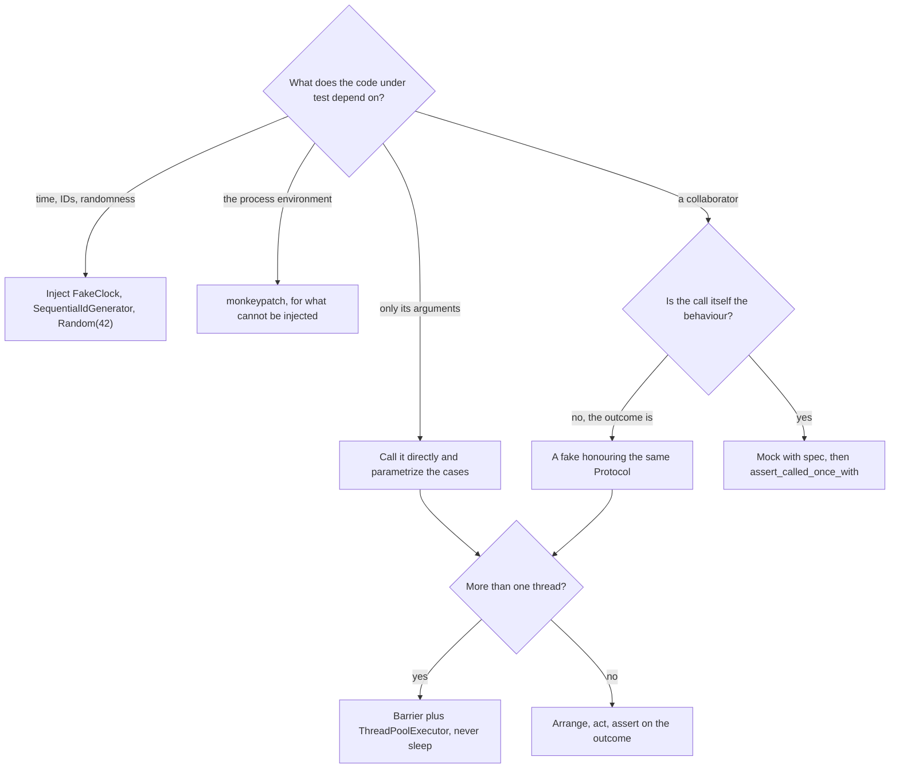

# Clean code and testing

## TL;DR

Clean code and testable code are the same property seen from two sides. Push decisions to the top as guard clauses, keep values frozen, raise domain exceptions rather than returning `None`, and let everything ambient — clock, IDs, storage, payments — arrive through the constructor. Then the tests need no mocking framework: a `FakeClock`, a handful of fakes, `parametrize`, and a `Barrier` for anything concurrent.

## Concepts

The running example is `code/fundamentals/testing_examples.py`, a subscription service, with its suite in `code/fundamentals/tests/test_testing_examples.py`. Nothing in it calls `time.time()`, which is why every test is exact rather than approximately right.

### Naming, small functions and guard clauses

A function should read as a sentence about one decision. Three habits get you most of the way: name by intention rather than mechanism (`is_renewable`, not `check_status`), keep the body to one level of nesting, and handle the exceptional cases first so the happy path is never indented.

```python
# Smell: the interesting line is four levels deep, and the reader has to unwind to find it.
def renew(self, subscription_id):
    sub = self._repository.get(subscription_id)
    if sub is not None:
        if sub.status == "active":
            if sub.days_remaining(self._clock.now()) <= 7:
                ...
```

The same logic with guards is flat, and each rejection carries the reason it was rejected:

```python
# Fix: guards first, one decision per line, the happy path at the bottom and unindented.
def renew(self, subscription_id: str) -> Subscription:
    current = self._repository.get(subscription_id)   # raises NotFoundError itself
    now = self._clock.now()
    self._guard_renewable(current, now)               # raises with the days that are left
    ...
```

Extracting `_guard_renewable` is not indirection for its own sake: it gives the rule a name, makes it testable on its own, and stops the caller reading like a flowchart.

### Exceptions: a domain hierarchy, EAFP, no swallowing

Every error a caller might reasonably act on differently deserves its own type, and all of them should share a root so a boundary can catch one thing:

```python title="code/fundamentals/testing_examples.py — two domain errors with distinct meanings"
--8<-- "code/fundamentals/testing_examples.py:errors"
```

`PaymentDeclinedError` is retryable, `RenewalTooEarlyError` never is, so they are different types even though both mean "no". Both inherit from the shared hierarchy (`ConflictError`, `InvalidStateError`, ultimately `HandbookError`), so a web layer can `except HandbookError` and map to a status code without importing anything about subscriptions.

Two rules complete the picture. **Never swallow**: `except Exception: pass` turns a bug into a silent data problem, and `except Exception: return None` pushes it to a caller with less context. **Prefer EAFP** — try, then handle the failure — over LBYL:

```python
# LBYL asks first: two lookups, and a window in which the key can disappear between them.
if subscription_id in self._rows:
    return self._rows[subscription_id]
raise NotFoundError(subscription_id)
```

```python
# EAFP does one lookup and treats the miss as the exceptional path it is.
try:
    return self._rows[subscription_id]
except KeyError:
    raise NotFoundError(f"no subscription {subscription_id!r}") from None
```

Note `from None`: it suppresses the `KeyError` context, so callers see your domain error rather than an implementation detail.

### Immutability and the boundary between pure domain and IO

Make entities values wherever the domain allows it. A frozen dataclass cannot be corrupted by a caller reaching in, is safe to share between threads, compares by value in tests, and makes every transition explicit because it has to return a new object:

```python title="code/fundamentals/testing_examples.py — a frozen entity whose transitions return new values"
--8<-- "code/fundamentals/testing_examples.py:domain"
```

`now` is a *parameter* on `days_remaining`, `is_renewable` and `renewed` — the domain never asks what time it is. That is the boundary: arithmetic and invariants on one side, everything that touches the world on the other, behind small `Protocol`s.

```python title="code/fundamentals/testing_examples.py — the IO boundary, and the fakes that stand in for it"
--8<-- "code/fundamentals/testing_examples.py:boundary"
```

The payoff shows up in the assertion `repository.get(subscription.id) == subscription` after a declined payment: because the entity is frozen and compared by value, "nothing changed" is one line rather than a field-by-field inspection.

### pytest: fixtures, parametrize, monkeypatch

Keep fixtures small and let them compose — `clock`, `gateway` and `repository` are one line each, and `service` assembles them. A single fat `setup` fixture forces every test to pay for everything, and hides which collaborator a given test actually cares about.

`parametrize` is for the same behaviour across different inputs, not for stitching unrelated cases together: `[(Plan.MONTHLY, 30), (Plan.ANNUAL, 365)]` is one rule with two data points, and each case gets its own name in the output. `monkeypatch` is the tool of last resort, for input you genuinely cannot inject — here, exactly one function that reads the process environment:

```python title="code/fundamentals/testing_examples.py — the one input that cannot be injected"
--8<-- "code/fundamentals/testing_examples.py:environment"
```

Because that read lives in one named function at the edge, one test uses `monkeypatch.setenv` and the other twelve stay free of global state.

### Fakes over mocks, and the fake clock

A **fake** is a real, simple implementation: `InMemorySubscriptionRepository` really stores and really returns, so tests assert on outcomes. A **stub** returns a canned answer. A **mock** records calls and asserts on them, which couples the test to *how* the code works rather than what it does — rename a method, refactor two calls into one, and a passing mock-based suite goes red for no reason.

**Which double the test needs, and where the seam has to be.**



The mock branch is narrow but real: when the *call* is the observable behaviour — "the card is charged exactly once per renewal" — `mock.Mock(spec=PaymentGateway)` plus `assert_called_once_with` says it directly. Always pass `spec=`; a bare `Mock()` answers to any attribute name, so it keeps passing after you rename the method it was supposed to be checking.

`FakeClock` is the fake that pays for itself fastest. Time-dependent code tested against the real clock is either flaky or slow; with an injected clock, "25 days later" is `clock.advance(25 * SECONDS_PER_DAY)` and the assertion is exact.

### Arrange-act-assert, and testing concurrency deterministically

Give every test three visually separated parts — set up the world, perform one action, assert on the result — and name it after the behaviour, not the method: `test_a_declined_card_leaves_the_subscription_exactly_as_it_was` tells you what broke from the failure line alone.

For concurrency, replace waiting with forcing. A `threading.Barrier` makes every thread arrive at the critical section together, `ThreadPoolExecutor` re-raises worker exceptions at `future.result()` (a bare `Thread` swallows them), and a bounded `result(timeout=...)` is how you assert a thread *is* blocked. One consequence catches people out: a fake shared by a concurrency test is production code for that test, so `FakePaymentGateway` carries its own lock.

### Docstrings and type checking

Type hints on every signature are the cheapest documentation there is, and they are checkable. Write the docstring for the *why* — the invariant, the trade-off, the surprising case — because the *what* is already in the name and the types. `"""Extend from the later of the old expiry and now, so an early renewal loses no days."""` earns its line; `"""Renews the subscription."""` does not.

Running `python -m fundamentals.testing_examples` walks the lifecycle on a fake clock:

```text
--- day 0: Ada subscribes to the monthly plan ---
sub-1 expires in 30 days, status active
--- renewal is refused while 30 days remain ---
refused: sub-1 has 30 days left and renews in the last 7
--- day 25: the card is declined, so nothing changes ---
refused: payment for cus-ada was declined
sub-1 still expires in 5 days, status active
--- the retry succeeds and extends from the old expiry ---
sub-1 now expires in 35 days after 1 charge of 9.99 USD
--- cancelling is terminal ---
refused: sub-1 is cancelled, not active
currency read from the environment: USD
```

## Applying it in the interview

You will rarely have time to write a full suite, and you are not expected to. What is graded is whether testability was designed in and whether you can name the cases.

**While you code (minutes 18–35).** Say the injection out loud once: "clock and IDs are constructor arguments, so the tests are deterministic." That single sentence covers a rubric line that most candidates never touch. Keep guard clauses at the top of each method as you write, because they are also the list of error cases you are about to name.

**When you close (minutes 35–42).** Name four or five tests in the shape *behaviour, not method*: the happy path, one validation failure, one state transition, one race, one edge case. For this service: renewal extends from the old expiry; a blank customer id is rejected before anything is stored; a cancelled subscription cannot be renewed; two threads charging the shared fake record every charge; renewal on the last day still works.

**If it is a machine-coding round**, write the tests as you go rather than at the end. A reviewer opening the repository runs the suite first, and a green suite covering the core flow beats twice as many classes with nothing exercising them.

!!! tip "Interview tip"
    When the interviewer asks how you would test something, answer with the *seam* and the *assertion*, not the framework: "I'd inject a `FakeClock`, advance it 25 days, and assert the new expiry is the old one plus 30 days — no sleeping, and it fails for exactly one reason." Naming the seam proves the design is testable; naming the assertion proves you know what the test is for.

## Pitfalls

- **Returning `None` for "not found".** Every caller then writes an `if`, one forgets, and the failure surfaces three layers away as an `AttributeError`. Raise `NotFoundError`.
- **Swallowing exceptions.** `except Exception: pass` in a service is a data-corruption bug in waiting. Catch the specific type, at the layer that can actually do something about it.
- **Mock-shaped tests.** Asserting on five calls in order tests today's implementation. Assert on the returned value and the state of the fake instead, and keep mocks for cases where the call *is* the behaviour.
- **Sleeps in tests.** They pass locally, fail on loaded CI, and never force the interleaving they claim to test. Use a `Barrier` and a bounded `result(timeout=...)`.
- **One giant fixture.** A `setup` that builds every collaborator makes each test slower and hides which dependency it actually exercises. Compose small fixtures.
- **Docstrings that restate the signature.** `"""Sets the name."""` above `def set_name(self, name: str) -> None` is noise. Document the invariant or delete the line.

!!! warning "Common mistake"
    Designing a class that can only be tested by patching. If a service calls `datetime.now()`, `uuid4()` or a module-level gateway inside its methods, the only way to test it is `mock.patch("module.datetime")` — which binds the test to the import path, breaks on any refactor, and is what interviewers mean when they say a design is untestable. The fix is the same one that makes the design better anyway: take the dependency as a constructor argument. If your answer to "how would you test this?" starts with "I'd patch...", the design is telling you something.

## Exercises

1. **Refactor to guard clauses.** A `checkout(cart)` returns `"ok"`, `"empty"` or `"payment_failed"` depending on three nested `if`s. Rewrite the contract and say what each change buys.

    ??? example "Solution"
        Return the `Order` and raise for the failures: `ValidationError` for an empty cart, `PaymentDeclinedError` for the gateway. String return codes get compared with `==` against a typo somewhere, carry no detail about *which* item was invalid, and force every caller to branch. Exceptions make the happy path the return value, put the detail in the message, and let one boundary handler map types to HTTP codes. Then flatten: each precondition becomes a guard at the top, so the payment call sits unindented at the bottom.

2. **Pick the double.** For each, choose fake, stub, mock or nothing: (a) an ID generator; (b) a `send_email` call that must happen exactly once on signup; (c) a repository; (d) a pricing calculator.

    ??? example "Solution"
        (a) A fake — `SequentialIdGenerator` gives readable, deterministic ids, which also makes assertions self-documenting. (b) A mock with `spec=`, because "it was called once" is the behaviour; a fake that counts sends is equally good and less brittle. (c) A fake — an in-memory repository lets you assert on what was stored, which is the outcome that matters. (d) Nothing: it is pure, so call it directly and `parametrize` the inputs.

3. **Make a time-dependent test exact.** A trial expires after 14 days; the current test constructs a subscription with `expires_at=time.time() + 14*86400` and asserts `days_remaining() == 14`. Say why it is fragile and fix it.

    ??? example "Solution"
        It reads the clock twice — once in the arrange, once inside `days_remaining` — so it fails whenever the two reads straddle a day boundary in the floor division, and it can only ever test "now". Inject a `FakeClock(start=0.0)`, pass `clock.now()` explicitly, and assert `expires_at == 14 * SECONDS_PER_DAY` exactly. The same clock then lets you test day 13, day 14 and day 15 as three `parametrize` cases instead of one.

4. **Name the five tests.** You have just coded the core flow of an elevator system. List the five tests you would name aloud in the last five minutes.

    ??? example "Solution"
        Happy path: a request from floor 3 while idle sends the nearest car and it arrives. Validation: a request for a non-existent floor raises `ValidationError`. State transition: a car that reaches its target moves `MOVING → DOORS_OPEN → IDLE` and refuses to move while the doors are open. Concurrency: eight threads pressing buttons on the same car produce one queue entry per distinct floor, forced with a `Barrier`. Edge case: a request for the floor the car is already on opens the doors without moving. Say each as *behaviour, injected seam, assertion*, and you have covered the testing rubric in about forty seconds.

## Related

- [The LLD interview framework](lld-interview-framework.md) — where testing sits in the 45 minutes
- [Dependency Injection](../patterns/dependency-injection.md) — the mechanism that makes all of this testable
- [Object-oriented Python for interviews](oop-in-python.md) — frozen dataclasses, Protocols and the typing toolkit
- [Concurrency for LLD in Python](concurrency-for-lld.md) — the barrier-driven tests in more depth
- [DRY, KISS, YAGNI, Demeter, GRASP and cohesion](design-principles-beyond-solid.md) — why the boundary sits where it does
- [pytest documentation: fixtures](https://docs.pytest.org/en/stable/explanation/fixtures.html)
- [Martin Fowler, "Mocks Aren't Stubs"](https://martinfowler.com/articles/mocksArentStubs.html)
