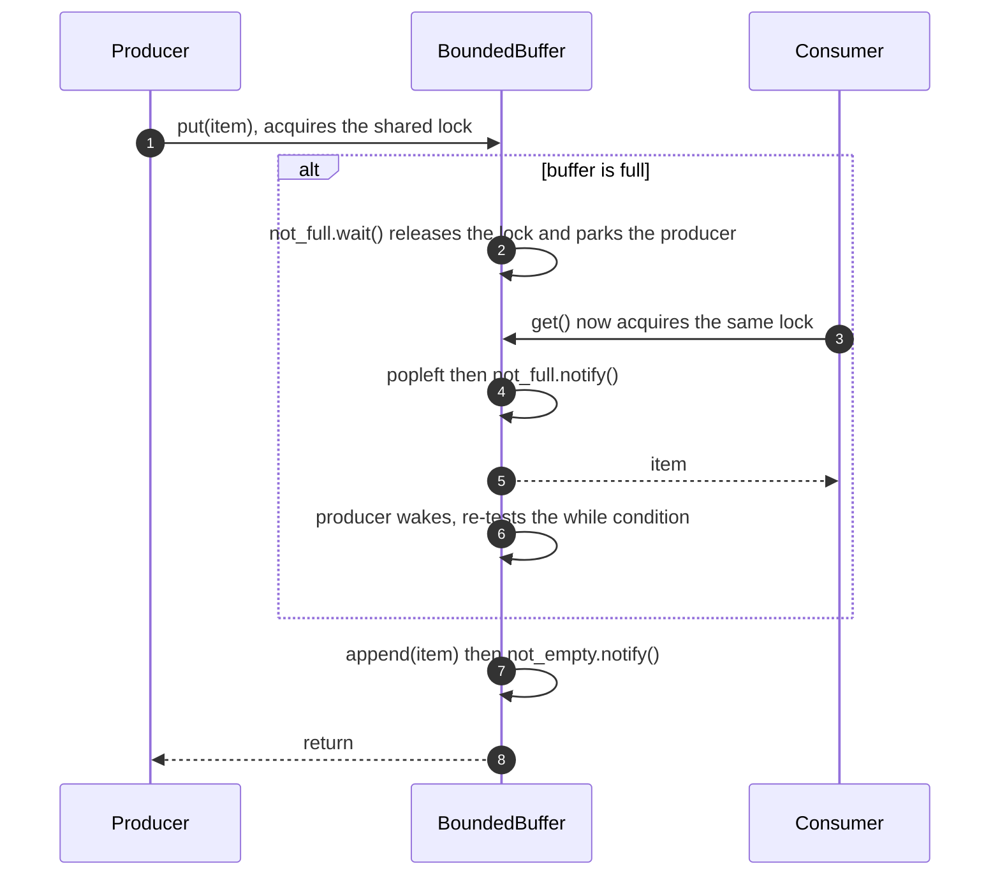
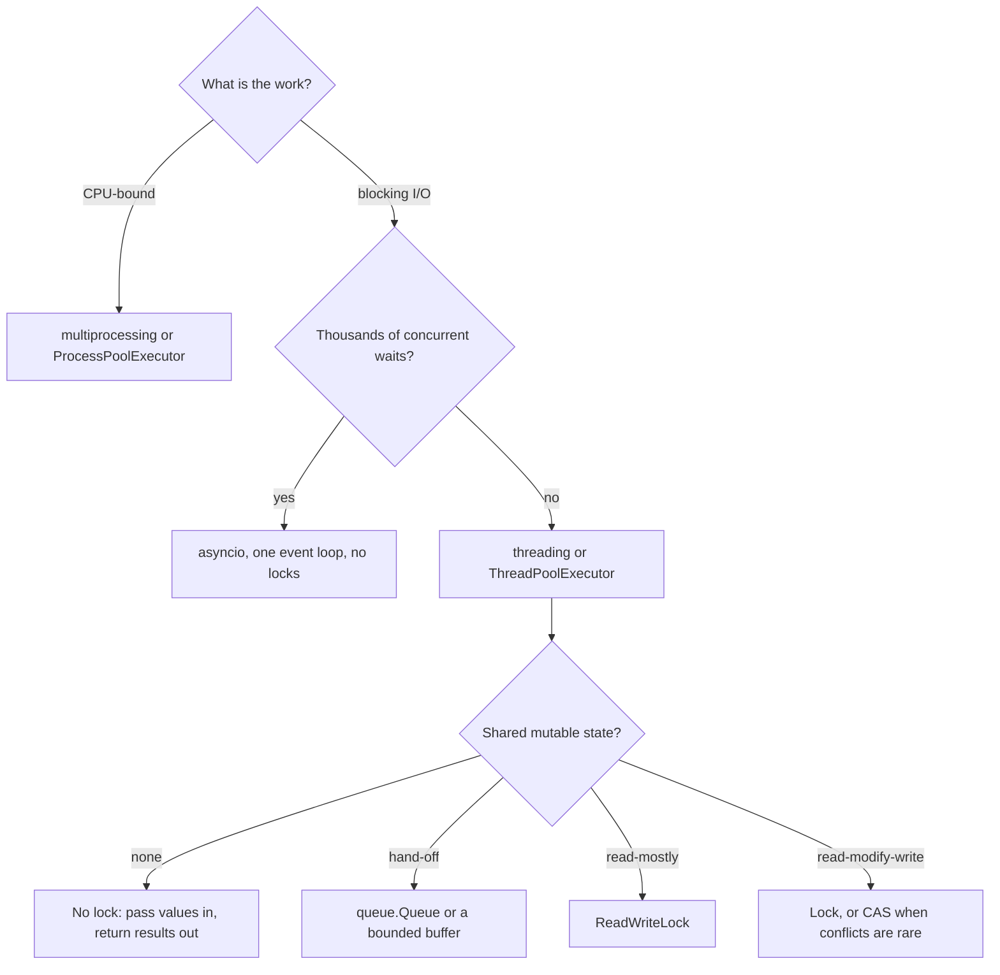

# Concurrency for LLD in Python

## TL;DR

The GIL serialises bytecodes, not your invariants, so `+=` still loses updates and shared mutable state still needs a lock. Know four things cold: which lock protects which state, `Condition` for producer-consumer, compare-and-set versus a held lock, and lock ordering for deadlocks. Threads for blocking I/O, `asyncio` for thousands of waits, `multiprocessing` for CPU work.

## Concepts

Every artifact below lives in `code/fundamentals/concurrency.py`, tested in `code/fundamentals/tests/test_concurrency.py` without a single sleep — the races are forced with a `Barrier`, not waited for.

### The GIL protects the interpreter, not your invariants

One thread executes Python bytecode at a time, and CPython switches threads every few milliseconds or whenever a thread blocks. That buys two things: the interpreter's own structures stay consistent, and single-bytecode operations such as `list.append` are effectively atomic. It buys nothing at the level you care about.

`self.value += 1` compiles to load, add, store. A thread can be preempted between the load and the store, and the value it eventually stores overwrites whatever another thread wrote in between:

```python title="code/fundamentals/concurrency.py — the same field, with and without a lock"
--8<-- "code/fundamentals/concurrency.py:counters"
```

`forced_lost_update` is what makes this teachable: rather than running a million increments and hoping for a race, both threads read, meet at a `Barrier`, then write. Two increments applied, counter ends at 1, every run — which is what makes it a test rather than an anecdote. Note the cost side: an uncontended lock costs about 17 ns, so the lock is almost never the performance problem; contention is.

### The primitives, and when each is the right answer

| Primitive | Reach for it when |
|---|---|
| `Lock` | One thread at a time in a critical section — the default |
| `RLock` | The same thread may re-enter (one public method calls another) |
| `Condition` | A thread must wait for a *predicate*, not just for a lock |
| `Semaphore` | At most N in flight (a connection pool, a rate cap) |
| `BoundedSemaphore` | The same, but an unmatched release raises instead of leaking |
| `Event` | One-shot broadcast — started, shutting down |
| `Barrier` | All N arrive before any proceeds — the test-writing tool |
| `Timer` | Fire once, later; cancellable |
| `queue.Queue` | Hand-off between threads with the locking already written |
| `ThreadPoolExecutor` | You want results and exceptions back, not threads |

Two rules make the table usable. Always use the `with` form, so an exception cannot leave a lock held. And always wait inside a `while`, never an `if`: a wakeup says the predicate *might* hold, because another thread can be scheduled in between and take what you were woken for.

### Producer-consumer with a Condition

`queue.Queue` is what you ship; a bounded buffer is what the interviewer wants to watch you write. The instructive version uses two `Condition` objects over one `Lock`, so a `put` wakes a waiting consumer rather than every blocked producer too.

```python title="code/fundamentals/concurrency.py — the bounded buffer"
--8<-- "code/fundamentals/concurrency.py:buffer"
```

**A producer blocking on a full buffer, and the consumer that frees it.**



Two things to say aloud: `wait()` releases the lock while it parks (otherwise nothing could make the predicate true), and the woken producer re-checks capacity, because a third producer may have taken the slot first.

### A read-write lock you can write from memory

Many readers share; a writer needs the place to itself. The right structure whenever reads dominate writes — a routing table, a configuration registry.

```python title="code/fundamentals/concurrency.py — writer-preferring read-write lock"
--8<-- "code/fundamentals/concurrency.py:rwlock"
```

The decision worth naming is *preference*. Here a reader waits while a writer is active **or queued**, so a stream of readers cannot starve a writer; readers starved by constant writes is the trade you accept. An interviewer who asks "what if reads never stop?" is checking that you chose rather than copied.

### Thread-safe singletons and double-checked locking

If a lazily created global must exist, double-checked locking is the idiom: an unlocked check for the common case, then a second check under the lock that is the correct one.

```python title="code/fundamentals/concurrency.py — double-checked locking"
--8<-- "code/fundamentals/concurrency.py:singleton"
```

Two details separate a good answer from a recited one. The two locks do different jobs: `_instance_lock` guards creation, `_lock` guards the counters afterwards. And this idiom was historically *broken* in Java, where a partially constructed object could be published before its constructor finished; on CPython the store to `_instance` happens only after `cls()` returns, so no thread sees a half-built registry. Then add the judgement: a singleton is global mutable state, `reset()` exists only for tests, and one instance built in `main` and injected is the better default.

### Optimistic versus pessimistic locking

Pessimistic locking prevents contention by holding a lock across the whole read-modify-write. Optimistic locking *detects* it: read the value with its version, compute, write only if the version has not moved.

```python title="code/fundamentals/concurrency.py — compare-and-set with a bounded retry loop"
--8<-- "code/fundamentals/concurrency.py:optimistic"
```

| | Pessimistic | Optimistic (version / CAS) |
|---|---|---|
| Cost when uncontended | A lock acquire | A lock acquire, plus a version compare |
| Cost when contended | Everyone waits, including for slow work | Losers retry, so work is repeated |
| Best when | Writes are frequent or `change` is slow | Conflicts are rare and `change` is cheap |
| Failure mode | Convoying, and deadlock with two locks | Livelock on a hot key, so bound the retries |

The retry loop is bounded on purpose: a permanently hot key raises `ConflictError` instead of spinning. It is the same trade the parking-lot design makes on a lost spot claim, and the one a database makes between row locks and snapshot isolation.

### Deadlock: ordering, then timeouts

A deadlock needs a cycle in the lock graph. `transfer(a, b)` against `transfer(b, a)` is the textbook one; the cure is to give every thread the same path through the graph by sorting on a stable key:

```python title="code/fundamentals/concurrency.py — lock ordering, and bounded acquisition"
--8<-- "code/fundamentals/concurrency.py:ordering"
```

Ordering is the first answer because it removes the cycle rather than surviving it. `try_transfer` is the fallback when no global order exists: acquire with a timeout and hand back a clean `False` to retry on, rather than a hang for someone to debug. Name the third option too — hold one lock instead of two, by moving the invariant into a single owner.

### Threads, asyncio, or processes

**The choice you should be able to draw in ten seconds.**



`asyncio` is cooperative concurrency on one thread: awaits are explicit yield points, so many data races disappear, but one blocking call stalls everything and CPU-bound work gains nothing. `multiprocessing` sidesteps the GIL at the cost of pickling and separate memory, which is why you share by message, not by object.

Running `python -m fundamentals.concurrency` prints the same numbers every time:

```text
--- += is not atomic: two threads read 0, both write 1 ---
2 increments applied, counter shows 1
--- one Lock, 8 threads x 5000 increments: expected 40000, got 40000 ---
--- read-write lock ---
5 readers inside at once; value after 4 exclusive writers: 4
--- bounded buffer (capacity 2): 12 items through, 0 left ---
--- singleton: 16 threads race ---
distinct instances: 1; counted: {'requests': 16}
--- optimistic CAS: 4 threads x 25 updates -> value 100 at version 101 ---
--- lock ordering: 8 workers transferring both ways ---
balances 300 and 300, total conserved at 600
```

## Applying it in the interview

Concurrency arrives at minutes 35–42 of the LLD framework, and there are three questions to answer.

**Which lock protects what.** Name the state, the lock and the granularity in one sentence: "the floor owns a lock over its spot statuses, so two gates racing for the last spot on floor 1 serialise while floor 2 is unaffected." One lock over the whole aggregate loses points — not because it is wrong, but because it shows you did not consider granularity.

**Which invariant it defends.** A lock only means something next to the rule it enforces — one vehicle per spot, one charge per ticket, no negative balance. If you cannot state the invariant, you cannot argue the lock is in the right place.

**How you would test it.** The differentiator, and it is cheap: "a `ThreadPoolExecutor` with 40 arrivals against 10 spots, asserting every spot is used exactly once", or "a `Barrier` so all 16 threads reach `instance()` together, then assert one distinct object".

Two smaller moves. Volunteer where you would *not* lock: immutable value objects need none, nor does thread-confined state. And name the primitive with its reason — `RLock` because a public method calls another, `Condition` because the wait is on a predicate, `Semaphore` because the cap is N rather than one.

!!! tip "Interview tip"
    When asked "is this thread-safe?", answer in the shape *state, lock, invariant, test*: "the ticket registry is shared, `_tickets_lock` guards it, the invariant is that a ticket leaves `ACTIVE` exactly once — which is why `begin_checkout` moves it to `PAYING` under the lock — and the test hands one ticket to two exit gates and asserts one raises." Four clauses, fifteen seconds, everything the rubric asks.

## Pitfalls

- **Believing the GIL makes code thread-safe.** It makes single bytecodes atomic. `+=`, check-then-act and every read-modify-write are still races.
- **Waiting on an `if`.** `if not self._items: self._condition.wait()` is a bug — the item can be taken before the woken thread runs. Always a `while`.
- **Holding a lock across slow work.** I/O or a callback inside the critical section turns one slow listener into a stalled system. Compute outside, mutate inside, notify after.
- **Wrong lock granularity.** One lock per aggregate serialises everything; one per element makes any multi-element operation a lock-ordering problem. Pick the middle unit and justify it.
- **Unbounded retry loops.** An optimistic update with no attempt cap turns a hot key into a spin. Bound it and raise.
- **Threads for CPU-bound work.** Eight threads hashing passwords run slower than one, trading the GIL back and forth. That is `multiprocessing`.

!!! warning "Common mistake"
    Testing concurrency with `sleep`. A `time.sleep(0.1)` between two threads and an assertion afterwards proves nothing: it passes on your laptop, fails on a loaded CI box, and never forces the interleaving you claim to test. Use a `Barrier` so every thread reaches the critical section together, `ThreadPoolExecutor` so worker exceptions re-raise at `future.result()`, and a short bounded `result(timeout=...)` when the point is that a thread *is* blocked.

## Exercises

1. **Make a cache thread-safe.** An LRU cache uses an `OrderedDict`: `get` looks up then calls `move_to_end`, `put` inserts then evicts. Which need locking, and which lock?

    ??? example "Solution"
        Both, with one `Lock` over the whole `OrderedDict`: each is check-then-act across two operations, so two threads can `move_to_end` the same key and two `put`s at capacity can evict twice. A `ReadWriteLock` looks tempting for a read-mostly cache but does not help — `get` mutates recency, so it is a writer. An LRU cache has no read-only path, which is why a real one shards its keys into independently locked segments.

2. **Spot the deadlock.** `Order.cancel()` takes the order lock then calls `inventory.restock(sku)`, which takes the inventory lock. `Inventory.reserve(sku)` takes the inventory lock then calls `order.hold()`, which takes the order lock. Give two fixes.

    ??? example "Solution"
        The cycle is order-then-inventory against inventory-then-order. Fix one: impose a global order — always take the inventory lock first, on both paths. Fix two, better: stop holding one lock while calling a component that takes another, so `cancel()` releases the order lock and *then* restocks, or publishes an event inventory consumes on its own. Fix three, when callers are outside your control: `acquire(timeout=...)` and retry, which survives the cycle rather than removing it.

3. **Choose the locking style.** A booking reads an in-memory seat, checks it is free, and marks it held. Bookings for a hot show arrive in bursts. Optimistic or pessimistic?

    ??? example "Solution"
        Pessimistic per seat. Conflicts on a hot show are common and `change` is trivially fast, so an optimistic retry storm just burns CPU re-reading the same contended seat. Do not lock the whole show — that serialises every buyer. Moved to a database the same shape becomes `SELECT ... FOR UPDATE` on the row, or a conditional update on a version column when the row is read far more often than written.

4. **Make a flaky test deterministic.** A test starts two threads, sleeps 200 ms, then asserts a counter equals 2. Rewrite it so it cannot flake, and say what each piece buys.

    ??? example "Solution"
        Submit both callables to a `ThreadPoolExecutor` and call `future.result()` on each: the pool joins the threads and re-raises what a bare `Thread` would swallow. If the point is that they *overlap*, put a `threading.Barrier(2)` inside the callable so neither finishes before both arrive — that makes overlap a fact rather than a hope, and the barrier timeout turns a hang into a failed assertion. The sleep then has nothing left to do.

## Related

- [Design an in-memory cache (LRU, LFU, TTL)](../problems/in-memory-cache.md) — where the lock-granularity argument gets real
- [Design an in-memory pub/sub message queue](../problems/pub-sub-system.md) — the bounded buffer at scale
- [Design a task scheduler (cron, LLD)](../problems/task-scheduler.md) — `Condition`, timers and a worker pool
- [Singleton](../patterns/singleton.md) — the other forms, and why injection usually wins
- [The LLD interview framework](lld-interview-framework.md) — where concurrency sits in the 45 minutes
- [Python documentation: threading](https://docs.python.org/3/library/threading.html)
- [PEP 703 — Making the Global Interpreter Lock optional in CPython](https://peps.python.org/pep-0703/)
