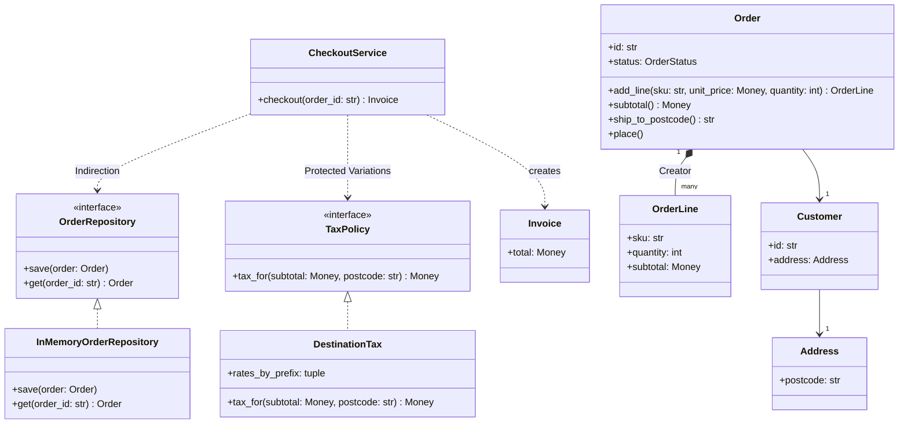

# DRY, KISS, YAGNI, Demeter, GRASP and cohesion

## TL;DR

SOLID shapes a class. These principles decide **who owns a piece of work**. DRY removes duplication that shares a reason to change, not code that looks alike. Demeter and tell-don't-ask keep behaviour from leaking into callers. GRASP names nine assignment decisions you already make by instinct. KISS and YAGNI stop a 45-minute design becoming a framework.

## Concepts

Every example comes from one checkout domain in `code/fundamentals/principles.py`, tested by `code/fundamentals/tests/test_principles.py`. The domain is deliberately boring: what matters is which object holds each decision.

### DRY removes shared reasons to change, not similar-looking code

"Don't repeat yourself" is usually quoted as "no copy-paste". The original formulation is stronger: every piece of *knowledge* has one authoritative representation. Two blocks duplicate knowledge when a single change in the world forces you to edit both. Two blocks that merely look alike but answer to different people are **accidental duplication**, and merging them is the more expensive mistake — you have coupled two things that were free to move apart, and the next change has to un-merge them under time pressure.

Rounding a percentage of money is real duplication: change the rounding mode and tax, discounts and refunds must all agree, or the invoice stops balancing.

```python title="code/fundamentals/principles.py — one rule, two reasons to change"
--8<-- "code/fundamentals/principles.py:dry"
```

`TaxRate` and `DiscountRate` are near-identical and stay separate on purpose: tax law changes when a legislature says so, discounts when marketing does. The shared *rule* is extracted; the shared *shape* is not. Say the test out loud — "I extract when both callers would have to change together, otherwise I leave the similarity alone."

### KISS and YAGNI are what an interview actually grades

A 45-minute round gives you roughly 17 minutes of writing, and every abstraction spends some of it. Interviewers report the same failure repeatedly: a candidate builds an event bus, a plugin registry and an abstract factory, then runs out of time before anything works. KISS says pick the simplest structure that meets the stated requirements; YAGNI says do not build for a requirement nobody stated.

The practical version is a two-part answer. Build the simple thing, then *name* the seam you would open when the requirement arrives: "pricing is a method today; with a second rule it becomes a `PricingStrategy` Protocol injected into the gate, and nothing else changes." You get the credit without spending the minutes. An abstraction earns its place when you can name the second implementation; one implementation plus a hypothetical is a guess.

### The Law of Demeter and tell-don't-ask

The Law of Demeter (the "principle of least knowledge") says a method may talk only to itself, its own fields, its parameters and objects it creates — never walk the object graph. The smell is a train wreck:

```python
# Smell: the caller knows Order has a Customer, Customer has an Address, Address has a postcode.
rate = tax_table.rate_for(order.customer.address.postcode)
```

Three classes can break this line: rename `Address.postcode` and every caller fails. The fix is one method on the object you already hold:

```python
# Fix: the order answers a question about itself; the graph is its business, not yours.
rate = tax_table.rate_for(order.ship_to_postcode())
```

Demeter is about *reaching*; tell-don't-ask is about *deciding*. A caller that reads state, judges it and writes back has taken a responsibility belonging to the object that holds the data:

```python
# Smell: the rule lives in the caller, so every caller must remember it.
if account.points >= points:
    account.points -= points
    credit = Money(points)
```

Two threads can interleave between the check and the subtraction, and the fourth caller will forget the check. `LoyaltyAccount.redeem` collapses read, decision and write into one call that either succeeds or raises:

```python title="code/fundamentals/principles.py — the decision lives with the data"
--8<-- "code/fundamentals/principles.py:tell"
```

Neither is absolute: fluent builders and data-transfer objects break Demeter deliberately and are fine, because chained calls on a *value* carry no decision.

### GRASP: nine answers to "which class does this go in?"

GRASP is a checklist for responsibility assignment. You will not recite it in the room, but its vocabulary lets you justify a placement in one sentence.

| Principle | The question | In the checkout domain |
|---|---|---|
| Information Expert | Who has the data? | `Order.subtotal()` — the order holds the lines |
| Creator | Who builds this object? | `Order.add_line`; the aggregate creates its parts |
| Controller | Who receives a use case? | `CheckoutService.checkout`, holding no rules of its own |
| Low Coupling | How little can this know? | The service names two Protocols and a callable |
| High Cohesion | Does it all serve one job? | Every line is about checking one order out |
| Polymorphism | Who handles type-varying behaviour? | `TaxPolicy` implementations, not `if country == ...` |
| Pure Fabrication | What if no domain object fits? | `OrderRepository`, invented to keep storage out of `Order` |
| Indirection | How do I decouple two things? | The repository Protocol, between service and database |
| Protected Variations | What is likely to change? | Tax law, so it gets a seam first |

**The checkout use case, and the two seams that protect it.**



Read the diagram as decisions rather than boxes. `CheckoutService` sequences and returns; it never computes tax, touches a dict of orders, or sets `order.status`.

```python title="code/fundamentals/principles.py — Controller, Indirection, Protected Variations"
--8<-- "code/fundamentals/principles.py:grasp"
```

### Coupling, cohesion and separation of concerns, named precisely

Coupling is how much one module must know about another; cohesion is how well one module's contents belong together. Both come in grades, and naming the grade makes the observation actionable.

| Coupling, worst to best | Cohesion, worst to best |
|---|---|
| **Content** — one class reads another's private attributes | **Coincidental** — a `utils.py` of whatever had no home |
| **Common** — two classes share module-level mutable state | **Logical** — one `handle(event_type, payload)` with a branch per type |
| **Control** — a flag switches the callee's branch | **Temporal** — a `startup()` doing five unrelated things |
| **Stamp** — a whole `Order` crosses where a postcode would do | **Functional** — everything serves one named job |
| **Data** — only the values actually needed cross | **Informational** — everything operates on the same data |
| **Message** — the caller cannot see the implementation at all | |

Separation of concerns is the same idea at a larger grain: keep the pure domain (arithmetic, invariants, transitions) away from boundary work (storage, HTTP, clocks, printing). Here `Order` and `OrderLine` are pure; `InMemoryOrderRepository` is the only thing that would grow a connection string. That boundary is why no test in `test_principles.py` needs more than a constructor.

### Fail fast and composition over inheritance

Fail fast means an object validates its invariants at construction, so an invalid one never exists. `Address.__post_init__` rejects a blank postcode and `OrderLine.__post_init__` a non-positive quantity, so nothing downstream writes `if line.quantity > 0`. A late failure costs a corrupted invoice three services away; an early one costs an exception naming the bad argument.

Composition over inheritance is the same trade in structure. Free shipping above a threshold is a rule *wrapped around* another rule, not a kind of shipping:

```python title="code/fundamentals/principles.py — wrapping beats subclassing"
--8<-- "code/fundamentals/principles.py:composition"
```

`free_over` works with flat shipping, weight-based shipping and another `free_over`. A `FreeOverFlatShipping` subclass would need rewriting per inner rule — the combinatorial explosion that collapses hierarchies. Inherit when the subclass genuinely *is* the parent and honours its contract; compose otherwise.

Running `python -m fundamentals.principles` walks the domain:

```text
--- the object that owns the data does the arithmetic ---
3 lines, subtotal 89.96 USD, ships to 94107
--- fail fast: an invalid line never becomes an object ---
rejected: line 'SKU-9' needs a positive quantity
--- the controller sequences, the policies decide ---
tax:      7.87 USD
shipping: 0.00 USD (free over 50.00 USD)
total:    97.83 USD
--- tell-don't-ask: the account applies its own rule ---
earned 500, redeemed 200 -> 2.00 USD credit, 300 points left
rejected: account C-1 has 300 points, not 1000
--- a second checkout is refused by the order, not by the service ---
rejected: order O-1 is placed, not draft
rejected: no order 'O-404'
```

## Applying it in the interview

These principles are not a section of the answer; they are the commentary justifying each placement. Three moments where they pay:

**Entities (minutes 5–10).** As nouns become classes, say who owns what: "the order holds the lines, so the order computes the subtotal — Information Expert." One sentence per non-obvious placement. If arithmetic drifts into a `*Manager` while the data sits in a dataclass, you are building an anemic model and the interviewer will name it.

**Class diagram (minutes 10–18).** Draw the seams and defend each with an axis of change: "tax is behind a Protocol because rates change per destination and per year; storage is behind a repository so the service is testable without a database." Three seams in a checkout design is right; nine is pattern-itis.

**Extensibility (last five minutes).** Answer every "how would you add X?" with a seam plus a test: "a new jurisdiction is a new `TaxPolicy` registered in `main`, and the test asserts one postcode in that region."

!!! tip "Interview tip"
    Before adding an abstraction, say the trigger out loud: "there are already two tax rules, so this goes behind a Protocol." Naming the *count of implementations* proves you are applying YAGNI deliberately. With one implementation, say "one rule today, so a method — the seam is here if a second arrives" and move on.

## Pitfalls

- **Merging code that looks alike.** Ask whether one change in the world forces both methods to move. If not, leave them apart and say why.
- **Demeter enforced as a syntax rule.** Wrapping every chained call in a delegate produces 40 pass-throughs, worse than the train wreck. Apply it where behaviour leaks, not to `datetime` or a builder chain.
- **A `*Manager` that holds all the behaviour.** `OrderManager.calculate_total(order)` over a data-only `Order` is an anemic model wearing a Controller's name. The Controller sequences; the entity computes.
- **Utility modules as an escape hatch.** `utils` and `helpers` collect coincidental cohesion by default. Give the function a home class or a named module, not a junk drawer.
- **Control-coupled flags.** `charge(amount, is_refund=True)` steers a branch inside the callee. Two well-named methods beat one boolean, which is usually a sign on a `Money`.
- **Validating late.** A `validate()` pass at checkout leaves a window where a broken order can be persisted. Push the check into `__post_init__`.

!!! warning "Common mistake"
    Reciting the acronyms instead of using them. "This follows SRP and DRY and GRASP" scores nothing; interviewers hear memorisation. What scores is the decision plus its consequence: "the subtotal lives on `Order` because `Order` holds the lines — on the service it would have to reach through `order.lines[i].unit_price`, and every line-price change breaks it." Name the principle *after* the reasoning, or not at all.

## Exercises

1. **Spot the accidental duplication.** A codebase has `format_invoice_number(order_id)` and `format_shipment_number(shipment_id)`, both `f"{prefix}-{value:08d}"`. A colleague proposes extracting `format_reference(prefix, value)`. Decide, and say why.

    ??? example "Solution"
        Extract only if the format is one business rule, not a coincidence. If finance owns invoice numbers and logistics owns shipment numbers, they diverge at the next audit and the helper grows into `format_reference(prefix, value, pad=8, separator="-")` — a parameter per caller, the classic sign of a bad merge. Compromise: keep both, and have both call `zero_padded(value, width)`, which carries no business meaning.

2. **Remove a train wreck.** `notifier.send(order.customer.address.country, order.customer.email)` appears in four services. Refactor it and name the principle each step serves.

    ??? example "Solution"
        Add `Order.notification_target()` returning a frozen `NotificationTarget(country, email)`. Demeter is satisfied because callers talk only to `Order`; the value object also fixes stamp coupling, since the notifier gets the two fields it uses instead of a customer graph. If sending differs by country, that becomes a `Channel` implementation, not an `if country == "US"` inside the notifier.

3. **Grade the coupling.** Classify each, and propose the next grade up: (a) `report.render(data, as_pdf=True)`; (b) a scheduler reading `config.SETTINGS`; (c) a service calling `repo._cache.clear()`.

    ??? example "Solution"
        (a) Control coupling — split into `render_pdf` and `render_html`, or inject a `Renderer`. (b) Common coupling on module-level mutable state — pass a frozen `Settings` into the constructor, which also lets one test run two configurations. (c) Content coupling, the worst grade — a private cache is not part of the contract; add `repo.invalidate(order_id)`, or keep the decision inside the repository.

4. **Apply YAGNI with a number.** You are asked to design a notification service; the interviewer mentions email. You are tempted to add a `Channel` Protocol, a registry and a retry decorator. What do you build first, and what do you say?

    ??? example "Solution"
        Build `NotificationService.send(user, message)` against an injected `EmailSender` Protocol — one seam, because injection is what makes the class testable today. Say: "the registry and the retry decorator arrive with a second channel; `Channel` is the same shape as `EmailSender`, so promoting it is a rename."

5. **Find the missing invariant.** `Order.place()` refuses an empty order and a second call. Name one invariant this domain should enforce at construction instead of at checkout, and where it goes.

    ??? example "Solution"
        A line's `unit_price` currency must match the order's; otherwise `subtotal()` raises a bare `ValueError` from `Money`, far from the line that caused it. The home is `Order.add_line`, already the Creator: compare against the first line's currency and raise `ValidationError` naming the SKU.

## Related

- [SOLID in Python](solid-principles.md) — the five principles these extend
- [The LLD interview framework](lld-interview-framework.md) — where each principle gets invoked
- [Common SDE2 mistakes in design rounds](../../cheatsheets/common-mistakes-sde2.md) — pattern-itis and anemic models, with fixes
- [Object-oriented Python for interviews](oop-in-python.md) — the dataclass and Protocol toolkit used above
- [Strategy](../patterns/strategy.md) — the seam Protected Variations asks for
- Larman, *Applying UML and Patterns* (2004), the GRASP chapter
- [Martin Fowler, "Tell Don't Ask"](https://martinfowler.com/bliki/TellDontAsk.html)
