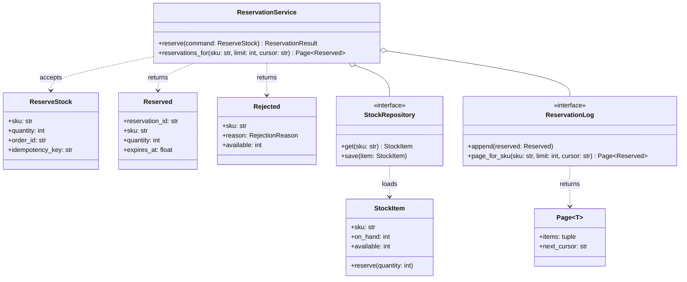

# Interfaces, contracts and service APIs in LLD

## TL;DR

- An interface is a **promise**: what the caller must supply, what comes back, what may fail, and what is still true afterwards. A method list is not a contract.
- Take a **command DTO**, return a **view DTO** or a **result object**. Raise only when the caller broke the contract; return a value when the domain says no.
- Every write that a client can retry needs an **idempotency key**. Every list method needs a **cursor**, not an offset.
- Small `Protocol`s per role; add fields, never change them.

## Concepts

The running example is `code/fundamentals/contracts.py`: reserving stock, the call an e-commerce checkout makes before it takes money. Tests are in `code/fundamentals/tests/test_contracts.py`.

### An interface is a promise, not a method list

**The reservation contract: two commands in, a result union out, and two small Protocols underneath.**



Both collaborators are `Protocol`s sized to what the service calls - two methods each. That is what makes the service testable without a database, and it is interface segregation applied at the point where it pays.

```python title="code/fundamentals/contracts.py - two Protocols and one real implementation"
--8<-- "code/fundamentals/contracts.py:protocols"
```

Method names carry the promise. `reserve` says a hold is taken and can be released; `get` says the thing exists or you get an error; `page_for_sku` says you will not receive the whole table. Compare `process(data)`, which promises nothing and forces the reader into the body.

### DTOs: commands in, views out

Do not let a service signature grow four positional strings, and do not hand your domain object to a caller. Take a **command** - a frozen dataclass that validates itself - and return a **view**.

```python title="code/fundamentals/contracts.py - the command and the two outcomes"
--8<-- "code/fundamentals/contracts.py:dto"
```

`__post_init__` means an invalid `ReserveStock` cannot exist, so no downstream code re-checks the quantity. The DTO is also the natural place for the `idempotency_key`: it is part of the request, not an extra argument someone forgets to thread through.

### Result objects or exceptions?

The dividing line is *whose fault it is*. If the caller broke the contract - an unknown SKU, a malformed command, a page size of zero - raise: the caller has a bug and a stack trace is the right feedback. If the domain simply says no - out of stock, item withdrawn, coupon expired - **return a value**. Those outcomes are part of the normal flow, they carry data the caller needs (`available=1` tells the UI what to offer), and a returned union forces the caller to handle them:

```python
match service.reserve(command):
    case Reserved(reservation_id=reservation_id):
        take_payment(reservation_id)
    case Rejected(reason=reason, available=available):
        offer_alternative(reason, available)
```

`type ReservationResult = Reserved | Rejected` is the whole "result object" machinery Python needs; no `Either` library, and `match` gives exhaustiveness for free. Reach for exceptions when the failure must unwind several frames, and for results when the immediate caller has a decision to make.

### Preconditions, postconditions and invariants

Three different promises, and interviewers score you for naming them separately.

- **Precondition**: what must be true when the method is called. It is the *caller's* obligation, so a violation raises a domain error.
- **Postcondition**: what the method guarantees on return - "available drops by exactly `quantity`".
- **Invariant**: what is true of the object at every observable moment - here, `0 <= reserved <= on_hand`.

```python title="code/fundamentals/contracts.py - guard the pre, assert the invariant"
--8<-- "code/fundamentals/contracts.py:invariants"
```

The asymmetry is deliberate. A precondition failure raises `ValidationError`, because the caller sent something impossible. An invariant failure raises `AssertionError`, because *this class* is broken - it should be impossible, and if it happens you want the crash in the method that caused it rather than three calls downstream. Put the invariant in one private method and call it at the end of every mutator; it costs a comparison and it turns a future refactor's silent corruption into a failing test.

### Idempotent service methods

Any write a client can retry - and every network client retries - needs to be safe to call twice. The mechanism is a client-supplied **idempotency key**: the service records the key with the result it produced, and a replay returns the stored result instead of doing the work again.

```python title="code/fundamentals/contracts.py - one lock, one key, one effect"
--8<-- "code/fundamentals/contracts.py:service"
```

Three details worth saying out loud. The key is stored **with the result**, not as a "seen" flag, so the replay returns the same reservation id rather than a fresh rejection. The lookup, the decision and the store all happen under one lock, so two threads replaying the same key cannot both take stock - the concurrency test fires 60 commands over 30 keys at 10 units and asserts exactly 10 reservations. And in production the key store needs a TTL and an in-progress marker, which is where this design meets [API design for HLD rounds](../../hld/fundamentals/api-design.md).

Note what is *not* idempotent by key: a natural `release(reservation_id)` is idempotent by identity, because releasing an already-released hold is a no-op. Prefer that shape when you can get it.

### Pagination belongs in the repository contract

A method that returns `list[T]` has promised to return the whole table. Return a page instead, and page by **cursor**, not offset.

```python title="code/fundamentals/contracts.py - a page is a value, the cursor is a key"
--8<-- "code/fundamentals/contracts.py:pagination"
```

An `OFFSET 40` query re-runs the sort and skips forty rows; if a row was inserted before position 40 between the two calls, the client sees one row twice and, on a delete, misses one entirely. A keyset cursor - "give me the rows whose id is greater than `RES-0004`" - is stable under concurrent writes and lets the database seek straight to the position on an index. The price is that the sort key must be unique and totally ordered, which is why `SortableIdGenerator` zero-pads: `RES-0010` sorts after `RES-0009`, while `RES-10` sorts before `RES-9`.

Bound the page size in the contract (`1..100` here) so a caller cannot ask for the table by passing `limit=10_000_000`, and treat `next_cursor is None` as the only end-of-data signal.

### From domain method to REST resource

The mapping is mechanical once the service interface is right, which is the point: design the domain call first, then expose it.

| Service method | HTTP | Response |
|---|---|---|
| `reserve(ReserveStock)` | `POST /skus/{sku}/reservations` with an `Idempotency-Key` header | `201` and the `Reserved` body; `409` and the `Rejected` body with a machine-readable `reason` |
| `reservations_for(sku, limit, cursor)` | `GET /skus/{sku}/reservations?limit=20&cursor=RES-0004` | `200` with `{"items": [...], "next_cursor": "..."}` |
| `release(reservation_id)` | `DELETE /reservations/{id}` | `204`, and `204` again on a repeat |

Nouns become resources, verbs become methods, result objects become status codes, and the DTO becomes the request body. Command DTOs whose intent is not CRUD get an action sub-resource (`POST /reservations/{id}/extend`) rather than a verb in the path. The full treatment - error envelopes, opaque cursors, `Retry-After`, long-running operations - is in [API design for HLD rounds](../../hld/fundamentals/api-design.md).

### Versioning and extensibility

A published contract can only grow. Adding an optional field with a default is compatible; removing a field, renaming it, changing its type, or turning an optional field into a required one is not.

```python title="code/fundamentals/contracts.py - additive by construction"
--8<-- "code/fundamentals/contracts.py:versioning"
```

Two habits make that easy. Omit unset optional fields from the payload rather than sending `null`, so a client written before `warehouse` existed receives byte-for-byte what it always received. And keep the view separate from the domain object, so adding an internal field to `StockItem` never leaks into a response. When a change really is breaking, it is a new resource version, not an edit - and the old one keeps working until its clients are gone.

Running `python -m fundamentals.contracts`:

```text
--- reserve 3 of SKU-A -> RES-0001, holds until 1700000900.0 ---
same idempotency key replayed -> the same result object: True
expected failure is a value: out_of_stock, 1 left - no exception raised
--- keyset pagination over the reservation log ---
cursor=None -> ['RES-0001', 'RES-0002']
cursor='RES-0002' -> ['RES-0003', 'RES-0004']
cursor='RES-0004' -> ['RES-0005']
v2 payload: {'reservation_id': 'RES-0001', 'sku': 'SKU-A', 'quantity': 3, 'expires_at': 1700000900.0, 'schema_version': 2, 'warehouse': 'LON-1'}
v1-shaped payload omits the new field: {'reservation_id': 'RES-0001', 'sku': 'SKU-A', 'quantity': 3, 'expires_at': 1700000900.0, 'schema_version': 2}
broken precondition raises: no stock record for 'SKU-MISSING'
the DTO refuses to exist: quantity must be positive, got 0
```

## Applying it in the interview

Interface design is the step between the class diagram and the code, and it is where SDE2 candidates most often lose points by going straight to implementation. After you have drawn the entities, write the service signatures on the board - three or four lines - and narrate the contract for each: "`reserve` takes a command with an idempotency key, returns `Reserved` or `Rejected`, raises only for an unknown SKU, and leaves `0 <= reserved <= on_hand` true." You have now answered the retry question, the error-handling question and the concurrency question before they were asked.

When the interviewer pushes on failure modes, use the fault line: caller error raises, domain outcome returns. When they push on scale, the list method is where you say "cursor, not offset, and a bounded limit". When they push on evolution, say "additive fields with defaults; a breaking change is a new version". These are the same moves [Design Amazon (cart, order, inventory, payment)](../problems/ecommerce-order-inventory.md) makes at full size, and the [Repository](../patterns/repository.md) pattern is where the persistence half of the contract lives.

!!! tip "Interview tip"
    Say the contract in one breath before you write the body: "preconditions, result, and what is still true afterwards." Interviewers grade whether you *thought* about the promise; writing `def reserve(self, command: ReserveStock) -> ReservationResult:` and then explaining those three things takes fifteen seconds and reads as senior.

## Pitfalls

- **Returning the domain entity.** Hand back `StockItem` and every client depends on `on_hand`, so you can never rename it. Return a view.
- **Exceptions for expected outcomes.** `OutOfStockError` forces every caller into a `try` block and throws away the `available` count they needed. Out of stock is an answer, not an accident.
- **`list[T]` on a repository.** It works with ten rows in a demo and falls over at a million, and changing the signature later breaks every caller. Return a page from the start.
- **Idempotency keys generated by the server.** The point is that the *client* can retry the identical request; a server-side key changes on every attempt and buys nothing.
- **Boolean parameters in the signature.** `reserve(command, True)` is unreadable at the call site. Use a keyword-only argument, an enum, or two methods.
- **A Protocol that mirrors one implementation.** If `StockRepository` grows `execute_sql`, it has stopped being a contract and become a leaky wrapper around the database.

!!! warning "Common mistake"
    Adding a required field to a published DTO and calling it "just a small change". Every client that has not been redeployed now sends a request that fails validation, and the failure lands on whoever deployed last. New fields are optional with a default, always; if the field genuinely must be required, it is a new version of the endpoint running alongside the old one until the callers have moved.

## Exercises

1. **Should `release(reservation_id)` take an idempotency key?**

    ??? example "Solution"
        No. It is already idempotent by identity: the reservation id names the exact effect, so releasing twice is a no-op and the second call returns the same `204`. Idempotency keys exist for *creates*, where the request carries no identifier for the thing it is about to make. Knowing when you do not need the mechanism is a stronger signal than knowing it.

2. **The reservation hold expires after fifteen minutes. Where does that belong in the contract?**

    ??? example "Solution"
        In the returned value, as `expires_at`, so the caller can decide what to do - which is why `Reserved` carries it. The expiry itself is enforced by a sweeper that releases stale holds, and the invariant `0 <= reserved <= on_hand` is what makes that sweeper safe to run concurrently. Do not put it in a constant the caller cannot see: a promise the client cannot read is not part of the contract.

3. **A caller asks for `reservations_for(sku, limit=1000)`. What should happen, and why not just serve it?**

    ??? example "Solution"
        Raise `ValidationError`, because the contract says `1..100`. Serving it makes your tail latency a function of whatever a client types, and once one client depends on 1000 you can never lower the cap. State the maximum in the error message so the caller can fix it without reading your source.

4. **`StockItem.reserve` raises when the quantity exceeds availability, but `ReservationService` returns `Rejected` for the same situation. Is that inconsistent?**

    ??? example "Solution"
        No - they are contracts at different layers. `StockItem` is an internal invariant-keeper: by the time anyone calls its `reserve`, availability has been checked, so exceeding it is a bug and raising is right. `ReservationService` is the boundary the outside world calls, where "not enough stock" is an ordinary business answer. Converting between the two is exactly what a service layer is for.

## Related

- [API design for HLD rounds](../../hld/fundamentals/api-design.md) - the same contracts exposed over HTTP, with cursors, idempotency headers and error envelopes
- [Repository](../patterns/repository.md) - the persistence half of the contract, and where pagination lives
- [SOLID in Python](solid-principles.md) - interface segregation and dependency inversion, which these Protocols apply
- [Design Amazon (cart, order, inventory, payment)](../problems/ecommerce-order-inventory.md) - reservation contracts at full size
- [Object-oriented Python for interviews](oop-in-python.md) - the dataclasses and Protocols the DTOs are built from
- [PEP 544 - Protocols: structural subtyping](https://peps.python.org/pep-0544/)
- [RFC 9110 - HTTP semantics, on idempotent methods](https://www.rfc-editor.org/rfc/rfc9110#name-idempotent-methods)
