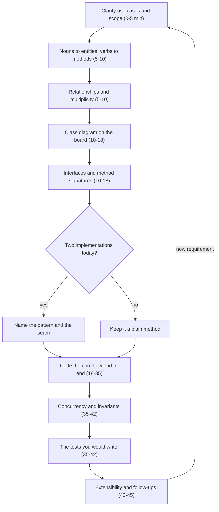

# The LLD interview framework

## TL;DR

Clarify, turn nouns into entities and verbs into methods, fix the relationships, draw the class diagram, write the interfaces, add patterns **only** where an axis of change justifies one, code the core flow end to end, then close with concurrency, extensibility and testing. In 45 minutes that is 5 / 5 / 8 / 17 / 7 / 3. Four failures sink candidates: pattern-itis, a god object, an anemic model, no working code.

## Concepts

The framework exists so you never stall. Every problem page in this handbook follows it, and every pacing table — including the one on [Design a parking lot](../problems/parking-lot.md) — is this process with a clock attached.

**The eight steps, and the decision that repeats.**

### 1. Clarify: turn a one-line prompt into a scoped use-case list

"Design a parking lot" is not a specification, and the interviewer knows it. Spend five minutes converting it into a numbered list of use cases plus an explicit out-of-scope line, and get both confirmed. Ask about the actors, the variation the design must absorb (vehicle types, pricing rules, payment methods), the scale (one lot or a chain, one process or many), and the concurrency (can two gates act at once?).

Write the assumptions on the board rather than holding them in your head. "Multiple entry gates operate concurrently; in-memory, single process; payments behind an interface" is one line that saves you from redesigning at minute 30. If the interviewer declines to answer, state your assumption and move — an unanswered question is a decision you now own.

### 2. Nouns to entities, verbs to methods

Read the confirmed use cases back and underline the nouns: `Lot`, `Floor`, `Spot`, `Vehicle`, `Ticket`, `Gate`, `Payment`. Those are candidate classes. Underline the verbs — park, issue, calculate, charge, release — and each belongs on the class holding the data it needs, which is Information Expert, the first question of [GRASP](design-principles-beyond-solid.md).

Two filters make the list shorter and better. Drop nouns that are attributes, not entities (a licence plate is a `str` on `Vehicle`). Promote a noun to a value object when it carries validation or arithmetic — `Money`, `TimeRange`, `Address`. Say each placement out loud: "the ticket knows its entry time, so the ticket computes duration." One sentence per class is what stops an anemic model forming.

### 3. Relationships, multiplicity and the class diagram

Now connect the boxes and put a number on every line. A lot has many floors (composition — destroy the lot and the floors go with it); a floor has many spots; a ticket references exactly one spot (association); a gate uses a pricing strategy it does not own (aggregation). Getting `1 → *` versus `0..1` right is a cheap, visible signal, and it forces good questions: can a ticket exist without a spot? (Yes — a lost ticket.)

Draw the structure first and hang the policies off it afterwards, as the parking-lot page does with two diagrams instead of one crowded one. Keep it under a dozen boxes; the notation is in [UML with Mermaid](uml-with-mermaid.md). Mark where the locks will live while you are here — you need it at minute 35.

### 4. Interfaces and APIs before implementations

Write the signatures before the bodies: `park(vehicle: Vehicle) -> Ticket`, `quote(ticket_id: str) -> Money`, `process(ticket_id: str, method: PaymentMethod) -> Payment`. A signature commits you to a return type and an error contract, which is where most design disagreements live. Decide now whether failure is an exception (`LotFullError`) or a result object, and be consistent.

Small `Protocol`s beat one fat abstract base class: `PricingStrategy` with one method is easy to fake in a test and hard to implement wrongly. This is also where you name what is injected — clock, ID generator, payment processor — because that decides whether your tests can be deterministic. Say the error contract aloud once and the rest of the round inherits it.

### 5. Patterns only where an axis of change justifies them

A pattern earns its place when you can name the second implementation *and* the requirement that will ask for it. Pricing has hourly, flat and daily-cap rules, so `PricingStrategy` is justified; a `TicketFactory` making one kind of ticket is not. Give the justification in the same breath as the name — "pricing is what they will ask me to change, so Strategy" — and voice the refusals: "I would not make the lot a Singleton; I build one in `main` and inject it, so tests can build several."

Three or four justified patterns in a 45-minute design is a strong answer. Nine is pattern-itis, and it is graded down because it predicts how you would treat a real codebase.

### 6. Code the core flow, then concurrency, extensibility and testing

Pick the single most important path — entry for a parking lot, book-a-seat for a cinema, `get`/`put` for a cache — and make it work end to end. Enums and errors first (they pin the vocabulary), then entities, then the service method tying them together. Working code for one flow beats skeletons for six.

Only then turn to the closing three. **Concurrency**: name which lock protects which state, why that granularity, and the invariant it defends. **Extensibility**: answer each "how would you add X?" with a seam and a test. **Testing**: name four or five cases (happy path, validation failure, state transition, race, edge case) even with no time to write them — naming them is most of the signal.

## Applying it in the interview

**The 45-minute timebox.** Six slots. Each problem page splits the middle to suit its own flow, but the first and last slots never move.

| Minutes | Step | Deliverable on the board |
|---|---|---|
| 0–5 | Clarify | Numbered use cases, assumptions, an out-of-scope line |
| 5–10 | Entities | Class names, attributes, verbs assigned to owners |
| 10–18 | Class diagram | Structure with multiplicities, policies hung off it |
| 18–35 | Code | The core flow end to end, enums and errors first |
| 35–42 | Concurrency and tests | Which lock protects what; four or five test cases |
| 42–45 | Extensions | Two follow-ups answered as seams |

**The 60-minute variant** stretches the same shape rather than adding steps: 0–7 clarify, 7–15 entities and relationships, 15–25 diagram and interfaces, 25–48 code, 48–55 concurrency and tests, 55–60 extensions. The extra 15 minutes buys a *second* flow and one real test, not more abstraction.

**Machine-coding rounds** (90–120 minutes, common at Uber and across the Indian product market) invert the emphasis: the deliverable is a repository that runs. Budget roughly 10 minutes planning, 15 on the skeleton and interfaces, 50 on the core, 20 on tests, and the rest on a `main()` demo and a short README. Keep it in memory and single-process unless told otherwise, and make sure something executes by the halfway mark — reviewers run the repo and read the tests first.

**What SDE2 interviewers grade.** Every rubric reduces to six signals.

| Signal | Earns it | Loses it |
|---|---|---|
| Requirements | Scoped use cases, stated assumptions | Coding before scope is agreed |
| Decomposition | Behaviour sits with its data | A `*Manager` doing everything |
| Abstraction | Seams at axes of change | Patterns with no second implementation |
| Working code | One flow runs end to end | Six half-classes, no path through |
| Correctness | Named locks, invariants, edge cases | "I'd add a lock somewhere" |
| Communication | Thinking aloud, taking hints | Defending a design past the hint |

**The Amazon OOD rubric** is that list rewritten as leadership principles, and the mapping is worth rehearsing. **Dive Deep** is the concurrency answer — name the lock, its granularity and the invariant it defends, not "I'd synchronise it". **Insist on the Highest Standards** is tests, error handling and naming; volunteer the test list before you are asked. **Ownership** is stating assumptions, owning trade-offs, and saying what happens on restart or partial failure.

**Company differences** are shallower than folklore suggests. Amazon runs OOD as a full round with leadership-principle follow-ups and a bar raiser. Microsoft commonly folds it into a coding round: whiteboard the classes, then implement one method properly. Google embeds it in coding and expects the data structures justified by complexity. Meta rarely runs a standalone LLD round for SDE2, but the skill surfaces in product-architecture and coding rounds. Uber uses the machine-coding round above. Only the deliverable moves.

!!! tip "Interview tip"
    Announce the framework in your first 30 seconds: "I'll clarify requirements, sketch entities and relationships, draw the class diagram, then code the entry flow and finish with concurrency and extensions — stop me if you want a different emphasis." It costs half a minute, lets the interviewer redirect you *before* you spend 20 on the wrong half, and reads as someone who has done this on the job.

## Pitfalls

- **Pattern-itis.** Factory, Builder, Observer and an event bus on a problem with one flow. Every pattern must arrive with the second implementation it exists for; if you cannot name one, use a method.
- **The god object.** `ParkingLotManager` holding spots, pricing, payments and the display board. Split by responsibility as soon as the class name needs an "and".
- **The anemic model.** Data-only dataclasses plus a service reaching through them. If the service writes `order.lines[i].unit_price`, that arithmetic belongs on `Order`.
- **No working code.** The commonest SDE2 failure and the hardest to recover from. At minute 30 with nothing runnable, abandon a class and finish the flow.
- **Designing the database instead of the objects.** Tables and sharding are HLD. Say "persistence sits behind a repository interface" and return to behaviour.
- **Ignoring the hint.** "What if two gates hit the same spot?" is not curiosity; it is the concurrency section arriving early.

!!! warning "Common mistake"
    Treating clarification as a warm-up and then never using it. Candidates spend four good minutes asking questions, write the answers down, then design as if the conversation never happened — three vehicle types when the interviewer said four, no concurrency when they said two gates. Before drawing the class diagram, read the assumption list back and check every line has a home in the design. Requirement coverage is scored explicitly, and this is where it is lost.

## Exercises

1. **Assign the verbs.** For a library system with `Book`, `BookCopy`, `Member`, `Loan`, `Catalog`, decide which class owns `is_overdue`, `can_borrow`, `search` and `reserve`. Justify each in a sentence.

    ??? example "Solution"
        `is_overdue(now)` on `Loan` — it holds the due date, and injecting `now` keeps it testable. `can_borrow()` on `Member` — it knows the active loan count and any suspension. `search(query)` on `Catalog`, a Pure Fabrication owning the index; on `Book` it would make every book know every other. `reserve(member)` on `Book`, not `BookCopy`, because a member reserves a title and the system assigns a copy at pickup — say that assumption aloud, since copy-level holds are defensible too.

2. **Rescue a stalled round.** It is minute 32 of 45. You have eight classes drawn, no method bodies, and the interviewer has gone quiet. What do you do next?

    ??? example "Solution"
        Say what you are doing and why: "I'm over-invested in structure — let me make the core flow real." Write the one service method top to bottom with the entities you have, stubbing anything peripheral in a line. Then spend minutes 38–45 on the lock, the test list and one extension. A narrow complete path plus honest stubs beats eight class declarations, and naming the correction is itself an Ownership signal.

3. **Map a design decision to the rubric.** You chose a lock per floor rather than one for the whole lot. Write the two sentences that turn that into a Dive Deep signal.

    ??? example "Solution"
        "The floor owns the lock because the invariant is *one vehicle per spot* and spots belong to floors, so two gates racing for the last compact spot on floor 1 serialise while a gate on floor 2 is unaffected. One lot-wide lock is correct but serialises every gate in the building; a lock per spot makes *finding* a free spot a multi-lock dance." Then add the test: 40 arrivals, 10 spots, three gates, every spot used exactly once.

## Related

- [LLD round checklist](../../cheatsheets/lld-checklist.md) — this framework as a pre-flight list
- [Object-oriented Python for interviews](oop-in-python.md) — the language toolkit assumed here
- [UML with Mermaid](uml-with-mermaid.md) — the notation for steps 3 and 4
- [Design a parking lot](../problems/parking-lot.md) — the framework applied in full
- [Mock LLD interview: parking lot](../../mocks/mock-lld-parking-lot.md) — a 45-minute transcript
- [DRY, KISS, YAGNI, Demeter, GRASP and cohesion](design-principles-beyond-solid.md) — what justifies each placement
