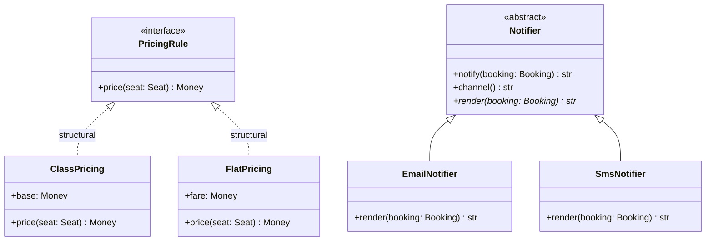
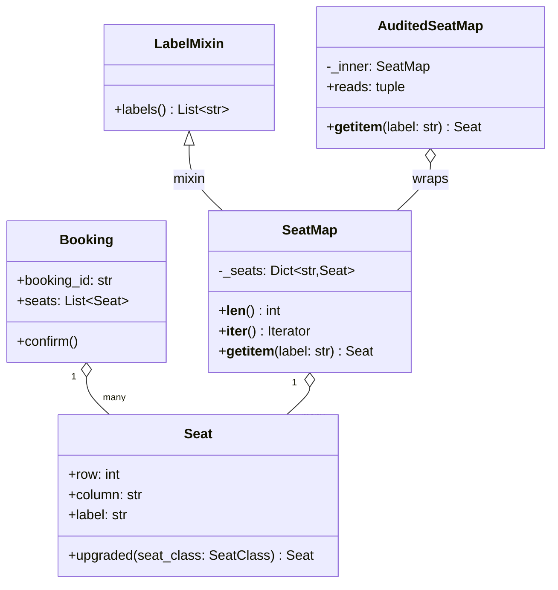

# Object-oriented Python for interviews

## TL;DR

- Model **values** as `@dataclass(frozen=True, slots=True)` and **entities** as `@dataclass(slots=True)` with an id and guarded transitions. That one distinction removes half the bugs in a machine-coding round.
- Use `Protocol` for a pure interface (structural, no inheritance) and `ABC` only when subclasses inherit real behaviour.
- Implement the dunders the language already calls (`__eq__`/`__hash__`, `__len__`, `__iter__`, `__enter__`) instead of inventing `get_all()` methods.
- Prefer composition; keep inheritance for genuine "is a" plus shared code.

## Concepts

Everything below is one runnable module, `code/fundamentals/oop_toolkit.py`, built around a single domain: the seat map of a show and the bookings made against it. Tests live in `code/fundamentals/tests/test_oop_toolkit.py`.

### Classes, instances and the three kinds of attribute

An attribute lives in one of three places, and mixing them up is the first thing a reviewer notices. **Instance attributes** are set in `__init__` (or by a dataclass field) and belong to one object. **Class attributes** are shared by every instance - fine for constants, a disaster for anything mutable, because one instance's `append` is visible to all. **Slots** replace the per-instance `__dict__` with a fixed layout, which forbids typos like `seat.colunm = "B"` at runtime rather than at review time.

```python
class Show:
    attendees: list[str] = []          # shared by every Show ever created

show_a, show_b = Show(), Show()
show_a.attendees.append("ana")
assert show_b.attendees == ["ana"]     # the bug, two lines later
```

The fix: `field(default_factory=list)` on a dataclass, or `self.attendees = []` in `__init__`.

### Value objects: frozen dataclasses

A value object has no identity of its own: two seats in row 12, column A *are* the same seat. Freeze it, slot it, validate it in `__post_init__`, and it becomes a hashable dictionary key that is safe to share between threads because nothing about it can change.

```python title="code/fundamentals/oop_toolkit.py - a value object"
--8<-- "code/fundamentals/oop_toolkit.py:value"
```

Four decisions worth narrating while you type:

- **`frozen=True`** generates `__hash__` from the compared fields; without it a dataclass is unhashable and cannot be a `dict` key or a set member.
- **`slots=True`** drops `__dict__`, so an attribute typo raises `AttributeError` instead of silently creating a new field.
- **`order=True`** derives `<`, `<=`, `>`, `>=` from the field order, which is why `row` is declared before `column`.
- **`field(compare=False)`** keeps `amenities` out of equality, hashing and ordering: a seat is identified by where it is, not by whether it has a power socket.

`__post_init__` is the only place a frozen dataclass may write to itself, and it needs `object.__setattr__` to do it. Validate there so the rest of the system can assume every `Seat` it receives is well formed.

### Entities: mutable dataclasses with guarded transitions

An entity is the opposite: identified by an id, expected to change. Generated equality is wrong for it, because a booking that gains a seat is still the same booking. Pass `eq=False` and write the pair yourself.

```python title="code/fundamentals/oop_toolkit.py - an entity"
--8<-- "code/fundamentals/oop_toolkit.py:entity"
```

`field(default_factory=list)` is how each instance gets its own list; a bare `seats: list[Seat] = []` raises `ValueError` at class-creation time, which is the language refusing to let you write the classic shared-default bug. `confirm` shows the shape every state change should have: check the current state, check the invariant, then assign - never assign first.

### Enums for every closed set

Any time a string or an integer means "one of a fixed set", it should be an enum. You get autocompletion, an error on a typo, and a name that appears in logs and diagrams.

```python title="code/fundamentals/oop_toolkit.py - three enum flavours"
--8<-- "code/fundamentals/oop_toolkit.py:enums"
```

`StrEnum` is the default choice for a status or a category that crosses a serialisation boundary: `SeatClass.PREMIUM == "premium"` is `True`, so JSON and database columns need no conversion. Plain `Enum` is better when you want the members to *not* be interchangeable with strings. `Flag` is for combinable options: `Amenity.WINDOW | Amenity.POWER` is one value that answers `Amenity.WINDOW in ...`, which beats four boolean fields.

### ABC or Protocol: nominal and structural typing

**`Protocol` is structural.** A class satisfies it by having the right methods; it never imports or inherits anything, and a fake defined inside a test qualifies automatically. **`ABC` is nominal.** A subclass declares the relationship, inherits real code, and cannot be instantiated until it supplies every `@abstractmethod`.

**`PricingRule` is a Protocol that classes satisfy by shape; `Notifier` is an ABC that subclasses inherit behaviour from.**



Dotted arrows mark realisation, solid ones inheritance.

```python title="code/fundamentals/oop_toolkit.py - both kinds of interface"
--8<-- "code/fundamentals/oop_toolkit.py:interfaces"
```

`@runtime_checkable` lets `isinstance(rule, PricingRule)` work, but it checks method *names* only, not signatures. Rule of thumb: reach for `Protocol` first, promote to `ABC` when two implementations would otherwise copy the same method.

### Equality, hashing and ordering

Three contracts the language enforces and interviewers probe. First: if `a == b` then `hash(a) == hash(b)`, so `__eq__` and `__hash__` must read the same fields; defining `__eq__` alone silently sets `__hash__ = None` and your object stops working in sets. Second: return `NotImplemented`, not `False`, for a type you do not understand, so Python can try the other operand's `__eq__`. Third: when the natural order is not the field order, write one key function.

```python title="code/fundamentals/oop_toolkit.py - one key, six comparisons"
--8<-- "code/fundamentals/oop_toolkit.py:ordering"
```

`@total_ordering` fills in `<=`, `>` and `>=` from `__lt__` and `__eq__`. Negating `priority` inside the key is how you get "highest priority first, then arrival order" out of a plain ascending `sorted`. Also implement `__repr__` on anything you will debug: it is what `pdb`, a failing assertion and a list of objects print.

### Containers and context managers

If your class holds things, implement the dunders and stop writing accessors - `len(seat_map)`, `for seat in seat_map`, `"2C" in seat_map` and `seat_map["2C"]` are free.

```python title="code/fundamentals/oop_toolkit.py - a container"
--8<-- "code/fundamentals/oop_toolkit.py:container"
```

A context manager is the same idea applied to a lifetime: acquire in `__enter__`, release in `__exit__`, and the release happens even when the block raises.

```python title="code/fundamentals/oop_toolkit.py - a context manager"
--8<-- "code/fundamentals/oop_toolkit.py:context"
```

Two details to say out loud: a falsy `__exit__` lets the exception propagate (returning `True` swallows it, which you almost never want), and if `__enter__` raises then `__exit__` never runs - so acquire everything or nothing inside `__enter__`.

### Constructors that are not `__init__`

`__init__` should take exactly the fields of the object. Every *other* way of building one is a `@classmethod` with a name that says where the data came from - `Seat.parse("12A")`, `Booking.from_request(payload)`, `Money.of("8.00")`. Returning `Self` rather than the class name keeps the annotation correct in subclasses.

```python
@classmethod
def from_row(cls, values: dict[str, str]) -> Self:
    return cls(int(values["row"]), values["column"])
```

A `@staticmethod` takes neither `self` nor `cls`; use it for a helper that belongs to the class only by topic, such as `Seat.aisle_columns()`. If a static method never touches the class at all, a module-level function is simpler.

### Composition, inheritance and mixins

Inheritance couples you to the base class forever: every method it grows, you inherit. Composition gives you a seam you control.

```python
class Row(list[Seat]):
    def append(self, seat: Seat) -> None:
        if len(self) >= 6:
            raise ValidationError("row is full")
        super().append(seat)

row = Row()
row.extend([seat] * 9)   # the guard never runs: extend does not call append
row[0] = other_seat      # nor does __setitem__
```

**A booking and a seat map both reference the same shared `Seat` values, and the audit wrapper composes rather than extends.**



```python title="code/fundamentals/oop_toolkit.py - wrap, do not extend"
--8<-- "code/fundamentals/oop_toolkit.py:composition"
```

A **mixin** is the acceptable use of multiple inheritance: methods and no state, no `__init__`, and a documented expectation of what the host class provides. `LabelMixin` gives any iterable-of-seats a `labels()` method. Keep the method resolution order shallow - one mixin plus one base is readable, four is not.

### Typing that pays for itself

Type hints are documentation the reader cannot skip and a diagram you did not have to draw. Four features carry most of the weight in an LLD round.

```python title="code/fundamentals/oop_toolkit.py - generics, Self, Literal, type alias"
--8<-- "code/fundamentals/oop_toolkit.py:generics"
```

`class Registry[T]` is the Python 3.12 spelling of a generic; no `TypeVar` line, and the parameter is scoped to the class. `Self` as a return type makes `add` chainable and stays correct in subclasses. `Literal["insertion", "key"]` pins two accepted strings without the ceremony of an enum. The `type SeatPredicate = ...` statement names a callable shape once so signatures read like sentences. Add `@override` on every method that overrides one: a renamed base method then breaks the build instead of leaving a dead override behind.

### Three gotchas an interviewer watches for

```python
def hold(labels: list[str], into: list[str] = []) -> list[str]:   # evaluated once
    into.extend(labels)
    return into

pickers = [lambda seat: seat.row == row for row in (1, 2, 3)]     # all three see row == 3
Seat(1, "A") is Seat(1, "A")                                      # False; == is True
```

Default arguments are evaluated once at `def` time, so a mutable default is shared by every call that omits it. Closures capture the *variable*, not its value, so every lambda built in a loop sees the loop's final value. And `is` compares identity while `==` compares value: `is` is correct for `None` and for enum members (which are singletons) and wrong for almost everything else.

```python title="code/fundamentals/oop_toolkit.py - the same three, fixed"
--8<-- "code/fundamentals/oop_toolkit.py:gotchas"
```

Running `python -m fundamentals.oop_toolkit` exercises the whole module:

```text
--- SeatMap(rows=3, seats=12) ---
mixin labels: 1A, 1B, 1C, 1D ...; '2c' in map -> True
prices: 1A (business) = 20.00 USD, 2B (premium) = 12.00 USD, 3C (economy) = 8.00 USD
2C: amenities AISLE, AISLE in them -> True
replace: 2C (premium) -> 2C (business); original still 2C (premium)
inside the with block, held = ['3C', '3D']
after the with block, held = []
BK-1 is confirmed for 3C, 3D
[email] Booking BK-1: 3C, 3D
[sms] BK-1 confirmed for 2 seat(s)
registry by key: ['BK-1', 'BK-2']
waitlist order: ['BK-5', 'BK-4', 'BK-3']
composition: 12 seats wrapped, reads audited ['1A', '2B']
is -> False; == -> True; enum member is a singleton -> True
each picker kept its own row: [[1], [3]]
no shared default: ['4A'] then ['4B']
rejected: 'row twelve' is not a seat label such as '12A'
```

## Applying it in the interview

This vocabulary shows up at two moments of [the LLD interview framework](lld-interview-framework.md). At the entity step, say which nouns are values and which are entities: "`Seat` and `Money` are frozen value objects, `Booking` and `Show` are entities with ids and lifecycles." That single sentence tells the interviewer you know why one gets a `__hash__` and the other gets a status field. At the interface step, say which abstractions are Protocols and why: "pricing is a `Protocol` because the gate only calls one method and my tests supply a fake; `Notifier` is an `ABC` because both channels share the rendering pipeline."

When you write code on the board, write the enums first, then the dataclasses, then the services: it is the fastest route to something an interviewer can read, and each enum kills an `if`-ladder later. Guard every transition with an explicit check and inject the clock and the ID generator, as [Design a parking lot](../problems/parking-lot.md) does throughout.

!!! tip "Interview tip"
    When you are asked "why a dataclass here?", answer in guarantees, not features: "frozen gives me a hash so a `Seat` can key the reservation dict, and immutability means two gate threads can share it without a lock." Guarantees are what senior engineers trade in; `@dataclass` on its own is just syntax.

## Pitfalls

- **Anemic models.** A `Booking` with nothing but fields, and a `BookingService` that pokes at them, is a struct with extra steps. Put the invariant next to the data: `confirm()` belongs on the booking.
- **Inheriting for reuse.** Subclassing `list`, `dict` or another concrete class to add one rule leaves every inherited method as a way around it. Wrap and delegate instead.
- **`@property` that does work.** Callers assume attribute access is cheap and side-effect free. If it queries a repository or mutates state, make it a method with a verb in its name.
- **Enum members compared by string.** `status == "confirmed"` works for a `StrEnum` and silently fails for a plain `Enum`; compare members with `is`.
- **Over-abstracting.** A `Protocol` with one implementation and no test double is speculative. Add the seam when the second implementation exists.

!!! warning "Common mistake"
    Defining `__eq__` without `__hash__`. Python sets `__hash__ = None` on any class that defines `__eq__` itself, so your objects work perfectly until the first `set()` or `dict` key and then raise `TypeError: unhashable type`. Either use a frozen dataclass and get both for free, or write the pair together over exactly the same fields.

## Exercises

1. **Make `Seat` sortable by aisle proximity.** Seats should sort so that aisle columns (`C`, `D`) come before window columns within the same row, without changing the field order.

    ??? example "Solution"
        `order=True` cannot express it. Drop it and use the `@total_ordering` shape from `WaitlistEntry`: `_key(self)` returns `(self.row, 0 if self.column in Seat.aisle_columns() else 1, self.column)`, and `__lt__` plus `__eq__` read that key. Keep `__hash__` on the same fields as `__eq__`.

2. **Add a `LoyaltyPricing` rule that gives members a fixed discount.** It must work with the existing code without touching `ClassPricing` or the Protocol.

    ??? example "Solution"
        A frozen dataclass holding `inner: PricingRule` and `discount: Money`, whose `price(seat)` returns `inner.price(seat) - discount`. It satisfies `PricingRule` structurally, so nothing else changes, and wrapping rather than subclassing means it composes with any rule.

3. **Turn `SeatHold` into a reusable generator-based context manager.** Keep the release-on-exception behaviour.

    ??? example "Solution"
        `@contextlib.contextmanager` on a generator: validate, add the labels to `held`, `yield` the seats inside a `try`, remove them in `finally`. The `finally` replaces `__exit__`; without it an exception leaks the hold. Prefer the class when the object also needs methods or a `repr`.

4. **Explain why `Booking` uses `eq=False` but `Seat` does not.**

    ??? example "Solution"
        `Seat` is a value: equality *is* field equality, so the generated `__eq__` is right and `frozen=True` supplies a matching `__hash__`. `Booking` is an entity: its fields change over its lifetime, and two bookings with identical fields are still different bookings, so equality must read the id alone.

## Related

- [SOLID in Python](solid-principles.md) - the principles these constructs are used to satisfy
- [The LLD interview framework](lld-interview-framework.md) - where entity and interface modelling sit in the 45 minutes
- [Design a parking lot](../problems/parking-lot.md) - the same toolkit applied to a full problem
- [Strategy](../patterns/strategy.md) - Protocols and frozen dataclasses as interchangeable rules
- [PEP 544 - Protocols: structural subtyping](https://peps.python.org/pep-0544/)
- [Python documentation: the data model](https://docs.python.org/3/reference/datamodel.html)
- [Python documentation: dataclasses](https://docs.python.org/3/library/dataclasses.html)
