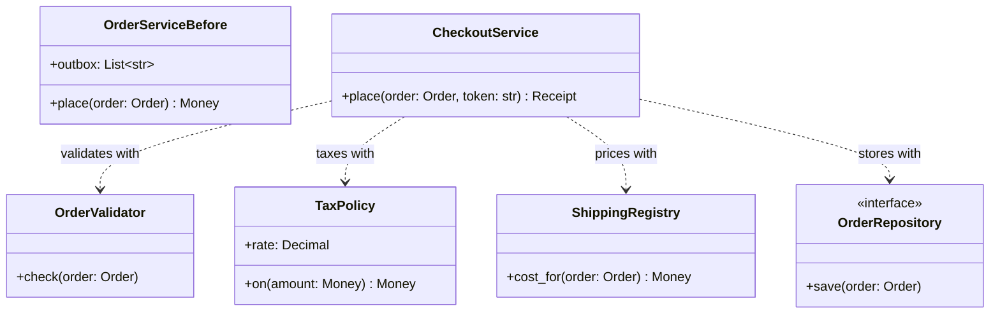
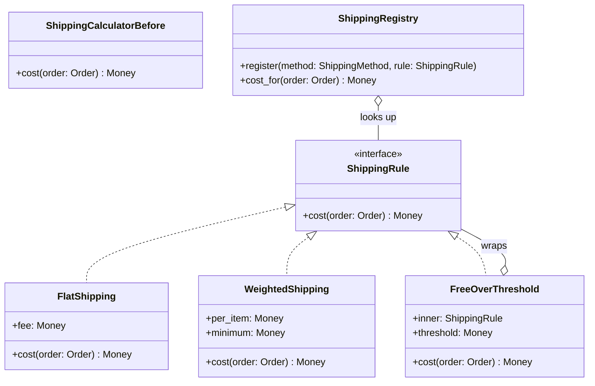
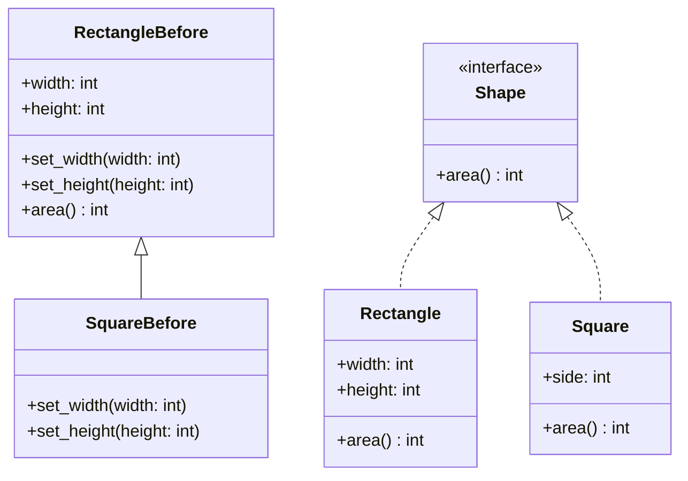
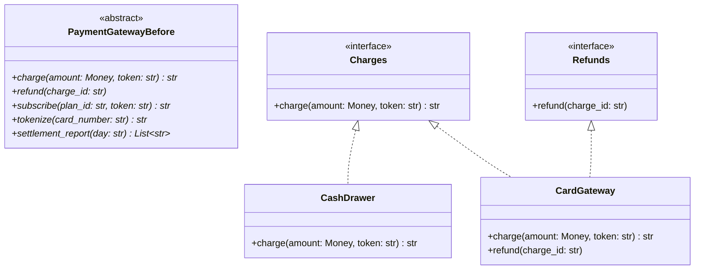
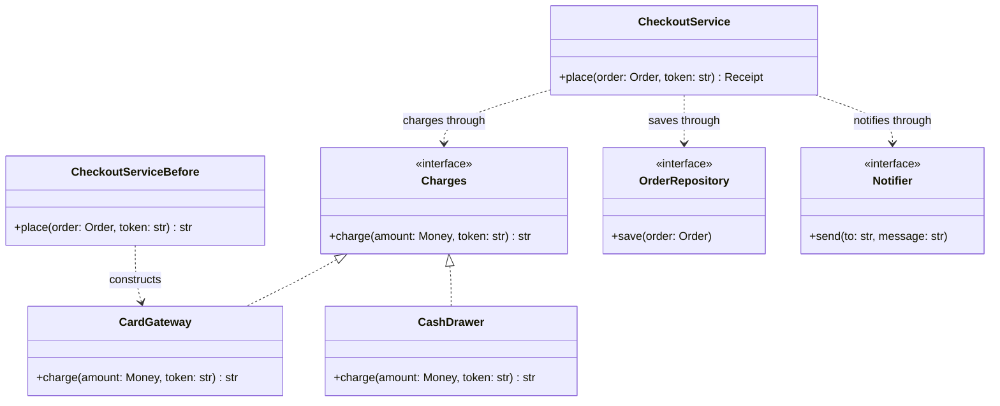

# SOLID in Python

## TL;DR

- SOLID is not five rules to recite; it is five smells to *notice* and five refactorings to perform: split the god class, replace the `if/elif` ladder, fix the broken subtype, shrink the fat interface, inject the abstraction.
- In Python, four of the five collapse into one habit: **depend on a small `Protocol`, pass it in, and let the composition root pick the implementation.**
- Name the principle only after you have named the change. "This is a new `ShippingRule`, registered here" beats "this violates OCP".

## Concepts

The examples below are one runnable checkout module, `code/fundamentals/solid.py`, with a `*Before` class per principle and the shape that replaces it. `code/fundamentals/tests/test_solid.py` asserts the difference each refactor bought.

### Single responsibility: one reason to change

A class should have one reason to change - one axis along which requirements move. The smell is a method you cannot summarise without the word "and", or a class whose imports span validation, HTTP, SQL and templating.

```python title="code/fundamentals/solid.py - five jobs in one method"
--8<-- "code/fundamentals/solid.py:srp_before"
```

Count the reasons this class gets edited: the tax office changes the rate, the warehouse changes the fees, someone rewrites the email, someone moves storage to Postgres, someone adds a rule about gift cards. Five teams, one file, five chances to break the other four.

**Before: one class with five reasons to change. After: collaborators with one each, and a service that only orchestrates.**



```python title="code/fundamentals/solid.py - one reason to change each"
--8<-- "code/fundamentals/solid.py:srp_after"
```

Splitting is not free: you now have four names to keep straight. The test that justifies it is the one changing the tax rate without constructing a payment gateway. The other signal is cohesion - every method of `TaxPolicy` touches the rate, while `OrderServiceBefore` had methods that shared nothing but the word "order". **Say in the room:** "validation, pricing and persistence change for different reasons, so they are different objects; `CheckoutService` only sequences them."

### Open/closed: extend by adding, not by editing

Software should be open to extension and closed to modification. The smell is an `if/elif` ladder over a type or an enum - especially the *second* one, because now two functions must be edited together and one of them will be forgotten.

```python title="code/fundamentals/solid.py - the ladder"
--8<-- "code/fundamentals/solid.py:ocp_before"
```

**Before: every new method edits `cost`. After: a rule per method, looked up in a registry that never changes.**



```python title="code/fundamentals/solid.py - a rule per method, plus a registry"
--8<-- "code/fundamentals/solid.py:ocp_after"
```

Two things the ladder could not do. `WeightedShipping` prices by item count, which the flat ladder had no place to put. `FreeOverThreshold` wraps *any* rule and was written months later without touching one line of the registry or the service - that is what "closed for modification" buys. This is [Strategy](../patterns/strategy.md) with a dict for a factory.

**Say in the room:** "shipping is the axis they will ask me to extend, so it goes behind a `ShippingRule` and the ladder becomes a lookup."

### Liskov substitution: a subtype must keep the promises

Anywhere the base type works, the subtype must work - same preconditions or weaker, same postconditions or stronger, same invariants. The smell is an override that raises `NotImplementedError`, an override that ignores an argument, or a subclass whose docstring starts "except that".

```python title="code/fundamentals/solid.py - the square that is not a rectangle"
--8<-- "code/fundamentals/solid.py:lsp_before"
```

`RectangleBefore` promises that `set_width` leaves the height alone. `SquareBefore` cannot keep that promise, so any code holding a `RectangleBefore` reference silently computes the wrong area. Write the promise down as a **contract test** and run it against every subclass; the violation stops being a debate:

```python
def rectangle_contract(shape: RectangleBefore) -> None:
    shape.set_width(5)
    shape.set_height(4)
    assert shape.area() == 20

rectangle_contract(RectangleBefore(2, 3))   # passes
rectangle_contract(SquareBefore(4))         # AssertionError: area is 16
```

**Before: inheritance chosen for the "is a" of geometry. After: one interface over the behaviour that is genuinely shared.**



```python title="code/fundamentals/solid.py - immutable shapes behind one method"
--8<-- "code/fundamentals/solid.py:lsp_after"
```

Two fixes are hiding in there. Immutability removes the setter that caused the trouble, and the shared abstraction is narrowed to the behaviour that really is common. The contract a subtype must keep is bigger than the signature: it includes the exceptions the base class documents, the invariants it maintains and the arguments it accepts. Accepting *fewer* inputs, raising a *new* exception type, or returning a *wider* type than the base promised all break substitution even though the types still line up. **Say in the room:** "`Square` is not a subtype of a mutable `Rectangle`, so I will make both implement `Shape` instead, and I would write a contract test that every implementation must pass."

### Interface segregation: many small Protocols beat one fat base class

No client should depend on methods it does not call. The smell is an implementation full of stubs that raise, or a test double that has to fake eight methods to exercise one.

```python title="code/fundamentals/solid.py - five methods nobody wants all of"
--8<-- "code/fundamentals/solid.py:isp_before"
```

**Before: one abstract base with five methods. After: two Protocols, and a class implements only what it can honestly do.**



```python title="code/fundamentals/solid.py - one method per role"
--8<-- "code/fundamentals/solid.py:isp_after"
```

A cash drawer cannot subscribe anyone to anything, and under the fat base class it had to say so in four stub methods. With small Protocols it implements `charge` and stops. The client shrinks too: `CheckoutService` declares `payments: Charges`, so nothing it depends on can be broken by a change to refunds. Python gives you this almost for free - duck typing means no implementation has to declare anything - but only if you *name the narrow type on the parameter*. Annotate it `CardGateway` and you have imported the whole fat surface anyway.

**Say in the room:** "the checkout only ever charges, so the interface it depends on has one method."

### Dependency inversion: depend on the abstraction, own the wiring

High-level policy should not depend on low-level detail; both depend on an abstraction. The smell is `self._gateway = StripeGateway()` inside a constructor: the class has chosen its own collaborator, and no test can substitute anything.

```python title="code/fundamentals/solid.py - inject every collaborator"
--8<-- "code/fundamentals/solid.py:dip"
```

**Before: the service constructs a concrete gateway. After: it names Protocols, and one composition root chooses the implementations.**



The ordering inside `place` is the other thing to point at: charge first, commit afterwards. A declined card raises before `save` runs, so no order is persisted and no email is sent. `build_checkout` is the **composition root** - the one function allowed to name concrete classes. Everything else takes what it needs as an argument, which is exactly [Dependency Injection](../patterns/dependency-injection.md); no framework is involved.

Running `python -m fundamentals.solid` shows each pair:

```text
--- order ORD-1: subtotal 44.98 USD, 3 items ---
SRP before: one class returns 65.96 USD and owns the outbox too
SRP after:  44.98 USD + 9.99 USD + 10.99 USD = 65.96 USD
OCP before: locker is 2.49 USD whatever the 6-item basket holds
OCP after:  the same basket is 4.50 USD under a per-item rule
OCP after:  a wrapping rule registered later drops express to 0.00 USD
LSP before: set_width(5) on a 4x4 square gives area 25, not 20
LSP after:  total_area of a rectangle and a square = 36
ISP after:  the cash drawer charges (cash-1) and owes no refund stub
ISP after:  isinstance(drawer, Charges) -> True, Refunds -> False
DIP:        the same service on a cash drawer -> cash-2
DIP:        the declined path is a two-line fake, not a sandbox: card tok-declined declined
notifier recorded 2 messages, the last to ana@example.com
```

## Applying it in the interview

SOLID is a vocabulary for the *last ten minutes*, when the interviewer starts asking "what if we also need X?". The move is always the same: name the axis of change, name the seam, name the test. "Discounts are the next thing to vary, so they go behind a `DiscountRule` Protocol; the registry maps a coupon type to a rule; the test I would add asserts that a stacked coupon never takes the total below zero."

Two calibrations matter at SDE2. First, apply the principles to the *one or two* axes the requirements actually name, not to every class - a `Protocol` with a single implementation and no test double is speculative work you will be asked to defend. Second, say the cost out loud: splitting a class adds names and indirection, and the return is that one team can change one thing. An interviewer who hears you weigh both sides stops testing whether you memorised the acronym.

!!! tip "Interview tip"
    Never say "that violates the open/closed principle" on its own. Say the refactor, then the label: "I would put each shipping rule behind one `cost` method and look it up by method - that is open/closed, and it means adding same-day delivery touches no existing code." The refactor is what gets graded; the label is what makes it memorable.

## Pitfalls

- **Pattern-itis.** Five interfaces for a program with one implementation of each is not SOLID, it is ceremony. YAGNI wins until a second implementation, a test double, or a named requirement appears.
- **Splitting by layer instead of by reason to change.** `OrderHelper`, `OrderManager` and `OrderUtils` are one class in three files. If two of them always change together, they are one responsibility.
- **Inheriting to reuse code.** Most "is a" relationships in a domain are really "has a" or "plays the role of". Reach for a Protocol plus composition and keep inheritance for genuine shared behaviour.
- **Injecting the concrete type.** Passing `gateway: CardGateway` as a constructor argument is not dependency inversion; you moved the coupling, you did not remove it. The parameter must be typed as the abstraction.
- **A "Protocol" with ten methods.** Interface segregation is about the *client's* needs. If two clients use disjoint halves, that is two Protocols.

!!! warning "Common mistake"
    Treating SRP as "one method per class". Cutting a class into single-method fragments produces the same god object spread across ten files, plus a wiring problem, and reviewers see it immediately. The unit is a *reason to change* - a stakeholder, a policy, an external system - not a line count. If you cannot name who would ask for the change, you have not found a responsibility.

## Exercises

1. **The registry still has an `if`.** `ShippingRegistry.cost_for` raises when a method has no rule. Is that an open/closed violation?

    ??? example "Solution"
        No. Selection has to happen somewhere; the principle is that *adding* a rule does not edit existing code, and `register` satisfies that. The missing-rule branch is error handling, not a type switch - it does not grow when a method is added. A Null Object (`FreeShipping`) as the registry default would remove even that branch, at the cost of turning a configuration mistake into silent free delivery.

2. **Apply LSP to a repository.** `OrderRepository.get` raises `NotFoundError` for a missing id. A caching implementation returns `None` instead. What breaks, and what is the fix?

    ??? example "Solution"
        Every caller written against the Protocol handles `NotFoundError`; the cache weakens the postcondition, so those callers now dereference `None` and fail somewhere unrelated. The fix is a contract test that every implementation must pass - "get on a missing id raises `NotFoundError`" - run as a parametrized test over all implementations. Contract tests are how you enforce LSP for interfaces you did not write.

3. **Add a loyalty discount without editing `CheckoutService`.**

    ??? example "Solution"
        Define `DiscountRule` with `discount(order) -> Money`, add it as a constructor argument typed as that Protocol, and subtract it from `taxable` before tax. Adding it to the constructor is a change to `CheckoutService`, so the truly closed version instead composes: wrap the injected `ShippingRegistry` or introduce a `PricingPipeline` of rules the service iterates. Choose the second only if the interviewer asks for more than one discount - otherwise the extra parameter is simpler and honest.

4. **Which principle does `FreeOverThreshold` illustrate, and which pattern is it?**

    ??? example "Solution"
        Open/closed, achieved through composition: it satisfies `ShippingRule`, holds another `ShippingRule`, and adds one rule on top. Structurally that is a Decorator - same interface in and out - which is why it can wrap `FlatShipping`, `WeightedShipping` or another `FreeOverThreshold` without any of them knowing. It also demonstrates DIP: it depends on the Protocol, never on a concrete rule.

## Related

- [Object-oriented Python for interviews](oop-in-python.md) - the dataclasses, Protocols and enums these refactorings use
- [DRY, KISS, YAGNI, Demeter, GRASP and cohesion](design-principles-beyond-solid.md) - the principles that tell you when *not* to apply these
- [Strategy](../patterns/strategy.md) - the pattern behind the open/closed refactor
- [Dependency Injection](../patterns/dependency-injection.md) - composition roots and how the abstraction reaches the service
- [Robert C. Martin, "Design Principles and Design Patterns" (2000)](https://web.archive.org/web/20150906155800/http://www.objectmentor.com/resources/articles/Principles_and_Patterns.pdf)
- [Barbara Liskov and Jeannette Wing, "A Behavioral Notion of Subtyping" (1994)](https://dl.acm.org/doi/10.1145/197320.197383)
- [PEP 544 - Protocols: structural subtyping](https://peps.python.org/pep-0544/)
