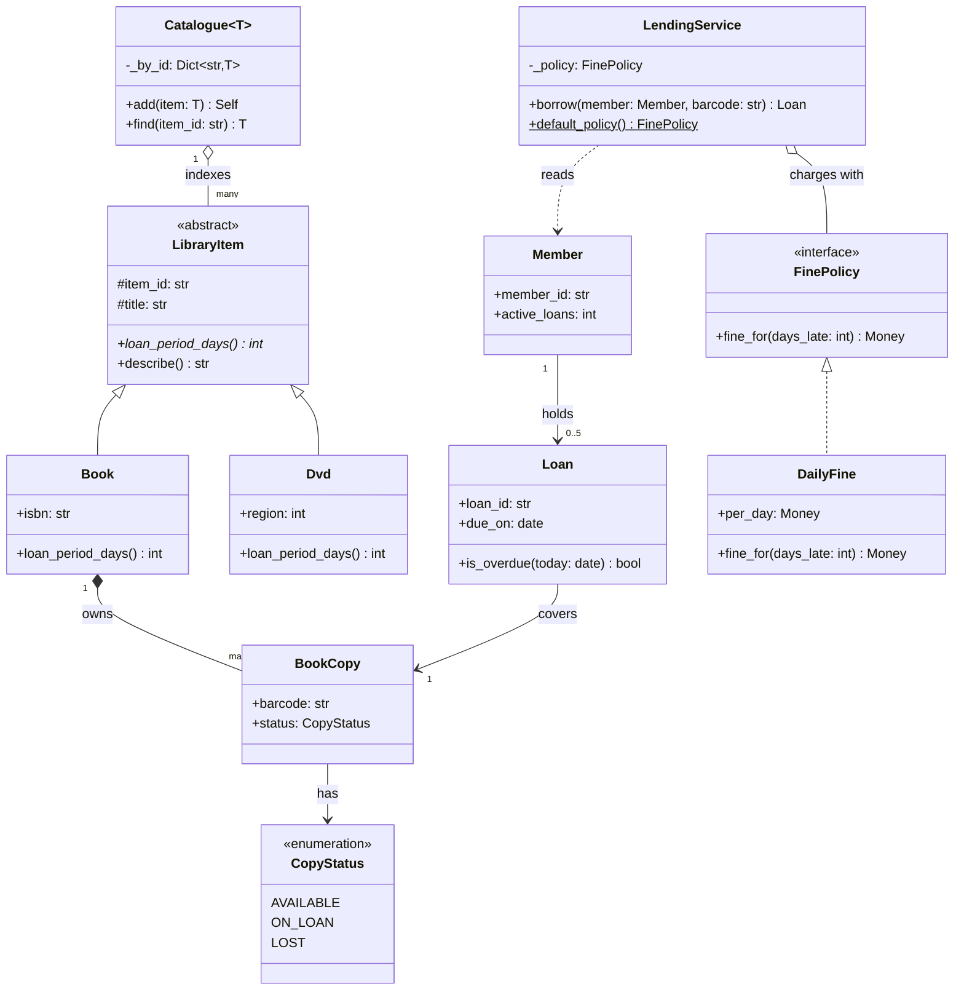
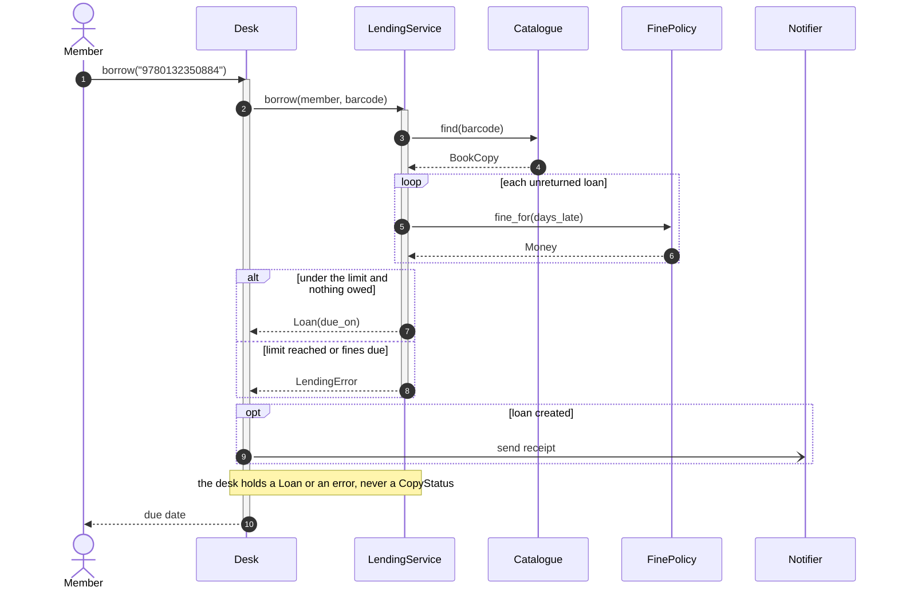
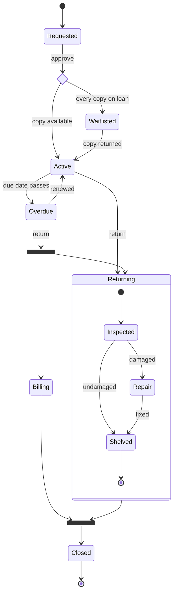
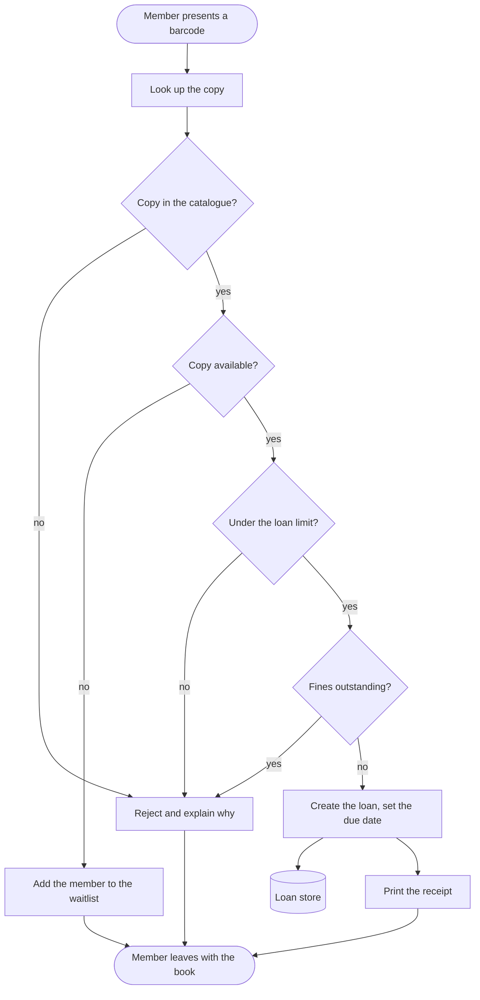
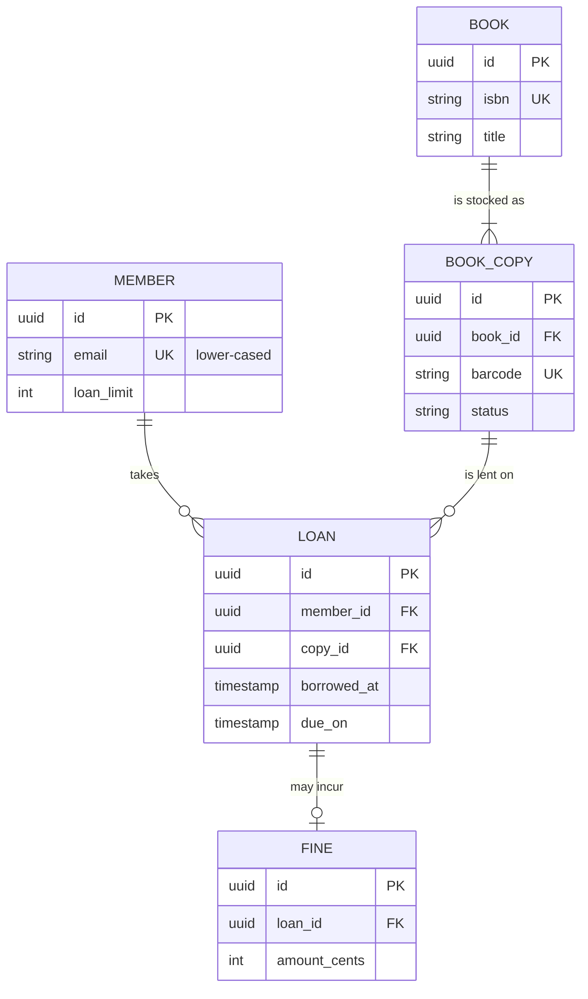

# UML with Mermaid

## TL;DR

- Five diagram types cover every design round: **class** (structure), **sequence** (order of calls), **stateDiagram-v2** (one entity's lifecycle), **flowchart** (decisions and request paths), **erDiagram** (persisted data).
- Draw structure first, then one flow, then a lifecycle only if an entity has three or more states.
- A diagram is a claim, not decoration: every arrow you draw, you must be able to defend.
- Mermaid fails loudly on small syntax mistakes. The list at the end of this page is the one worth memorising.

## Concepts

Every example below models the same small system - a library that lends copies of books to members - so you can see one design from five angles. All five render with the handbook's own validator.

### Choosing the diagram: five types, five questions

| Question the interviewer is asking | Diagram | The one thing it must show |
|---|---|---|
| What are the objects and how do they relate? | `classDiagram` | Names, key methods, multiplicity |
| What happens when a user does X? | `sequenceDiagram` | Order of calls and who returns what |
| What can happen to a *Loan*, and in what order? | `stateDiagram-v2` | Every legal transition, and the illegal ones by omission |
| How is this decision made? | `flowchart TD` | Branches and their outcomes |
| What is stored, and keyed by what? | `erDiagram` | Tables, keys, cardinality |

In a 45-minute round you draw two: a class diagram and one sequence diagram. Add a state diagram when an entity has three or more statuses - exactly when the interviewer asks "what if it is already paid?".

### Class diagrams: structure and the six relationships

The class diagram is the deliverable. Four things make it readable: visibility markers, member types written the Mermaid way, annotations, and multiplicities on the relationships.

**Structure of the lending domain: what exists, what owns what, and how many.**



**Visibility** is the first character of a member: `+` public, `-` private, `#` protected, `~` package. Python has no access modifiers, so map the convention you already use: a leading underscore is `-`, everything else is `+`. **Classifiers** go after the parentheses: `+loan_period_days()* int` is abstract, `+default_policy()$ FinePolicy` is static. **Annotations** sit on their own line inside the braces: `<<interface>>`, `<<abstract>>`, `<<enumeration>>`. **Generics** use tildes: `Catalogue~T~`, `Dict~str,T~`, `List~Loan~`.

The six relationships, strongest coupling first:

| Notation | Relationship | Read it as | In Python |
|---|---|---|---|
| `A <|-- B` | Inheritance | B is an A | `class B(A)` |
| `A *-- B` | Composition | A owns B; B dies with A | B created inside A, never shared |
| `A o-- B` | Aggregation | A holds B; B outlives A | B passed into A's constructor |
| `A --> B` | Association | A keeps a reference to B | An attribute |
| `A ..> B` | Dependency | A mentions B in a signature or body | A parameter or local |
| `A <|.. B` | Realisation | B implements A | `Protocol` or `ABC` |

Composition versus aggregation is the distinction interviewers probe. A `Book` composes its `BookCopy` objects - destroy the catalogue entry and the copies are meaningless. `LendingService` aggregates a `FinePolicy` - the policy is injected, shared, and outlives any one service. **Multiplicities** are quoted strings on either end: `Member "1" --> "0..5" Loan` says a member holds at most five loans, and that single annotation answers a requirement question before it is asked.

### Sequence diagrams: the order of calls

A sequence diagram answers "walk me through borrowing a book". Participants are single tokens with aliases so the label can contain spaces; `->>` is a synchronous call, `-->>` a return, `-)` an asynchronous send that expects no reply.

**Borrowing a copy: the desk asks the service, the service prices any fines, and the answer is a loan or an error.**



`autonumber` on the first line numbers the messages, which lets you say "step 6 is where the lock is taken". `activate`/`deactivate` draw the lifeline bars that show how long a call occupies its participant; they must balance, and the shorthand `->>+` / `-->>-` does the same job in less typing. Four block types carry the logic: `alt/else/end` for mutually exclusive branches, `opt/end` for a branch that may not happen, `loop/end` for repetition, and `par/and/end` for work that happens concurrently:

```text
par notify the member
    L-)N: email
and update the shelf display
    L-)B: refresh
end
```

Keep it to eight participants. When a flow needs more, you are drawing two flows.

### State diagrams: one entity's lifecycle

Use `stateDiagram-v2` when an entity has three or more statuses and the interesting question is which transitions are legal. Transitions carry the event, not the outcome: `Active --> Overdue : due date passes`.

**The lifecycle of a loan: a choice on availability, a fork when an overdue return also has to be billed, and a composite state for the return desk.**



Three constructs earn their place here. A `<<choice>>` is one decision with several guarded outcomes - cleaner than three arrows out of the same state. A `<<fork>>` splits into branches that run independently and a `<<join>>` waits for all of them, which is how you draw "inspect the book *and* raise the fine". A **composite state** (`state Returning { ... }`) hides a sub-machine so the top level stays readable; each nested machine gets its own `[*]` start and end.

What the diagram says by omission matters as much as what it draws: there is no arrow from `Closed` back to `Active`, so reopening a closed loan is not a state change, it is a new loan. Say that out loud.

### Activity diagrams as `flowchart TD`

Classic UML activity diagrams have no Mermaid equivalent, so the handbook draws them as `flowchart TD`: rounded nodes for start and end, rectangles for actions, diamonds for decisions, cylinders for stores.

**The borrow decision as an activity: four checks, three ways to say no.**



The same syntax draws the architecture diagrams in the HLD half of the handbook; only the node vocabulary changes - `db[("Postgres")]` for a store, `q[["Kafka"]]` for a queue, `subgraph name["Cache tier"] ... end` for a boundary.

### Entity-relationship diagrams

An `erDiagram` is the persisted view: what has a table, what has a key, and how many of each. Cardinality is read left to right - `||` exactly one, `o|` zero or one, `}o` zero or many, `}|` one or many.

**What the lending system stores, and the keys that join it.**



The relationship label after the colon is **mandatory** - omit it and the diagram fails to parse. Entity names are `UPPER_SNAKE`, attribute lines are `type name KEY "comment"`, and types must be single tokens: `uuid`, `string`, `int`, `bigint`, `timestamp`, `decimal`, `json`.

### The handbook's conventions

- Only the five types above, and always `flowchart`, never `graph`.
- One diagram per fence, a **bold caption sentence** on the line immediately above it, blank lines either side.
- Soft limit 25 nodes, hard limit 30. Past that, split the diagram - two readable pictures always beat one dense one.
- Never `%%{init ...}%%`, `style`, `classDef`, `linkStyle` or `click`: they hard-code colours that vanish in the dark theme. `%%` comments only on their own line.
- ASCII identifiers, no tabs, no unicode arrows, and no `"` inside a quoted label - rephrase instead.
- Class names in a diagram must be identical to the class names in the code the page embeds.
- Validate before you commit: `node scripts/validate_mermaid.mjs --files docs/lld/fundamentals/uml-with-mermaid.md`.

### Syntax that silently breaks the render

```text
classDiagram  +park(v: Vehicle) Optional[Ticket]   ->  +park(v: Vehicle) Ticket
classDiagram  -spots: List[Spot]                   ->  -spots: List~Spot~
flowchart     A --> end                            ->  A --> act_end
flowchart     api[API Gateway (L7)]                ->  api["API Gateway (L7)"]
sequence      participant Load Balancer            ->  participant LB as Load Balancer
sequence      A->>B: charge; then commit           ->  A->>B: charge, then commit
erDiagram     USER ||--o{ ORDER                    ->  USER ||--o{ ORDER : places
state         Waiting for payment --> Paid         ->  state "Waiting for payment" as WaitPay
```

Square brackets, angle brackets and pipes inside a class member are the most common failure: Mermaid reads them as shape syntax. Write `List~Spot~` and `Dict~str,int~`, and drop `Optional` entirely. In flowcharts, `end` is reserved and an unquoted label containing brackets or parentheses ends the node early. In sequence diagrams a participant id must be one token, so give it an alias.

## Applying it in the interview

Diagrams are how you take control of an LLD round. After the clarifying questions, say "let me put the entities on the board" and draw the class diagram from the nouns - that single move converts a vague prompt into a shared artefact you both point at for the next thirty minutes. Draw it in the order of [the LLD interview framework](../fundamentals/lld-interview-framework.md): classes and multiplicity first, then hang the interfaces off it, then one sequence diagram for the flow with the hardest concurrency.

On a whiteboard you draw the same shapes by hand; in a shared editor you type the Mermaid. The discipline is identical: caption every diagram with the claim it makes, keep it under about twenty boxes, and leave arrows you cannot defend off the board. When the interviewer asks for a change, edit the diagram rather than describing the edit - re-drawing a multiplicity from `1..*` to `0..*` is the evidence they want. [Design a parking lot](../problems/parking-lot.md) shows the finished set for one problem; [The 45-minute HLD framework](../../hld/fundamentals/interview-framework.md) scales the same flowchart vocabulary to architecture.

!!! tip "Interview tip"
    Caption every diagram with a sentence that makes a claim: "the floor owns the lock, so two gates on different floors never contend". A picture with a claim invites the interviewer to argue with your design, which is the conversation you want; a picture without one invites them to ask what it is for.

## Pitfalls

- **Drawing everything.** Twenty-five boxes is the readable limit and the graders' patience runs out sooner. Show the classes that carry behaviour and leave the DTOs out.
- **A class diagram that disagrees with the code.** If the diagram says `PricingStrategy` and the code says `PriceCalc`, the reviewer trusts neither. Rename one.
- **Every arrow drawn as an association.** If half your relationships are plain `-->`, you have not decided what owns what. Pick composition, aggregation or dependency deliberately.
- **Sequence diagrams with ten participants.** That is two flows drawn on top of each other. Split by use case.
- **State diagrams that only show the happy path.** The value is in the transitions you refuse: no arrow from `Closed` to `Active` is a design decision, and interviewers grade it.
- **Colour and styling.** `classDef` and `style` look good in one theme and unreadable in the other; the linter rejects both.

!!! warning "Common mistake"
    Writing Python type syntax inside a class diagram. `+park(vehicle: Vehicle) Optional[Ticket]` and `-spots: List[Spot]` both fail to render, and the failure is a red box where your design should be. Mermaid uses tildes for generics: `List~Spot~`, `Dict~str,int~`. Run the validator before you publish; it catches this in under a second and it is the single most common reason a diagram silently disappears.

## Exercises

1. **Convert this sentence to a class diagram fragment**: "a lot has many floors; each floor has many spots; a ticket refers to exactly one spot; a spot may hold one vehicle."

    ??? example "Solution"
        `ParkingLot "1" *-- "many" ParkingFloor`, `ParkingFloor "1" *-- "many" ParkingSpot`, `Ticket --> "1" ParkingSpot`, `ParkingSpot --> "0..1" Vehicle`. Composition for the first two because a floor cannot exist without its lot, and `0..1` on the last because an empty spot is the normal case - a multiplicity that documents a requirement the prose glossed over.

2. **Which diagram would you draw to answer "what happens when two exit gates scan the same ticket?"**

    ??? example "Solution"
        A sequence diagram, because the question is about ordering and interleaving. Put both gates on it as separate participants, use `alt` for the winner and loser branches, and mark with a note where the lock is held. A state diagram for the ticket is the useful companion - it shows that `PAYING` exists precisely so that only one gate can leave `ACTIVE`.

3. **Fix this fence**: `flowchart LR` with `cache[Redis (LRU, 10 GB)] --> end`.

    ??? example "Solution"
        Two errors. The label contains parentheses and commas, so it must be quoted: `cache["Redis (LRU, 10 GB)"]`. And `end` is a reserved word in flowcharts, so the target needs a real id: `svc_done["Return the response"]`. The result is `cache["Redis (LRU, 10 GB)"] --> svc_done["Return the response"]`.

4. **When is a state diagram the wrong choice?**

    ??? example "Solution"
        When the entity has two states, when the "states" are really attributes that vary independently (a flag set is not a state machine), or when the complexity is *who* calls *whom* rather than what an object may become next. Two states are a boolean and a guard clause.

## Related

- [The LLD interview framework](lld-interview-framework.md) - where each diagram lands in the 45 minutes
- [Design a parking lot](../problems/parking-lot.md) - the full diagram set for one problem
- [The 45-minute HLD framework](../../hld/fundamentals/interview-framework.md) - the same flowchart vocabulary at architecture scale
- [Object-oriented Python for interviews](oop-in-python.md) - the Python constructs the class diagrams describe
- [Mermaid documentation: class diagrams](https://mermaid.js.org/syntax/classDiagram.html)
- [Mermaid documentation: sequence diagrams](https://mermaid.js.org/syntax/sequenceDiagram.html)
- [Mermaid documentation: state diagrams](https://mermaid.js.org/syntax/stateDiagram.html)
