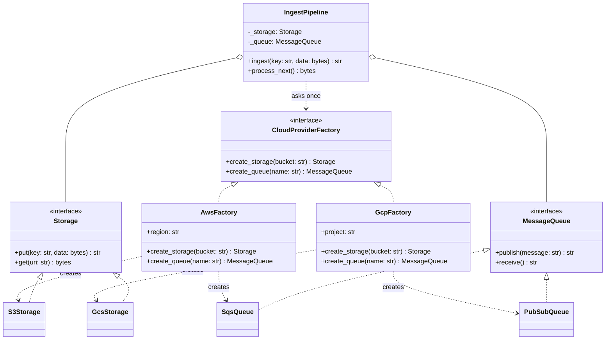

# Abstract Factory

## Intent

Provide one object that creates every member of a family of related products, so the code that uses them gets a consistent set without naming a concrete class. The guarantee is about *matching*, not about hiding constructors: a pipeline that got its bucket from one provider has no way to get its queue from another.

## When to use and when not to

**Use it when**

- Two or more products must agree with each other: a database driver's connection and cursor, a payment provider's processor and webhook parser, a cloud's storage and queue, a widget toolkit's button and entry.
- The family is chosen once, from configuration or environment, and used everywhere; switching families must touch one line.
- Tests need a whole fake family at once: every in-memory repository plus the in-memory unit of work that knows how to commit them.

**Leave it out when**

- There is one product. One key, one class is Factory Method; an abstract factory with one method is that pattern in a heavier coat.
- Products change more often than families. Every new product adds a method to the interface and to every concrete factory; the pattern is built for adding families, not members.
- The families never switch at runtime. A module per family and one `import` line is the same guarantee with no classes.

## Structure

**One abstract factory, one method per product; each concrete factory returns products from a single family; the client asks once and holds only the products.**



Read it by rows: the top row is the family chooser, the middle row the two product interfaces, the bottom row the concrete products. `IngestPipeline` touches the factory in `__init__` only; afterwards it holds a `Storage` and a `MessageQueue` that came from the same row.

## Canonical example in Python

The two product interfaces and their in-memory stand-ins come first (`code/patterns/abstract_factory.py`, tested by `code/patterns/tests/test_abstract_factory.py`):

```python title="code/patterns/abstract_factory.py — the product interfaces and four products"
--8<-- "code/patterns/abstract_factory.py:products"
```

The stand-ins differ only in URI scheme and message-id format. That is deliberate: it is exactly enough for a consumer from the wrong family to break, which is the bug the pattern exists to prevent. The factories and the client:

```python title="code/patterns/abstract_factory.py — the abstract factory, two families and the client"
--8<-- "code/patterns/abstract_factory.py:factory"
```

Four decisions to say out loud:

- **The factory is the family boundary.** `IngestPipeline` asks one factory for both products in `__init__` and never keeps the factory. There is no constructor parameter through which a second family could arrive, so "can the pipeline mix providers?" has a structural answer: no.
- **Configuration lives in the concrete factory.** `AwsFactory(region=...)` and `GcpFactory(project=...)` are frozen dataclasses; the bucket and topic names they derive are a family-level decision the client should not know about.
- **The family is chosen once, by a Factory Method.** `factory_for("aws")` runs at the composition root and returns the Protocol type; the rest of the program never sees `AwsFactory`. Abstract Factory is usually *implemented with* factory methods, which is why the two get confused.
- **The mismatch is loud.** `GcsStorage.get` rejects an `s3://` URI with `ValidationError`, so if someone wires products by hand the failure names the two families instead of returning empty bytes.

Running `python -m patterns.abstract_factory` prints:

```text
--- aws: one factory, two products that match ---
published sqs-1
consumed 27 bytes through S3Storage and SqsQueue
--- gcp: one factory, two products that match ---
published pubsub-1
consumed 27 bytes through GcsStorage and PubSubQueue
--- the bug the pattern prevents: an AWS URI handed to a GCP consumer ---
rejected: 's3://uploads-us-east-1/invoices/2026-08.pdf' is not an object of 'gs://handbook-uploads/'
--- Pythonic: a frozen dataclass of callables is the same family as data ---
kit satisfies CloudProviderFactory: True
published sqs-1 via probe.eu-west-1
rejected: unknown provider 'azure'
```

## Pythonic variant

A family is a fixed set of constructors, and Python can hold constructors in fields. Name the fields after the Protocol's methods and the dataclass *is* a concrete factory:

```python title="code/patterns/abstract_factory.py — a family as data"
--8<-- "code/patterns/abstract_factory.py:pythonic"
```

- **Structural typing does the work.** `ProviderKit` has attributes called `create_storage` and `create_queue`, so `isinstance(kit, CloudProviderFactory)` is true and `IngestPipeline(kit)` runs unchanged.
- **A new family is a function.** `aws_kit(region)` closes over the region the way `AwsFactory` stored it; a test family is two lambdas built inside the test.
- **The trade.** A kit cannot carry behaviour shared by the family (a retry policy, a credentials refresh) without growing back into a class; when the methods need each other, write the class.

The second form is the standard library's: a **module as the factory**. A module is a namespace of callables, so one module per provider plus `importlib.import_module` is an abstract factory with no classes:

```python
import importlib

provider = importlib.import_module(f"cloud.{settings.provider}")  # cloud/aws.py, cloud/gcp.py
pipeline = IngestPipeline(provider)  # the module has create_storage and create_queue
```

| Reach for | When |
|---|---|
| A module per family and one import | The family is fixed per deployment and never switches at runtime |
| A dataclass of callables | Several families, no shared behaviour, test families built inline |
| Concrete factory classes | Families carry configuration and behaviour; you want a readable `repr` and equality |
| Factory Method alone | There is one product |

## Real-world usage

- **DB-API modules (PEP 249)**: every driver module exposes `connect()`, whose `Connection` creates matching `Cursor`s and raises the module's own exception family; swapping the import swaps the whole family.
- **SQLAlchemy dialects**: one `Dialect` object per database supplies a statement compiler, a DDL compiler and a type compiler that agree with each other, selected from the URL scheme.
- **`multiprocessing.get_context("spawn")`** returns a context whose `Process`, `Queue`, `Lock` and `Pool` match the start method; mixing two contexts is the same bug as mixing clouds.
- **`tkinter` and `tkinter.ttk`**: `Button`, `Label` and `Entry` exist in both; which module you build widgets from decides the family's look.

## Related patterns and confusions

| Looks like Abstract Factory | How to tell them apart |
|---|---|
| **Factory Method** | One product chosen by key versus a family that must match. Abstract Factory is usually several factory methods on one object, and the concrete factory is itself picked by one. |
| **Builder** | Builder assembles one complex object step by step; Abstract Factory returns several simple objects at once, each complete. |
| **Strategy** | A concrete factory is injected exactly like a strategy, but it is chosen once at start-up and creates objects rather than performing the algorithm. |
| **Dependency Injection** | Injection hands the client the products; an abstract factory hands it a maker of products. Inject directly when the client needs one of each; use the factory when it creates many over its lifetime. |
| **Bridge** | Both keep an abstraction away from an implementation. Bridge is about one abstraction delegating to one implementor at runtime; Abstract Factory is about creating a consistent set. |
| **Prototype** | A family can be a set of configured prototypes that the factory clones, which is how toolkits avoid one subclass per theme. |

## Where it appears in LLD problems

- [Design a payment gateway and digital wallet](../problems/payment-gateway-wallet.md) — a provider family: the `PaymentProcessor` adapter, the webhook parser and the refund client must agree on ids and signatures; pairing one provider's processor with another's parser is this page's mismatch.
- [Design Uber (LLD) with driver matching](../problems/ride-sharing-lld.md) — a ride-type family: for "XL" the vehicle requirements, the fare calculator and the matching rule come as a set, chosen once per request type.
- The in-memory fakes in [Unit of Work](unit-of-work.md) are a family too: repositories and the unit of work that commits them must be built together.

## Interview tips

!!! tip "Interview tip"
    Say "family" and "must match" before you say "factory": "storage and queue have to come from the same provider, so one `CloudProviderFactory` creates both, chosen once from config; adding a provider is a new factory class and the pipeline does not change." Then offer the Python shortcut: a module per provider, or a frozen dataclass of constructors, satisfies the same Protocol.

!!! warning "Common mistake"
    Passing the products into the client separately "for flexibility". `IngestPipeline(storage, queue)` makes the family guarantee disappear at the one place it mattered, and the mismatch resurfaces as empty reads in production. Runner-up: an abstract factory for one product, or one whose product list keeps growing, which means families were the wrong axis and a Factory Method per product would have been lighter.

## Related

- [Factory Method](factory-method.md) — one product chosen by key, and how a concrete factory gets chosen
- [Builder](builder.md) — one complex object assembled in steps
- [Dependency Injection](dependency-injection.md) — when to inject the products instead of their maker
- [Design a payment gateway and digital wallet](../problems/payment-gateway-wallet.md) — provider families behind one interface
- [Design Uber (LLD) with driver matching](../problems/ride-sharing-lld.md) — ride-type families
- Gamma, Helm, Johnson and Vlissides, *Design Patterns* (1994), Abstract Factory
- [PEP 249 — Python Database API Specification v2.0](https://peps.python.org/pep-0249/)
- [Python documentation: `multiprocessing` — contexts and start methods](https://docs.python.org/3/library/multiprocessing.html#contexts-and-start-methods)
