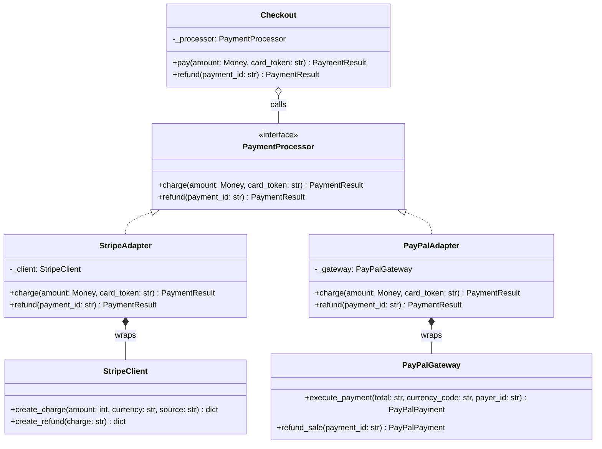

# Adapter

## Intent

Convert the interface of a class you do not control into the interface your code expects, so the two can work together without either one changing. The client keeps talking to one stable Target written in its own vocabulary; the adapter does the translation of names, units, result shapes and errors, and adds nothing else.

## When to use and when not to

**Use it when**

- A vendor SDK, legacy module or third-party library has the behaviour you need but the wrong shape: `create_charge(amount_cents, currency, source)` where your domain says `charge(Money, token)`.
- You expect a second implementation (a second payment provider, a second SMS carrier) and want the switch to be a constructor argument, not a rewrite.
- You want the vendor's types, exceptions and quirks confined to one file that the rest of the codebase never imports.
- Tests need a fake: once the client depends on your Target, a fake is a ten-line class, not a mocked SDK.

**Leave it out when**

- The object already has the right shape. Python checks structure, not ancestry, so an object with the right method names and signatures *is* a `PaymentProcessor`; wrapping it adds a layer that does nothing.
- You are about to add retries, logging or caching "while you are in there". That is a Decorator with the same interface; an adapter that also changes behaviour is two patterns in one class and cannot be tested as either.
- You control both sides. Change the interface instead of bridging it.

## Structure

**Four roles: the Target interface the client owns, the Adaptees you cannot change, and one Adapter per adaptee that implements the Target by delegating.**



The arrows tell the story: `Checkout` knows only `PaymentProcessor`; each adapter *realises* the Target and *owns* one adaptee. Nothing points from the vendor side back into the domain. This is the object adapter (composition); the class adapter (inheriting from the adaptee) is discussed below.

## Canonical example in Python

The Target comes first, and it is written in the domain's vocabulary before any vendor is looked at (`code/patterns/adapter.py`, tested by `code/patterns/tests/test_adapter.py`):

```python title="code/patterns/adapter.py — the Target, owned by the client"
--8<-- "code/patterns/adapter.py:target"
```

The two adaptees stand in for SDKs you cannot edit. Read them for the four ways they disagree: method names, amount encoding (integer cents versus a decimal string), result shape (dict versus object) and failure reporting (an exception versus a status field):

```python title="code/patterns/adapter.py — two vendor SDKs you do not own"
--8<-- "code/patterns/adapter.py:adaptees"
```

Each adapter translates in both directions and nothing more:

```python title="code/patterns/adapter.py — one adapter per vendor"
--8<-- "code/patterns/adapter.py:adapters"
```

Three decisions to say out loud:

- **The Target is yours, not the first vendor's.** `Money` in, `PaymentResult` out, one `PaymentDeclinedError`. If you had mirrored Stripe's API and called it the interface, PayPal would not have fitted and the "adapter" would leak cents and lower-case currency codes everywhere.
- **Errors are translated too.** `raise PaymentDeclinedError(...) from exc` keeps the vendor exception chained for the logs while the client catches one type. PayPal never raises; the adapter inspects `state` and raises on the client's behalf. Translation of failure modes is the part candidates forget.
- **No behaviour.** No retries, no logging, no caching. Each adapter is a pure function of its input plus one vendor call, which is what makes it trivial to test against a recording stub.

The client is deliberately unaware:

```python title="code/patterns/adapter.py — the client"
--8<-- "code/patterns/adapter.py:client"
```

It validates domain rules (positive amounts, refund only what it charged) and delegates. Swap the processor and nothing in `Checkout` or its tests changes. Running `python -m patterns.adapter` prints:

```text
--- one Checkout, two vendors, one vocabulary ---
stripe: charged 12.34 USD -> ch_1 (captured)
paypal: charged 12.34 USD -> PAY-1 (captured)
--- refunds travel through the same adapter ---
stripe: refunded 12.34 USD for ch_1 (refunded)
paypal: refunded 12.34 USD for PAY-1 (refunded)
--- every vendor failure arrives as one domain error ---
declined: stripe: card_declined
declined: paypal: payment denied
--- callable targets: a closure adapter and a bound method, side by side ---
terminal: 5.00 USD -> AUTH1000
  stripe: 5.00 USD -> ch_1
rejected before any vendor call: amount must be positive
```

## Pythonic variant

Python removes two reasons the pattern exists in Java. There is no `implements` to satisfy, so an object with the right shape needs no wrapper, and a single-method Target is just a `Callable`, so the adapter can be a closure:

```python title="code/patterns/adapter.py — a closure adapts a one-call vendor"
--8<-- "code/patterns/adapter.py:pythonic"
```

`terminal_charge` also shows interface segregation in action: the terminal cannot refund, so it is adapted to `ChargeFn` rather than forced to fake the full Protocol. A bound method such as `StripeAdapter(client).charge` satisfies the same `ChargeFn`, so the two forms mix freely.

The class adapter uses inheritance instead of composition. It works in Python, and it is almost always the wrong choice:

```python
class StripeClassAdapter(StripeClient):
    """Inherits the vendor's whole API and constructor; clients can now call create_charge directly."""

    def charge(self, amount: Money, card_token: str) -> PaymentResult:
        raw = self.create_charge(amount.cents, amount.currency.lower(), card_token)
        return PaymentResult(str(raw["id"]), amount, PaymentStatus.CAPTURED, "stripe")
```

Every vendor method is now part of your public surface, and you cannot adapt an instance the SDK hands you. Prefer composition. Resist `__getattr__` pass-through for the same reason: it turns a narrow adapter into a leaky one.

| Reach for | When |
|---|---|
| Nothing | The object already has the Target's method names and signatures |
| A closure or `functools.partial` | The Target is one callable and the translation has no state |
| A class with the Target's methods | Several methods, shared translation state, or you want a name in logs and diagrams |
| A `Protocol` declared by the client | Always: it is the contract the adapters and the test fakes are checked against |

One gotcha worth stating: `isinstance(x, PaymentProcessor)` on a `@runtime_checkable` Protocol checks that the method *names* exist, not their signatures. A type checker catches the rest; the runtime check does not.

## Real-world usage

- **`io.TextIOWrapper`** adapts a binary stream (`BufferedReader`, `BytesIO`, a socket file) to the text interface: `read()` returns `str`, encodings and newlines are translated. **`socket.makefile()`** and **`os.fdopen()`** do the same for sockets and raw descriptors.
- **`functools.cmp_to_key`** adapts an old-style comparison function to the `key=` interface that `sorted`, `min` and `heapq` expect.
- **`contextlib.closing`** adapts anything with a `close()` method to the context-manager protocol; **`asyncio.to_thread`** adapts a blocking callable to an awaitable.
- **`sqlite3.register_adapter`** adapts your Python types to SQLite's storage classes, and DB-API 2.0 drivers are adapters from each database's wire protocol to one cursor interface.
- **`logging.LoggerAdapter`** carries the name but behaves like a Decorator: it presents the same logging API and injects extra context. Names lie; ask whether the interface changes.
- **Frameworks**: `requests` mounts transport adapters (`HTTPAdapter`) per URL prefix; SQLAlchemy dialects and Django database backends adapt engines to one query API.

## Related patterns and confusions

The structural patterns all "wrap something", so classify by two questions: does the interface change, and what is the wrapper for?

| Looks like Adapter | How to tell them apart |
|---|---|
| **Decorator** | Same interface in and out, adds behaviour, stacks. Adapter changes the interface and adds no behaviour. `RetryingProcessor(StripeAdapter(client))` is the right layering: adapt first, then decorate. |
| **Proxy** | Same interface, controls *access* to one object (lazy load, cache, permissions, remote call). If the wrapper decides whether the real call happens, it is a Proxy. |
| **Facade** | A new, simpler interface over a *subsystem* of several objects. An adapter wraps one object one-to-one; a facade is not interchangeable with what it hides. |
| **Bridge** | The same picture of an abstraction holding an implementor, designed *up front* so both sides vary. Adapter is retrofitted after the fact to make unrelated things fit. |
| **Strategy** | Interchangeable algorithms behind one interface. The adapters here *are* interchangeable, but the intent differs: you wrote the strategies; you adapted the vendors. |
| **Anti-corruption layer** | The DDD name for a boundary made of adapters plus translation of the whole model, not one interface. |

## Where it appears in LLD problems

- [Design a payment gateway and digital wallet](../problems/payment-gateway-wallet.md) — `PaymentProcessor` over several providers; the adapters absorb provider-specific ids, units and failure codes.
- [Design a notification service (LLD)](../problems/notification-service.md) — the `ChannelSender` Protocol is exactly the seam an adapter goes in: the package ships stubs behind it, and a real SMS or push vendor whose SDK disagrees about addresses and receipts is wrapped there without the dispatcher noticing.
- [Design a food delivery system (Swiggy, Zomato, DoorDash)](../problems/food-delivery.md) — distance and ETA behind one interface, so a straight-line estimate and a maps provider are interchangeable; payments behind the same processor interface as above.

## Interview tips

!!! tip "Interview tip"
    Write the Target first, in your vocabulary, and say why: "the interface is `charge(Money, token) -> PaymentResult`; Stripe and PayPal each get an adapter that translates names, units, results and errors." Then name the test: a recording stub asserting the adapter sent `1234, "usd"`, and a ten-line fake processor for every `Checkout` test. Finish with the Python note that a closure or duck typing would do for a one-method Target.

!!! warning "Common mistake"
    Letting the vendor leak. Returning the SDK's dict, re-raising its exception, or shaping the Target around the first vendor's API all mean the second vendor will not fit and every caller has to know which one is live. Runner-up: adding retries or logging inside the adapter. Keep it a pure translation and put behaviour in a Decorator around it.

## Related

- [Facade](facade.md) — a simpler interface over many objects rather than a matching one over one
- [Bridge](bridge.md) — the same shape designed in advance so both hierarchies vary
- [Decorator](decorator.md) — same interface, extra behaviour, stackable around an adapter
- [Proxy](proxy.md) — same interface, controlled access
- [Design a payment gateway and digital wallet](../problems/payment-gateway-wallet.md) — adapters over payment providers in a full problem
- [Design a notification service (LLD)](../problems/notification-service.md) — adapters over messaging vendors
- Gamma, Helm, Johnson and Vlissides, *Design Patterns* (1994), Adapter
- [PEP 544 — Protocols: Structural subtyping](https://peps.python.org/pep-0544/)
- [Python documentation: `io` — Core tools for working with streams](https://docs.python.org/3/library/io.html)
