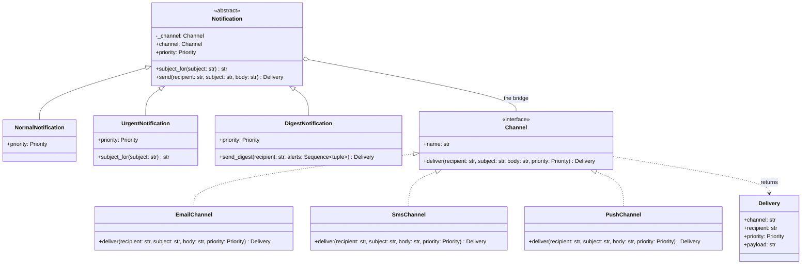

# Bridge

## Intent

Separate an abstraction (what the client asks for) from its implementation (how the work is carried out) so that each side forms its own hierarchy and the two meet through one reference. You add a kind of notification without touching any channel, and a channel without touching any notification: the class count grows as a sum, not a product.

## When to use and when not to

**Use it when**

- Two independent axes of variation would otherwise multiply: notification kind x delivery channel, shape x renderer, log handler x formatter. Three kinds and three channels are nine subclasses by inheritance and six classes with a Bridge; five and five are 25 against 10.
- The implementation must be switched at deployment or at runtime: a recording channel in tests, SMS after hours, a vendor swap without a release of the abstraction side.
- One side is platform- or vendor-specific and you want the other side portable and unit-testable without the platform.
- You are designing both sides now. Bridge is a plan; Adapter is a repair.

**Leave it out when**

- Only one axis varies. An abstraction with one refinement holding a swappable implementor is Strategy; do not promote it until the second axis arrives.
- You do not own one side. Fitting an existing interface you cannot change is Adapter.
- The abstraction side has no behaviour of its own. If every refinement is "the same call with different constants", collapse the refinements into fields on one class and inject the implementor (the Pythonic variant below).

## Structure

**Two hierarchies joined by one arrow: the Abstraction and its refinements on the left, the Implementor and its concrete channels on the right.**



The aggregation arrow is the pattern. Everything left of it is about *what* is said; everything right of it is about *how* it travels. Note that the two interfaces differ: `send` takes a subject and a body, `deliver` also takes a priority that the abstraction computes.

## Canonical example in Python

The implementor side comes first, because its interface is the contract the whole design hangs on (`code/patterns/bridge.py`, tested by `code/patterns/tests/test_bridge.py`):

```python title="code/patterns/bridge.py — the Implementor and three concrete channels"
--8<-- "code/patterns/bridge.py:implementor"
```

Read the three channels for how differently they treat the same four arguments: e-mail has a subject line and a priority header, SMS has neither and truncates at 160 characters, push wants JSON with a boolean flag. None of them knows whether the message was urgent or a digest; they receive a priority and render it in their own vocabulary.

The abstraction side owns the meaning:

```python title="code/patterns/bridge.py — the Abstraction and its refinements"
--8<-- "code/patterns/bridge.py:abstraction"
```

Four decisions to say out loud:

- **The interfaces are not the same.** `Notification.send` is higher-level than `Channel.deliver`; the abstraction decorates the subject and supplies the priority before the call crosses the bridge. If both sides had identical signatures you would be looking at a Decorator or a Proxy, not a Bridge.
- **`Protocol` on the implementor, `ABC` on the abstraction.** Channels are vendor-shaped and a test writes a `RecordingChannel` with no base class; refinements share real code (`send`, the `channel` property, the `subject_for` hook), which is what an abstract base class is for.
- **The implementor is swappable while the object lives.** `urgent.channel = SmsChannel()` moves an on-call alert from e-mail to SMS after hours. The channels hold no mutable state, so no lock is involved.
- **Each side keeps its own rules.** SMS truncation lives in `SmsChannel`, the empty-digest check lives in `DigestNotification`. Neither validation leaks across the bridge.

Running `python -m patterns.bridge` prints:

```text
--- 2 abstractions x 2 implementors: 4 behaviours from 4 classes ---
NormalNotification via email: 'Subject: Disk almost full\nX-Priority: 3\n\ndb-3 at 95%'
NormalNotification via sms: 'Disk almost full: db-3 at 95%'
UrgentNotification via email: 'Subject: [URGENT] Disk almost full\nX-Priority: 1\n\ndb-3 at 95%'
UrgentNotification via sms: '[URGENT] Disk almost full: db-3 at 95%'
--- a third implementor: PushChannel, no change on the abstraction side ---
UrgentNotification via push: {"title": "[URGENT] Disk almost full", "body": "db-3 at 95%", "time_sensitive": true}
--- a third abstraction: DigestNotification, no change on the implementor side ---
DigestNotification via email: 'Subject: Digest: 2 alerts\nX-Priority: 3\n\n- Disk almost full: db-3 at 95%\n- Cert expiring: api.example.com in 3 days'
--- swap the implementor under a live abstraction ---
office hours: email
after hours:  sms
--- each implementor keeps its own contract: SMS truncates at 160 characters ---
payload length 160, starts with '[URGENT] Disk almost full'
--- Pythonic variant: a value object holding a callable implementor ---
Alert via sms: '[URGENT] Disk almost full: db-3 at 95%'
rejected: a digest needs at least one alert
```

## Pythonic variant

`NormalNotification` and `UrgentNotification` differ by two constants. When every refinement is data, the abstraction hierarchy collapses into one frozen dataclass, and a one-method implementor is any callable, including a bound method of the channel classes above:

```python title="code/patterns/bridge.py — the abstraction as a value, the implementor as a callable"
--8<-- "code/patterns/bridge.py:pythonic"
```

`Alert(SmsChannel().deliver, Priority.HIGH, URGENT_MARKER)` produces byte-for-byte the same `Delivery` as `UrgentNotification(SmsChannel())`, and the tests assert exactly that. What you keep is the essence of the pattern, composition with an injected implementor; what you drop is a hierarchy that carried no behaviour.

| Reach for | When |
|---|---|
| One dataclass plus an injected callable | Refinements differ only by configuration; the implementor has one method |
| An `ABC` with hooks plus a `Protocol` implementor | Refinements add methods or logic (`send_digest`), or the implementor has several methods that must stay consistent (`open`, `write`, `close`) |
| Strategy instead | One axis varies; the "abstraction" would have a single refinement |

Say it in the room: "I would start with the dataclass and the callable, and promote the abstraction side to classes when a refinement needs its own method."

## Real-world usage

- **`logging.Handler` x `logging.Formatter`.** The handler hierarchy (`StreamHandler`, `FileHandler`, `SocketHandler`, `QueueHandler`) decides where a record goes; the formatter hierarchy decides how it reads; `handler.setFormatter(...)` is the bridge. With one handler in view the same arrow reads as Strategy, which is why the two patterns share a diagram.
- **`socketserver`.** `TCPServer(("", 8000), MyHandler)`: the server hierarchy (`TCPServer`, `UDPServer`, `ThreadingTCPServer`, `ForkingTCPServer`) varies how connections are accepted and scheduled; the handler hierarchy (`BaseRequestHandler`, `StreamRequestHandler`, `http.server.BaseHTTPRequestHandler`) varies what happens on each connection.
- **`asyncio.SelectorEventLoop(selector=...)`** over the `selectors` hierarchy (`SelectSelector`, `PollSelector`, `EpollSelector`, `KqueueSelector`): one loop abstraction, one implementor per operating system facility.
- **Frameworks**: Django's `FileField` and `ImageField` over pluggable `Storage` backends; SQLAlchemy's `Engine` and `Connection` over `Dialect` implementations; GUI toolkits, the example the pattern was named for, with a `Window` hierarchy over a platform `WindowImp`.

## Related patterns and confusions

| Looks like Bridge | How to tell them apart |
|---|---|
| **Strategy** | The same picture, an object holding a swappable collaborator. Count the hierarchies: one axis of variation is Strategy; two that must vary independently is Bridge. |
| **Adapter** | Both hold an implementor by composition, but Adapter is retrofitted so an existing class fits an interface it was not written for; Bridge is designed up front and both interfaces are yours. |
| **Decorator / Proxy** | The wrapper has the *same* interface as what it wraps. A Bridge's two sides have different interfaces; `send` is not `deliver`. |
| **Abstract Factory** | Often the partner: a factory picks the concrete implementor for a platform so that the abstraction never names one. |
| **Template Method** | `subject_for` is a hook, so the abstraction side here uses Template Method internally. The Bridge is the arrow across to `Channel`, not the hooks within `Notification`. |
| **Dependency Injection** | The mechanism that delivers the implementor into the abstraction. Bridge is the shape; injection is how it is wired. |

## Where it appears in LLD problems

- [Design a notification service (LLD)](../problems/notification-service.md) — the two axes are there (what happened x how it is delivered) but the code resolves them with a `(event, channel)` template lookup rather than two hierarchies. That is the pragmatic answer when one axis is data; Bridge earns its place once a kind needs *behaviour* of its own.
- [Design a logging framework](../problems/logging-framework.md) — loggers and handlers on one side, formatters and sinks on the other; adding JSON output must not touch the file handler.

## Interview tips

!!! tip "Interview tip"
    Lead with the arithmetic: "kinds times channels is nine classes and growing; I will split them into a `Notification` hierarchy that holds a `Channel`, so each new kind or channel is one class." Then draw the one arrow, name the two interfaces and show that they differ, and close with the runtime swap and the test fake that the `Protocol` makes free.

!!! warning "Common mistake"
    Letting one side learn about the other. An `if isinstance(self.channel, SmsChannel)` inside `UrgentNotification`, or a `Channel.deliver` that takes e-mail headers every channel must fake, welds the hierarchies back together and you are paying for the pattern without getting it. Keep the implementor interface to what every channel can honour, and keep channel-specific rules (the 160-character cut) inside the channel.

## Related

- [Adapter](adapter.md) — the retrofitted cousin: same composition, an interface you do not own
- [Strategy](strategy.md) — one axis of variation instead of two
- [Abstract Factory](abstract-factory.md) — choosing the concrete implementor per platform
- [Dependency Injection](dependency-injection.md) — how the implementor reaches the abstraction
- [Design a notification service (LLD)](../problems/notification-service.md) — the two axes resolved by lookup instead
- [Design a logging framework](../problems/logging-framework.md) — handlers x formatters in a full problem
- Gamma, Helm, Johnson and Vlissides, *Design Patterns* (1994), Bridge
- [Python documentation: `logging` — Handler and Formatter objects](https://docs.python.org/3/library/logging.html#handler-objects)
- [Python documentation: `socketserver` — server and request handler classes](https://docs.python.org/3/library/socketserver.html)
