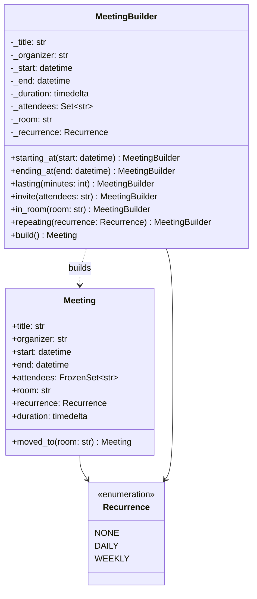

# Builder

## Intent

Separate the assembly of a complex object from the object itself. Parts arrive one step at a time, in any order, from whichever code knows them; `build` turns the collected parts into a complete, validated, immutable product. The builder is the object that is allowed to be half-finished, so the product never has to be.

## When to use and when not to

**Use it when**

- A few required parts, many optional ones that interact: an end time *or* a duration, a recurrence that needs a start. A nine-parameter constructor hides those rules; `build` states them once.
- Parts arrive from different places or at different times: the form knows the title, the availability service knows the slot, the room service knows the room. The builder travels between them unfinished.
- The product should be immutable and never invalid: the builder absorbs the mutation, and the frozen `Meeting` can be shared, hashed and cached without a lock.
- Every validation failure should be reported at once, not one per round trip.

**Leave it out when**

- Every part is known at one call site: keyword-only arguments with defaults are the builder, with a `TypeError` for a missing name.
- The object is mutable anyway and each field validates alone: setters are the builder.
- Three required fields and nothing optional: a builder for `Point(x, y, z)` is ceremony the interviewer will notice.
- What varies is *which class* to build, not which parts: that is Factory Method.

## Structure

**Two classes and a recipe: the builder collects parts and validates at `build`; the product is a frozen value that re-checks the same rules.**



`MeetingBuilder` is the only mutable object in the picture, and the dotted arrow is the whole pattern: `build` is the one place a `Meeting` is assembled from steps. `daily_standup`, the Gang of Four Director, is a function that drives the builder through a fixed recipe, so it has no box.

## Canonical example in Python

The invariants and the product come first (`code/patterns/builder.py`, tested by `code/patterns/tests/test_builder.py`):

```python title="code/patterns/builder.py — the invariants and the product"
--8<-- "code/patterns/builder.py:product"
```

Three decisions to say out loud:

- **The rules live in one function.** `meeting_problems` serves `Meeting.__post_init__` and `MeetingBuilder.build`, so nobody can construct a `Meeting` around the builder. It returns a list instead of raising, which is what lets `build` report every problem in one message.
- **The product is frozen.** Hashable and safe to share across threads; the only way to change one is `moved_to`, which is `dataclasses.replace` under a domain name, validated again.
- **Timezone-aware or rejected.** The value type refuses a naive `datetime` once, so no service has to check.

The builder and a director:

```python title="code/patterns/builder.py — the builder and a director"
--8<-- "code/patterns/builder.py:builder"
```

- **Required in `__init__`, optional in steps.** `MeetingBuilder("Design review", "ana")` cannot exist without a title and an organizer, so `build` never fails over a part the caller had from the start. Steps return `self`, typed `Self`, and do not validate: `lasting(0)` is accepted now and rejected at `build`, because a half-built object is allowed to be wrong.
- **`build` derives, then checks.** The end comes from the duration and the organizer joins the attendees before `meeting_problems` runs, so the errors talk about the product. The last of `ending_at` and `lasting` wins. A builder serves one construction and is discarded, never shared between threads, so it needs no lock.
- **The Director is `daily_standup`.** The Gang of Four made it a class that drives a builder through a fixed sequence; a fixed sequence of calls is a function, and a second recipe is a second function.

Running `python -m patterns.builder` prints:

```text
--- fluent steps, then one validation ---
Design review: 09:00-09:45 in Board room, ['ana', 'ben', 'chen']
--- the builder travels half-built: the slot finder supplies the start later ---
1:1: 11:00-11:30
--- every problem at once, not just the first ---
rejected: title is required; a meeting cannot last more than 8 hours
--- the director: a recipe is a function ---
Daily stand-up: daily, 15 min, 3 attendees
--- Pythonic: keyword-only arguments, then replace() for changes ---
moved from Tue 09:00 to Wed 09:00; original still Tue 09:00
rejected: end must be after start
```

## Pythonic variant

When every part is known at one call site, the signature is the builder:

```python title="code/patterns/builder.py — keyword-only arguments and replace()"
--8<-- "code/patterns/builder.py:pythonic"
```

- **Keyword-only arguments** (the bare `*`) are named steps, defaults are optional steps, and Python raises the `TypeError` for a missing name at the call, not at `build`. The call reads like the chain and costs no class.
- **`dataclasses.replace`** is the builder for a value that already exists: copy, change a field, re-run `__post_init__`. `reschedule` moves the start and keeps the duration; the original is untouched, so a rejected change cannot corrupt a meeting other code holds.
- **`__post_init__` on the product** is the part you keep even when you drop the builder class: validation once, in the type, not in every caller.

| Reach for | When |
|---|---|
| Keyword-only arguments with defaults | All parts known at one call site; the rules fit in `__post_init__` |
| A frozen dataclass plus `replace` | The object exists and you want a changed, re-validated copy |
| A builder class | Parts arrive from several places or over time; cross-field rules; every error reported at once |
| A director function | The same recipe is built in more than one place |

Draw the builder, then say: "in Python I would start with keyword-only arguments and promote to a builder when the parts start arriving from different places."

## Real-world usage

- **`argparse.ArgumentParser`** is configured in steps (`add_argument` in any order, `add_subparsers`, `set_defaults`) and built by `parse_args`, which applies types, choices and required-ness at the end and returns a `Namespace`; missing options are reported together, a bad value one at a time.
- **`xml.etree.ElementTree.TreeBuilder`**: `start`, `data` and `end` assemble a tree and `close` hands back the root; the parser driving it is the Director.
- **String building**: `parts.append(...)` followed by `"".join(parts)`, or `io.StringIO`, is the idiom Java needs `StringBuilder` for.
- **Generative query APIs**: SQLAlchemy's `select(...).where(...).order_by(...)` and Django's `QuerySet.filter(...)` return a new statement from every step and run nothing until execution, which is the `replace` form at scale.

## Related patterns and confusions

| Looks like Builder | How to tell them apart |
|---|---|
| **Factory Method** | One call, one key, whole object: `create("sms")`. Builder is many calls, many parts, checked at the end. A factory may use a builder inside; a builder chooses parts, never classes. |
| **Abstract Factory** | Returns several simple objects that must match; Builder returns one complex object assembled from parts. |
| **Prototype** | Also yields a configured object, by copying a finished one and changing a field. `replace` is where the two meet: Prototype when a good instance exists, Builder when one must be assembled. |
| **Fluent interface** | A style, not a pattern. `select().where()` is fluent and immutable, `Path / "x"` is fluent and not a builder at all. Say "fluent" about the calls and "builder" about the `build`. |
| **Telescoping constructors** | The problem, not a pattern: `Meeting(title, org, start, None, 30, None, None, "daily")`. Keyword arguments cure it, which is why Builder is rarer in Python than in Java. |
| **Template Method** | The Director fixes the order of *construction* steps; Template Method fixes the order of *algorithm* steps. |

## Where it appears in LLD problems

- [Design a meeting scheduler and calendar](../problems/meeting-scheduler.md) — this module's `MeetingBuilder`: title and organizer up front, attendees, slot, room and recurrence from three services, one validation before the calendar accepts it.
- [Design a hotel management system](../problems/hotel-management.md) — a reservation assembled from guest, room type, dates and add-ons; check-out after check-in and guests within capacity are checked once, before inventory is touched.
- [Design a logging framework](../problems/logging-framework.md) — a logger configuration built in steps (level, handlers, formatter, filters) and validated before the first record, the shape `logging.config.dictConfig` exposes as data.
- [Design a notification service (LLD)](../problems/notification-service.md) — a request assembled from template, recipients, channel and priority; there the checks live in pipeline stages rather than in `build`, which is where they go once they must be reordered.

## Interview tips

!!! tip "Interview tip"
    Lead with the invariant, not the pattern: "a meeting needs an end or a duration, the organizer must attend, and those parts come from three services, so a `MeetingBuilder` collects them and `build` validates once and returns a frozen `Meeting`." Then add the Python sentence: keyword-only arguments would do if one call site knew everything, and `replace` handles changes after the fact.

!!! warning "Common mistake"
    Validating in the steps instead of in `build`. A builder that rejects `lasting(0)` on the spot cannot accept an `ending_at` later, and one that checks "organizer must attend" inside `invite` forces callers into a fixed order, which is the problem the pattern removes. Collect, check once, report every failure in one error. Runner-up: a mutable product, which turns `build` into a setter with extra ceremony.

## Related

- [Factory Method](factory-method.md) — one key, one call, when the choice is the class
- [Prototype](prototype.md) — copy a finished object instead of assembling one
- [Design a meeting scheduler and calendar](../problems/meeting-scheduler.md) — the builder in its home problem
- [Design a hotel management system](../problems/hotel-management.md) — reservations validated once
- [Design a logging framework](../problems/logging-framework.md) — logger configuration as a builder
- [Design a notification service (LLD)](../problems/notification-service.md) — notifications validated before dispatch
- Gamma, Helm, Johnson and Vlissides, *Design Patterns* (1994), Builder
- [Python documentation: `argparse`](https://docs.python.org/3/library/argparse.html#argumentparser-objects)
- [Python documentation: `dataclasses.replace`](https://docs.python.org/3/library/dataclasses.html#dataclasses.replace)
