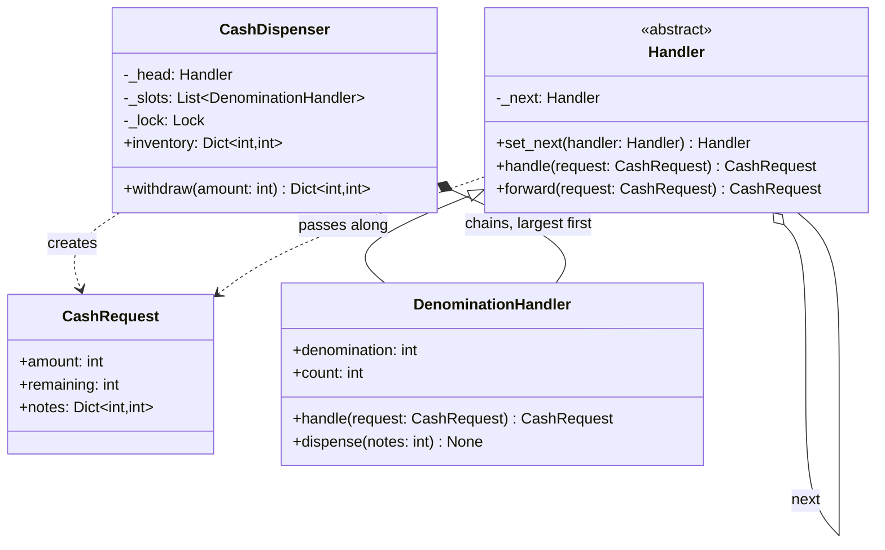

# Chain of Responsibility

## Intent

Decouple the sender of a request from the object that handles it by giving several handlers a chance, in order, until one takes it. The sender knows only the first link; each handler decides whether to act, forward, or both. Adding, removing or reordering handlers never touches the sender.

## When to use and when not to

**Use it when**

- More than one object could handle a request and which one is only known at runtime: the 2000 slot is empty tonight, the fraud rule that fires depends on the payment.
- The set of handlers or their order must be configurable (middleware order in settings, approval limits per role).
- Each handler should own one rule and its own state (one slot, one note count) and be testable alone.

Two shapes exist, and you should name the one you mean:

- **First handler wins** (the pure form): support escalation, exception handling, fraud rules. Exactly one handler answers; the rest never see the request.
- **Each takes its share** (the contributing form): a note dispenser, HTTP middleware, logger propagation. Every link may act *and* forward.

**Leave it out when**

- There is one handler. A chain of one is a function call with ceremony.
- The routing key is known before you ask (`handlers[request.kind]`): dict dispatch is explicit and constant-time; a chain is an implicit linear search.
- The "handlers" are stages that always run and transform the payload. That is a Pipeline, and `functools.reduce` over a list reads better than linked objects.
- A silent drop would be a bug you cannot afford; then the chain needs a terminal handler that rejects loudly (see the common mistake), or it should not be a chain.

## Structure

**Four roles: the abstract Handler with the next link, one concrete handler per note slot, the request that travels, and the client that assembles the chain.**



`CashDispenser` builds the chain once and talks only to the head. `DenominationHandler.handle` plans its contribution and forwards the remainder; nothing inside the chain mutates a slot. `CashRequest` carries the remainder and the plan so far, which is what lets every link contribute without return-value gymnastics.

## Canonical example in Python

The request, the abstract handler and one slot come first (`code/patterns/chain_of_responsibility.py`, tested by `code/patterns/tests/test_chain_of_responsibility.py`):

```python title="code/patterns/chain_of_responsibility.py — the request, the abstract handler and one slot"
--8<-- "code/patterns/chain_of_responsibility.py:chain"
```

Three decisions to say out loud:

- **`handle` is abstract, `forward` is concrete.** Every handler must decide; the base class only knows how to pass a request on. A handler that never calls `forward` ends the chain on purpose, and the reader can see it.
- **Greedy, largest note first, is correct here only because each denomination divides the next** (100 into 500, 500 into 2000). With 2000/500/200 notes it is wrong: for 600 the greedy chain takes a 500 and strands 100, while three 200s would do. The chain decides *who contributes*, not whether the arithmetic is sound. Say that before the interviewer does.
- **Plan, then commit.** `handle` reads `count` and never decrements it. A chain that dispensed as it went would hand out the 2000 note and then discover the 100 slot is short: the customer holds part of the money and the slots disagree with the account.

The client owns the order, the validation and the commit:

```python title="code/patterns/chain_of_responsibility.py — the client"
--8<-- "code/patterns/chain_of_responsibility.py:dispenser"
```

Validation runs once, before the chain: an amount that is not a multiple of the smallest note can never be covered, so no slot should see it. The lock serialises plan-and-commit, because two withdrawals planning against the same slots at once could both see enough notes. A failed plan raises `CannotDispenseError` and touches nothing, which the demo shows by printing the inventory after the failed 4600.

Running `python -m patterns.chain_of_responsibility` prints:

```text
slots (largest first): 2000 x 2, 500 x 5, 100 x 10
withdraw 3700: 2000 x 1, 500 x 3, 100 x 2
  slots now: 2000 x 1, 500 x 2, 100 x 8
withdraw 4600: cannot dispense 4600: short by 800
  slots now: 2000 x 1, 500 x 2, 100 x 8
withdraw 2500: 2000 x 1, 500 x 1
  slots now: 2000 x 0, 500 x 1, 100 x 8
rejected before the chain ran: amount must be a positive multiple of 100
--- pure chain: the first fraud rule with an opinion wins ---
US 80.00 USD x1: approved
US 2500.00 USD x1: 2500.00 USD exceeds 1000.00 USD
KP 40.00 USD x1: country KP is denied
DE 40.00 USD x7: 7 attempts in the last hour
--- generator pipeline: each stage keeps what it handles and hands the rest on ---
20 app.http: GET /orders 200
40 app.db: timeout token=***
```

## Pythonic variant

A handler with one method is a function, and a chain is a list of them. The pure form is a loop that stops at the first opinion:

```python title="code/patterns/chain_of_responsibility.py — the first rule with an opinion wins"
--8<-- "code/patterns/chain_of_responsibility.py:functional"
```

`None` is the "not mine, pass it on" signal and a string is a verdict, so the protocol is the return type. Order is list order: reordering the rules is a list edit, not a rewiring of `set_next` calls, and the test that proves a rule is never consulted after a rejection is four lines. This is the shape of fraud rules in the payment gateway and of approval policies anywhere.

The contributing form becomes a pipeline of generator stages. Each stage keeps, drops or rewrites what flows through and hands the rest on, and nothing runs until someone iterates:

```python title="code/patterns/chain_of_responsibility.py — generator stages"
--8<-- "code/patterns/chain_of_responsibility.py:pipeline"
```

When is the list enough?

| Reach for | When |
|---|---|
| A list of callables and a loop | Handlers are stateless or closures, and the order lives in one place (settings, the composition root) |
| Generator stages | Requests arrive as a stream and a link may drop, rewrite or batch them |
| Linked `Handler` objects | A link owns mutable state (a slot's count), has more than one method (`handle`, `dispense`), or the chain is assembled from configuration by someone else |
| A dict keyed by request type | The routing key is known before you ask; chains are for when it is not |

## Real-world usage

- **Exception handling** is the chain you use every day: an exception climbs the call stack and the first matching `except` handles it; frames above it never see it.
- **`logging` propagation**: a record is offered to its logger's handlers, then to the parent's, up to the root, until a logger with `propagate = False` stops it. Filters attached to handlers decide per link.
- **`sys.meta_path`**: `import` asks each finder for a spec in order and takes the first answer that is not `None`; `codecs.lookup` does the same with registered search functions.
- **`urllib.request.OpenerDirector`**: handlers are sorted once, then each `*_open` and `http_error_*` method is tried until one returns a response.
- **Frameworks**: Django middleware (each layer may return a response early or call `get_response`), Express's `next()`, servlet filters, DOM event bubbling.

## Related patterns and confusions

| Looks like Chain of Responsibility | How to tell them apart |
|---|---|
| **Pipeline and Middleware** | Every stage runs and the payload is transformed in order; nothing is handled and dropped. A chain is about *who* answers; a pipeline is about *what* happens to the data. The dispenser sits between the two, which is why the generator form fits it. |
| **Decorator** | The same silhouette, objects wrapping objects behind one interface, but a decorator always calls through and adds behaviour around a fixed inner object. A link may stop the request, and the point is the *search* for a handler. |
| **Command** | The command is the request object; the chain is how it finds a receiver. They compose: an ATM withdrawal command travels down the denomination chain. |
| **Strategy** | The client picks one strategy up front; a chain discovers the handler by asking each in turn. If you know the key, use a strategy or a dict. |
| **Observer** | Every observer gets the event and none consumes it; order is unspecified. Chain handlers are ordered, and the first (or each) may end the request. |
| **Composite** | A tree, not a line, but chains often run *along* a composite's parent links: DOM bubbling and logger hierarchies are chains over trees. |
| **State** | One current object handles every event and switches itself; nothing is forwarded along a line. |

## Where it appears in LLD problems

- [Design an ATM](../problems/atm.md) — the `DenominationHandler` chain inside the cash dispenser; plan-then-commit is the follow-up question.
- [Design a logging framework](../problems/logging-framework.md) — record propagation up the logger hierarchy, with filters as links.
- [Design a payment gateway and digital wallet](../problems/payment-gateway-wallet.md) — fraud rules as a first-rejection chain before authorisation.
- [Design a rate limiter (LLD)](../problems/rate-limiter-lld.md) — the limiter as a middleware link that denies or forwards.

## Interview tips

!!! tip "Interview tip"
    Name the shape before you draw it: "first handler wins" or "each link contributes". Then name the three things the client owns: the order, the validation before the chain, and the commit after it. For the dispenser, volunteer both caveats (greedy needs divisible denominations; plan before you mutate) before you are asked, and offer the list-of-callables form as what you would actually ship for stateless rules.

!!! warning "Common mistake"
    A chain with no terminal decision. When every link forwards and the last `_next` is `None`, the request vanishes: the dispenser returns a partial plan, the middleware returns `None`, the ticket is never answered. End the chain with an explicit outcome (raise, reject, default) and test the fall-through path. Runner-up: handlers that mutate shared state before the chain has finished deciding.

## Related

- [Pipeline and Middleware](pipeline-middleware.md) — when every stage runs
- [Command](command.md) — the request that travels down the chain
- [Decorator](decorator.md) — the wrapper that always calls through
- [Design an ATM](../problems/atm.md) — the dispenser inside a full problem
- [Design a logging framework](../problems/logging-framework.md) — propagation as a chain
- Gamma, Helm, Johnson and Vlissides, *Design Patterns* (1994), Chain of Responsibility
- [Python documentation: Logging HOWTO, logging flow](https://docs.python.org/3/howto/logging.html#logging-flow)
- [Django documentation: Middleware](https://docs.djangoproject.com/en/stable/topics/http/middleware/)
