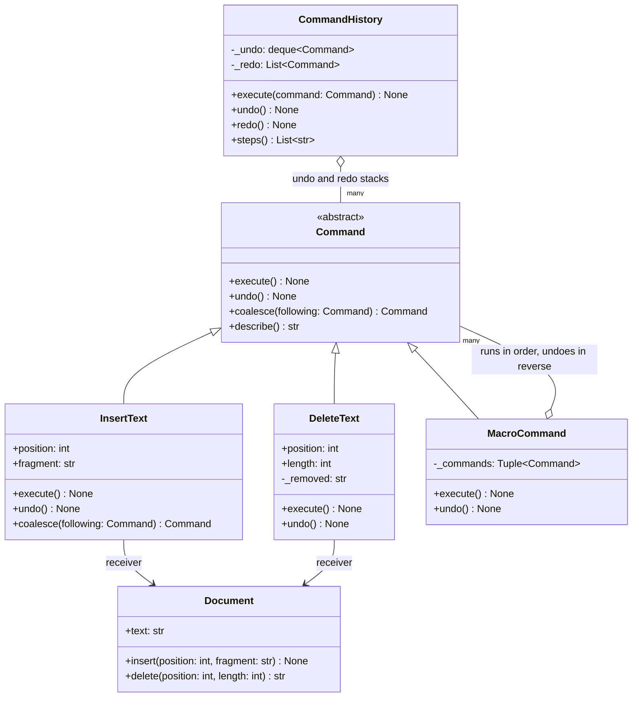
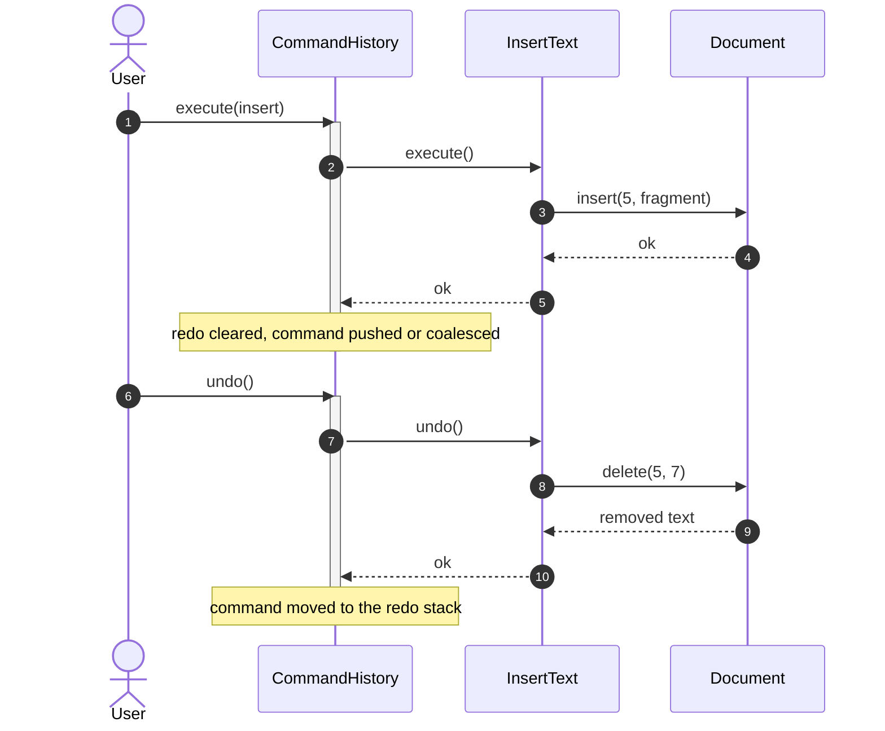

# Command

## Intent

Package a request as an object: what to do, to whom, with which arguments, and how to reverse it. Whoever triggers it (a key press, a timer, a worker thread) needs only `execute`, so the same object can sit on an undo stack, wait in a queue or be written to a log, and the receiver never knows.

## When to use and when not to

**Use it when**

- Undo and redo are requirements. A command stores the change and its inverse, O(change) per step, where a snapshot costs O(state): 100 keystrokes on a 1 MB document cost 100 x 1 MB = 100 MB as snapshots, a few bytes each as commands.
- Execution happens elsewhere or later: a scheduler at the due time, a worker pool on another thread.
- You need a record of what happened, not only the result: an audit trail, a macro recorder.
- Several requests must behave as one: a replace is a delete plus an insert, undone together.

**Leave it out when**

- The request runs immediately and is never stored; a method call is a command with none of the ceremony.
- Only the behaviour varies, with no inverse and no deferral: that is Strategy or a callback.
- Undo has no cheap inverse (a reformat touching every line, a chess move with castling rights): snapshot the state instead, which is Memento, possibly carried inside the command.

## Structure

**Four roles: the Command interface, concrete commands carrying their arguments and their inverse, the Receiver that does the work, and the Invoker that runs and stacks them; the Client is `main`.**



`CommandHistory` depends on `Command` alone: it calls `execute`, `undo` and `coalesce` and never reads a position or a fragment. `Document` has no outgoing arrow; it does not know it is being undone. `MacroCommand` is a Composite of commands: one user action, one undo step.

## Canonical example in Python

The receiver is an ordinary class that knows nothing about undo (`code/patterns/command.py`, tested by `code/patterns/tests/test_command.py`):

```python title="code/patterns/command.py — the receiver"
--8<-- "code/patterns/command.py:receiver"
```

`delete` returns what it removed; that return value is what lets a delete command reverse itself.

The interface and the three concrete commands:

```python title="code/patterns/command.py — the interface and three commands"
--8<-- "code/patterns/command.py:commands"
```

Three decisions to say out loud:

- **The inverse is captured during `execute`.** `DeleteText` cannot know what it will remove until it runs, so it records the removed text then and refuses to `undo` before that. A command carries exactly the memento it needs, never the document.
- **Coalescing belongs to the command.** Only `InsertText` knows that "Hel" then "lo" at the next position is one edit; the history asks `coalesce` and replaces the top of the stack without looking at text. Otherwise undo retreats one character at a time.
- **A macro is all or nothing.** Parts run in order and undo in reverse; if one fails halfway, the parts that ran are undone before the error propagates.

The invoker:

```python title="code/patterns/command.py — the invoker"
--8<-- "code/patterns/command.py:invoker"
```

A command is pushed only after it succeeded, so a failing edit leaves both stacks as they were. A new edit clears the redo stack: after undo, then type, the old future is gone. `deque(maxlen=limit)` bounds the session at `limit` commands, and `_last` lets typing merge only into the edit made immediately before it, never into one reached by undo or redo.

**One keystroke and its undo: the history talks to the command, the command talks to the document.**



Running `python -m patterns.command` prints:

```text
--- typing, undo, redo; consecutive inserts coalesce into one step ---
insert 'Hello'   -> 'Hello'          undo depth 1
insert ', world' -> 'Hello, world'   undo depth 1 (coalesced)
replace macro    -> 'Hello, there'   undo depth 2
undo             -> 'Hello, world'   redo depth 1
undo             -> ''               redo depth 2
redo             -> 'Hello, world'   redo depth 1
insert '!'       -> 'Hello, world!'  redo depth 0 (branch abandoned)
undo steps, oldest first:
  insert 'Hello, world' at 0
  insert '!' at 12
rejected: nothing to redo
--- a macro that fails halfway leaves no trace ---
rejected: position 99 is outside the document
text 'Hello, world!', undo depth 2
--- functional variant: partials and (do, undo) pairs ---
after two steps: 'cdef'
after two undos: 'abc'
worker ran 2 queued commands -> 'x'
```

## Pythonic variant

A command with one method is a callable, and `functools.partial` is its constructor: it binds the receiver and the arguments now so whoever holds the result can call it later, knowing neither. The undo stack then holds `(do, undo)` pairs:

```python title="code/patterns/command.py — partials and (do, undo) pairs"
--8<-- "code/patterns/command.py:functional"
```

- **`partial(document.insert, 0, "Hello")` is `InsertText` without the class.** A bound method already carries its receiver; `partial` adds the arguments.
- **Closures carry the memento.** `delete_step` keeps the removed text where its `undo` closure can see it, as `DeleteText._removed` did with a field.
- **A queue of callables is a command queue.** `run_queued` is the whole worker; it never learns what it runs.

When is the callable enough?

| Reach for | When |
|---|---|
| `partial(method, *args)` | Deferred or queued execution with no undo: timers, executors, callbacks |
| `(do, undo)` pairs on an `UndoStack` | Undo over a few operations that need no name and no merging |
| A `Command` subclass | The command is inspected after creation: logged, merged, grouped, retried |
| A frozen dataclass plus a separate executor | The command crosses a process boundary and must be serialised |

Draw the class diagram, then say "in Python the command is usually a `partial` on a queue; I promote it to a class when it needs captured state, a log line or merging".

## Real-world usage

- **`contextlib.ExitStack.callback(fn, *args)` and `unittest.TestCase.addCleanup`**: undo commands pushed on a stack and run in reverse on exit, the LIFO discipline of `MacroCommand.undo`.
- **`threading.Timer(interval, function, args)`** is a command with a due time and a `cancel`; **`sched.scheduler.enter`** keeps such events in a heap, the core of a task scheduler.
- **`concurrent.futures.Executor.submit(fn, *args)`** wraps the request into a work item, queues it for a worker thread and returns a `Future`.
- **Frameworks**: Celery's `task.delay` serialises a command onto a broker; Qt's `QUndoCommand.mergeWith` is `coalesce`; a write-ahead log stores a redo and an undo record per change.

## Related patterns and confusions

| Looks like Command | How to tell them apart |
|---|---|
| **Memento** | Command stores what was *done* and its inverse, O(change); Memento stores what the state *was*, O(state). Editors use commands for keystrokes and a memento for operations with no cheap inverse. |
| **Strategy** | A strategy is one way of performing an operation, chosen by the context; a command is a request to perform it, owned by whoever wants it done, possibly later. |
| **Chain of Responsibility** | The command is the request; the chain is how it finds a receiver. A withdrawal command travels down the denomination chain. |
| **Observer** | An observer is told that something happened; a command is told to make something happen. Only the second is undoable. |
| **Mediator** | A mediator routes messages between colleagues and decides who acts; a command is one of the messages. |
| **Composite** | `MacroCommand` *is* a Composite: a command made of commands, which the history treats like any other. |

## Where it appears in LLD problems

- [Design a text editor with undo and redo](../problems/text-editor.md) — the core: insert, delete and paste commands, a capped history, coalesced typing.
- [Design a task scheduler (cron, LLD)](../problems/task-scheduler.md) — a task is a command with a due time in a heap; the worker pool runs it without knowing what it is, and a retry re-enqueues it.
- [Design an elevator system](../problems/elevator-system.md) — hall and cabin calls are request objects the controller queues per car.
- [Design a stock brokerage system](../problems/stock-brokerage.md) — place and cancel as commands with an audit trail.
- [Design Splitwise](../problems/splitwise.md) — add, edit and delete expense as commands: undoable edits, and the activity feed for free.

## Interview tips

!!! tip "Interview tip"
    Lead with the invariant, not the class list: "the history only holds commands that ran; undo pops, reverses and pushes to redo; a new command clears redo." Volunteer the two follow-ups before they are asked, coalesced typing and the history cap, then the Python shortcut: `partial` on a queue, a class only when the command must be inspected.

!!! warning "Common mistake"
    An `undo` that computes its inverse from the receiver's *current* state. A delete whose undo trusts the current length works once and breaks as soon as another command runs in between. Capture what you need during `execute` (the removed text, the previous value) and make `undo` a pure replay of it. Runner-up: pushing a command before it succeeded.

## Related

- [Memento](memento.md) — the state instead of the change
- [Chain of Responsibility](chain-of-responsibility.md) — how a request finds its receiver
- [Design a text editor with undo and redo](../problems/text-editor.md) — the pattern as the core of a problem
- [Design a task scheduler (cron, LLD)](../problems/task-scheduler.md) — commands with due times
- [Design an elevator system](../problems/elevator-system.md) — queued requests
- [Design Splitwise](../problems/splitwise.md) — undoable edits
- Gamma, Helm, Johnson and Vlissides, *Design Patterns* (1994), Command
- [Python documentation: `contextlib.ExitStack`](https://docs.python.org/3/library/contextlib.html#contextlib.ExitStack)
- [Qt documentation: `QUndoStack`](https://doc.qt.io/qt-6/qundostack.html)
