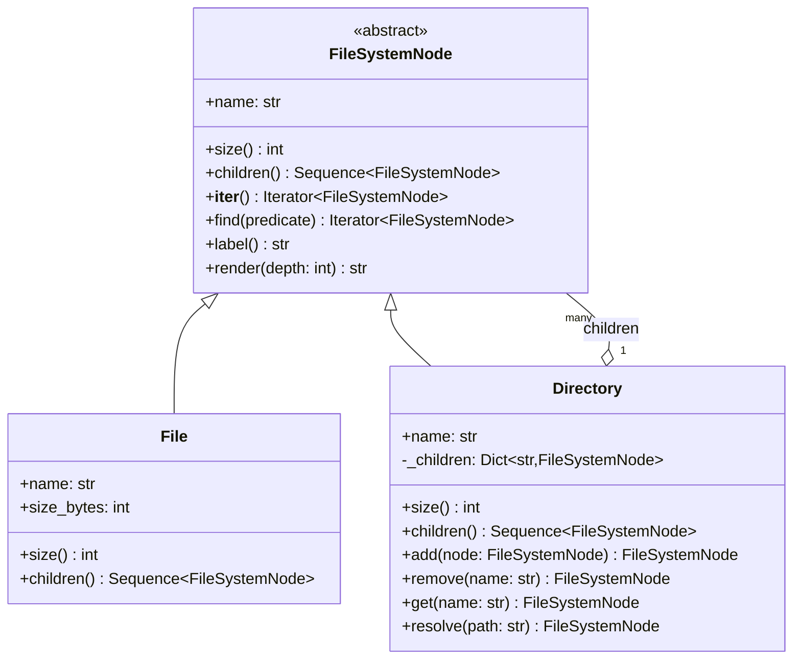

# Composite

## Intent

Compose objects into a tree and give the leaves and the branches one interface, so the client that asks a file for its size asks a directory the same way and never learns how deep the answer went. The recursion lives inside the composite; the client writes one call.

## When to use and when not to

**Use it when**

- The domain is a part-whole hierarchy: directories and files, menu sections and dishes, courses, modules and lessons, expense groups inside groups, widgets inside panels, rules joined by AND and OR.
- The operations are aggregate and recursive: size, price, duration, count, render, validate. If every question about a container is "ask each child and combine", you want the pattern.
- Clients must not care about depth: code written for "a node" must work on the root, a subtree and a single leaf without `isinstance` ladders.

**Leave it out when**

- The structure is flat. A list with a loop is not a Composite.
- Leaves and containers share no operation; then you have a graph of unrelated objects, not a part-whole.
- New *operations* arrive more often than new *node kinds*. Each operation is a method on every class; when that churns, keep the tree dumb and put operations outside it with Visitor or `functools.singledispatch`.
- The tree is read-only and short-lived: nested tuples plus one recursive function are enough.

## Structure

**Three roles: the Component that both kinds of node implement, the Leaf with no children, and the Composite that holds children and owns the container-only operations.**



The aggregation arrow from `Directory` back to `FileSystemNode` is the recursion: a directory holds components, and a component may be another directory. `add`, `remove`, `get` and `resolve` appear only on the composite (the safe form); everything on the component is meaningful for a leaf too.

## Canonical example in Python

The component declares two primitives and derives the rest from them (`code/patterns/composite.py`, tested by `code/patterns/tests/test_composite.py`):

```python title="code/patterns/composite.py — the Component"
--8<-- "code/patterns/composite.py:component"
```

`size` and `children` are abstract; `__iter__`, `find` and `render` are written once in terms of them. A leaf returns an empty tuple from `children`, so the walk has no special case, and `sum`, `max` and generator expressions become the whole-tree query language.

The leaf and the composite:

```python title="code/patterns/composite.py — the Leaf and the Composite"
--8<-- "code/patterns/composite.py:leaf_and_composite"
```

Four decisions to say out loud:

- **Safe, not transparent.** `add` and `remove` exist only on `Directory`, so a client holding a `FileSystemNode` must resolve a directory before mutating the tree. The transparent form declares them on the component and raises on leaves: fewer checks in clients, and every leaf lies about what it can do. Name the trade-off and pick one.
- **Identity equality.** Both classes are `eq=False` dataclasses. Nodes are entities: two files called `hosts` in different directories are different files, and field-wise `__eq__` would compare whole subtrees every time a node was used as a dict key.
- **The composite guards the invariants.** Duplicate names raise `ConflictError`; adding a node whose subtree contains the directory raises `ValidationError`, checked with the component's own iterator; a failed `add` leaves the tree untouched.
- **`size` recomputes on every call.** Correct and O(n), and the follow-up the interviewer is waiting for: a hot root with millions of files needs a cached total per directory, a parent link and invalidation up the chain on every `add`, `remove` and write.

Running `python -m patterns.composite` prints:

```text
--- one render call, leaves and directories alike ---
root/ (1575544 B)
    etc/ (2168 B)
        hosts (120 B)
        nginx/ (2048 B)
            nginx.conf (2048 B)
    var/ (1572864 B)
        log/ (1572864 B)
            app.log (1048576 B)
            app.log.1 (524288 B)
    README (512 B)
--- size() is the same question at every level ---
etc: 2168 B
etc/nginx: 2048 B
var/log: 1572864 B
README: 512 B
--- __iter__ turns every whole-tree question into a builtin ---
nodes: 10, files: 5
files over 100 KB: ['app.log', 'app.log.1']
largest file: app.log
--- the composite guards its own invariants ---
duplicate name: ConflictError: etc/ already contains 'hosts'
cycle: ValidationError: cannot add 'root' inside its own subtree
missing entry: NotFoundError: etc/ has no entry 'passwd'
after removing app.log.1: var/log is 1048576 B, root is 1051256 B
--- Pythonic variant: one class, a generator walk, match for outside operations ---
total: 30 B
root@0 > a.txt@1 > docs@1 > b.txt@2
dir log/: 1 entries, 1048576 B
file README: 512 B
```

## Pythonic variant

Python offers a form with *one* class, the way `xml.etree.ElementTree.Element` works: every node may have children, and a leaf is a node whose list is empty. A recursive generator replaces `__iter__`, and `match` keeps operations outside the tree when the node kinds are stable:

```python title="code/patterns/composite.py — one class, a generator walk, match dispatch"
--8<-- "code/patterns/composite.py:pythonic"
```

`Node` is right when leaves and containers have the same fields and no container-only invariant; `File` plus `Directory` is right when the leaf carries data the container must not have, or the container owns rules such as unique names. `describe` is the road to Visitor: the second `match` over the same node kinds is the moment to name them.

| Reach for | When |
|---|---|
| Nested tuples or dicts plus a recursive function | Read-only data, built and consumed in one place |
| One dataclass with a `children` list | Leaves and containers share every field; no container-only rules |
| Leaf and Composite classes over an `ABC` | Leaves and containers differ in data or invariants; the traversal must be shared |
| Visitor or `singledispatch` | Operations change faster than node kinds |

## Real-world usage

- **`unittest.TestSuite`** is the textbook Composite: `addTest` accepts a `TestCase` or another suite, and `run(result)` works on both. The whole test run is one call on the root.
- **`xml.etree.ElementTree.Element`** uses the single-class form: every element holds children, `iter()` walks the subtree, `findall` is `find` with a path predicate.
- **`ast`** nodes form a Composite queried with `ast.walk` and `ast.iter_child_nodes` and operated on with `ast.NodeVisitor`, which is why the Visitor page reuses this tree.
- **`email.message.EmailMessage`** is multipart: `walk()` yields the message and every nested part; `is_multipart()` is the leaf test.
- **`tkinter`** widgets: a `Frame` contains widgets and frames, `winfo_children()` lists them, `destroy()` cascades down. Django `Q` objects and SQLAlchemy `and_`/`or_` build boolean trees rendered to SQL with one call at the root.

## Related patterns and confusions

| Looks like Composite | How to tell them apart |
|---|---|
| **Decorator** | A wrapper with exactly one child and the same interface, there to add behaviour. A Composite has many children and is there to aggregate; they share a diagram shape and nothing else. |
| **Iterator** | Composite answers "what is the whole worth"; Iterator answers "give me the elements one at a time". `__iter__` here is an internal iterator over the composite; `os.walk` is the external one. |
| **Visitor** | Operations live *in* the nodes with Composite and *outside* them with Visitor. Use both when the tree is stable and the operations are not. |
| **Chain of Responsibility** | Follows parent links upwards (a click bubbling from a button to its window); Composite follows child links downwards. UI toolkits use both on the same tree. |
| **A DAG** | Hard links or shared subtrees make one node reachable by two paths; `size` then double-counts and the cycle check becomes a visited set. Say whether your structure is a tree or a graph. |

## Where it appears in LLD problems

- [Design an in-memory file system](../problems/in-memory-file-system.md) — this tree with paths, cached sizes and a visitor for search.
- [Design a learning management system](../problems/learning-management.md) — course, module and lesson with total duration and completion percentage as aggregate operations.
- [Design a restaurant management system](../problems/restaurant-management.md) — `MenuComponent` over `MenuItem`, `MenuSection` and `ComboItem`, where price and availability roll up.

## Interview tips

!!! tip "Interview tip"
    Name the two primitives before you draw: "every node can report its size and list its children; the walk, the search and the render are written once on top of those." Then state the safe-versus-transparent choice and the cycle check, and volunteer the caching follow-up: "`size` is O(n); for a hot root I would cache totals per directory and invalidate up the parent chain."

!!! warning "Common mistake"
    Making the component the union of everything a directory can do. A `File` whose `add`, `remove` and `resolve` all raise gives the client no static way to know which calls are safe; keep container operations on the container. Runner-up: default dataclass equality on tree nodes, which compares whole subtrees on every dict lookup and says two different `hosts` files are the same file.

## Related

- [Visitor](visitor.md) — operations over the tree without changing the nodes
- [Iterator](iterator.md) — walking the tree element by element, depth first or breadth first
- [Decorator](decorator.md) — the one-child wrapper that shares the diagram shape
- [Design an in-memory file system](../problems/in-memory-file-system.md) — the full problem built on this tree
- [Design a learning management system](../problems/learning-management.md) — course content as a part-whole hierarchy
- [Design a restaurant management system](../problems/restaurant-management.md) — menus as sections and items
- Gamma, Helm, Johnson and Vlissides, *Design Patterns* (1994), Composite
- [Python documentation: `unittest` — grouping tests with TestSuite](https://docs.python.org/3/library/unittest.html#grouping-tests)
- [Python documentation: `xml.etree.ElementTree` — Element objects](https://docs.python.org/3/library/xml.etree.elementtree.html#element-objects)
