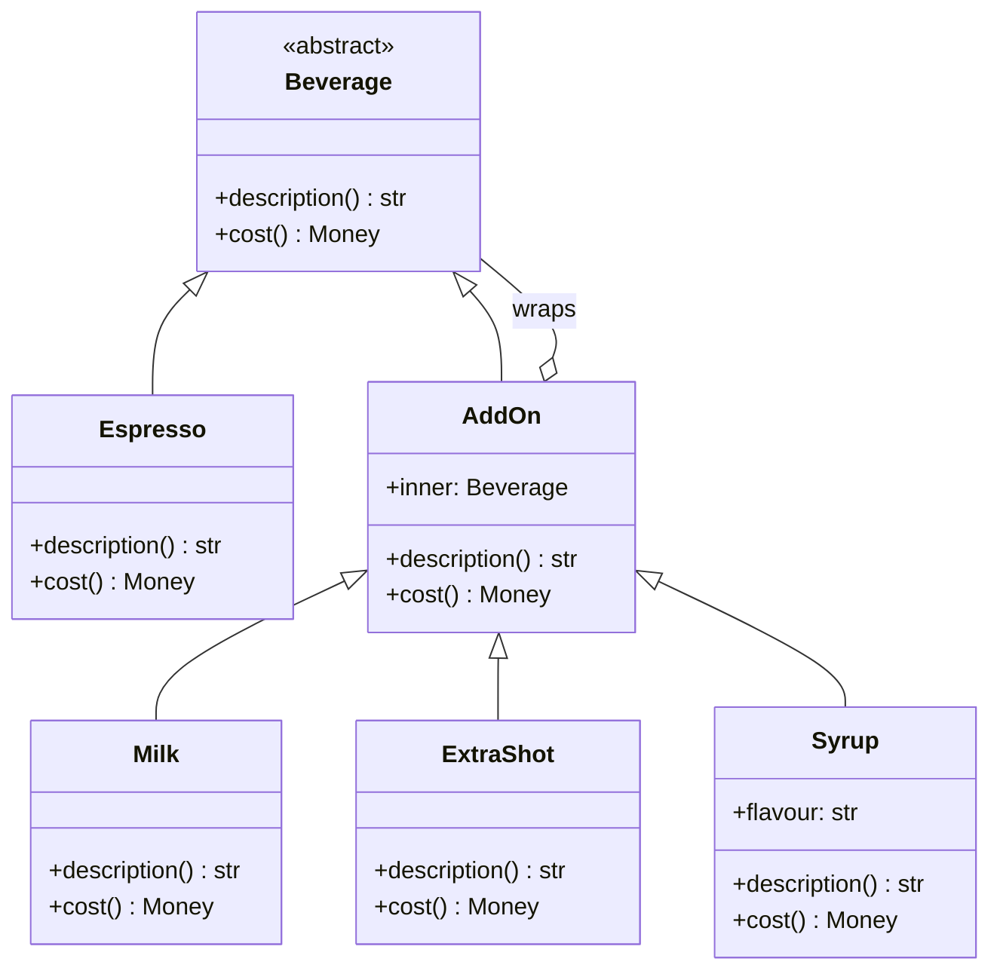
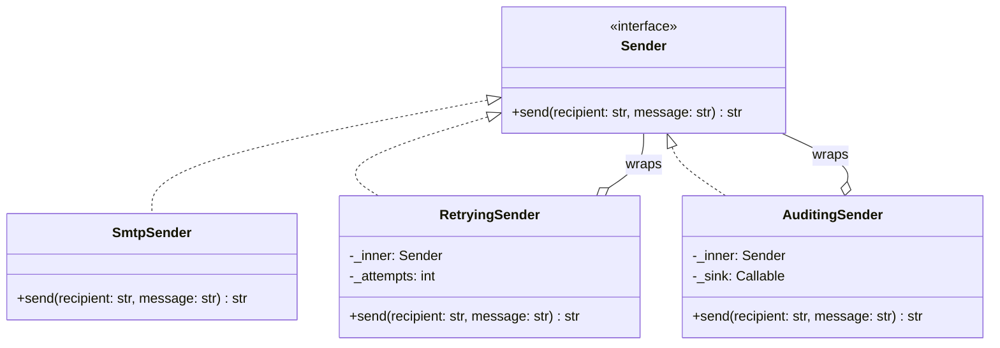

# Decorator

## Intent

Attach responsibilities to an object at runtime by wrapping it in another object that presents the same interface. Wrappers stack, so the combinations you would otherwise subclass (milk plus two extra shots plus syrup; retries plus auditing around a transport) are assembled by composition at the call site, one layer per responsibility.

## When to use and when not to

**Use it when**

- Responsibilities are optional and combinable. Three add-ons give seven non-empty combinations as subclasses, ignoring order and repetition, and "two extra shots" needs a subclass per count; as decorators they are three classes.
- A cross-cutting behaviour must wrap an interface you do not want to touch: retries, caching, auditing, rate limiting or compression around any sender, cache or stream.
- The stack differs per instance: this tenant gets retries, that one retries plus an audit trail, decided at wiring time, not in a hierarchy.

**Leave it out when**

- The wrapper changes the interface: that is an Adapter, and it cannot stack.
- The wrapper exists to control *whether* the real call happens (lazy load, permission check, cache in front of a remote): that is a Proxy.
- One class needs one behaviour forever. Put it in the class; a single permanent layer is ceremony.
- Callers depend on identity. `isinstance(drink, Espresso)` is false once wrapped, and `__getattr__` forwarding skips dunder methods; code that needs the real object will be surprised.

## Structure

**The coffee form: a Component, one Concrete Component and a Decorator base that is itself a Component, so decorators can wrap decorators.**



**The infrastructure form: a Protocol instead of a base class, and each decorator holds a Sender and is a Sender.**



Both pictures share one shape: the arrow from the decorator back to the interface it implements.

## Canonical example in Python

The beverage hierarchy first (`code/patterns/decorator.py`, tested by `code/patterns/tests/test_decorator.py`):

```python title="code/patterns/decorator.py — Component, Concrete Component and the add-ons"
--8<-- "code/patterns/decorator.py:beverage"
```

`AddOn` forwards both calls unchanged; each add-on overrides what it changes and delegates the rest inward. The add-ons are frozen dataclasses, so a decorated drink is a value: `Milk(Espresso()) == Milk(Espresso())`, hashable, printable, safe to share.

The sender stack is the same shape with real stakes:

```python title="code/patterns/decorator.py — retries and auditing around any Sender"
--8<-- "code/patterns/decorator.py:sender"
```

Four decisions to say out loud:

- **Same interface in and out.** `RetryingSender.send` takes and returns exactly what `SmtpSender.send` does, and the recording fake in the tests sees the original arguments untouched. A different signature means it is no longer a decorator.
- **Order is semantics.** `AuditingSender(RetryingSender(smtp))` records one line per message; `RetryingSender(AuditingSender(smtp))` records every attempt. Neither is wrong; the stack is a design decision you state, not an accident of wiring.
- **Errors pass through.** When the retry budget is spent, the original `SendError` propagates. A decorator adds behaviour; translating errors is the adapter's job.
- **Inject the sleep.** The backoff schedule is computed and handed to a callable, so tests assert `[0.1, 0.2]` and never wait.

Running `python -m patterns.decorator` prints:

```text
--- beverages: stack add-ons at runtime, the same add-on twice ---
espresso                                 2.00 USD
espresso, milk                           2.50 USD
espresso, milk, extra shot, extra shot   4.10 USD
espresso, milk, hazelnut syrup           2.90 USD
--- senders: same interface in and out, retries layered around a flaky transport ---
receipt smtp-1 after 2 retries, backoff [0.1, 0.2]
--- order matters: audit outside retry sees one call, inside sees every attempt ---
audit outside retry: ['user-42: ok (smtp-1)']
audit inside retry:  ['user-42: failed (connection reset)', 'user-42: failed (connection reset)', 'user-42: ok (smtp-1)']
--- when the budget runs out the original error surfaces, untranslated ---
SendError after 3 attempts: connection reset
--- function decorators: the same two wrappers for a callable ---
smtp-1 -> ['send_email: ok (smtp-1)']
wraps keeps the identity: name='send_email' doc='Send through the module transport.'
```

## Pythonic variant

When the target is a callable, Python has syntax for the pattern: `@retry(attempts=3)` above `def send_email` means `send_email = retry(attempts=3)(send_email)`, a function that takes a function and returns a same-signature function. The two sender wrappers, restated:

```python title="code/patterns/decorator.py — the same wrappers as function decorators"
--8<-- "code/patterns/decorator.py:functional"
```

- **`functools.wraps` is not optional.** Without it the decorated function is called `wrapper`, its docstring is gone and `inspect.signature` lies; with it the original is reachable as `__wrapped__`, which is how `unittest.mock` and debuggers see through the layers.
- **Stacking reads bottom-up.** `@audited` above `@retry` is audit outside retry: one line per call, exactly as with the classes.
- **Decorators with arguments are factories.** `retry(attempts=3)` returns the decorator; validate the arguments there so misuse fails at import time.

When is each form right?

| Reach for | When |
|---|---|
| `@decorator` on a function | The target is a callable, the stack is fixed when the code is written, and the behaviour is cross-cutting (retry, cache, timing, auth) |
| A `contextlib.contextmanager` or `ContextDecorator` | The behaviour is "before and after" around a block and you want both `with` and `@` forms |
| The object decorator | The target has several methods that must stay consistent, the stack is assembled at runtime per instance, or layers must be inspected or removed |
| A middleware list (Pipeline) | Many layers whose order is configuration rather than code |

One naming trap: `@property`, `@staticmethod`, `@dataclass` and `@app.route` use the syntax but replace the function with a descriptor, transform a class or register a handler. Only a decorator that returns a same-signature wrapper is the GoF pattern.

## Real-world usage

- **`functools.lru_cache` and `functools.cache`** wrap a function with a cache behind the same signature; `cache_info()` and `cache_clear()` are the layer showing through.
- **`io.BufferedReader` and `io.BufferedWriter`** wrap a raw stream with buffering behind the same `read`/`write` interface; `gzip.GzipFile` wraps any file object with compression; `ssl.SSLSocket` wraps a socket with TLS and the socket API.
- **`logging.LoggerAdapter`** carries the adapter name but decorates: the same logging methods with extra context injected into every record.
- **`unittest.mock.patch`** is both a decorator and a context manager, the `ContextDecorator` shape.
- **Frameworks**: Flask and Django view decorators (`@login_required`, `@cache_page`) and Django's middleware chain.

## Related patterns and confusions

The structural patterns all wrap something; classify by two questions: does the interface change, and why does the wrapper exist?

| Looks like Decorator | How to tell them apart |
|---|---|
| **Adapter** | Changes the interface, adds no behaviour, never stacks. Adapt first, then decorate: `RetryingProcessor(StripeAdapter(client))`. |
| **Proxy** | Same interface, but the wrapper exists to *control access* to one object: lazy creation, a cache, a permission check, a network hop. A proxy decides whether the real call happens and is usually one layer the client did not choose; a decorator always forwards, adds, and is stacked by the client. |
| **Facade** | A new, simpler interface over a subsystem of several objects. Not interchangeable with what it hides, so it cannot be layered. |
| **Composite** | Many children, there to aggregate. A decorator is a composite with exactly one child and a different purpose. |
| **Strategy** | Swaps the algorithm inside the object; a decorator wraps the outside. `DailyCapPricing` on the Strategy page is half a decorator: same interface, but it wraps one specific type rather than any strategy. |
| **Chain of Responsibility** | A handler may stop the chain and never forward; a decorator always delegates. A middleware pipeline is a chain of decorators built from a list. |

## Where it appears in LLD problems

- [Design a vending machine (and a coffee machine)](../problems/vending-machine.md) — add-ons as decorators over a base drink; price and description compose.
- [Design an in-memory cache (LRU, LFU, TTL)](../problems/in-memory-cache.md) — `LoadingCache` wraps any cache with read-through loading.
- [Design a notification service (LLD)](../problems/notification-service.md) — `CircuitBreakerSender` wraps a channel sender; the rate limit and dedup are pipeline stages there.
- [Design a logging framework](../problems/logging-framework.md) — `AsyncHandler` wraps any handler to make it non-blocking.
- [Design a rate limiter (LLD)](../problems/rate-limiter-lld.md) — the counter-example: it rejects a per-handler `@rate_limit` for a middleware stage.

## Interview tips

!!! tip "Interview tip"
    Draw two boxes with the same interface and say the sentence that proves you understand the pattern: "same interface in and out, so I can stack them, and the order is a decision: audit outside retry records one line per message, inside records every attempt." Then offer `@retry` with `functools.wraps` and say when the function form is enough.

!!! warning "Common mistake"
    Changing the interface inside a decorator. A `RetryingSender` that returns a result object instead of the receipt, or swallows `SendError` and returns `None`, is an adapter with side effects and nothing can stack on it. Runner-up: forgetting `functools.wraps`, so every decorated function is called `wrapper` in tracebacks, and `__getattr__` forwarding that misses the dunder methods the caller needed.

## Related

- [Proxy](proxy.md) — same interface, there to control access rather than add behaviour
- [Adapter](adapter.md) — changes the interface; adapt first, decorate after
- [Pipeline and Middleware](pipeline-middleware.md) — a list of decorators whose order is configuration
- [Composite](composite.md) — the many-children cousin with the same diagram shape
- [Design a vending machine (and a coffee machine)](../problems/vending-machine.md) — add-ons in a full problem
- [Design an in-memory cache (LRU, LFU, TTL)](../problems/in-memory-cache.md) — layers over a cache interface
- Gamma, Helm, Johnson and Vlissides, *Design Patterns* (1994), Decorator
- [PEP 318 — Decorators for Functions and Methods](https://peps.python.org/pep-0318/)
- [Python documentation: `functools` — `wraps`, `lru_cache`](https://docs.python.org/3/library/functools.html)
