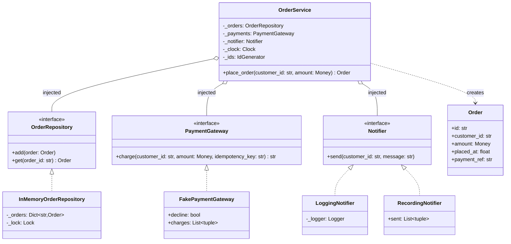

# Dependency Injection

## Intent

Supply an object's collaborators from outside instead of letting it construct or look them up. `OrderService` declares what it needs (a store, a payment gateway, a notifier, a clock, an id generator) as constructor parameters typed as Protocols; whoever builds the service decides which implementations those are. Production wires real objects once, tests wire fakes, and the service code is identical in both.

## When to use and when not to

**Use it when**

- A class touches anything a test cannot control: the wall clock, random ids, a network, a database, stdout. Inject it and the test owns it.
- You want to assert on side effects (what was charged, who was notified) without `unittest.mock.patch`; a hand-written fake records them and never lies about a method name.
- Two deployments need different implementations (SQLite locally, Postgres in production); the choice belongs in one composition root, not in every class.

**Leave it out when**

- The dependency is a pure function or a value object (`math.ceil`, `Money`); injecting something with no side effects and no variants adds a parameter and buys nothing.
- The object is a leaf utility with one implementation and no test that needs to replace it.
- You are injecting twelve things. That is a class with too many jobs; split it instead of hiding the parameter list behind a container.

## Structure

**The service, the three Protocols it declares, and the implementations a composition root or a test chooses; `Clock` and `IdGenerator` come from `common` and are injected the same way.**



`OrderService` knows the three interfaces and nothing below the dotted lines. The fakes are not second-class: `FakePaymentGateway` and `RecordingNotifier` live next to the contract, are typed against it, and are the reason the tests need no database and no patching.

## Canonical example in Python

The contracts come first (`code/patterns/dependency_injection.py`, tested by `code/patterns/tests/test_dependency_injection.py`):

```python title="code/patterns/dependency_injection.py — the contracts"
--8<-- "code/patterns/dependency_injection.py:ports"
```

The service declares its needs in `__init__` and constructs none of them:

```python title="code/patterns/dependency_injection.py — the service"
--8<-- "code/patterns/dependency_injection.py:service"
```

Three decisions to say out loud:

- **Constructor injection, nothing else.** Setter injection leaves a half-built object; a lookup inside the method (`registry.get("clock")`) hides the dependency from the signature. With the constructor, the `OrderService(...)` call in a test is the documentation of what the service touches.
- **Protocols, not base classes.** `FakePaymentGateway` never inherits from `PaymentGateway`; it qualifies by shape, and so does a double defined inside one test. `@runtime_checkable` lets a test assert that with `isinstance`.
- **Time and identity are collaborators.** `time.time()` and `uuid4()` inside a service make every assertion approximate; `Clock` and `IdGenerator` from `common` make `placed_at == EPOCH` and `id == "order-1"` exact, and `FakeClock.advance(60)` tests time-dependent rules without sleeping.

The implementations, real and fake, sit next to the contract:

```python title="code/patterns/dependency_injection.py — the implementations"
--8<-- "code/patterns/dependency_injection.py:implementations"
```

`FakePaymentGateway` is a stub for the outcome (`decline=True`) and a spy for the calls (`charges`). Unlike `Mock()`, it fails loudly on a misspelt method and survives a signature change only if you update it, which is the point.

`main()` is the composition root, the one function that names concrete classes together; nothing else in the module mentions `SystemClock` or `UuidIdGenerator`. Running `python -m patterns.dependency_injection` prints:

```text
--- production wiring: the composition root alone names the concrete classes ---
placed an order with a 32-char uuid at wall-clock time; nothing below depends on either
--- test wiring: the same class, a fake in every slot ---
order-1 for ada: 25.00 USD at t=1700000000, paid as pay-order-1
notifier recorded: ('ada', 'order order-1 confirmed: 25.00 USD')
order-2 placed 60 s later: the clock is a collaborator
--- functional variant: partial() binds the collaborators once ---
order-3 for cy: 5.00 USD; orders stored: 3
--- a declined payment stores nothing and notifies nobody ---
rejected: card declined for dee; orders stored: 3; messages sent: 3
```

## Pythonic variant

A class with one public method and five injected collaborators is a function with five bound arguments:

```python title="code/patterns/dependency_injection.py — the service as a function"
--8<-- "code/patterns/dependency_injection.py:functional"
```

- **`functools.partial` is constructor injection for functions.** `bind(...)` fixes the collaborators and returns a `PlaceOrder` callable; the request arrives per call.
- **Keyword defaults are a seam with a cost.** `clock: Clock | None = None` plus `self._clock = clock or SystemClock()` keeps call sites short, but the dependency vanishes from the signature, and `clock: Clock = SystemClock()` is evaluated once at import. Use it for leaf utilities, not services.
- **pytest fixtures are injection by parameter name.** A test that takes `wiring` receives the composed graph; the fixture is the test suite's composition root.
- **FastAPI's `Depends`** does the same per request: `service: OrderService = Depends(get_service)` in a path function resolves the graph when the request arrives.

Why no container? Spring, Guice and `dependency-injector` solve auto-wiring across hundreds of components with lifecycle scopes. An LLD design has five to ten objects built once in `main()`; keyword arguments already give you named, typed, explicit wiring, and a container would hide the one thing the interviewer wants to see, the graph. Say "I wire by hand in the composition root and reach for a container only when the graph outgrows a screen."

| Reach for | When |
|---|---|
| Constructor parameters typed as Protocols | Services and anything with side effects (the default) |
| `functools.partial` | A single-function service, or a callback that needs collaborators |
| A keyword default | A leaf utility where the real implementation is almost always right |
| A framework's injector (`Depends`, fixtures) | Per-request or per-test lifetimes the framework already manages |

## Real-world usage

- **pytest fixtures** are the most used injector in Python: parameters resolved by name, with `function`, `module` and `session` scopes for lifetimes.
- **FastAPI `Depends`** injects per-request collaborators (database sessions, the current user) into path functions and composes them.
- **The stdlib injects by parameter.** `json.dumps(default=...)`, `socketserver.TCPServer(address, handler_class)`, `logging.Handler.setFormatter(...)`: nothing is looked up, the caller passes it in.
- **This handbook**: every LLD package takes `Clock` and `IdGenerator` in its constructors, which is why every demo prints the same numbers on every machine.

## Related patterns and confusions

| Looks like Dependency Injection | How to tell them apart |
|---|---|
| **Singleton** | The object fetches a global (`PaymentClient.instance()`); with DI the collaborator is handed in. You can still build exactly one instance in the composition root; you lose only the global access. |
| **Service Locator** | `registry.get("clock")` inside the method: resolved at call time, invisible in the signature. It injects the locator, not the collaborator. |
| **Strategy** | Strategy is *what* you inject, a swappable algorithm; DI is *how* it arrives. Every strategy here is injected; not every injected object is a strategy. |
| **Factory Method** | A factory creates on demand inside the class; DI receives from outside. Inject a factory when the service must create many instances at runtime. |
| **Dependency Inversion Principle** | The D in SOLID says depend on abstractions. DI is the usual way to satisfy it, but you can inject concrete classes (no inversion) or instantiate a Protocol's implementation yourself (no injection). |

## Where it appears in LLD problems

- Every problem in this handbook: `Clock`, `IdGenerator` and a repository are constructor parameters of each service, so the demos are deterministic and the tests need no patching.
- [Design a parking lot](../problems/parking-lot.md) — the gate takes a `PricingStrategy` and a `Clock`; the tests drive the clock to price a stay.
- [Design a notification service (LLD)](../problems/notification-service.md) — channel senders are injected, so the tests record instead of sending.
- [Design a payment gateway and digital wallet](../problems/payment-gateway-wallet.md) — the PSP adapter is injected; the tests use a declining fake exactly like `FakePaymentGateway`.

## Interview tips

!!! tip "Interview tip"
    Say it while drawing the constructor: "the service takes its store, gateway, notifier, clock and id generator as Protocols; `main` wires the real ones, tests wire fakes." Then the two sentences that mark an SDE2: name the test that becomes possible (a declined payment stores nothing, asserted on the fake) and name what you are not doing (no container, no `patch`, no global).

!!! warning "Common mistake"
    Injecting the abstraction and then defeating it: `self._clock = clock or SystemClock()` followed by `time.time()` three lines later, or a service that accepts a repository and also imports `sqlite3`. Runner-up: `patch("module.time.time")` in tests when a `Clock` parameter would have made the seam explicit and the test readable.

## Related

- [Repository](repository.md) — the most common thing to inject
- [Clean code and testing](../fundamentals/clean-code-and-testing.md) — fakes versus mocks, and what a good test asserts
- [Singleton](singleton.md) — the global access DI replaces
- [SOLID in Python](../fundamentals/solid-principles.md) — the Dependency Inversion Principle DI serves
- [Strategy](strategy.md) — the pattern most often delivered through injection
- Martin Fowler, *Inversion of Control Containers and the Dependency Injection pattern* (2004)
- [PEP 544 — Protocols: Structural subtyping](https://peps.python.org/pep-0544/)
- [pytest documentation: fixtures](https://docs.pytest.org/en/stable/how-to/fixtures.html)
