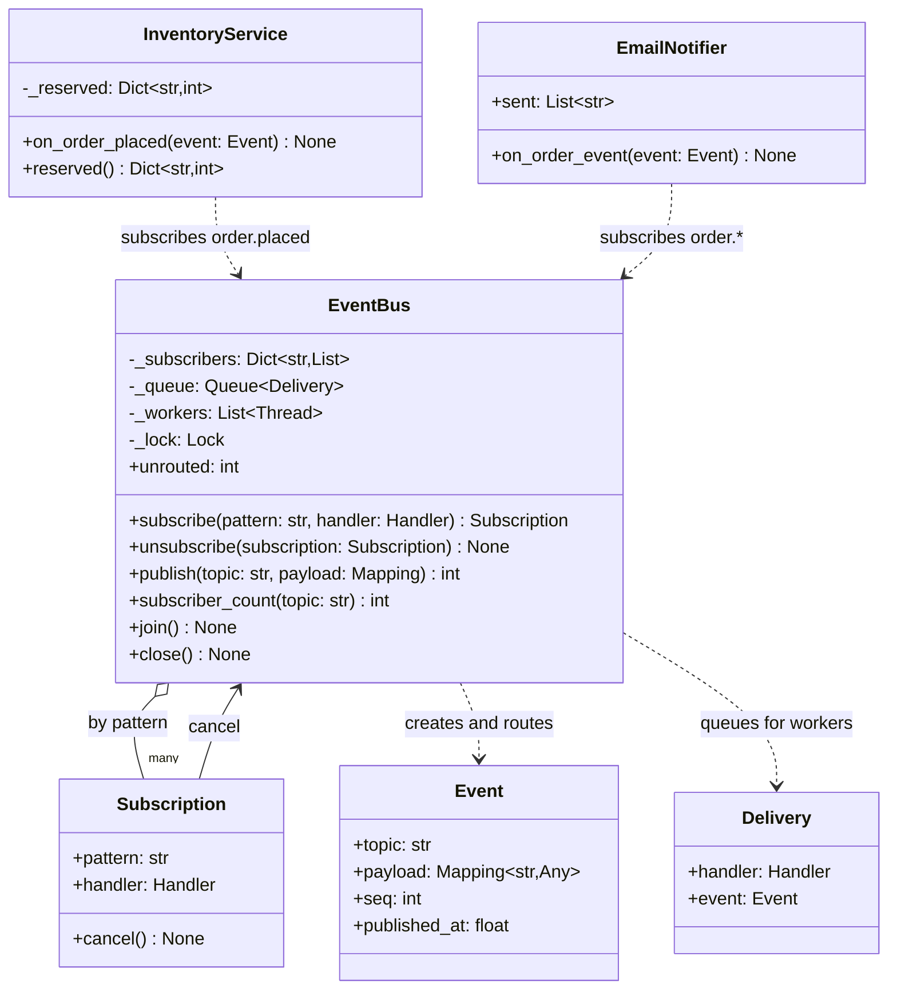
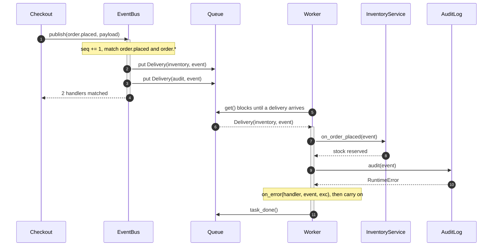

# Event Bus

## Intent

Let a component announce that something happened, by topic, without knowing who cares, and let any number of components react without knowing who announced it. The bus in the middle owns the subscriptions and the delivery policy (inline or on a worker thread), so publisher and subscribers share nothing but a topic name and an event shape.

## When to use and when not to

**Use it when**

- One fact has many independent consequences that keep growing: an order placed must reserve stock, email the customer and update analytics, and next quarter feed fraud scoring, without checkout changing.
- Publisher and subscribers live in different modules or teams; the bus points both at the event shape instead of at each other.
- A reaction may be slow or flaky (a ledger write, a third-party call) and the publisher must neither wait for it nor fail because of it.

**Leave it out when**

- The publisher needs the answer. A bus delivers and forgets; a request with a result is a function call or a Pipeline.
- There is one subscriber and it will stay that way; a direct dependency is easier to follow in a debugger.
- Order or atomicity matters across reactions (reserve stock, then charge, roll back on failure): that is a workflow, a Mediator or a saga.
- Delivery must survive a crash. An in-process bus is at-most-once; durable topics with offsets are the pub/sub problem page.

## Structure

**Six roles: the event, the bus that routes by topic, the subscription handle, the delivery unit a worker drains, and two subscribers that never meet.**



`EventBus` is the only object that knows both sides: publishers call `publish(topic, payload)`, subscribers hand over a callable and get a `Subscription` to cancel. `Delivery` lets a worker thread carry exactly one handler call. `InventoryService` and `EmailNotifier` import the bus and the event, nothing else.

**Worker-thread delivery: publish returns once the deliveries are queued, and a handler that raises is reported without stopping the others.**



## Canonical example in Python

The event and the small types around it come first (`code/patterns/event_bus.py`, tested by `code/patterns/tests/test_event_bus.py`):

```python title="code/patterns/event_bus.py — the event, the handler types, the delivery and the subscription"
--8<-- "code/patterns/event_bus.py:event"
```

`Event` is frozen and carries what the bus stamps on it: a sequence number and a time from the injected `Clock`. A `Handler` is any callable, and so is the error policy.

The bus:

```python title="code/patterns/event_bus.py — routing, delivery policy, error isolation, lifecycle"
--8<-- "code/patterns/event_bus.py:bus"
```

Five decisions to say out loud:

- **Topics are strings, matched exactly or by glob.** `order.*` catches `order.refunded` before anyone has written it; an exact topic stays a dict lookup. Observer has no topic: you subscribe to an object.
- **Copy under the lock, call outside it.** A slow handler never blocks `subscribe`, and a handler may cancel itself mid-dispatch.
- **The delivery policy belongs to the bus.** With `workers=0` handlers run inline, in subscription order, before `publish` returns. With `workers=1` each handler call becomes a `Delivery` on a `queue.Queue`, `publish` returns at once and one daemon thread drains in FIFO order, so events stay in publish order; more workers trade order for throughput, as partitions do.
- **Error isolation is the contract.** `_deliver` catches everything, hands it to `on_error` and moves on: a failing audit handler cannot stop inventory from reserving or kill the worker.
- **`join` and `close`.** `queue.join` blocks until every delivery is handled; `close` refuses new events, then queues one sentinel per worker *behind* the pending deliveries, so FIFO order drains them before any worker stops.

The subscribers import `Event` and nothing else, and each guards its own state because a worker bus calls them off-thread:

```python title="code/patterns/event_bus.py — two subscribers that never meet"
--8<-- "code/patterns/event_bus.py:subscribers"
```

Running `python -m patterns.event_bus` prints:

```text
--- synchronous bus: handlers run on the publisher's thread, failures are isolated ---
  order.placed   -> 3 handler(s)
  order.paid     -> 1 handler(s)
  payment.failed -> 0 handler(s)
  inventory reserved: {'sku-1': 2, 'sku-2': 1}
  emails: ['order.placed -> o-100', 'order.paid -> o-100']
  isolated failures: ["order.placed #1: RuntimeError('audit store unavailable')"]
  unrouted events: 1
  after emails.cancel(): order.shipped -> 0 handler(s)
--- worker-thread bus: publish returns at once, delivery happens on the worker ---
  publisher on MainThread continued; deliveries so far: 0
  after join(): 2 deliveries on EventBus-worker-0; worker survived 2 failures
  after close(): InvalidStateError: event bus is closed
--- pythonic: a defaultdict of callables is the whole bus ---
  lambda saw order.placed #1
  routed to 1 handler(s)
```

## Pythonic variant

Strip the threads, wildcards, cancellation and counters and what remains is a dict of lists and a loop:

```python title="code/patterns/event_bus.py — the ten-line bus"
--8<-- "code/patterns/event_bus.py:pythonic"
```

- **`defaultdict(list)` of callables** is the whole data structure; `list(...)` before the loop lets a handler subscribe another without corrupting the iteration.
- **What you give up**: a raising handler stops the rest, nothing runs off-thread, and an event nobody listens to vanishes uncounted.
- **The async form** is the same bus over `asyncio.Queue` with a task per worker; `blinker.Signal` is the packaged version of the synchronous one.

| Reach for | When |
|---|---|
| `simple_bus()` or a dict of lists | One module, a test, a CLI |
| A `Signal` per event type (Observer page) | A few known events, no topics, subscribers are objects |
| `EventBus(workers=0)` | Wildcards, counters and isolation, and the publisher can afford to wait |
| `EventBus(workers=n)` | Slow or flaky subscribers behind a publisher on the request path |
| A broker (Kafka, Redis Streams, SQS) | Across processes, with durability, replay and consumer groups |

Draw the class diagram, then say "in Python I would start from a dict of callables and add the bus class the day I need isolation, a worker or a second team subscribing".

## Real-world usage

- **Django signals.** `post_save.connect(handler, sender=Order)` is a registry per signal with `sender` as the topic, delivered synchronously on the saving thread; `send_robust` is the error-isolated form.
- **blinker** (Flask's signals): `Namespace().signal("order-placed")`, `connect` and `send`, weak references by default so a forgotten receiver does not leak.
- **`logging`** is a bus keyed by logger name: a record for `app.orders` reaches the handlers of `app.orders`, `app` and the root, a prefix-wildcard topic hierarchy with `propagate` as the cancel.
- **Elsewhere**: Guava `EventBus` and `AsyncEventBus(executor)` (the `workers` switch), Spring `ApplicationEventPublisher`, DOM `CustomEvent`, Qt signals.

## Related patterns and confusions

| Looks like Event Bus | How to tell them apart |
|---|---|
| **Observer** | You subscribe to *an object* (`feed.subscribe(watchlist)`), which holds its observers and defines the notification. With a bus you subscribe to *a topic string* on a third party; publisher and subscriber never reference each other, and one bus carries many unrelated event types: M publishers to N subscribers, not one subject to N observers. |
| **Mediator** | A mediator *coordinates*: it knows its colleagues, encodes the workflow (stop the elevator, open the doors, reset the button), calls them in order and waits for answers. A bus understands nothing about its events; it routes and forgets. Handlers that depend on each other's order are a mediator without the name. |
| **Pipeline and Middleware** | Serial and ordered, returns a result, any stage may stop the rest. A bus is fan-out: every subscriber gets the event, none can stop the others, nothing comes back. |
| **Message queue, pub/sub system** | The same idea across processes, with durability, offsets, consumer groups and at-least-once delivery. The in-process bus is at-most-once. |
| **Command** | A request to do one thing, addressed to one receiver, often undoable. An event states that something happened and is addressed to nobody. |

## Where it appears in LLD problems

- [Design an in-memory pub/sub message queue](../problems/pub-sub-system.md) — the bus grown up: durable topics, consumer offsets, consumer groups and at-least-once delivery.
- [Design Amazon (cart, order, inventory, payment)](../problems/ecommerce-order-inventory.md) — `order.placed` fans out to inventory, payment and notification; the order saga is the mediator that consumes those events.
- [Design an online auction](../problems/online-auction.md) — `bid.placed` triggers outbid notifications and the auction timer without the bidding service knowing either.
- [Design a stock brokerage system](../problems/stock-brokerage.md) — price ticks and order fills as topics; watchlists, alerts and the portfolio subscribe.

## Interview tips

!!! tip "Interview tip"
    Draw the bus as a third box and name the two things it owns: the subscription table keyed by topic and the delivery policy. Then the three sentences that separate it from its neighbours: subscribers know a topic, not an object (Observer); the bus routes without understanding the events (Mediator); it is in-process and at-most-once (a message queue is neither).

!!! warning "Common mistake"
    Treating the bus as a function call with extra steps: publishing, then assuming the subscriber has already run (with a worker it has not), or expecting something back. A publisher that depends on a subscriber has hidden coupling nobody can trace. Runner-up: a dispatch loop without error isolation, where one raising handler silences the rest or kills the worker.

## Related

- [Observer](observer.md) — subscribe to an object, not a topic
- [Mediator](mediator.md) — the coordinator that understands the workflow
- [Pipeline and Middleware](pipeline-middleware.md) — serial stages with a result, the opposite shape
- [Design an in-memory pub/sub message queue](../problems/pub-sub-system.md) — durable topics and offsets
- [Design Amazon (cart, order, inventory, payment)](../problems/ecommerce-order-inventory.md) — order events fanned out
- [Design an online auction](../problems/online-auction.md) — bids as events
- [Django documentation: Signals](https://docs.djangoproject.com/en/stable/topics/signals/)
- [blinker documentation](https://blinker.readthedocs.io/en/stable/)
- [Martin Fowler, *What do you mean by "Event-Driven"?* (2017)](https://martinfowler.com/articles/201701-event-driven.html)
