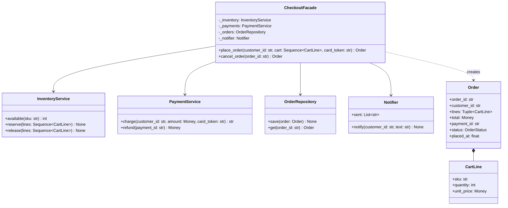

# Facade

## Intent

Provide one higher-level interface to a subsystem of several collaborating objects, so the common case is a single call. `place_order` reserves stock, charges the card, stores the order and notifies the customer, in that order, and releases the stock if the card is declined. The parts stay independent and reachable; the facade adds a door, it does not build a wall.

## When to use and when not to

**Use it when**

- A use case touches several objects in a fixed order and every caller would otherwise repeat that choreography: checkout, check-in, withdrawal, ride booking.
- The workflow needs compensation. When step three fails, someone has to undo steps one and two; that someone should exist once, with a name, and be tested.
- You want the client (a controller, a CLI, a test) to depend on one interface, so the subsystem can be rearranged behind it.
- You are wrapping a library whose full surface is wide and whose common case is narrow; `requests.get` over a `Session` is the model.

**Leave it out when**

- There is one object behind it. A facade over one class is a rename; if the interface must change, that is Adapter.
- The parts must talk to *each other* through it, with state flowing both ways; that is Mediator, and the difference is who calls whom.
- The "facade" starts holding business rules. Stock arithmetic belongs to the inventory, declines to payments; a facade that validates everything itself becomes the God object the pattern was meant to prevent.
- The operation must be atomic across a database. A facade sequences calls and compensates; it is not a transaction. Reach for Unit of Work when the steps share one store, and name the saga when they do not.

## Structure

**One Facade in front of four independent parts; the client calls the facade, the parts never call each other or the facade.**



Every arrow points away from the facade. Nothing in the subsystem imports it, which is what keeps the parts testable alone and reusable by a second facade (returns, say) later.

## Canonical example in Python

The subsystem first, because the facade is only as good as the boundaries it sits on (`code/patterns/facade.py`, tested by `code/patterns/tests/test_facade.py`):

```python title="code/patterns/facade.py — four parts that know nothing about each other"
--8<-- "code/patterns/facade.py:subsystem"
```

Each part owns one invariant. `InventoryService.reserve` checks and decrements under a lock, and rejects the whole cart if any line is short, so a reservation is never half applied. `PaymentService` knows what a decline is. Neither knows that an order exists.

The facade owns the order of events and the undo:

```python title="code/patterns/facade.py — the Facade"
--8<-- "code/patterns/facade.py:facade"
```

Four decisions to say out loud:

- **Cheapest and most reversible step first.** Validate the cart, then reserve stock (free to undo), then charge the card (costly to undo), then persist and notify. A decline after the reservation is compensated by one `release`; an out-of-stock cart never reaches the card.
- **Compensate, then re-raise.** The facade undoes what it did and lets the original `CardDeclinedError` through. Swallowing it would hide the outcome from the controller; translating it would be the adapter's job.
- **No rule of its own.** The facade never looks at stock counts or card tokens. When the interviewer adds a discount rule, it goes into a pricing part that the facade calls, not into `place_order`.
- **The lock lives in the part.** The concurrency test fires 40 checkouts at 5 keyboards through the facade and exactly 5 succeed, because `InventoryService` owns its invariant. A facade-level lock would serialise every checkout to protect one counter.

Running `python -m patterns.facade` prints:

```text
--- one call runs reserve, charge, save, notify ---
ord-1 for cust-1: 145.00 USD, pay-1, placed
stock after: keyboard 3, mouse 9
--- the facade compensates: a declined card releases the reservation ---
CardDeclinedError: card declined for cust-1; stock back to keyboard 3, mouse 9; orders saved: 1
--- and it checks before it spends: out of stock means no charge at all ---
OutOfStockError: insufficient stock for keyboard; charges on record: 1
--- cancel reverses the workflow ---
ord-1 cancelled; stock keyboard 5, mouse 10; charges on record: 0
InvalidStateError: order ord-1 is already cancelled
--- the subsystem is still reachable when the facade is too coarse ---
inventory.available('mouse') -> 10
--- what the notifier sent along the way ---
cust-1: order ord-1 placed: 145.00 USD
cust-1: order ord-1 cancelled: 145.00 USD refunded
--- Pythonic variant: the facade as a function, the subsystem bound once ---
ord-2 for cust-2: 25.00 USD; stock keyboard 5, mouse 9
```

## Pythonic variant

`CheckoutFacade` holds references and no state of its own, so the class is optional. A function with keyword-only collaborators is the same facade, and `functools.partial` plays the constructor:

```python title="code/patterns/facade.py — the facade as a function"
--8<-- "code/patterns/facade.py:pythonic"
```

```python
quick_checkout = partial(place_order, inventory=inventory, payments=payments,
                         orders=orders, notifier=notifier, ids=ids, clock=clock)
order = quick_checkout("cust-2", [CartLine("mouse", 1, Money.of("25.00"))], "tok-visa")
```

The stdlib's favourite form goes one step further: a module-level function that builds the subsystem for you. `requests.get(url)` creates a `Session`, sends, and closes it; `subprocess.run(cmd)` builds a `Popen`, waits and collects. The function is the facade for the common case, and the class stays public for callers who need connection reuse or streaming. Offer both in the room: "a `checkout()` function for the 80% case, the `CheckoutFacade` for callers that need to configure the parts".

| Reach for | When |
|---|---|
| A function with keyword-only collaborators | The facade keeps no state; `partial` binds the subsystem once |
| A module-level convenience function | The subsystem can be built per call cheaply and the common case needs no configuration |
| A class | Two or more entry points share the same collaborators (`place_order`, `cancel_order`), or the client must be handed one object to depend on |

## Real-world usage

- **`requests.get`, `post`, ...** over `Session`, `PreparedRequest`, adapters and connection pools. **`subprocess.run`** over `Popen`, pipes and `communicate()`. **`shutil.make_archive`** over `zipfile` and `tarfile`.
- **`logging.basicConfig`** and the module-level `logging.info` over `Logger`, `Handler` and `Formatter`; the objects remain for anyone who outgrows the one-liner.
- **`urllib.request.urlopen`** over `OpenerDirector` and its handler chain; **`pathlib.Path.read_text`** over `open`, decode and `close`; **`json.dumps`** over `JSONEncoder`.
- **Frameworks**: Django's `ModelForm.save()` and `Model.objects.create()`, SQLAlchemy's `Session` over connections and the unit of work, a "service layer" or "application service" in DDD vocabulary, which is a facade over the domain model.

## Related patterns and confusions

| Looks like Facade | How to tell them apart |
|---|---|
| **Adapter** | Wraps *one* object to give it the interface a client expects, one-to-one and interchangeable with other adapters. A facade defines a *new*, simpler interface over *many* objects and is not interchangeable with what it hides. |
| **Mediator** | Both centralise, but the direction differs. A facade is one-way: client to facade to parts, and the parts never know it exists. A mediator sits between colleagues that talk *through* it, both ways, at runtime. |
| **Proxy / Decorator** | Same interface as the thing wrapped. A facade's interface is different by design. |
| **Abstract Factory** | Builds the family of parts; a facade uses them. Often the factory is what the facade's constructor arguments came from. |
| **Unit of Work / Saga** | The transaction boundary. A facade sequences and compensates in memory; it does not make the steps atomic. |
| **Gateway / Anti-corruption layer** | A facade over a *remote* system, usually built from adapters, with translation of the whole model. |

## Where it appears in LLD problems

- [Design Amazon (cart, order, inventory, payment)](../problems/ecommerce-order-inventory.md) — `place_order` across cart, inventory, payment and notification, with compensation on failure.
- [Design a hotel management system](../problems/hotel-management.md) — check-in and check-out as facades over reservations, rooms, billing and housekeeping.
- [Design an ATM](../problems/atm.md) — `withdraw` over card authentication, account, cash dispenser and receipt printer.
- [Design Uber (LLD) with driver matching](../problems/ride-sharing-lld.md) — `request_ride` over matching, pricing, driver state and notification.

## Interview tips

!!! tip "Interview tip"
    Name the steps, their order and the undo in one breath: "place_order validates, reserves, charges, saves, notifies; reserve comes before charge because releasing stock is free and refunding is not; a decline releases the reservation and re-raises." Then show that the subsystem is still usable without the facade, and that the lock sits in the inventory, not in the facade.

!!! warning "Common mistake"
    Growing a God facade. The moment `place_order` checks stock counts, computes tax and validates card numbers itself, every rule in the system lives in one class with one test file, and the parts cannot be reused or tested alone. Keep the facade to sequencing and compensation; push every rule into the part that owns the data. Runner-up: calling the sequence a transaction. It is not; say "compensation" and name Unit of Work or a saga for atomicity.

## Related

- [Adapter](adapter.md) — one object, matching interface; the facade is many objects, new interface
- [Mediator](mediator.md) — colleagues talking through a hub, both ways
- [Unit of Work](unit-of-work.md) — the atomic boundary a facade's compensation approximates
- [Abstract Factory](abstract-factory.md) — where the facade's parts come from
- [Design Amazon (cart, order, inventory, payment)](../problems/ecommerce-order-inventory.md) — checkout as a facade in a full problem
- [Design a hotel management system](../problems/hotel-management.md) — check-in and check-out facades
- Gamma, Helm, Johnson and Vlissides, *Design Patterns* (1994), Facade
- [Python documentation: `subprocess` — the `run` function and the `Popen` constructor](https://docs.python.org/3/library/subprocess.html)
- [Requests documentation: Session objects](https://requests.readthedocs.io/en/latest/user/advanced/#session-objects)
