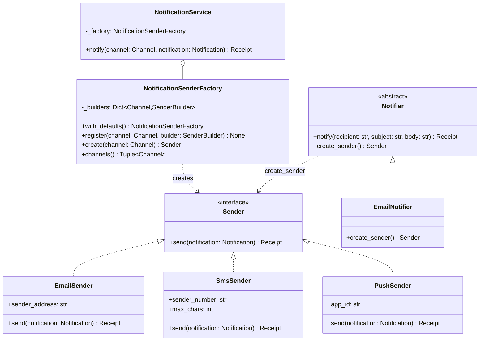

# Factory Method

## Intent

Move the decision "which concrete class do I build?" out of the code that uses the object and into a creator that makes it once. The notification service asks for `"sms"` and receives *a* `Sender`; adding a WhatsApp channel is a new class plus one registry entry, not another `elif` in every place that sends.

## When to use and when not to

**Use it when**

- The concrete class depends on runtime data: a string in a request, a key in a config file, a file extension, the operating system. Without a factory, every call site repeats the same switch.
- Construction needs knowledge the caller should not carry: credentials for the SMS gateway, which subclass matches `os.name`, whether to pool.
- Tests need to substitute the product. The factory is the one seam to inject; a registry entry that returns a stub replaces every sender at once.

**Leave it out when**

- There is one concrete class. `Car(plate)` needs no `CarFactory`; add the creator when the second class arrives.
- The caller already holds the class. A class is a callable in Python, so pass it: `build(EmailSender)` is a factory with no factory code.
- What must stay consistent is a *family* of products (storage and queue from the same cloud) rather than one product; that is Abstract Factory. Many optional parts assembled in steps is Builder.

## Structure

**Two creators, one product interface: the registry factory chooses by key, the Gang of Four creator chooses by subclass; the client sees only `Sender`.**



`NotificationSenderFactory` holds a dict from `Channel` to a callable that builds a sender. `NotificationService` depends on the factory and on `Sender`, never on a sender class. `Notifier` is the textbook form: `create_sender` is the factory *method*, and `EmailNotifier` overrides it.

## Canonical example in Python

The product interface and three products first (`code/patterns/factory_method.py`, tested by `code/patterns/tests/test_factory_method.py`):

```python title="code/patterns/factory_method.py — the product interface and the products"
--8<-- "code/patterns/factory_method.py:products"
```

The senders are frozen dataclasses that satisfy `Sender` by shape, and `Notification.from_template` is already a factory method of the smallest kind: an alternate constructor on the class itself. The creator and its client:

```python title="code/patterns/factory_method.py — the registry factory and its client"
--8<-- "code/patterns/factory_method.py:factory"
```

Four decisions to say out loud:

- **The registry holds callables, not classes.** A class is a zero-argument callable when its fields have defaults, `partial(EmailSender, "alerts@example.com")` is one that carries configuration, and `lambda: spy` is one that returns a test double. The factory never learns which it got.
- **An instance, not a module global.** `main` builds the factory and injects it into `NotificationService`; a test builds its own with stubs. No `reset`, no import-order surprises.
- **Two failures, two exceptions.** `"fax"` is not a channel at all (`ValidationError`, bad input); `"in_app"` is a real channel nobody registered (`NotFoundError`, bad configuration). Interviewers ask "what if the channel is misspelled?", and the answer is which line rejects it.
- **Normalise at the boundary.** `create` accepts `Channel | str` and converts once, so the rest of the module only ever sees the enum.

The name comes from the Gang of Four shape, where the factory method is a hook on an abstract creator:

```python title="code/patterns/factory_method.py — the Gang of Four creator"
--8<-- "code/patterns/factory_method.py:creator"
```

`notify` is a Template Method written once against `Sender`; each subclass decides what `create_sender` returns. The choice is welded to a class hierarchy, so a new channel is a new subclass. Draw the registry first and name this form when asked where the pattern came from.

Running `python -m patterns.factory_method` prints:

```text
--- one call site, three products, chosen by a key ---
email: email from noreply@example.com to ana@example.com: [Order A-42 shipped] It arrives on Tuesday.
  sms: sms from +10000000000 to ana@example.com: Order A-42 shipped: It arrives on Tuesday.
 push: push via handbook to ana@example.com: Order A-42 shipped
--- configuration travels in the builder; the factory never sees it ---
email from alerts@example.com to ana@example.com: [Order A-42 shipped] It arrives on Tuesday.
--- a misspelled channel and an unregistered one fail differently ---
ValidationError: unknown channel 'fax'
NotFoundError: no sender registered for 'in_app'
--- GoF shape: the factory method is a hook on the creator ---
email from billing@example.com to ana@example.com: [Invoice ready] Total 12.50 USD.
--- __init_subclass__: the class statement is the registration ---
registered: ['in_app', 'webhook']
inbox of ana@example.com: Order A-42 shipped
```

## Pythonic variant

Python gives you three factories for free. A **classmethod constructor** is a factory method on the product: `datetime.fromtimestamp`, `dict.fromkeys`, `Money.of("3.00")` and `Notification.from_template` above all build an instance from a shape the plain constructor does not accept. A **dict of callables** is the registry with the class removed:

```python
builders = {"email": EmailSender, "sms": partial(SmsSender, max_chars=70), "push": PushSender}
sender = builders[channel]()  # KeyError is your NotFoundError; wrap it at the boundary
```

The third form makes the class statement itself the registration:

```python title="code/patterns/factory_method.py — __init_subclass__ auto-registration"
--8<-- "code/patterns/factory_method.py:pythonic"
```

- **No list to forget.** Defining `InAppSender` with `channel=Channel.IN_APP` registers it; `for_channel` is the factory method and the registry is the class hierarchy.
- **The registry is process-wide.** A subclass defined in a test stays registered until the test removes it, which is the Singleton problem in a new coat.
- **Import order decides what exists.** A sender in a module nobody imports was never registered; frameworks solve this with an explicit `autodiscover` step.

| Reach for | When |
|---|---|
| The constructor | One concrete class |
| A classmethod constructor | Same class, a different input shape |
| A dict of callables | A handful of products, one call site, no configuration to validate |
| `NotificationSenderFactory` | Several call sites, registration at start-up, meaningful errors, stubs in tests |
| `__init_subclass__` | A plugin system where products are written by other teams or modules |

## Real-world usage

- **`pathlib.Path()`** returns a `PosixPath` or a `WindowsPath` depending on `os.name`: a factory method hiding inside `__new__`, which is why you never write `PosixPath` yourself.
- **Alternate constructors** are everywhere: `datetime.fromtimestamp`, `date.today`, `int.from_bytes`, `dict.fromkeys`, `Decimal.from_float`.
- **`logging.getLogger`** is a registry factory with a swappable product: `logging.setLoggerClass` changes what it builds without changing any caller.
- **`codecs.register`** and `importlib.metadata.entry_points` are registries of factory callables; Django's `Model.objects.create` and SQLAlchemy's `sessionmaker` are factories configured once and called everywhere.

## Related patterns and confusions

| Looks like Factory Method | How to tell them apart |
|---|---|
| **Simple factory** | A `create` method with a switch inside. The registry form on this page is one; the Gang of Four name strictly means the subclass hook. Say "a parameterised factory" and nobody will argue. |
| **Abstract Factory** | Many factory methods on one object, and the products must match: `create_storage` and `create_queue` from the same cloud. One key, one product, is this page. |
| **Builder** | Many optional parts assembled in steps, validated once at `build`; a factory makes the whole object in one call from one key. |
| **Strategy** | The factory *chooses* a strategy from a name; the strategy *is* the behaviour. `rules_by_name` on the Strategy page is the smallest factory there is. |
| **Prototype** | Creates by cloning a configured object instead of by calling a class; useful when set-up is expensive or the configuration is data. |
| **Template Method** | `Notifier.notify` is one; the Gang of Four Factory Method is a Template Method whose varying step happens to construct something. |

## Where it appears in LLD problems

- [Design a parking lot](../problems/parking-lot.md) — `VehicleFactory.create(vehicle_type, plate)` maps a string from the gate to `Car`, `Truck` or `Motorcycle` through a registry dict; adding a bus touches the registry, not the gate.
- [Design a vending machine (and a coffee machine)](../problems/vending-machine.md) — products and beverages are built from a slot code or recipe name.
- [Design a payment gateway and digital wallet](../problems/payment-gateway-wallet.md) — a `PaymentProcessor` per payment-method string (card, UPI, net banking), each an adapter over a provider.
- [Design a notification service (LLD)](../problems/notification-service.md) — one sender per channel behind one interface; that problem hands the dispatcher a ready-built `{Channel: sender}` map, which is this registry with the construction step removed.

## Interview tips

!!! tip "Interview tip"
    Name the key, the registry and the error in one breath: "the gate receives `'car'`; `VehicleFactory.create` looks it up in a dict of classes and raises `ValidationError` for anything unknown, so adding a bus is one entry." Then add the Python sentence: a class is a callable, so the registry can hold classes, `partial`s or lambdas, and a test registers a stub.

!!! warning "Common mistake"
    A factory that is still an `if/elif` ladder, now with a class around it. `create` that does `if channel == "email": return EmailSender()` has the ceremony without the benefit: every new product edits the method. Data drives the choice (a dict, a registry, a class attribute), code stays closed. Runner-up: registering products with a decorator in modules that are never imported, and discovering it in production.

## Related

- [Abstract Factory](abstract-factory.md) — several products that must match
- [Builder](builder.md) — one object from many optional parts
- [Dependency Injection](dependency-injection.md) — how the factory reaches the service
- [Design a parking lot](../problems/parking-lot.md) — `VehicleFactory` and the registry idiom in a full problem
- [Design a notification service (LLD)](../problems/notification-service.md) — senders per channel behind one factory
- Gamma, Helm, Johnson and Vlissides, *Design Patterns* (1994), Factory Method
- [PEP 487 — Simpler customisation of class creation](https://peps.python.org/pep-0487/)
- [Python documentation: `pathlib` — `Path`](https://docs.python.org/3/library/pathlib.html#pathlib.Path)
