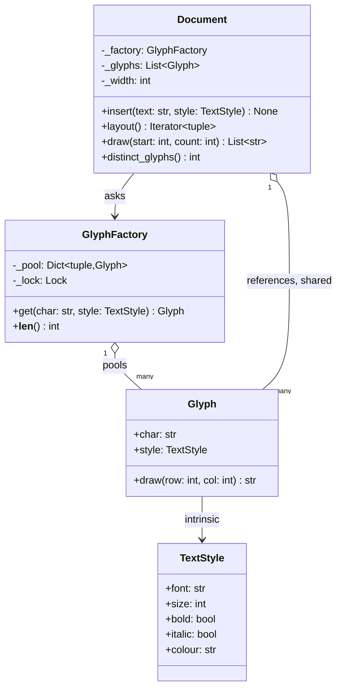

# Flyweight

## Intent

Support very large numbers of fine-grained objects by splitting their state in two: the part that repeats (intrinsic) lives once in an immutable shared object handed out by a factory, and the part that differs per use (extrinsic) is computed or stored outside and passed in when the object does its work. A document with a million characters needs one glyph object per distinct character-and-style pair, not one per character.

## When to use and when not to

**Use it when**

- You have many objects and most of their state is repeated: characters in a document, tiles on a map, particles, sprites, pieces on a board, markers on a chart. A 1 MB plain-text file is about 2^20, so roughly a million characters at 1 byte each; one style object per character is a million objects for three distinct styles.
- The repeated state is immutable, or can be made so. Sharing anything mutable is a bug generator, not an optimisation.
- The varying state is cheap to pass or compute: a position from an index, a square from a board lookup.
- You measured: `tracemalloc` showed that the objects are the problem.

**Leave it out when**

- The objects are few. A flyweight over two hundred objects is ceremony with no payoff.
- Most state is unique per object; then there is nothing to share and the factory only adds a lookup.
- You want to avoid *construction cost* rather than *memory*: that is a cache or an Object Pool, and the objects usually stay mutable and exclusive.
- The shared object would need a parent pointer or any per-use field. The moment a flyweight stores its position, it stops being shareable.

## Structure

**Four roles: the immutable Flyweight, the Factory that pools it by key, a second intrinsic value it references, and the Client that keeps the extrinsic state and passes it in.**



`Glyph.draw` takes `row` and `col` as arguments and stores neither. `Document` holds a list of references, many of them to the same object, and derives the position from the index at layout time.

## Canonical example in Python

The flyweight and its factory (`code/patterns/flyweight.py`, tested by `code/patterns/tests/test_flyweight.py`):

```python title="code/patterns/flyweight.py — intrinsic state, the Flyweight and its Factory"
--8<-- "code/patterns/flyweight.py:flyweight"
```

The client keeps what varies:

```python title="code/patterns/flyweight.py — the client computes the extrinsic state"
--8<-- "code/patterns/flyweight.py:document"
```

Four decisions to say out loud:

- **Split the state before you draw anything.** Character and style are intrinsic: they are the same for every `e` in 12pt body text. Position is extrinsic: it differs for every occurrence and falls out of `divmod(index, width)`, so the document stores an index, not coordinates.
- **Frozen dataclasses make the key and the contract.** `TextStyle` is hashable because it is frozen, so `(char, style)` is a dict key; and frozen means a shared glyph cannot be changed under the other thousand references. The demo shows the `FrozenInstanceError`.
- **Equality is free; identity needs the pool.** `Glyph("e", body) == factory.get("e", body)` holds without a factory. The memory saving comes from the `is`, and only the factory can promise it.
- **The factory's lock makes check-then-create atomic.** Two threads asking for the same key at the same moment must get one object; the concurrency test fires sixteen workers at five keys and the pool ends at five.

Running `python -m patterns.flyweight` prints:

```text
--- a document of hundreds of characters, built from a few dozen shared objects ---
characters: 909, glyph objects: 40, pool size: 40
the 'e' of 'the' on line one and on line two: same object -> True
--- extrinsic state: the position is computed at layout time and passed in ---
'F' at (0,0) in Helvetica 18b black
'l' at (0,1) in Helvetica 18b black
't' at (1,0) in Helvetica 12 black
--- shared objects must be immutable, and the dataclass enforces it ---
FrozenInstanceError: cannot assign to field 'char'
--- chess: 32 squares on the board, 12 piece objects in memory ---
squares: 32, objects: 12, cache: 12
e2 and d2 share one white pawn: True; symbols: rnbqkbnr
--- the interpreter does it too: small ints, interned strings, compiled patterns ---
int('256') is int('256'): True; int('257') is int('257'): False
two built strings: False; after sys.intern: True
re.compile returns the cached pattern: True
```

## Pythonic variant

Python has two built-in flyweight factories. `functools.cache` on a constructor function is the pool, the lock and the lookup in one decorator, and `Enum` members are flyweights by construction: one object per member, shared by every reference, compared with `is`:

```python title="code/patterns/flyweight.py — Enum members and a cached constructor"
--8<-- "code/patterns/flyweight.py:pythonic"
```

The board is a dict from square to piece: the square is extrinsic and belongs to the board, the kind and colour are intrinsic and belong to twelve shared `Piece` objects. Moving a piece is a dict update; no piece object ever changes.

| Reach for | When |
|---|---|
| An `Enum` | The set of flyweights is fixed and known when the code is written (piece kinds, cell types, log levels) |
| `functools.cache` on a constructor | The key space is small and bounded; the cache may live for the process |
| A `weakref.WeakValueDictionary` pool | The key space is unbounded and unused flyweights should be collectable |
| An explicit factory class with a lock | You need `__len__`, eviction, statistics, or a test that asserts the pool size |
| `sys.intern` | The flyweights are strings compared many times; identity makes `==` a pointer check |

## Real-world usage

- **CPython itself**: small integers are pre-allocated and shared, identifiers and short strings are interned, `None`, `True` and `False` are singletons, and `re.compile` returns the cached pattern object for a repeated pattern.
- **`enum.Enum`**: every member is a shared object; `PieceKind.KING is PieceKind.KING` is the whole point. `datetime.timezone.utc` and `decimal` contexts are shared immutable values in the same spirit.
- **`functools.cache` / `lru_cache`** in front of any pure constructor turns it into a flyweight factory.
- **Frameworks and engines**: sprite and texture atlases shared across thousands of game objects, glyph caches in every text renderer and browser, NumPy views sharing one buffer.

## Related patterns and confusions

| Looks like Flyweight | How to tell them apart |
|---|---|
| **Singleton** | One instance per *class*, reached globally. A flyweight is one instance per *value*, reached through a factory; a Singleton is the degenerate flyweight with a single key. |
| **Object Pool** | Hands out *exclusive, mutable* objects and takes them back (connections, threads). A flyweight is *shared and immutable*, and nobody gives it back. |
| **Prototype** | Clones to produce *distinct* copies you can then change. A flyweight returns the *same* object you must not change. |
| **Cache / memoisation** | The same mechanism, a different purpose. A cache saves recomputation; a flyweight saves memory through identity. `functools.cache` serves both; call it a flyweight when sharing is the point. |
| **Value object** | The prerequisite, not the pattern. Every flyweight is a value object; a value object becomes a flyweight when a factory guarantees one instance per value. |
| **Composite** | The GoF text shares leaves of a large composite as flyweights; the price is that shared leaves cannot hold a parent pointer, so the walk must carry the context. |

## Where it appears in LLD problems

- [Design a text editor with undo and redo](../problems/text-editor.md) — characters and styles as shared glyphs; the undo stack stores indexes and references, not copies of the text.
- [Design chess](../problems/chess.md) — twelve shared piece objects, a board that maps squares to them, and move generation that takes the square as an argument.
- [Design the snake game](../problems/snake-game.md) — cell types and sprites shared across the grid; only coordinates change each tick.

## Interview tips

!!! tip "Interview tip"
    Split the state out loud before naming the pattern: "character and style are intrinsic and immutable, so they go in a shared `Glyph`; position is extrinsic and comes from the index, so it is passed to `draw`." Then name the factory and its lock, give the Python shortcut (`functools.cache` on the constructor, or an `Enum` when the set is fixed) and say you would measure with `tracemalloc` before doing any of it.

!!! warning "Common mistake"
    Letting extrinsic state leak into the flyweight. A `Glyph` with a `position` field, or a mutable `TextStyle` whose colour gets changed for one heading, either destroys the sharing or changes every character that shares it. Keep flyweights frozen and keep per-use state with the client. Runner-up: reaching for the pattern at two hundred objects, where the lookup costs more than it saves.

## Related

- [Prototype](prototype.md) — clone to get a distinct copy, the opposite of sharing one
- [Singleton](singleton.md) — one per class rather than one per value
- [Object Pool](object-pool.md) — exclusive mutable objects checked out and returned
- [Design a text editor with undo and redo](../problems/text-editor.md) — glyph sharing in a full problem
- [Design chess](../problems/chess.md) — shared pieces on a board of squares
- [Design the snake game](../problems/snake-game.md) — shared cell types on a grid
- Gamma, Helm, Johnson and Vlissides, *Design Patterns* (1994), Flyweight
- [Python documentation: `functools.cache`](https://docs.python.org/3/library/functools.html#functools.cache)
- [Python documentation: `enum` — how are Enums different?](https://docs.python.org/3/howto/enum.html#how-are-enums-different)
