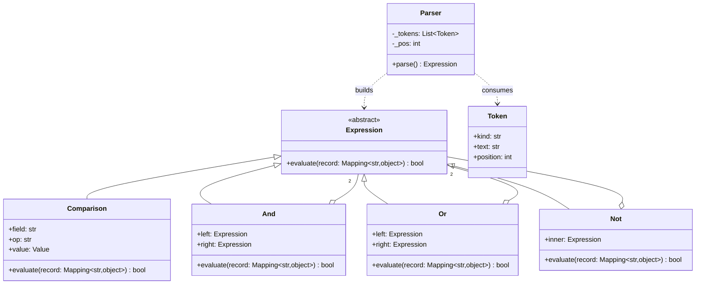

# Interpreter

## Intent

Represent each rule of a small grammar as a class, parse a sentence into a tree of those objects, and evaluate the tree by asking every node to interpret itself against a context. Users get a language they can write without a deployment; you pay with a tokenizer, a parser and a grammar you now own.

## When to use and when not to

**Use it when**

- Rules arrive as text from people who do not ship code: alert thresholds, fraud rules, search filters, feature-flag targeting.
- The grammar is small and stable: comparisons, `AND`, `OR`, `NOT` and parentheses, with no ambition to become a programming language.
- You need more than evaluation: list the fields a rule reads, render it back, translate it to SQL. A tree can be walked; a compiled regex cannot.

**Leave it out when**, which is most of the time:

- The grammar is someone else's. Thresholds in JSON or YAML, schedules in cron syntax, file patterns in globs, text patterns in regular expressions: the stdlib already has the parser and the evaluator.
- The expressions are Python. `ast.parse(text, mode="eval")` gives you the tree; allowlist the node types and walk it.
- The rules are built in code, not parsed from text: that is Specification, the same tree assembled with operators and no parser.
- The grammar keeps growing (functions, types, string escapes, error recovery): use a parser generator or reconsider the feature.

## Structure

**The grammar as classes: one abstract node, one leaf that compares a field with a literal, three non-terminals for the operators, and a Parser that turns tokens into the tree. The Context is a plain mapping.**



The non-terminals hold other expressions and nothing else, so the tree is a Composite. `Parser` is the only class that knows the grammar's syntax; the nodes know only its meaning. `Comparison` is a leaf because the record, not the tree, supplies the field's value.

## Canonical example in Python

The nodes come first (`code/patterns/interpreter.py`, tested by `code/patterns/tests/test_interpreter.py`):

```python title="code/patterns/interpreter.py — the expression nodes"
--8<-- "code/patterns/interpreter.py:nodes"
```

Every node has one method, and that method is the meaning of one production. `lookup` makes an unknown field an error rather than a silent `False`, which is the difference between a rule that is wrong and a rule that merely looks right.

The grammar and the parser:

```python title="code/patterns/interpreter.py — tokens and the recursive-descent parser"
--8<-- "code/patterns/interpreter.py:parser"
```

Three decisions to say out loud:

- **Precedence is the call structure.** `_or` calls `_and`, which calls `_unary`, so `a OR b AND c` groups as `a OR (b AND c)` without a precedence table. A new precedence level is a new method between two existing ones.
- **Frozen dataclasses make a parsed rule a value.** Equal text parses to equal trees and trees are hashable, so a cache of parsed rules is a dict. Parse once at save time, evaluate per record.
- **Two kinds of error, two exception types.** `ParseError` carries a position and belongs to the person typing the rule; `NotFoundError` for a missing field belongs to whoever shaped the record. Validating a rule at save time means parsing it *and* checking `fields_read` against the schema.

Running `python -m patterns.interpreter` prints:

```text
--- the rule as text, and the tree the parser builds from it ---
amount > 100 AND country = "US"
And(left=Comparison(field='amount', op='>', value=100), right=Comparison(field='country', op='=', value='US'))
--- three rules against three records ---
record                              big US order         risky   vip or bulk
amount=250 country=US tier=silver            yes            no            no
amount=80 country=DE tier=gold                no           yes           yes
amount=900 country=CA tier=bronze             no           yes           yes
--- the tree is data: a second operation without touching the nodes ---
fields read by 'risky': attempts, country
parsed rules are values: parse(text) == parse(text) -> True
--- errors say where and why ---
parse error in 'amount > AND': expected a value at position 9, found 'AND'
parse error in 'country = "US': unterminated string at position 10
parse error in '(amount > 1': expected ')' at position 11, found end of input
evaluation error: record has no field 'tier'
--- the match-statement evaluator agrees with the methods on all 9 cases: True ---
```

## Pythonic variant

The evaluator does not have to live on the nodes. A `match` statement over the same frozen dataclasses does the dispatch in one function, and a second operation over the tree is a second function rather than a method on every class:

```python title="code/patterns/interpreter.py — the evaluator and a second walk as match statements"
--8<-- "code/patterns/interpreter.py:match_form"
```

This is the Visitor trade-off in miniature: methods on nodes make a new node cheap; functions with `match` make a new operation cheap. Rule engines add operations (explain, translate, lint) far more often than node types.

When the rule language is Python itself, do not write a parser at all. `ast` gives you the tree; your job is the allowlist:

```python
import ast

ALLOWED = (ast.Expression, ast.BoolOp, ast.UnaryOp, ast.Compare, ast.Name, ast.Constant, ast.Tuple,
           ast.And, ast.Or, ast.Not, ast.Gt, ast.GtE, ast.Lt, ast.LtE, ast.Eq, ast.NotEq, ast.In, ast.Load)


def parse_python_rule(text: str) -> ast.Expression:
    tree = ast.parse(text, mode="eval")
    for node in ast.walk(tree):
        if not isinstance(node, ALLOWED):
            raise ValueError(f"{type(node).__name__} is not allowed in a rule")
    return tree
```

Then evaluate with a `match` over `ast` nodes exactly as above. Never `eval(text)`: a rule is user input, and `eval` runs it with your process's privileges.

| Reach for | When |
|---|---|
| `re`, `fnmatch`, `json`, cron, `string.Template` | The grammar already exists; you only need the evaluator someone else wrote |
| Specification objects with operator overloads | Rules are assembled in code or from a form, never parsed from text |
| `ast.parse` plus an allowlist and `match` | Rules are written in Python syntax by people you trust to write Python |
| Tokenizer plus recursive descent (this page) | A small, stable, user-facing language of your own |
| A parser generator (Lark, ANTLR) | Anything bigger, or anything that needs good error recovery |

## Real-world usage

- **`re`** is the Interpreter you use every day: `re.compile` parses a pattern language into a matcher, and the matcher interprets it against each string. `fnmatch` and `glob` translate a smaller language *into* regular expressions instead of interpreting it directly.
- **`string.Template`, `str.format` and f-strings** interpret a substitution mini-language; `ast.literal_eval` is the allowlisted evaluator for one tiny grammar.
- **`sqlite3`** ships a complete SQL parser and interpreter; every ORM that accepts `amount__gt=100` builds the same tree without text.
- **Frameworks**: Django's `Q` lookups and Elasticsearch's query DSL are trees you build; Prometheus alert rules, `jq` filters and feature-flag targeting rules are trees parsed from text.

## Related patterns and confusions

| Looks like Interpreter | How to tell them apart |
|---|---|
| **Specification** | The same tree (`And`, `Or`, `Not` over leaves) built with operators in code instead of parsed from text. Specification has a fixed grammar and no parser; add a parser and you have arrived here. |
| **Composite** | The syntax tree *is* a Composite; Interpreter adds the grammar that produces it and the `evaluate` that consumes it. |
| **Visitor** | When the tree needs a second operation (render to SQL, list fields), put it in a Visitor or in a `match` function as `fields_read` does. Interpreter defines the nodes; Visitor keeps them closed while operations grow. |
| **Strategy** | A strategy is a fixed algorithm chosen at runtime; an interpreted rule is an algorithm *described* at runtime. Rules often decide which strategy applies. |
| **Flyweight** | Terminal nodes that carry no per-tree state can be shared across trees; the Gang of Four name this as the classic use of Flyweight. |

## Where it appears in LLD problems

- [Design a rate limiter (LLD)](../problems/rate-limiter-lld.md) — which rule applies to a request: `path = "/api/orders" AND tier = "free"`, parsed once from configuration. Say out loud that a dict keyed by endpoint does the job until the rules need `OR`.
- [Design Stack Overflow](../problems/stack-overflow.md) — search syntax such as `[python] is:unanswered score:5`: a tokenizer and a flat grammar parsed into Specification filters, with ranking left to a Strategy.
- [Design an in-memory key-value store with transactions](../problems/kv-store-transactions.md) — the REPL's `SET a 1`, `BEGIN`, `ROLLBACK` line grammar: a tokenizer and a dispatch table, which is as much Interpreter as the problem needs.

## Interview tips

!!! tip "Interview tip"
    Write the grammar before the classes, a few lines of EBNF on the whiteboard, then say "one method per production, precedence is the call order, the nodes are frozen dataclasses so a parsed rule is a value I can cache". Then name what you would use instead: `ast` with an allowlist if the rules are Python, Specification if they come from a form, `re` or cron if the language already exists.

!!! warning "Common mistake"
    `eval(rule_text)`. It is the one-line interpreter that also runs `__import__("os").system(...)` with your process's privileges; `ast.literal_eval` handles literals only, and an allowlisted `ast` walk is the safe version. Runner-up: parsing a grammar with parentheses using regular expressions. Regular languages cannot count brackets; the day a user nests two levels, that approach is over.

## Related

- [Specification](specification.md) — the same tree without a parser
- [Visitor](visitor.md) — operations over the tree, kept apart from the nodes
- [Composite](composite.md) — the structure of the syntax tree
- [Design a rate limiter (LLD)](../problems/rate-limiter-lld.md) — rules that select a limit
- [Design Stack Overflow](../problems/stack-overflow.md) — a search-query grammar
- Gamma, Helm, Johnson and Vlissides, *Design Patterns* (1994), Interpreter
- [Python documentation: `ast` — Abstract Syntax Trees](https://docs.python.org/3/library/ast.html)
- [Python documentation: Regular Expression HOWTO](https://docs.python.org/3/howto/regex.html)
