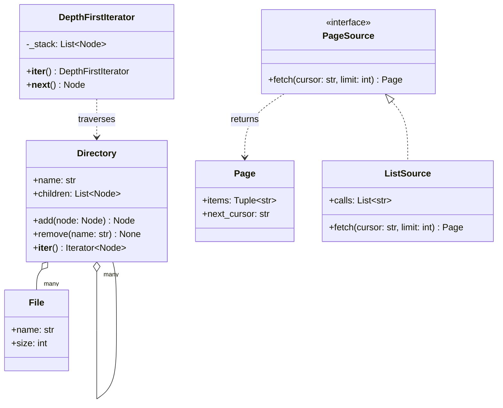

# Iterator

## Intent

Visit the elements of an aggregate one at a time without exposing how it stores them. The caller gets `next` and nothing else, so traversal order is a decision separate from the structure, several walks can be in flight at once, and the structure can change from a list to a tree to a database cursor without any `for` loop noticing.

## When to use and when not to

**Use it when**

- The order of traversal is a choice (depth-first, breadth-first, by size) that does not belong inside the structure.
- The sequence is lazy, large or remote: pages from an API, rows from a cursor, lines from a file. Materialising it costs memory and time the caller may never need.
- Callers compose: `islice` for the first few, a filter for files only, `sum` for total size, none of which knows about the tree.
- Two walks must proceed independently; each iterator keeps its own position.

**Leave it out when**

- The structure is a list and the caller wants a list. Return the list.
- The caller needs random access, `len` or repeated passes over the same data; that is a sequence, not an iterator.
- The caller must modify the collection during the walk. Snapshot first (as `Directory.__iter__` does) or collect, then mutate.

## Structure

**The Aggregate hands out iterators over its children, the classic Iterator keeps the traversal state, and a page source shows the same idea over a remote sequence.**



`Directory` is iterable, not an iterator: every `__iter__` call returns a fresh iterator over a snapshot. `DepthFirstIterator` is an iterator: `__iter__` returns itself and its stack is the whole state of the walk. The generators and `paginate` have no box because they are functions; `PageSource` is what `paginate` pulls from.

## Canonical example in Python

The tree and the classic iterator come first (`code/patterns/iterator.py`, tested by `code/patterns/tests/test_iterator.py`):

```python title="code/patterns/iterator.py — the aggregate and the classic iterator"
--8<-- "code/patterns/iterator.py:tree"
```

Three decisions to say out loud:

- **Iterable versus iterator.** `Directory.__iter__` returns a *new* iterator every time, so `for child in root` works twice and two callers can walk at once. `DepthFirstIterator.__iter__` returns `self`, which lets a `for` loop drive it and also makes it one-shot.
- **Snapshot on entry.** `iter(tuple(self.children))` costs one tuple of references, no copying of nodes, and buys the guarantee that `remove` during a walk neither raises nor skips the next sibling, which a plain list iterator gets wrong.
- **The stack is the state.** Pre-order must remember what is left to visit; the class keeps it in `_stack`, pushing children reversed so the first child comes out first. The generator below keeps the same state in its frame.

The generators:

```python title="code/patterns/iterator.py — the same walks as generators"
--8<-- "code/patterns/iterator.py:generators"
```

`walk_depth_first` is the pattern in a handful of lines: the call stack replaces `_stack`, `yield from` delegates to the sub-walk, and nothing runs until the caller pulls. `files_only` is the composition rule: any iterator in, another iterator out, one element at a time.

A paginated source is the same idea over a network:

```python title="code/patterns/iterator.py — an iterator over remote pages"
--8<-- "code/patterns/iterator.py:pagination"
```

The caller writes `for member in paginate(api, 100)` and never sees a cursor. The second page is fetched only when the first is exhausted, so `islice(..., 3)` over a group of any size costs one request. `ListSource` records its calls, which is how the tests prove it.

Running `python -m patterns.iterator` prints:

```text
--- the tree: root/{docs/{intro.md, api.md}, src/{main.py, util.py}, README} ---
DepthFirstIterator:  docs, intro.md, api.md, src, main.py, util.py, README
walk_depth_first:    docs, intro.md, api.md, src, main.py, util.py, README
walk_breadth_first:  docs, src, README, intro.md, api.md, main.py, util.py
class and generator agree on the order: True
--- the caller composes with itertools and never sees the tree ---
first three files:   intro.md, api.md, main.py
total size:          5600 bytes
--- an iterable can be walked twice; an iterator is one-shot ---
root children twice: 3 then 3
same iterator twice: 7 then 0
--- paginate hides the cursor; pages are fetched only as consumed ---
first three members: alice, bob, carol (2 fetches of 2)
all 7 members:       3 more fetches of 3, cursors [None, '3', '6']
```

## Pythonic variant

In Python the pattern is built into the language, so the variant *is* the idiom:

- **The protocol is two methods.** `iter(x)` calls `x.__iter__()`; `next(it)` calls `it.__next__()` until `StopIteration`. A `for` loop is exactly that, and so are `list(...)`, `sum(...)`, unpacking and `in`.
- **A generator function is an iterator class written by the compiler.** The locals are the fields, the position in the code is the state, `return` raises `StopIteration`. Write the class only when the iterator needs methods beyond `__next__`: peek, rewind, a `close` that releases a connection.
- **`itertools` is the standard library of iterator combinators.** `islice` stops early, `chain` concatenates walks, `takewhile` cuts at a predicate, `groupby` batches, and `iter(callable, sentinel)` turns a `read()` into an iterator.

```python
from itertools import chain, islice, takewhile

small = takewhile(lambda node: node.size < 2000, files_only(walk_depth_first(root)))
heads = chain(islice(walk_depth_first(root), 2), islice(walk_breadth_first(root), 2))
```

| Reach for | When |
|---|---|
| Return the list | Small, already materialised, the caller wants `len` and indexing |
| A generator function | Any lazy or recursive walk; the default |
| `__iter__` on the aggregate returning a generator | The structure should work in `for`, `in`, `list` and `sum` directly |
| An iterator class with `__next__` | The iterator needs extra methods, or state the caller can inspect (the cursor, items fetched so far) |
| `itertools` over any of the above | Early exit, batching, merging, filtering, without touching the producer |

## Real-world usage

- **`os.walk` and `os.scandir`**: a generator over a directory tree that yields one level at a time; you prune the walk by editing the `dirs` list in place.
- **File objects, `csv.reader`, `sqlite3.Cursor`**: iterators over lines, records or rows, pulled as the loop advances, which is why a file larger than memory fits in a `for` loop.
- **`pathlib.Path.rglob`, `ast.walk`, `zipfile.ZipFile.infolist`**: traversals over trees that never hand you the tree.
- **Frameworks**: boto3 paginators and the GitHub API's `Link` headers are `paginate`; Django's `QuerySet.iterator()` streams rows in chunks; a Kafka consumer is an iterator that blocks instead of stopping.

## Related patterns and confusions

| Looks like Iterator | How to tell them apart |
|---|---|
| **Composite** | The tree being walked. Composite decides the *shape*; Iterator decides the *order* in which you see it. Putting `__iter__` on the composite is the usual marriage. |
| **Visitor** | An iterator puts the loop in the caller (pull); a visitor pushes the operation into the structure (double dispatch). Iterator for a filter or a sum; Visitor when the operation differs by node type. |
| **Generator versus coroutine** | A generator is the language's implementation of an iterator. A coroutine (`send`) is something else: data flows *into* it. |
| **Observer** | Pull versus push. An iterator yields when asked; an observer is called when the subject decides. Turning one into the other needs a queue. |
| **Memento** | The iterator's state (the stack, the cursor) is a memento of the traversal; the Gang of Four mention using one to resume a walk. |
| **Strategy** | The traversal order injected into the aggregate is a strategy; each order is a different generator. |

## Where it appears in LLD problems

- [Design an in-memory file system](../problems/in-memory-file-system.md) — `find` by name or extension and recursive `size` are `walk_depth_first` with a filter and a `sum`; delete-while-iterating is the snapshot decision in `Directory.__iter__`.
- [Design a library management system](../problems/library-management.md) — catalogue search results as a paginated iterator, and a walk over a book's copies to find one that can be loaned.
- [Design an in-memory key-value store with transactions](../problems/kv-store-transactions.md) — a prefix scan is an iterator over a snapshot of sorted keys: `bisect` for the start, `takewhile` for the end, so writes during the scan are not observed.

## Interview tips

!!! tip "Interview tip"
    Say "the tree is iterable, the walk is a generator" and write `__iter__` as a three-line generator on the whiteboard. Then name the two things the interviewer is fishing for: what happens if the collection changes during the walk (snapshot, or fail fast as `dict` does), and where the order is decided. Mention `islice`: the caller can stop early without the producer's help.

!!! warning "Common mistake"
    `__iter__` returning `self` on a *collection*. The class now works in one `for` loop and silently yields nothing in the second, because the exhausted state lives on the object. Return a fresh iterator (a generator) from the aggregate and reserve `return self` for the iterator class. Runner-up: a generator holding a lock or a database connection across `yield`; the caller may pause the loop for minutes.

## Related

- [Composite](composite.md) — the tree that gets walked
- [Visitor](visitor.md) — push instead of pull over the same tree
- [Design an in-memory file system](../problems/in-memory-file-system.md) — walks, finds and recursive sizes
- [Design a library management system](../problems/library-management.md) — paginated search results
- [Design an in-memory key-value store with transactions](../problems/kv-store-transactions.md) — prefix scans over a snapshot
- [PEP 234 — Iterators](https://peps.python.org/pep-0234/)
- [PEP 255 — Simple Generators](https://peps.python.org/pep-0255/)
- [Python documentation: `itertools`](https://docs.python.org/3/library/itertools.html)
