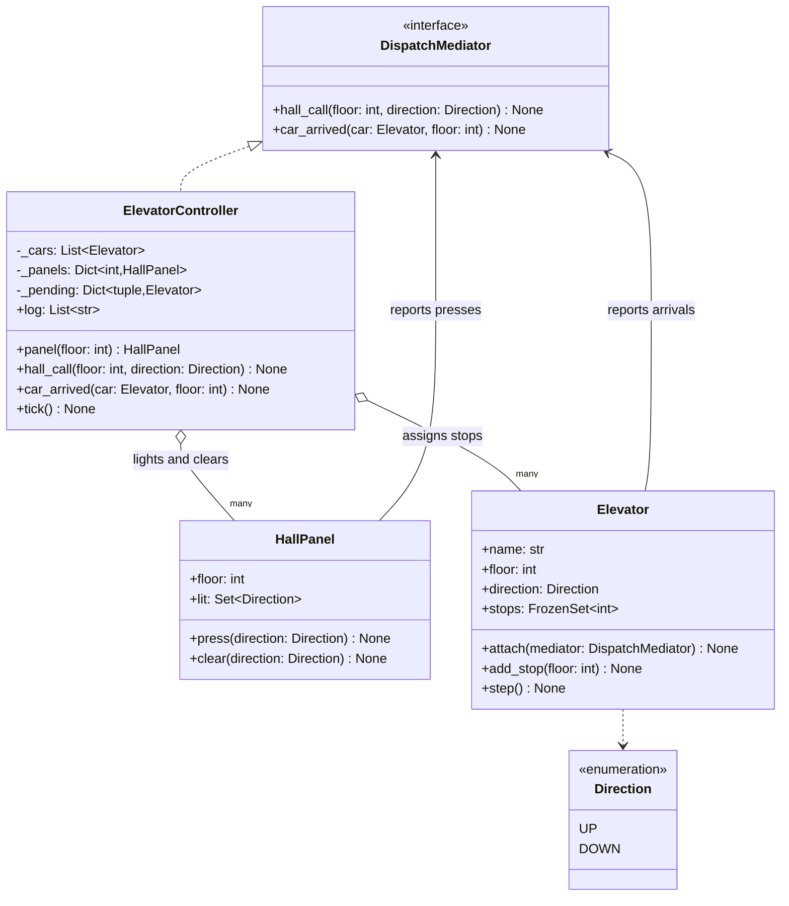
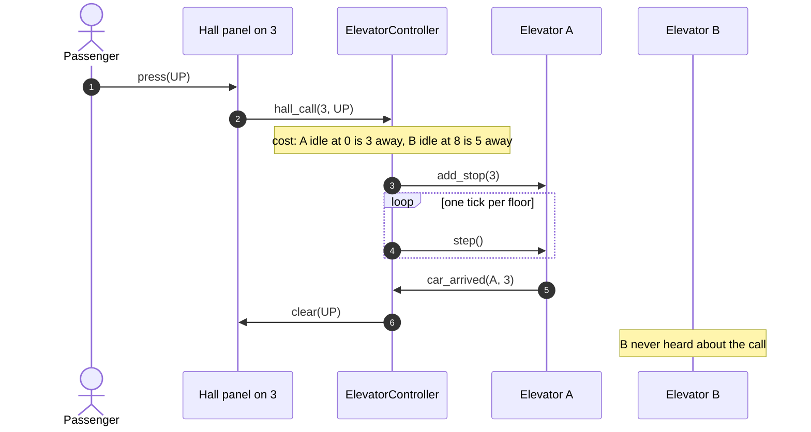

# Mediator

## Intent

Move the interactions between a group of objects into one object they all talk to, so that none of them holds a reference to another. The colleagues stay small and reusable, the rules of the conversation live in one place you can read and test, and adding a colleague changes the mediator rather than every peer.

## When to use and when not to

**Use it when**

- Objects that should be simple are tangled: a car that knows every hall panel, a panel that knows every car. N colleagues talking to each other is N x (N - 1) connections; through a mediator it is N.
- The rules of the interaction are a policy you expect to change: which car answers a call, who may speak to whom, what happens when two bidders bid at once.
- You want to test the coordination without the colleagues: a controller fed by fake panels and cars that record what they were told.

**Leave it out when**

- Two objects talk. A method call is the mediator.
- The subject does not care who listens and nothing decides; that is Observer, or an event bus once topics are involved.
- The mediator would only forward calls. A mediator with no policy is an indirection tax; the colleagues may as well call each other.
- The coordination is a long-running workflow across services with persistent state; that is a saga or an orchestrator, not an in-process object.

## Structure

**Two kinds of colleague, the mediator interface they depend on, and one concrete controller that holds every decision and the state of the conversation.**



No arrow runs between `HallPanel` and `Elevator`; that missing edge is the pattern. Both depend on the two-method `DispatchMediator` interface, so a test can stand in a recorder for the controller. `ElevatorController` is the only class with more than one kind of collaborator.

## Canonical example in Python

The colleagues come first (`code/patterns/mediator.py`, tested by `code/patterns/tests/test_mediator.py`):

```python title="code/patterns/mediator.py — the mediator interface and the two colleagues"
--8<-- "code/patterns/mediator.py:colleagues"
```

Three decisions to say out loud:

- **Colleagues depend on a Protocol, not on the controller.** A panel knows how to light a lamp and whom to tell about a press; a car knows how to move and whom to tell about an arrival. Cabin buttons call `add_stop` directly, because a car's own stops are not an interaction between colleagues. The mediator is for what happens *between* objects, not for everything.
- **Per-colleague behaviour stays in the colleague.** The LOOK rule (keep going while stops remain ahead, then turn) is the car's business. Pulling it into the controller is the first step towards the god object in the warning below.
- **Pressing twice is absorbed at the edge.** The panel ignores a press for a lamp that is already lit, so the mediator never sees duplicate calls and never has to deduplicate them.

The mediator owns the two decisions that would otherwise be smeared across every colleague:

```python title="code/patterns/mediator.py — the controller"
--8<-- "code/patterns/mediator.py:mediator"
```

`_cost` is the dispatch policy in one place: nearest car that is idle or already heading that way, else the least busy. Swap the method and every colleague is untouched, which is where a Strategy plugs in. `_pending` is the state of the conversation: which car serves which call. Without it, any car stopping at floor 3 would clear a lamp it was not serving. State about the relationship belongs in the mediator; state about the car stays in the car.

**A hall call and its answer: the panel and the car never address each other.**



Running `python -m patterns.mediator` prints:

```text
--- two cars, ten floors; panels and cars only ever talk to the controller ---
start:  A@0  B@8                                 lamps: none
calls:  A@0 [3]  B@8 [7]                         lamps: 3up, 7down
tick 1: A@1 up [3]  B@7 down                     lamps: 3up
tick 2: A@2 up [3]  B@7                          lamps: 3up
tick 3: A@3 up [6]  B@7                          lamps: none
tick 4: A@4 up [6]  B@7                          lamps: none
controller log:
  call 3 up: assigned to A
  call 7 down: assigned to B
  B arrived at 7: cleared down
  A arrived at 3: cleared up
--- the chat room: the same shape with callables and a routing policy ---
alice broadcasts -> delivered to 2
bob broadcasts   -> delivered to 1 (carol blocked bob)
bob to alice     -> delivered to 1
  alice  ['bob: hi', 'bob: psst']
  bob    ['alice: hello all']
  carol  ['alice: hello all']
rejected: 'dave' is not in the room
```

## Pythonic variant

When colleagues only need to receive, they do not need a class or a `set_mediator` call: a colleague is a callable, and the mediator is a dict plus a policy. The chat room is the textbook example in that form:

```python title="code/patterns/mediator.py — a chat room over plain callables"
--8<-- "code/patterns/mediator.py:hub"
```

- **Members are callables.** A lambda appending to a list, a bound method on an `Inbox`, a function that posts to a socket: the room cannot tell them apart and never holds one member's reference to another.
- **The policy is the point.** Blocking, direct messages and excluding the sender from a broadcast live in `say`. Take the policy away and `ChatRoom` degrades into an event bus, which is the right tool when there is no policy.
- **Return values close the loop.** `say` reports how many members received the message, so the caller can tell a blocked delivery from a silent one without knowing the rule.

| Reach for | When |
|---|---|
| A direct method call | Two objects, one direction |
| Observer | One subject, many listeners, no decision about who hears what |
| An event bus | Many publishers and subscribers decoupled by topic, still no decision |
| A mediator over callables | Many-to-many with a routing policy, colleagues that only receive |
| A mediator with a Protocol | Colleagues that both report and are commanded, state about the relationship, a policy you will swap |

## Real-world usage

- **The `asyncio` event loop**: coroutines never schedule each other. They hand control to the loop, which decides who runs next, wires futures to callbacks and owns timers and I/O readiness. `loop.call_soon` and `Future.add_done_callback` are colleagues talking to the mediator.
- **GUI toolkits**: `tkinter`'s `mainloop` and Qt's event dispatch route events to widgets, and a dialog controller that enables OK only when every field validates is the Gang of Four's own example.
- **Django `Form.clean()`**: fields validate themselves; cross-field rules (end date after start date) live in the form, the mediator between fields.
- **Board games**: a `Board` that validates a chess move against every other piece is a mediator; pieces never consult each other.

## Related patterns and confusions

| Looks like Mediator | How to tell them apart |
|---|---|
| **Observer** | A subject emits and observers react; nobody decides who should hear what. A mediator receives, decides and directs. Mediators often *use* Observer to hear from colleagues, which is why the two get conflated. |
| **Event Bus** | Delivery by topic with no policy; publishers and subscribers are unknown to each other. A bus that grows routing rules is a mediator in disguise, and should be named as one. |
| **Facade** | A facade simplifies a subsystem for outsiders, and the subsystem does not know it exists. A mediator coordinates peers that know it and report to it. |
| **Command** | The hall call is a request object; the controller is who receives it and decides. Commands are the messages, the mediator is the router. |
| **Strategy** | The dispatch rule inside the controller is a strategy; the controller is the mediator that applies it. |
| **Singleton** | Controllers are often made singletons out of habit. One instance created at the composition root is enough. |

## Where it appears in LLD problems

- [Design an elevator system](../problems/elevator-system.md) — `ElevatorController` between hall calls, cars and displays, with the dispatch strategy plugged into it and per-car stop sets kept in the cars.
- [Design an online auction](../problems/online-auction.md) — the bid service between bidders: validate against the current high bid, resolve proxy bids, notify the outbid bidder. Bidders never see each other.
- [Design Uber (LLD) with driver matching](../problems/ride-sharing-lld.md) — the matching service between riders, drivers and the location index, owning the offer, accept and timeout cascade.
- [Design a traffic signal controller](../problems/traffic-signal.md) — the intersection controller that makes conflicting greens impossible; lights never consult each other.

## Interview tips

!!! tip "Interview tip"
    Draw the star, not the mesh: every colleague points at one box. Then say what the box decides (the dispatch rule, the lamp rule) and what state it keeps (pending calls), because a mediator with no decision is plumbing. Close with how you would test it: fake colleagues that record what they were told, driven by a tick.

!!! warning "Common mistake"
    The god object. A mediator that absorbs the colleagues' own behaviour (moving the car, lighting the lamp, validating a field) until nobody can read it. Only the *interaction* moves into the mediator; per-colleague behaviour stays where it was. Runner-up: calling it Observer. If the object decides who hears what, it is a mediator, and hiding that policy in subscriber order is a bug waiting to happen.

## Related

- [Observer](observer.md) — one-to-many without a decision
- [Event Bus](event-bus.md) — decoupling by topic, no policy
- [Design an elevator system](../problems/elevator-system.md) — the controller as mediator
- [Design an online auction](../problems/online-auction.md) — bidders coordinated by the bid service
- [Design Uber (LLD) with driver matching](../problems/ride-sharing-lld.md) — the matching service
- [Design a traffic signal controller](../problems/traffic-signal.md) — the intersection controller
- Gamma, Helm, Johnson and Vlissides, *Design Patterns* (1994), Mediator
- [Python documentation: `asyncio` Event Loop](https://docs.python.org/3/library/asyncio-eventloop.html)
- [Django documentation: Cleaning and validating fields that depend on each other](https://docs.djangoproject.com/en/stable/ref/forms/validation/#cleaning-and-validating-fields-that-depend-on-each-other)
