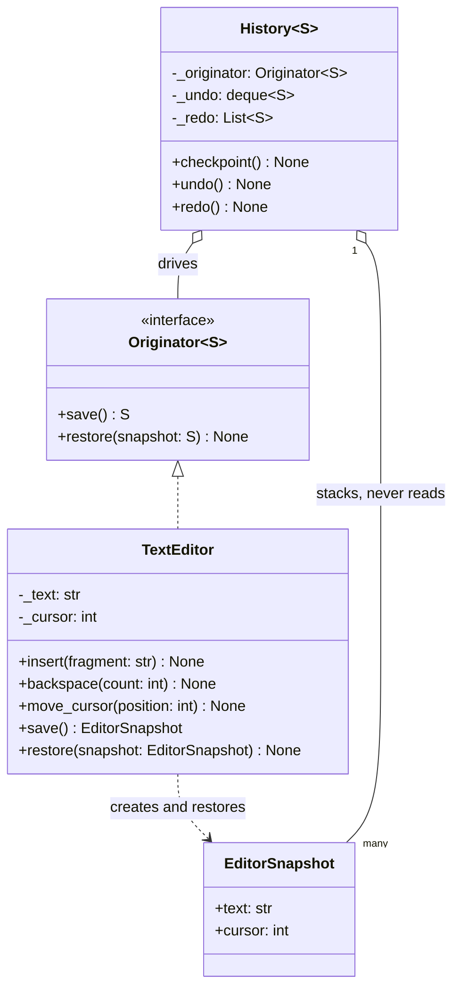

# Memento

## Intent

Capture an object's internal state in a snapshot that only the object itself can interpret, hand that snapshot to someone else to keep, and restore from it later. The keeper gains undo, rollback and "try it, revert if it fails" without learning a single field of the object, so the object stays free to change its representation.

## When to use and when not to

**Use it when**

- Full restore is the requirement: undo in an editor, rollback of a transaction, taking back a move in chess.
- You catch yourself exposing private fields so that another class can save them; that is the smell this pattern removes.
- The work is speculative: apply a chess move to see whether it leaves your own king in check, then restore.
- The state is cheap to snapshot (immutable strings and tuples are shared, not copied) and the number of snapshots is bounded.

**Leave it out when**

- State is large and edits are small. A snapshot per keystroke on a 1 MB document is 100 keystrokes x 1 MB = 100 MB of history; store the change instead (Command with `undo`).
- You need to replay, log or audit *what happened*; a memento records what the state *was*, not how it got there.
- The state lives outside the process; database rows and files have their own savepoints.

## Structure

**Three roles: the Originator exports and imports snapshots, the Memento is an opaque value, and the Caretaker stacks mementos without reading them.**



`History` is typed over `S` and can only call `save` and `restore`; it cannot read `text` even by accident. `TextEditor` never inherits from `Originator`, it qualifies by shape. The aggregation from `History` to `EditorSnapshot` is the entire memory cost of the pattern.

## Canonical example in Python

The originator and its snapshot come first (`code/patterns/memento.py`, tested by `code/patterns/tests/test_memento.py`):

```python title="code/patterns/memento.py — the originator and the memento"
--8<-- "code/patterns/memento.py:originator"
```

Three decisions to say out loud:

- **A frozen dataclass is the memento.** It is immutable, so restoring it twice gives the same state twice, and it has equality, so a test can assert `editor.save() == EditorSnapshot("draft", 5)`.
- **The narrow interface is a type parameter.** The Gang of Four give the caretaker a narrow view of the memento and the originator a wide one. Python has no friend classes, so the narrowing is done by making `History` generic over `S`: it cannot name a field it does not know about.
- **What gets copied.** `str` is immutable, so `save` is O(1) and shares the document; a `list[str]` of lines would have to be frozen into a `tuple` at save time. The snapshot costs the size of the *mutable* state you must copy.

The caretaker owns the policy, never the data:

```python title="code/patterns/memento.py — the caretaker"
--8<-- "code/patterns/memento.py:caretaker"
```

- `checkpoint` runs *before* a mutation and clears the redo stack, which is the redo-invalidation rule every editor gets asked about: after you undo and then type, the old future is gone.
- `deque(maxlen=limit)` drops the oldest snapshot for free. Copying is not the problem (reading 1 MB from memory is ~3 µs on the latency ladder); memory is, at `limit` x snapshot size per open document.
- `undo` pushes the *current* state onto the redo stack before restoring, so redo is the same operation in the other direction.

Running `python -m patterns.memento` prints:

```text
--- typing with a history capped at 3 snapshots ---
typed  'Hello' -> 'Hello'          undo depth 1
typed      ',' -> 'Hello,'         undo depth 2
typed ' world' -> 'Hello, world'   undo depth 3
typed      '!' -> 'Hello, world!'  undo depth 3
undo            -> 'Hello, world'   redo depth 1
undo            -> 'Hello,'         redo depth 2
redo            -> 'Hello, world'   redo depth 1
new edit        -> 'Hello, there'   redo depth 0 (branch abandoned)
undo x3         -> 'Hello'          undo depth 0 (oldest was dropped)
rejected: nothing to undo
--- savepoints over a dict: the memento is a copy ---
inner transaction: a=None depth 2
rollback inner:    a=2 depth 1
commit outer:      a=2 depth 0
```

## Pythonic variant

When the state is a handful of fields, the frozen dataclass above is already the idiom. Three other forms cover the rest.

**The memento is a copy.** For an entity with nested mutable state (a chess board holding lists of pieces), `copy.deepcopy` snapshots every field without naming them:

```python
import copy


class Board:
    def save(self) -> dict[str, object]:
        return copy.deepcopy(vars(self))  # nested lists included

    def restore(self, snapshot: dict[str, object]) -> None:
        vars(self).update(copy.deepcopy(snapshot))  # copy again: it may be restored twice
```

`vars` does not see `__slots__` and `deepcopy` is slower than building a value by hand, so this is the form for prototypes and for classes whose fields change often.

**The memento is the previous value.** If the originator is itself a frozen dataclass, every version is free: `History` stores the old instances and `restore` is an assignment.

**Savepoints.** A transactional store needs nested snapshots, and a `dict` copy is a complete memento when the values are immutable:

```python title="code/patterns/memento.py — savepoints over a dict"
--8<-- "code/patterns/memento.py:savepoints"
```

`begin` costs O(n) in the size of the store: fine for a few thousand keys, wrong for millions. Past that point you keep a *write-set* (the keys touched in this transaction and their previous values) and rollback replays it backwards, which is Command's cost model, not Memento's.

| Reach for | When |
|---|---|
| A frozen dataclass snapshot | A few fields; you want equality and a readable `repr` in tests |
| `copy.deepcopy(vars(self))` | Nested mutable state; you would rather copy everything than list it |
| The previous immutable value | The originator is a frozen dataclass or a persistent structure |
| A `dict` copy per savepoint | Keyed state, nested transactions, small stores |
| A write-set of previous values | Large store, few writes per transaction |
| `pickle.dumps(obj)` | The snapshot must leave the process (checkpoint to disk, send to a worker) |

## Real-world usage

- **`random.getstate()` and `random.setstate()`**: the state is an opaque tuple you are told not to inspect, which is the pattern in two function calls.
- **Context managers as caretakers**: `decimal.localcontext()` and `warnings.catch_warnings()` save on enter and restore on exit. pytest's `monkeypatch` records each attribute it replaces and restores it at teardown.
- **`SAVEPOINT` in SQL**: `ROLLBACK TO SAVEPOINT` restores, `RELEASE` commits. Django's nested `transaction.atomic()` and SQLAlchemy's `begin_nested()` map onto it.
- **`pickle` and `copy`**: the mechanisms most Python mementos are built from; `__getstate__` and `__setstate__` are `save` and `restore` under other names.

## Related patterns and confusions

| Looks like Memento | How to tell them apart |
|---|---|
| **Command** | Command stores what was *done* and how to undo it, O(change) per step; Memento stores what the state *was*, O(state) per step. Editors use commands for keystrokes and a memento for operations with no cheap inverse. A command may carry a memento inside. |
| **Prototype** | Both may call `deepcopy`. Prototype clones to create a *new* object that lives its own life; Memento snapshots to bring the *same* object back. |
| **State** | State swaps behaviour as the lifecycle moves; Memento swaps data. A memento may well contain the state enum. |
| **Unit of Work** | A unit of work tracks changes in order to *commit* them; a savepoint snapshot exists in order to *discard* them. |
| **Event sourcing** | The event log is a sequence of commands; the periodic snapshot that saves you from replaying it is a memento. |
| **Serialisation** | `pickle` builds a memento; it is not the pattern. The pattern is the rule about who may read the bytes: only the originator. |

## Where it appears in LLD problems

- [Design a text editor with undo and redo](../problems/text-editor.md) — Command is the core, Memento is the alternative you are asked to compare, and the capped history is this page's `deque(maxlen=)`.
- [Design chess](../problems/chess.md) — simulate a move, check whether your own king is attacked, restore; undo that must give back captured pieces and castling rights is simpler as a board snapshot than as hand-written inverses.
- [Design an in-memory key-value store with transactions](../problems/kv-store-transactions.md) — nested `BEGIN`, `ROLLBACK`, `COMMIT`: a snapshot per savepoint versus a write-set.

## Interview tips

!!! tip "Interview tip"
    Say who is allowed to read the snapshot before you say the word memento: "the editor returns an opaque `EditorSnapshot`; the history is generic over it and can only hand it back, so nothing outside the editor depends on its fields." Then give the cost model in one line, snapshot is O(state) and command is O(change), and name the cap on the history.

!!! warning "Common mistake"
    Shallow snapshots of mutable state. `EditorSnapshot(self._lines)` that shares the live list is not a snapshot: the next edit mutates it and undo restores the present. Freeze at save time (`tuple(lines)`, `deepcopy`) and copy again on restore if the originator mutates in place. Runner-up: an unbounded undo stack that grows for the life of the process.

## Related

- [Command](command.md) — store the change instead of the state
- [Prototype](prototype.md) — clone to create, not to restore
- [Design a text editor with undo and redo](../problems/text-editor.md) — Command versus Memento for undo
- [Design chess](../problems/chess.md) — board snapshots for simulation and undo
- [Design an in-memory key-value store with transactions](../problems/kv-store-transactions.md) — savepoints and write-sets
- Gamma, Helm, Johnson and Vlissides, *Design Patterns* (1994), Memento
- [Python documentation: `copy` — shallow and deep copy operations](https://docs.python.org/3/library/copy.html)
- [PostgreSQL documentation: `SAVEPOINT`](https://www.postgresql.org/docs/current/sql-savepoint.html)
