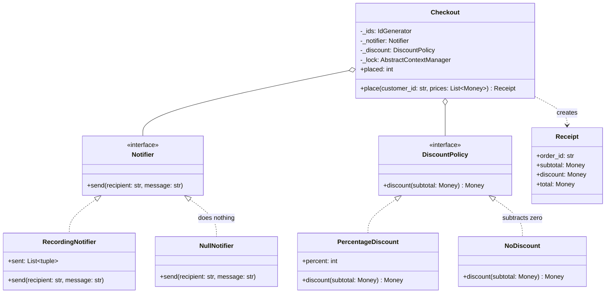

# Null Object

## Intent

Provide an implementation of an interface whose methods do nothing, or return the neutral value, and hand it to clients in place of `None`. The client keeps one code path: `Checkout` calls `self._notifier.send(...)` and `self._discount.discount(subtotal)` whether or not the customer has an email address or a coupon, and no call site ever asks.

## When to use and when not to

**Use it when**

- A collaborator is optional and "absent" has an obvious neutral behaviour: no notification, zero discount, no lock, no log output.
- The same `if x is not None` appears at several call sites; each is a branch to test and a place to forget.
- An injected dependency needs a default that does nothing rather than something real: a `Checkout` built without a notifier must not send email.

**Leave it out when**

- The caller needs to know about absence. `repo.get(id)` returns `None` because "no such user" is information; a `NullUser` with an empty name lets the bug travel several layers before it surfaces.
- "Do nothing" would hide a failure. A gateway that silently approves or a repository that silently drops writes is a defect with a pattern name.
- The neutral behaviour is not obvious. If two engineers would write the null `price()` differently (zero, raise, last known price), the interface is not ready for one.

## Structure

**Two interfaces, a working and a null implementation of each, and a client that treats them identically.**



`Checkout` holds a `Notifier` and a `DiscountPolicy` and never inspects which. The null implementations realise the same Protocols; they do not subclass the working ones. `NullNotifier` qualifies by shape, exactly like `RecordingNotifier`.

## Canonical example in Python

The notifier pair first (`code/patterns/null_object.py`, tested by `code/patterns/tests/test_null_object.py`):

```python title="code/patterns/null_object.py — a working notifier and the null one"
--8<-- "code/patterns/null_object.py:notifier"
```

The discount pair has the same shape, with the null object as the identity element of the operation:

```python title="code/patterns/null_object.py — a real discount and the null one"
--8<-- "code/patterns/null_object.py:discount"
```

Three decisions to say out loud:

- **Frozen, field-less dataclasses.** A null object has no state, so `NullNotifier() == NullNotifier()`, instances are hashable, and one shared instance serves the whole process. Immutability is also what makes it safe as a default argument.
- **The neutral value in the right type.** `NoDiscount.discount` returns `Money(0, subtotal.currency)`, not `0` and not `None`; the caller's `subtotal - off` works without a branch. The identity element is part of the contract.
- **Realisation, not inheritance.** `NullNotifier` does not subclass `RecordingNotifier` and override `send` with `pass`; that would inherit a list it never uses and tie the null object to one implementation.

The client shows the payoff:

```python title="code/patterns/null_object.py — the client with one code path"
--8<-- "code/patterns/null_object.py:checkout"
```

Every optional collaborator defaults to its null object, including the lock: `contextlib.nullcontext()` is the standard library's null object for "a context manager", so a single-threaded `Checkout` and a threaded one run the same `with self._lock:` line.

The stdlib section names the two you will be asked about:

```python title="code/patterns/null_object.py — the stdlib's own null objects"
--8<-- "code/patterns/null_object.py:stdlib"
```

When no handler exists anywhere in a logger's hierarchy, `logging` falls back to `lastResort` and writes warnings to stderr. `NullHandler` counts as a handler and does nothing, so a library that attaches one never surprises the application that imports it.

Running `python -m patterns.null_object` prints:

```text
--- a guest checkout: no coupon, no contact details, one thread ---
order-1: subtotal 30.00 USD, discount 0.00 USD, total 30.00 USD
--- a member checkout: a 10% coupon and an email on file ---
order-2: subtotal 30.00 USD, discount 3.00 USD, total 27.00 USD
notified: ('grace', 'order order-2: 27.00 USD')
--- the same Checkout code path, with and without a real lock ---
nullcontext, one thread: 100 orders placed
threading.Lock, four threads: 100 orders placed
--- logging.NullHandler: the stdlib's null object for handlers ---
handlers on the library logger: ['NullHandler']; the warning went nowhere
--- null objects are values: one shared instance is enough ---
NullNotifier() == NullNotifier(): True; NoDiscount() == NO_DISCOUNT: True
```

## Pythonic variant

Most null objects in Python are not classes:

- **Empty collections.** Return `[]`, `{}` or `""` instead of `None`, and callers iterate, index and join without a check; `dict.get(key, [])` and `defaultdict(list)` build the idea into lookups.
- **A do-nothing callable** fills an optional callback slot, so the loop calls it unconditionally:

```python
def _ignore(*_: object) -> None:
    return None


class Download:
    def __init__(self, on_progress: Callable[[int], None] = _ignore) -> None:
        self._on_progress = on_progress  # always callable, never checked
```

- **`nullcontext(value)`** stands in for an optional resource: `with (open(path) if path else nullcontext(sys.stdin)) as source:` keeps one `with` block.
- **`os.devnull`** is the null file: `subprocess.run(cmd, stdout=subprocess.DEVNULL)` discards output without branching on a quiet flag.

Promote the idiom to a class when the interface has more than one method, when the null choice should be visible and named in a constructor signature, or when `isinstance(x, Notifier)` must hold for it.

## Real-world usage

- **`logging.NullHandler`**: the handler a library attaches to its top-level logger so that importing it never writes to stderr.
- **`contextlib.nullcontext`**: the stand-in for an optional context manager; `nullcontext(enter_result)` even chooses what `__enter__` returns.
- **`os.devnull` and `subprocess.DEVNULL`**: the null file; `open(os.devnull, "w")` is a sink that accepts every write.
- **Django's `AnonymousUser`**: `request.user` is always user-shaped, with `is_authenticated` set to `False`, instead of being `None` for visitors.

## Related patterns and confusions

| Looks like Null Object | How to tell them apart |
|---|---|
| **Strategy** | A null object is a strategy whose algorithm is "nothing": `NoDiscount` sits in the slot `PercentageDiscount` uses. The difference is intent: a strategy chooses behaviour, a null object removes a check. |
| **`None`** | `None` says "absent, and you must handle it"; a null object says "absent, and nobody needs to care". Use `None` when absence is information, a null object when it is not. |
| **Special Case** (Fowler) | The general form: an object for one particular case, such as `UnknownCustomer` with a zero credit limit. A null object is the special case whose behaviour is empty. |
| **Stub and fake** | Test doubles live in tests and stand in for something real; a null object is production code and stands in for nothing. `RecordingNotifier` is a fake; `NullNotifier` ships. |
| **`Mock()`** | The opposite worth remembering: it accepts everything *and* records it, and auto-creates attributes. A `Mock` standing in for a notifier in production code is a bug, not a null object. |

## Where it appears in LLD problems

- [Design a logging framework](../problems/logging-framework.md) — a logger with no handlers must still be safe to call; a null sink and a pass-through formatter keep the pipeline uniform.
- [Design Amazon (cart, order, inventory, payment)](../problems/ecommerce-order-inventory.md) — `NoDiscount` for carts without a coupon, so the pricing pipeline never branches on absence.
- [Design a notification service (LLD)](../problems/notification-service.md) — a null channel for opted-out users keeps the dispatch loop free of `if` statements.

## Interview tips

!!! tip "Interview tip"
    Introduce it when you write the first default: "the notifier defaults to a `NullNotifier`, so `Checkout` never checks for `None`." Then add the two SDE2 sentences: which null objects the stdlib already ships (`nullcontext`, `NullHandler`, `os.devnull`), and the case where you refuse the pattern because absence is information (`get` returning `None`).

!!! warning "Common mistake"
    A null object that hides a failure: a payment gateway that approves everything for now, a repository whose `add` is `pass`. Null objects are for optional side effects with an obvious neutral value, never for required collaborators. Runner-up: a `NullUser` full of empty strings that lets a missing-user bug surface three layers later as a blank page.

## Related

- [Strategy](strategy.md) — the slot a null object fills
- [Design a logging framework](../problems/logging-framework.md) — null sinks and handlers in a full problem
- [Design Amazon (cart, order, inventory, payment)](../problems/ecommerce-order-inventory.md) — no-coupon pricing without branches
- [Dependency Injection](dependency-injection.md) — how the null object arrives, as a default
- Martin Fowler, *Patterns of Enterprise Application Architecture* (2002), Special Case
- [Python documentation: logging.NullHandler](https://docs.python.org/3/library/logging.handlers.html#nullhandler)
- [Python documentation: contextlib.nullcontext](https://docs.python.org/3/library/contextlib.html#contextlib.nullcontext)
