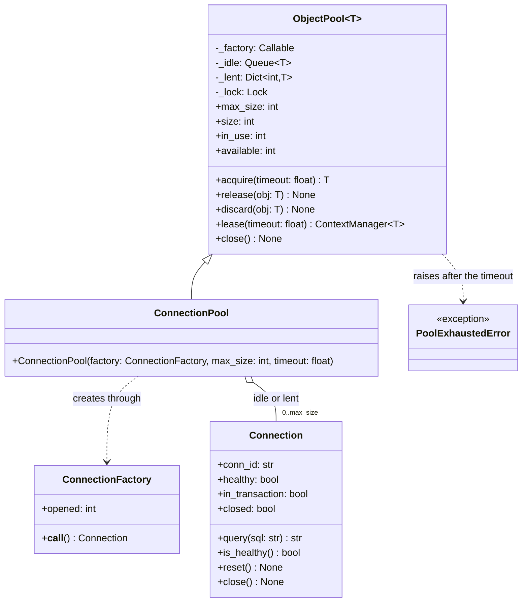

# Object Pool

## Intent

Pay the cost of creating an expensive object once, then lend that object to one borrower at a time from a bounded set. The caller asks the pool for *an* object, uses it and gives it back; the pool decides whether that means reusing an idle one, creating one within the cap, or making the caller wait.

## When to use and when not to

**Use it when**

- Creation dominates use. A database connection costs a TCP handshake, a TLS handshake and authentication: three round trips or more, 3 x 500 µs ~ 1.5 ms inside one datacenter. Taking an idle one from a queue is an uncontended lock, ~17 ns, about 10^5 times cheaper.
- The objects are interchangeable: any healthy connection, any free lane, any compact car in the fleet.
- You need a cap. A pool of 20 connections is also a bulkhead: the twenty-first borrower waits or fails fast instead of opening a connection the database will refuse.
- The objects have a lifecycle: they go stale, keep state between uses or must be closed at shutdown.

**Leave it out when**

- Creation is cheap. A Python object is an allocation, about one memory reference (~100 ns).
- The objects have identity. If the caller needs *that* car, by licence plate, you want a repository with a status field.
- You want a cache: keyed, allowed to miss, evicting. A pool is unkeyed, waits instead of missing and keeps its objects.

## Structure

**Four roles: the generic pool, the expensive object it lends, the factory that builds one, and a subclass that binds the lifecycle hooks.**



`ObjectPool` knows nothing about connections: it takes a factory and three optional callables. `ConnectionPool` only passes `Connection.is_healthy`, `Connection.reset` and `Connection.close` as those hooks. `lease()` is the API callers should see; `acquire` and `release` exist for code that cannot use a `with` block.

## Canonical example in Python

The object and its factory come first (`code/patterns/object_pool.py`, tested by `code/patterns/tests/test_object_pool.py`); the connection is a stand-in that counts queries, remembers an open transaction and can be marked unhealthy.

```python title="code/patterns/object_pool.py — the expensive object and its factory"
--8<-- "code/patterns/object_pool.py:connection"
```

The pool's public surface:

```python title="code/patterns/object_pool.py — the pool: acquire, release, lease, close"
--8<-- "code/patterns/object_pool.py:pool"
```

Four decisions to say out loud:

- **`queue.Queue` is the pool.** A thread-safe FIFO with a condition variable inside, so the blocking wait and the wake-up on `release` come for free; your own lock guards only `_created`, `_lent` and `_closed`.
- **Every wait is bounded.** `acquire` uses the pool-wide `timeout` unless the caller passes one, then raises `PoolExhaustedError`: a leaked object becomes an error you can alarm on, not a hung service. A `release` wakes a waiter through the queue; the waiter also re-checks the cap each slice of the deadline, because `discard` frees a *slot* without queueing an object.
- **Health check on the way out, reset on the way in.** A connection dropped while idle fails `validate` on the next `acquire` and is replaced in the same slot; `reset` rolls back what the last borrower left open. Both are injected callables, so the pool never imports a driver.
- **A double release is refused.** `_lent` maps `id(obj)` to the object itself, so the id cannot be recycled while it is out, and a second `release` raises instead of queueing one connection for two borrowers.

The slot accounting is where the thread-safety lives, and `ConnectionPool` binds the hooks:

```python title="code/patterns/object_pool.py — slot accounting, and the ConnectionPool that binds the hooks"
--8<-- "code/patterns/object_pool.py:internals"
```

`_create_if_room` reserves the slot under the lock and calls the factory outside it: two threads cannot both win the last slot, a slow handshake stalls no `release`, and a factory that raises gives the slot back. It also refuses to build for a closed pool, so `_wait_for_object` cannot open a connection nobody will take back. `close` drains the idle queue under the same lock, so a racing `release` either returns its object first or sees the flag and destroys it.

Running `python -m patterns.object_pool` prints:

```text
--- 6 sequential borrowers, pool of 3 ---
  borrower 1: conn-1 ran 'SELECT 1'
  borrower 2: conn-1 ran 'SELECT 2'
  borrower 3: conn-1 ran 'SELECT 3'
  borrower 4: conn-1 ran 'SELECT 4'
  borrower 5: conn-1 ran 'SELECT 5'
  borrower 6: conn-1 ran 'SELECT 6'
  connections opened: 1 (one is enough when nobody overlaps)
--- 3 borrowers inside the pool at once, then 8 threads x 25 leases ---
  held at the same time: ['conn-1', 'conn-2', 'conn-3']; opened: 3
  leases: 200, opened: 3 (the cap held), in use afterwards: 0
--- a stale idle connection is replaced on acquire (pool of 1) ---
  db-1 failed the health check; got db-2, closed old: True
  pool size still 1, opened 2
--- bounded wait: both connections lent out, a third borrower gives up after 50 ms ---
  PoolExhaustedError: all 2 objects are in use (waited 0.05 s)
  after one release: got c-1 immediately
--- a double release is refused ---
  ValidationError: object was not acquired from this pool, or was already released
--- close(): idle connections are closed, new borrowers are refused ---
  InvalidStateError: pool is closed; size now 0
```

## Pythonic variant

When objects never go stale and the count is known up front, the queue alone is the pool:

```python title="code/patterns/object_pool.py — a prefilled queue and a borrow context manager"
--8<-- "code/patterns/object_pool.py:pythonic"
```

- **Eager, not lazy.** `prefilled_pool` opens every object at start-up: right for a worker that will use them all, wrong for a CLI that may use none.
- **`queue.Empty` is the whole error handling**, and a `borrow` body that raises still puts the object back.
- **What you give up** is validation, reset, metrics and shutdown: a broken connection goes straight back into rotation.

| Reach for | When |
|---|---|
| No pool | Creation is cheap, or the call is one-off |
| `queue.Queue` plus `borrow` | Fixed count, objects never go bad, pool lifetime equals process lifetime |
| `threading.BoundedSemaphore(n)` | You want the cap but not the objects: at most n concurrent calls to a vendor API |
| `ObjectPool` with hooks | Lazy creation, health checks, reset between uses, `close()`, counters to export |
| A library pool | Production: SQLAlchemy, urllib3 and the drivers have met the reconnect edge cases |

Draw the class diagram, then say "in Python I would start from a `queue.Queue` behind a context manager and grow it into a class the day I need a health check or lazy creation under a cap".

## Real-world usage

- **`concurrent.futures.ThreadPoolExecutor` and `multiprocessing.Pool`** pool threads and child processes, the most expensive objects a process owns; `submit` is `acquire` with the work attached.
- **urllib3 `HTTPConnectionPool`** (under `requests.Session`) keeps keep-alive sockets per host: `maxsize` is the cap, `block=True` the bounded wait.
- **SQLAlchemy `QueuePool`** is this module with production edges: `max_overflow` for bursts, `pool_timeout` (30 s by default), `pool_pre_ping` as the health check, `pool_recycle` to retire old connections, rollback on return as the reset.
- **Database-side poolers** (PgBouncer, RDS Proxy) move the pool out of the process: 50 app servers x 20 connections need not become 1,000 server-side connections.

## Related patterns and confusions

| Looks like Object Pool | How to tell them apart |
|---|---|
| **Singleton** | One shared instance versus N interchangeable ones lent exclusively. The pool is usually one per process: build it in the composition root and inject it rather than reach for `ConnectionPool.instance()`. |
| **Flyweight** | Immutable and shared by everyone at once; a pooled object is mutable and owned by one borrower at a time, hence `release` and `reset`. |
| **Cache** | Keyed, may miss, evicts under pressure. A pool has no key, waits instead of missing, and destroys objects only when they break or at `close()`. |
| **Producer-consumer** | Same `queue.Queue`, opposite direction: a consumed item is gone, a borrowed one comes back. |

## Where it appears in LLD problems

- [Design a car rental system](../problems/car-rental.md) — a fleet is a pool per category: a reservation is `acquire` over a date range, a return is `release`, the inspection on return is the health check.
- [Design a bowling alley](../problems/bowling-alley.md) — lanes are a small fixed pool; a waiting group is a bounded `acquire`, a lane under maintenance is a `discard`.
- [Design a parking lot](../problems/parking-lot.md) — spots per size are a pool in spirit, except that an allocation strategy picks *which* idle spot.

## Interview tips

!!! tip "Interview tip"
    Lead with the three numbers the pool manages: `max_size` (the cap), `timeout` (the bounded wait) and what "idle" means (a health check). Name the two hooks, `validate` on acquire and `reset` on release, and say that `with pool.lease() as conn:` is the only API application code sees.

!!! warning "Common mistake"
    An unbounded wait. `queue.get()` with no timeout looks safe until one code path forgets to release; then the pool drains, every thread blocks forever and the service is up but does nothing. Give the pool a default timeout, raise a typed error, release in a `finally`. Runner-up: returning a broken object without `reset` or `discard`, so the next borrower inherits the fault.

## Related

- [Singleton](singleton.md) — why the pool is injected rather than reached through a global
- [Concurrency for LLD in Python](../fundamentals/concurrency-for-lld.md) — `queue.Queue`, locks and the bounded-wait idiom behind the pool
- [Design a car rental system](../problems/car-rental.md) — the fleet as a pool per category
- [Design a bowling alley](../problems/bowling-alley.md) — lanes as a fixed pool
- [Design a parking lot](../problems/parking-lot.md) — spots as a pool with an allocation strategy on top
- [Python documentation: queue — A synchronized queue class](https://docs.python.org/3/library/queue.html)
- [SQLAlchemy documentation: Connection Pooling](https://docs.sqlalchemy.org/en/20/core/pooling.html)
- [urllib3 documentation: Advanced Usage, connection pools](https://urllib3.readthedocs.io/en/stable/advanced-usage.html)
