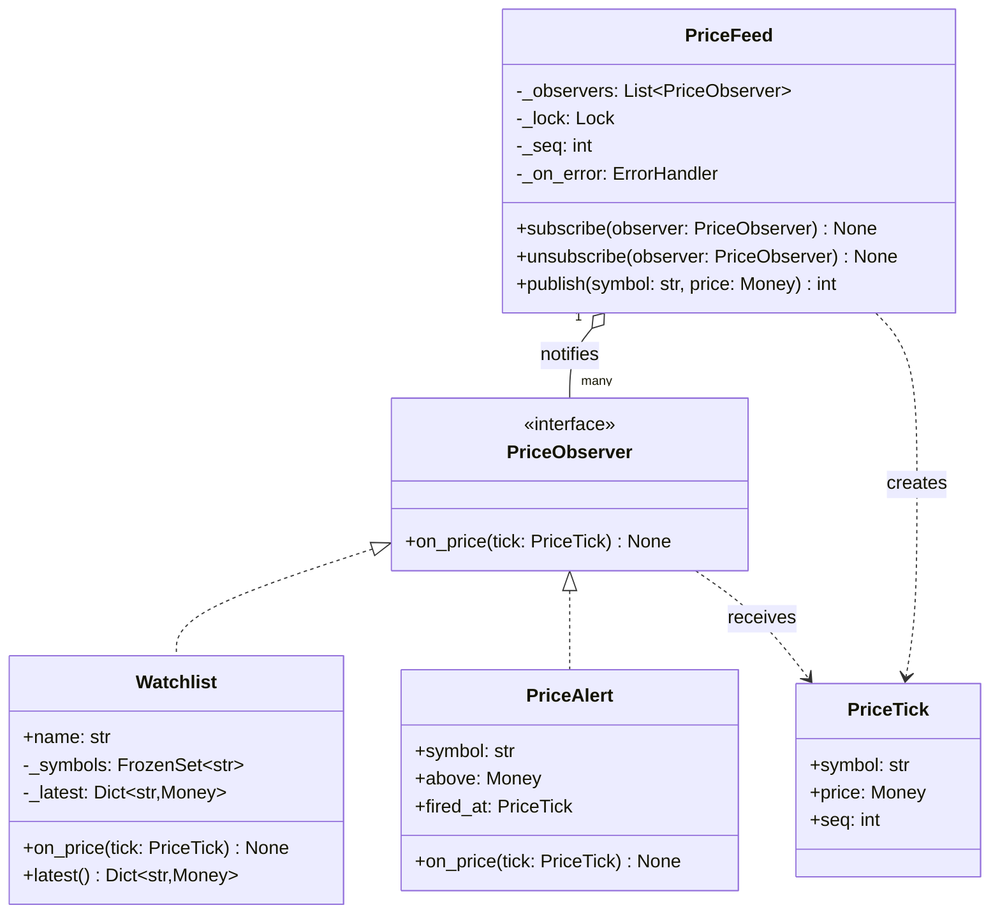
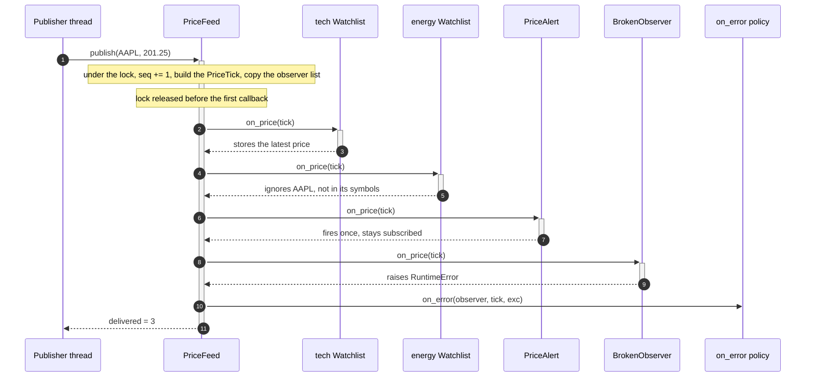

# Observer

## Intent

Define a one-to-many dependency: when the subject changes, every registered observer is told, and the subject neither knows nor cares what they do with the news. A price feed publishes ticks; watchlists, alerts and limit-order triggers each react in their own module, and the fourth reaction is a new subscriber, not an edit to the feed.

## When to use and when not to

**Use it when**

- Several independent reactions hang off one event and the set changes at runtime: a user adds an alert, a screen opens a watchlist.
- The publisher must not import its consumers: market data cannot depend on the alerting package.
- The reaction is a side effect (display, log, metric) that returns nothing to the publisher.

**Leave it out when**

- There is one consumer and always will be; call it.
- The publisher needs a result back, or order matters: that is a return value, a Strategy or a Chain of Responsibility.
- Consumers need durability, replay or back-pressure, or live in another process: that is an Event Bus or a message queue.
- Observers must coordinate with each other; that logic belongs in a Mediator.

## Structure

**Four roles: the Observer interface, the Subject that keeps the list, the concrete observers, and the immutable event they receive.**



`PriceFeed` depends on `PriceObserver` alone; `Watchlist` and `PriceAlert` qualify by having `on_price`, not by inheriting. The arrow points one way: an observer holds no reference to the feed, so a test can hand it a `PriceTick` directly.

**One `publish`: copy the list under the lock, run every observer outside it, route one failure to the policy.**



## Canonical example in Python

The event, the interface and the subject come first (`code/patterns/observer.py`, tested by `code/patterns/tests/test_observer.py`):

```python title="code/patterns/observer.py — the event, the observer interface and the subject"
--8<-- "code/patterns/observer.py:subject"
```

Three decisions to say out loud:

- **Copy, then dispatch outside the lock.** `publish` holds `_lock` for the sequence number, the tick and a list copy, and for nothing else. An observer can therefore `unsubscribe` itself mid-notification without corrupting the iteration, and a slow observer never blocks a `subscribe` on another thread. The copy is nothing next to a callback: an uncontended lock is ~17 ns, one same-datacenter call is ~500 µs, and 500 µs / 17 ns is about 30,000x.
- **Isolate every callback.** Each `on_price` runs in its own `try`; an exception goes to the injected `on_error` and the remaining observers still run. The default policy logs, a test injects a list, production injects a metric. Isolation is not eviction: the failing observer stays subscribed; dropping it is the policy's decision.
- **The event is a frozen value with a sequence number.** Observers may keep it without copying, and `seq` exposes gaps and duplicates. Ordering holds per publisher thread only: serialise the publishers or put a queue in front when order matters.

The observers carry the business logic, so the feed stays a dumb fan-out:

```python title="code/patterns/observer.py — two concrete observers"
--8<-- "code/patterns/observer.py:observers"
```

`Watchlist` filters for itself (the feed knows nothing about symbol groups) and guards its own dictionary, because `on_price` runs on whichever thread published. `PriceAlert` fires once and then keeps receiving ticks it ignores until someone unsubscribes it: the registration outlives the interest, which is the lapsed-listener leak in miniature.

Running `python -m patterns.observer` prints:

```text
--- 4 observers subscribed; one of them always raises ---
tick AAPL at  199.50: delivered to 3 of 4
tick XOM  at  105.10: delivered to 3 of 4
tick AAPL at  201.25: delivered to 3 of 4
tick MSFT at  410.00: delivered to 3 of 4
tech watchlist:    AAPL=201.25 USD, MSFT=410.00 USD
energy watchlist:  XOM=105.10 USD
alert fired:       seq 3 at 201.25 USD
isolated failures: 4 (first: seq 1: downstream store unavailable)
alert unsubscribed -> 3 observers remain
--- Signal: the same fan-out with plain callables and a weak receiver ---
receivers while the scratch watchlist is alive: 2
receivers after it was garbage-collected:      1 (emit reached 1)
lambda receiver saw: ['AAPL@202.00 USD']
```

## Pythonic variant

An observer with one method is a callable, and a subject with one event is a list of callables. Python supplies the interface, `Callable[[PriceTick], None]`; the part worth a class is the weak reference:

```python title="code/patterns/observer.py — a signal of callables, weak on request"
--8<-- "code/patterns/observer.py:signal"
```

- **Functions, lambdas and bound methods all connect.** `signal.connect(watchlist.on_price)` registers a method without the class promising anything.
- **`weak=True` removes the leak.** A `Watchlist` that goes out of scope is dropped on the next `emit`, so a subscriber that forgets to disconnect is not pinned in memory forever. Bound methods need `weakref.WeakMethod`: a plain `weakref.ref(obj.method)` dies at once, because the bound-method object exists only for that attribute access.
- **`emit` propagates exceptions**, like Django's `Signal.send`; wrap it in the `PriceFeed` policy above when you want `send_robust`.

For observer *objects* rather than callables, `weakref.WeakSet` gives you the weak behaviour for free:

```python
import weakref


class Subject:
    def __init__(self) -> None:
        self._observers: weakref.WeakSet[PriceObserver] = weakref.WeakSet()

    def publish(self, tick: PriceTick) -> None:
        for observer in list(self._observers):  # snapshot: the set may shrink mid-loop
            observer.on_price(tick)
```

| Reach for | When |
|---|---|
| A `list` of callables and a loop | One event type, one thread, and you wrote every subscriber |
| `Signal` with weak receivers | Subscribers are objects with their own lifetimes (widgets, sessions) |
| `PriceFeed` with a lock and an error policy | Publishers on several threads, or subscribers you do not control |
| An Event Bus | Many subjects, event types as topics, asynchronous delivery or retry |

## Real-world usage

- **`logging`**: a `Logger` fans every record out to its handlers, and `Handler.handleError` is the isolation policy: a handler that raises inside `emit` is reported and the next handler still runs.
- **`concurrent.futures.Future.add_done_callback`**: the documentation promises that a callback's exception is logged and ignored, the same policy as `on_error`. `asyncio` futures route it to the loop's exception handler instead.
- **`weakref.finalize`** and **`atexit.register`**: observers of an object's collection and of interpreter shutdown.
- **Frameworks**: Django signals (receivers are held weakly by default; `send_robust` isolates failures), Qt signals and slots, DOM `addEventListener`; Kafka and Redis pub/sub are the cross-process form.

## Related patterns and confusions

| Looks like Observer | How to tell them apart |
|---|---|
| **Mediator** | Observers never know each other exist and the subject holds no logic. A mediator knows every colleague and *decides* who reacts: an elevator controller routes a hall call to one car, a price feed tells everyone. |
| **Event Bus (pub/sub)** | Observer couples a subscriber to one subject object (`feed.subscribe`). A bus decouples by topic: subscribers name an event type, publishers name nobody, and the bus owns threading, ordering and retry. Promote to a bus when there are many subjects or delivery must be asynchronous. |
| **Chain of Responsibility** | Every observer gets the event and none consumes it; order is unspecified. Chain handlers are ordered, and the first (or each) may end the request. |
| **Command** | A command is *what* to do; an observer is *whom* to tell. A queue of commands drained by a worker is not an observer, even when an observer fills it. |
| **Strategy** | One delegate, chosen by the client, returning a result. Observer is many delegates that chose themselves and return nothing. |

## Where it appears in LLD problems

- [Design a stock brokerage system](../problems/stock-brokerage.md) — `MarketDataFeed` notifying price alerts and resting limit orders across threads.
- [Design Cricinfo (live scoreboard)](../problems/cricinfo.md) — `ScoreUpdateService` fanning each ball out to scoreboards and commentary subscribers.
- [Design an online auction](../problems/online-auction.md) — bidders told of each new high bid; the notification must never block the bid.
- [Design a notification service (LLD)](../problems/notification-service.md) — domain events delivered to channel senders, with failure isolated per channel.
- [Design an elevator system](../problems/elevator-system.md) — floor displays and hall panels observing each car.
- [Design an in-memory pub/sub message queue](../problems/pub-sub-system.md) — what Observer becomes once topics, queues and consumer offsets arrive.

## Interview tips

!!! tip "Interview tip"
    Say the three production details before the interviewer asks: "the feed copies the list under a lock and calls observers outside it; each callback is isolated and failures go to an injected policy; registration is explicit, and weak where subscribers have their own lifetime." Then name the boundary: "if you want asynchronous delivery or retries, this becomes an event bus with a queue."

!!! warning "Common mistake"
    `for observer in self._observers: observer.update(event)` with no copy and no `try`. One raising observer kills the notification for everyone after it, and an observer that unsubscribes itself mutates the list you are iterating. Runner-up: never unsubscribing, so a closed screen keeps receiving ticks, and its memory, for the life of the feed.

## Related

- [Event Bus](event-bus.md) — topics, queues and asynchronous delivery
- [Mediator](mediator.md) — when the middle holds the logic
- [Chain of Responsibility](chain-of-responsibility.md) — ordered handlers that may consume the request
- [Design a stock brokerage system](../problems/stock-brokerage.md) — the price feed inside a full problem
- [Design Cricinfo (live scoreboard)](../problems/cricinfo.md) — ball-by-ball fan-out
- Gamma, Helm, Johnson and Vlissides, *Design Patterns* (1994), Observer
- [Python documentation: `weakref` — weak references](https://docs.python.org/3/library/weakref.html)
- [Django documentation: Signals](https://docs.djangoproject.com/en/stable/topics/signals/)
