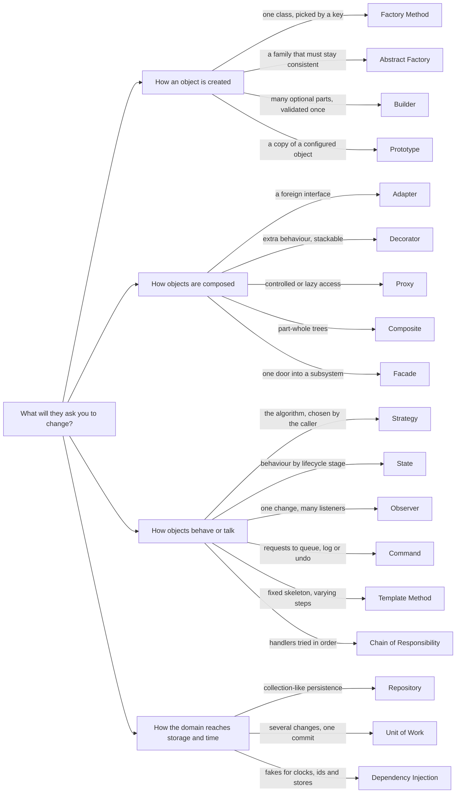
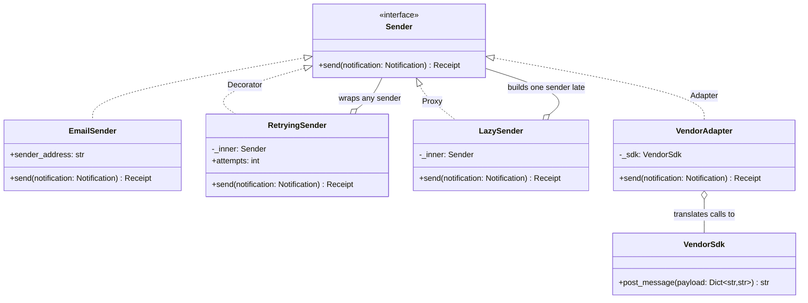

# Design patterns overview

## Intent

A design pattern is a named answer to a recurring force in object-oriented code: something will vary, and the code that does not vary should stop changing. This page is the index, not the lesson: which pattern answers which symptom, which draw the same picture for different reasons, and when to use none; each pattern page gives the diagram, a tested module and the Pythonic shortcut.

## When to use and when not to

**Reach for a pattern when**

- You can name the axis of change before you name the pattern. "Pricing is what they will ask me to change" justifies a Strategy; "I might need it later" justifies nothing.
- A conditional on *type* or *state* is spreading. An `if/elif` ladder over vehicle types wants a Factory Method; the same ladder over ticket statuses wants State.
- A dependency must be faked in a test: clocks, id generators, providers and stores go behind a small interface and arrive by injection.
- Two objects must stop knowing about each other: the floor should not import the display board (Observer); a vendor SDK should not leak into the checkout (Adapter).

**Pattern-itis, and how to catch it in yourself**

- Announcing patterns before requirements. "I will use Singleton, Factory, Strategy and Observer" in the first minute is the fastest way to lose the round.
- A Singleton for every manager. One instance built in `main` and injected behaves the same and stays testable; the [parking lot](../problems/parking-lot.md) rejects the Singleton on purpose.
- A Strategy with one strategy, a Builder for three required fields, an Observer between two objects that could simply call each other: a class and an indirection that buy nothing until the second variant exists.
- A class diagram larger than the problem. Seven classes for tic-tac-toe is a warning sign; interviewers want to watch you *stop*.

Two questions decide: which follow-up does this pattern turn into a one-class change, and which test does it make easier? If either answer needs more than a sentence, leave it out and say why.

## Structure

**The catalogue by family: intent in a phrase, and the Python idiom that is often enough.**

| Pattern | Intent | Python idiom |
|---|---|---|
| *Creational* | | |
| [Singleton](singleton.md) | one instance, global access | module-level instance; inject instead |
| [Factory Method](factory-method.md) | defer the concrete class to a creator | dict registry, `classmethod` constructor |
| [Abstract Factory](abstract-factory.md) | families of objects that must match | dataclass of callables; a module |
| [Builder](builder.md) | stepwise construction, validated once | keyword-only args, `replace` |
| [Prototype](prototype.md) | clone a configured object | `copy.deepcopy`, `dataclasses.replace` |
| *Structural* | | |
| [Adapter](adapter.md) | fit a foreign interface | thin wrapper over a `Protocol` |
| [Bridge](bridge.md) | two hierarchies vary independently | injected implementor |
| [Composite](composite.md) | part-whole trees, treated uniformly | recursive dataclasses, `__iter__` |
| [Decorator](decorator.md) | add behaviour, stackable | `@decorator`, `functools.wraps` |
| [Facade](facade.md) | one door into a subsystem | module-level function |
| [Flyweight](flyweight.md) | share intrinsic state | interning, `lru_cache`, `Enum` |
| [Proxy](proxy.md) | control access to an object | `__getattr__` delegation, `cached_property` |
| *Behavioural* | | |
| [Chain of Responsibility](chain-of-responsibility.md) | handlers tried in order | list of callables |
| [Command](command.md) | a request as an object | callables, `partial`, (do, undo) pairs |
| [Interpreter](interpreter.md) | a grammar plus an evaluator | `ast`, `match` |
| [Iterator](iterator.md) | sequential access, structure hidden | generators, `itertools` |
| [Mediator](mediator.md) | centralise many-to-many talk | one coordinator object |
| [Memento](memento.md) | snapshot and restore | frozen dataclass, `deepcopy` |
| [Observer](observer.md) | one change, many listeners | callback list, signals |
| [State](state.md) | behaviour by lifecycle stage | `Enum` plus transition table |
| [Strategy](strategy.md) | interchangeable algorithms | callables, `sorted(key=)` |
| [Template Method](template-method.md) | fixed skeleton, varying steps | `ABC` hooks; pass a callable |
| [Visitor](visitor.md) | new operations over a structure | `singledispatch`, `match` |
| *Enterprise* | | |
| [Repository](repository.md) | collection-like persistence | `Protocol` plus a dict-backed fake |
| [Unit of Work](unit-of-work.md) | commit several changes atomically | `contextmanager` |
| [Dependency Injection](dependency-injection.md) | collaborators supplied from outside | constructor args and `Protocol`s |
| [Null Object](null-object.md) | a do-nothing stand-in | `NullHandler`, `nullcontext` |
| [Specification](specification.md) | composable business rules | predicates, operator overloading |
| [Object Pool](object-pool.md) | reuse expensive objects | `queue.Queue` plus context manager |
| [Pipeline and Middleware](pipeline-middleware.md) | ordered stages that may short-circuit | `reduce` over callables |
| [Event Bus](event-bus.md) | in-process pub/sub by topic | `defaultdict(list)` plus a worker |

**Symptom to pattern: start from what will change.**

**One shape, three intents: Decorator, Proxy and Adapter all hold a reference and forward a call.**

The boxes are identical, so the answer has to be the intent: say what the wrapper adds (Decorator), withholds (Proxy) or translates (Adapter).

## Related patterns and confusions

Four groups cover most "how is that different" follow-ups; each has one separating question.

| Confused group | The question that separates them |
|---|---|
| **Strategy vs State vs Template Method** | *Who picks the behaviour, and when?* Strategy: the caller injects one of several interchangeable algorithms that do not know each other. State: the object swaps its own behaviour as events move it through a lifecycle, and each state knows its successors. Template Method: a base class fixes the skeleton and subclasses fill in steps, decided when the class is written. |
| **Decorator vs Proxy vs Adapter** | *Same interface or a different one, and what happens to the call?* Decorator keeps the interface and adds behaviour; several can stack (retry around rate limit around logging). Proxy keeps the interface and controls access (lazy creation, caching, permissions, a remote stub), normally one per subject. Adapter changes the interface so an object you do not own fits the one your code expects. |
| **Observer vs Mediator vs Event Bus** | *Who knows whom?* Observer: the subject holds its observers and calls them directly, one subject to many listeners. Mediator: colleagues know only the mediator, which holds the interaction rules (the elevator controller). Event Bus: keyed by topic, both sides know only the bus, dispatch may be asynchronous and one failing handler does not stop the rest. |
| **Facade vs Adapter** | *Simpler, or compatible?* A Facade offers a new, smaller interface over several objects so the caller makes one call (`place_order`) instead of six. An Adapter offers an *existing* interface over one object so a client written against it keeps working. A facade may contain adapters; an adapter never simplifies. |

The creational trio: Factory Method picks one class by key, Abstract Factory a matching family, Builder assembles one object from many optional parts.

## Where it appears in LLD problems

Every problem page has a "Design patterns applied" table with a *why* column; these recur most often.

| Problem | Patterns that earn their place |
|---|---|
| [Design a parking lot](../problems/parking-lot.md) | Strategy (pricing, allocation), Factory Method (vehicles), Observer (display); Singleton rejected for injection |
| [Design an elevator system](../problems/elevator-system.md) | State (car lifecycle), Strategy (dispatch), Mediator (controller), Command (requests) |
| [Design a vending machine (and a coffee machine)](../problems/vending-machine.md) | State (core), Decorator (add-ons), Strategy (change-making) |
| [Design a text editor with undo and redo](../problems/text-editor.md) | Command (core), Memento (the alternative), Flyweight (styles) |
| [Design a logging framework](../problems/logging-framework.md) | Chain of Responsibility (propagation), Strategy (formatter), Builder (config), Null Object |
| [Design a notification service (LLD)](../problems/notification-service.md) | Factory Method (senders), Pipeline (validate, dedup, rate limit), Decorator (retries) |
| [Design a payment gateway and digital wallet](../problems/payment-gateway-wallet.md) | Adapter (providers), Unit of Work (ledger), Chain of Responsibility (fraud), State (payment) |

## Interview tips

!!! tip "Interview tip"
    Introduce a pattern as a consequence, never as a plan: "the pricing rule is what they will ask me to change, so it goes behind a `PricingStrategy` and the gate only ever calls `price`". One sentence of symptom, one of pattern, one naming the test it makes easy. Interviewers grade the justification, not the vocabulary.

!!! warning "Common mistake"
    Treating the Gang of Four list as a checklist and the Java shape as the only shape. A Strategy with one method is a function in Python, a Singleton is usually a module or an injected instance, a Builder is often keyword arguments with defaults. Draw the diagram the interviewer expects, then say which idiom you would actually write and why.

## Related

- [Problem to pattern quick reference](../../cheatsheets/pattern-quick-reference.md) — the same map as one table
- [Strategy](strategy.md) — learn it first; the model for every Pythonic variant
- [State](state.md) — Strategy's most frequent confusion
- [Observer](observer.md) — the pattern behind every "notify" requirement
- [The LLD interview framework](../fundamentals/lld-interview-framework.md) — where "patterns only where justified" sits in the round
- Gamma, Helm, Johnson and Vlissides, *Design Patterns* (1994)
- Fowler, *Patterns of Enterprise Application Architecture* (2002), for the enterprise rows
