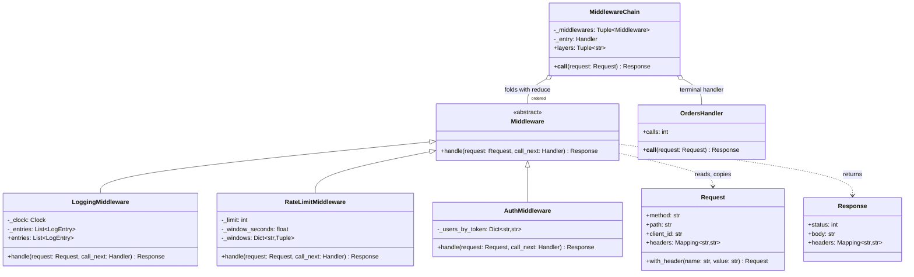
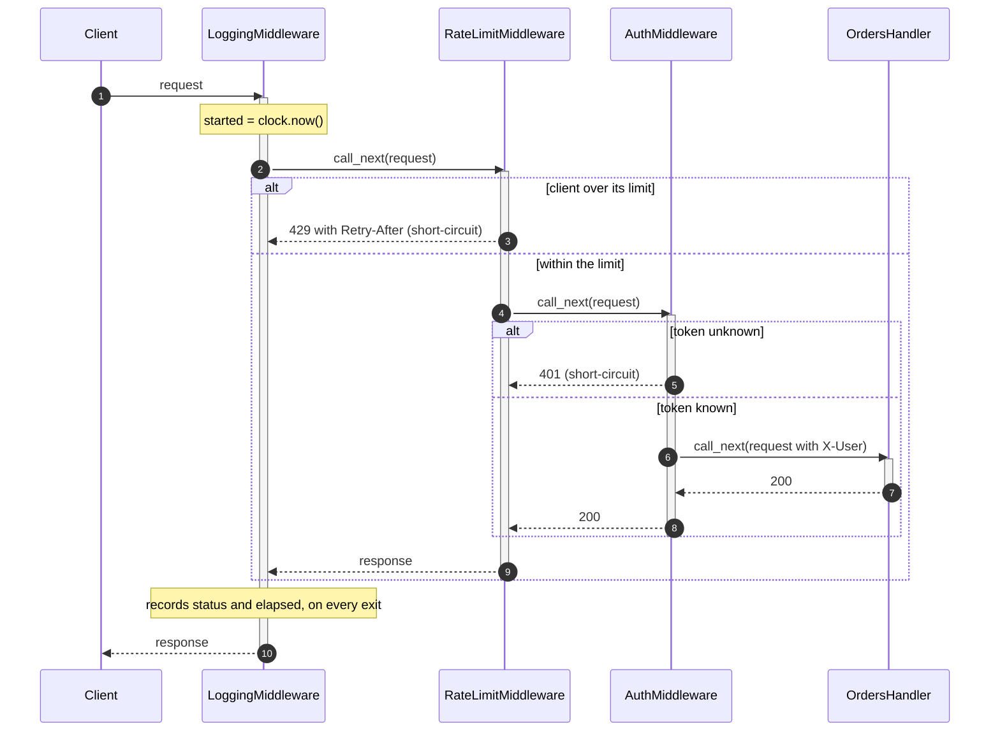

# Pipeline and Middleware

## Intent

Arrange the work done to a request as an ordered list of stages. Each stage may transform what it receives and hand it on, stop the line and answer itself, or act on the result on its way back. Adding authentication, rate limiting or logging is inserting a stage; the handler at the end never learns they exist.

## When to use and when not to

**Use it when**

- The same concerns apply to every request (authentication, rate limiting, logging, tracing, retries) and would otherwise be pasted into every handler.
- The order is a policy you want in one place and under test: the limiter sits outside authentication, so a brute-force client is refused before any token lookup.
- Stages must see both directions: timing, response headers, turning an exception into a 500.
- Data goes through a fixed series of transforms (parse, validate, enrich, persist): the linear form, where `reduce` over callables is enough.

**Leave it out when**

- There is one stage. A pipeline of one is a function call.
- Stages must talk to each other. Once they pass state through a shared context dict, the order is a hidden dependency and the stages are coupled.
- The work branches. Routing by request type is dispatch (a dict of handlers or a Strategy); searching for the one object that will handle a request is Chain of Responsibility.
- Nothing flows back and nobody may stop the others: that is fan-out, the Event Bus.

## Structure

**Five roles: the request and response that travel, the abstract stage, three concrete stages, the terminal handler, and the chain that folds them.**



`Middleware.handle` gets the request and `call_next`, the rest of the chain as one callable. `MiddlewareChain` is the only object that knows the order; it builds `_entry` once with `reduce`. `OrdersHandler` is plain application code, a `Request` in and a `Response` out, unaware of the layers.

**One request through the onion: every stage sees it on the way in, a short-circuit skips everything inside, and the logger sees every exit.**



## Canonical example in Python

The messages come first (`code/patterns/pipeline_middleware.py`, tested by `code/patterns/tests/test_pipeline_middleware.py`):

```python title="code/patterns/pipeline_middleware.py — the request, the response and the Handler type"
--8<-- "code/patterns/pipeline_middleware.py:messages"
```

`Request` is frozen; a stage that adds a header gets a copy from `with_header`, so an outer stage's view cannot change behind its back (the mutable `CashRequest` of Chain of Responsibility allows that on purpose).

The stages:

```python title="code/patterns/pipeline_middleware.py — the abstract stage and three concrete ones"
--8<-- "code/patterns/pipeline_middleware.py:middleware"
```

Three decisions to say out loud:

- **`call_next` is the whole rest of the chain.** A stage sees one callable, not a list: it cannot skip a stage, reorder them or reach the handler directly, and it is testable with a lambda as `call_next`.
- **A short-circuit is a return without a call.** `AuthMiddleware` answers 401 and `RateLimitMiddleware` answers 429 with `Retry-After`; the stages inside them never run, and the handler's call count proves it.
- **Post-processing is the code after `call_next`.** `LoggingMiddleware` times everything inside it and, with `try/finally`, records an exception from the handler as a 500 before letting it propagate; a stage that turns the exception into a real 500 response is the usual next layer.

The handler and the fold:

```python title="code/patterns/pipeline_middleware.py — the terminal handler and the chain that folds the stages"
--8<-- "code/patterns/pipeline_middleware.py:chain"
```

`reduce` walks the list from the innermost stage outward, wrapping each around the callable built so far, so the first stage listed is the outermost. The fold runs once, at construction; a request costs one call per stage, and an empty list is the handler itself.

Running `python -m patterns.pipeline_middleware` prints:

```text
--- LoggingMiddleware -> RateLimitMiddleware -> AuthMiddleware -> OrdersHandler ---
  10.0.0.1 GET  /orders   -> 200 alice: GET /orders
  10.0.0.1 GET  /orders/7 -> 401 unauthorized
  10.0.0.1 POST /orders   -> 429 rate limited (Retry-After: 60 s)
  10.0.0.2 GET  /orders   -> 401 unauthorized
  handler calls: 1 of 4 (the rest were answered by a stage)
--- the log, written on the way out, covers every exit ---
  GET  /orders   200 in 3.0 ms
  GET  /orders/7 401 in 0.0 ms
  POST /orders   429 in 0.0 ms
  GET  /orders   401 in 0.0 ms
--- a minute later the window has reset ---
  POST /orders -> 200 alice: POST /orders; handler calls: 2
--- a handler that raises still gets a log line ---
  RuntimeError: database down; logged as 500 in 0.0 ms
--- pythonic: a linear pipeline folded with reduce ---
  '  Hello   WORLD, again  ' -> 'hello wor...'
--- pythonic: middleware as stacked decorators ---
  without X-Request-Id: 400 missing X-Request-Id
  with X-Request-Id:    200 anonymous: GET /orders
```

The handler advances a `FakeClock` by 3 ms to stand in for a database call; the refused requests cost 0.0 ms.

## Pythonic variant

When every stage is a transform and none needs to stop the line, the pipeline is `reduce` over callables. When a stage must short-circuit, it is a decorator, a function from handler to handler, and stacking decorators is composition:

```python title="code/patterns/pipeline_middleware.py — a linear pipeline and middleware as decorators"
--8<-- "code/patterns/pipeline_middleware.py:pythonic"
```

- **`pipeline(str.strip, collapse_spaces, ...)`** takes any callables, unbound methods included; a new stage is a new argument.
- **`require_header(name)` is a middleware** in eight lines and also a decorator: `@require_header("X-Request-Id")` above a handler function produces the same layer `stack` builds.
- **Streams** use generator stages, `Iterable` in and `Iterator` out, and nothing runs until you iterate; see `run_stages` on the Chain of Responsibility page.

| Reach for | When |
|---|---|
| `pipeline(*stages)` | Pure transforms, no short-circuit, one value in and one out |
| Generator stages | A stream of items; a stage may drop, batch or rewrite them |
| Stacked decorators | A few stateless layers whose order is fixed in code |
| `Middleware` classes and a `MiddlewareChain` | Layers own state (counters, clocks, locks), need names in logs, or are ordered by configuration |

Draw the class diagram, then say "in Python a middleware is a decorator; I would write functions and promote them to classes when they carry state or the order comes from settings".

## Real-world usage

- **WSGI and ASGI.** Every middleware is a callable that wraps the inner application, `app = GZipMiddleware(SessionMiddleware(app))`. Django folds its `MIDDLEWARE` setting exactly like `MiddlewareChain`, first entry outermost, `get_response` as `call_next`; Starlette's `dispatch(request, call_next)` is `handle` by another name.
- **The stdlib I/O stack.** `TextIOWrapper(BufferedReader(FileIO(...)))` is a pipeline of transforms over bytes, each wrapping the next; `gzip.open` and `codecs` add stages.
- **scikit-learn `Pipeline([("scale", StandardScaler()), ("model", LogisticRegression())])`** runs `fit` and `transform` in order and `predict` through every stage; `pandas.DataFrame.pipe` is `pipeline` for one frame.
- **Unix pipes** (`grep | sort | uniq -c`) are the original: generator stages across processes.

## Related patterns and confusions

| Looks like Pipeline and Middleware | How to tell them apart |
|---|---|
| **Chain of Responsibility** | A chain searches for the one handler and stops when it is found; a pipeline runs every stage unless one short-circuits, and the point is the transform, not the search. |
| **Decorator** | A middleware *is* a decorator over the handler (`Callable[[Handler], Handler]`). Decorator adds behaviour to one object; this pattern owns the ordered stack and the place it is assembled. |
| **Strategy** | One algorithm chosen from several, not a sequence that all run. |
| **Observer, Event Bus** | Fan-out: every subscriber gets the event, order is unspecified, nothing comes back, and no subscriber can stop the others. A pipeline is serial and returns a result. |
| **Template Method** | A fixed skeleton with overridable steps, decided when the class is written; pipeline stages are objects assembled at runtime, in any order. |
| **Interceptor, Filter** | The same pattern under the names gRPC and the servlet API use. |

## Where it appears in LLD problems

- [Design a rate limiter (LLD)](../problems/rate-limiter-lld.md) — the limiter as a stage that answers 429 with `Retry-After`, placed before authentication.
- [Design a notification service (LLD)](../problems/notification-service.md) — render, apply preferences and quiet hours, deduplicate, rate limit per user, send: each stage may drop the notification.
- [Design a logging framework](../problems/logging-framework.md) — a record passes filters, then a formatter, then handlers.
- [Design a payment gateway and digital wallet](../problems/payment-gateway-wallet.md) — the fraud rules are the chained part (`AmountCeilingRule`, `DenylistRule`, `VelocityRule`, `DailyLimitRule`, linked by `set_next`); the idempotency claim and the authorisation call around them are plain statements. Only the *extensible* step earns the chain.

## Interview tips

!!! tip "Interview tip"
    Draw the onion, not a line: "the request goes inward through logging, rate limiting and auth to the handler, and the response comes back out through the same stages". State the order and why (the limiter before auth), show a short-circuit (401 without calling the handler) and say the fold happens once with `reduce`. Finish with the Python view: a middleware is a decorator.

!!! warning "Common mistake"
    A stage that neither returns a response nor calls `call_next`. In Express the request hangs; here the caller gets `None` and the outer stages crash on `.status`. Every branch of `handle` must end in one of the two. Runner-up: stages that talk through a mutable context dict, which makes the order an undocumented dependency.

## Related

- [Chain of Responsibility](chain-of-responsibility.md) — the search for a handler, and the generator stages for streams
- [Decorator](decorator.md) — one layer of the onion on its own
- [Design a rate limiter (LLD)](../problems/rate-limiter-lld.md) — the limiter as middleware
- [Design a notification service (LLD)](../problems/notification-service.md) — a pipeline that may drop the message
- [Design a logging framework](../problems/logging-framework.md) — filters and formatters as stages
- [PEP 3333 — Python Web Server Gateway Interface v1.0.1](https://peps.python.org/pep-3333/)
- [Django documentation: Middleware](https://docs.djangoproject.com/en/stable/topics/http/middleware/)
- [scikit-learn documentation: Pipeline](https://scikit-learn.org/stable/modules/generated/sklearn.pipeline.Pipeline.html)
