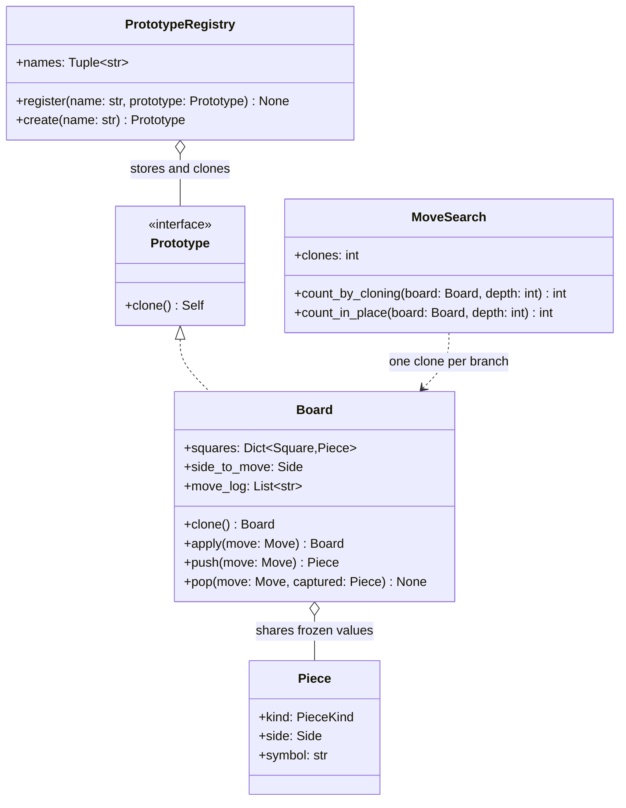

# Prototype

## Intent

Create an object by copying an existing, already-configured one instead of running a constructor that would rebuild the same state. The client asks an instance for a copy, so it needs to know neither the concrete class nor how the original was assembled.

## When to use and when not to

**Use it when**

- Reaching the configured state is the expensive part — a file, a query, a twenty-call builder. Copying is a memory operation; rebuilding is not: ~500 µs for a datacenter round trip against ~3 µs to read 1 MB from memory, ~170x.
- You explore alternatives from one starting point and discard most of them: game-tree search, what-if pricing, a speculative transaction.
- The variants are data, so a registry of configured instances replaces a subclass or a factory branch per variant.

**Leave it out when**

- The constructor is cheap and complete; `Board(squares, side)` beats `prototype.clone()` when nothing was configured.
- The state has identity that must not be duplicated — an open connection, a lock, a primary key — so two clones each believe they own one resource.
- You want the same object moved back in time rather than a second object: that is [Memento](memento.md).
- The change is one field of a value object, which `dataclasses.replace` spells better, or the fork is cheaper to undo than to copy — a search that can unmake a move should not clone a position.

## Structure

**Four roles: the Prototype interface, a Concrete Prototype that copies itself, a registry of configured instances, and a client that clones instead of constructing.**



`MoveSearch` never names a class or a constructor; it calls `clone`. `Board` decides per field what is copied and what is shared; `PrototypeRegistry` holds instances, so a new position is data.

## Canonical example in Python

The interface and the prototype come first (`code/patterns/prototype.py`, tested by `code/patterns/tests/test_prototype.py`):

```python title="code/patterns/prototype.py — the Prototype interface and a board that copies itself"
--8<-- "code/patterns/prototype.py:prototype"
```

Three decisions to say out loud:

- **`Self`, not `Board`, in the Protocol** ties the return type to the receiver, so a clone of a `Board` type-checks as one.
- **The clone is a per-field decision, and that is the whole pattern.** `dict(self.squares)` and `list(self.move_log)` are new containers because both are mutable; `side_to_move` copies by value; the `Piece` objects are *shared*, because a frozen dataclass cannot change under either holder. Deep or shallow is a property of each field, not of the copy, and the cost follows: O(occupied squares).
- **`push` returns the undo record instead of storing it,** so make/unmake keeps its bookkeeping on the recursion stack and the board carries no history a clone would copy.

The registry and the client cover the two reasons the pattern exists:

```python title="code/patterns/prototype.py — a registry of instances and a client that forks positions"
--8<-- "code/patterns/prototype.py:clients"
```

`create` returns `prototype.clone()`, never the stored object; one caller that mutated the prototype would poison every later `create`. `MoveSearch` walks the same tree twice on purpose: cloning per branch cannot corrupt the parent, while make/unmake allocates nothing and relies on `pop` being an exact inverse. Both find 51 positions at depth 3, and the forking walk pays 63 clones for it — a cost decision, not a correctness one.

Running `python -m patterns.prototype` prints:

```text
--- a registry of configured objects, not of constructors ---
registered: ('bare_kings', 'duel')
two creates, two objects: True, equal state: True
mutated the first:  ..kr .... R... .K..
the second is cold: ..kr .... .... RK..
the stored prototype is untouched: True
--- clone copies the mutable containers and shares the frozen pieces ---
same piece object: True
different dict:    True
copy.copy shares the dict, so the original moved too: ..kr .... .K.. R...
and the halves disagree: white vs black to move
--- fork per branch, or make and unmake: same tree, different cost ---
depth 3: 51 positions, 63 clones
depth 3: 51 positions, 0 clones
the caller's board survived both: True
--- the Pythonic forms: dataclasses.replace and a deepcopy hook ---
replace: 90+30 -> 3+2, rated still True
deepcopy: shared engine True, notes ['rook lift looks strong']
the branch's evaluation is visible on the session: 1
rejected: no prototype named 'sicilian'
```

The two `copy.copy` lines show the failure mode: a shallow copy shares containers but rebinds scalars.

## Pythonic variant

Python ships the pattern, so a hand-written `clone` must justify itself. `copy.deepcopy` is generic and never rots when a field is added, `dataclasses.replace` is clone-with-changes on a frozen value, and `__deepcopy__` declares what to share:

```python title="code/patterns/prototype.py — replace for values, a deepcopy hook for shared resources"
--8<-- "code/patterns/prototype.py:pythonic"
```

- **`replace` re-runs `__init__`,** so validation fires again and a misspelled field is a `TypeError` at the call, not a stray attribute on the copy. Python 3.13 generalises it beyond dataclasses as `copy.replace()`.
- **`deepcopy` copies too much by default.** It follows every reference it can reach, duplicating the engine, pool or lock hanging off your object. Write the `memo` entry before copying anything that can point back, or a cycle never ends.

| Reach for | When |
|---|---|
| Nothing | The constructor is cheap, or the fork is better as make/unmake |
| `dataclasses.replace` | A frozen value with one or two fields changed |
| `copy.copy` | Every field is immutable or shared on purpose |
| `copy.deepcopy` | You want the whole graph and accept O(graph) |
| `__deepcopy__` or `__copy__` | Something reachable must be shared, or a cached field dropped |
| A hand-written `clone` | Selective copying on a hot path |

Say the last row out loud: `clone` is an optimisation over `deepcopy`, bought with a maintenance hazard — add a field, forget the clone, and the bug is a silently shared list.

## Real-world usage

- **The `copy` module is the pattern.** `copy.copy` and `copy.deepcopy` dispatch to `__copy__` and `__deepcopy__`, thread a `memo` dict so cycles terminate and shared subobjects stay shared, and otherwise fall back to `__reduce_ex__` — which is why anything picklable is already copyable.
- **Clone-with-changes is everywhere on immutable types** — `datetime.replace`, `namedtuple._replace`, `Path.with_suffix` — and every container ships a shallow clone: `dict.copy`, `list.copy`, `collections.ChainMap.new_child`.
- **Frameworks**: a Django `QuerySet` clones itself on every `filter()`, so chaining never mutates the queryset you started from; duplicating a row is the `pk = None; save()` idiom. JavaScript's prototypes delegate to an exemplar rather than copying one.

## Related patterns and confusions

The creational patterns all produce objects; classify by what the creator knows.

| Looks like Prototype | How to tell them apart |
|---|---|
| **Memento** | Both may call `deepcopy`. A prototype is copied to get a *new* object that lives its own life; a memento, to bring the *same* object back. A memento is also opaque — only its originator reads it — while a clone is a usable peer. |
| **Factory Method / Abstract Factory** | A factory calls a constructor and knows the classes; `PrototypeRegistry` stores instances and knows none, so it is a factory whose products are copies. |
| **Builder** | A builder assembles step by step, and it is what you run *once* to produce the object worth registering. The two compose. |
| **Flyweight** | Opposite intent: a flyweight is the *same* shared object you must not change, a clone is a distinct copy you are expected to change. `Piece` is a flyweight *inside* a prototype. An Object Pool is a third relative — it lends objects and takes them back, while nobody returns a clone. |
| **Copy-on-write** | An optimisation of cloning, not a rival: share, copy on first write. A clone whose fields are all immutable is already copy-on-write. |

## Where it appears in LLD problems

- [Design chess](../problems/chess.md) — clone the board, play the candidate move, ask whether your own king is attacked, drop the clone. Volunteer the follow-up: a real engine uses make/unmake, this page's `push`/`pop`.
- [Design a text editor with undo and redo](../problems/text-editor.md) — cloning the buffer gives a checkpoint you can branch from; the same copy kept for restore is a memento.
- [Design an in-memory key-value store with transactions](../problems/kv-store-transactions.md) — `BEGIN` copies the map so the transaction scribbles on its own version; a write-set of the changed keys only is the same clone-versus-delta trade.

## Interview tips

!!! tip "Interview tip"
    Answer the copy question before naming the pattern: "the clone gets a new dict and a new move log because both are mutable, and the same `Piece` objects because they are frozen." That proves you know deep versus shallow is decided per field. Then be honest about Python: `copy.deepcopy` is the default, and `clone` is an optimisation you justify with a cost.

!!! warning "Common mistake"
    A shallow clone that shares a mutable container. `Board(self.squares, ...)` without the `dict(...)` gives two objects that move together, and the first symptom is a search result that depends on the order the branches ran in. Runner-up: cloning something with identity — a connection, a lock, a primary key — leaving two objects that each believe they own it.

## Related

- [Memento](memento.md) — a copy kept to restore, not to fork
- [Flyweight](flyweight.md) — shared immutable state, what makes a clone cheap
- [Design chess](../problems/chess.md) — cloning a position versus make/unmake
- [Design a text editor with undo and redo](../problems/text-editor.md) — buffer checkpoints
- [Design an in-memory key-value store with transactions](../problems/kv-store-transactions.md) — a copied map per savepoint
- Gamma, Helm, Johnson and Vlissides, *Design Patterns* (1994), Prototype
- [Python documentation: `copy` — Shallow and deep copy operations](https://docs.python.org/3/library/copy.html)
- [Python documentation: `dataclasses.replace`](https://docs.python.org/3/library/dataclasses.html#dataclasses.replace)
