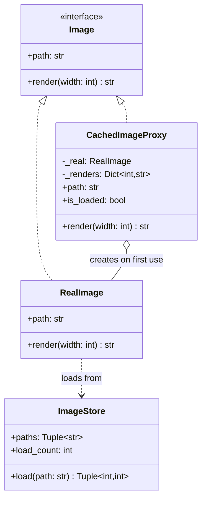
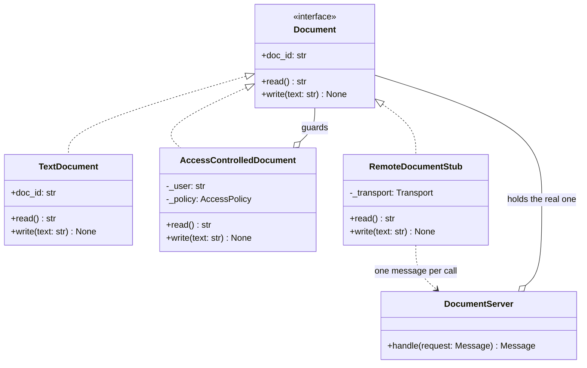

# Proxy

## Intent

Give the client a stand-in that presents the real object's interface and decides what happens to each call: create the real object only when it is first needed, answer from a cache, refuse the call, or send it across a network. The calling code never changes, and usually never learns which one it holds.

## When to use and when not to

**Use it when**

- Creation is expensive and often unnecessary — the *virtual* proxy. Building 1,000 compressed photos at ~200 KB each is ~200 MB; proxies holding paths cost nothing until someone scrolls.
- The same call keeps giving the same answer — the *caching* proxy, with the cache behind the interface, not in every caller.
- Authorisation belongs outside the domain object — the *protection* proxy. `TextDocument` should not have to know what a role is.
- The real object is in another process — the *remote* proxy. The stub makes the call look local, though a datacenter round trip is ~500 µs against ~100 ns for a memory reference: 5,000x.

**Leave it out when**

- The wrapper adds behaviour the client deliberately chose and stacks: that is a [Decorator](decorator.md). If it changes the interface it is an [Adapter](adapter.md) — adapt first, then proxy.
- Nothing is ever skipped. A lazy layer that always resolves on the first call is one indirection and no benefit.
- Hiding the cost would hide a budget: an ORM lazy relationship is a virtual proxy, and N+1 is the bill — 100 rows one at a time is 100 round trips, ~50 ms of network.

## Structure

**The virtual and caching proxy: one Subject, a RealSubject whose constructor does the expensive work, and a stand-in that postpones it and remembers the answers.**



**The protection and remote proxies: the same Subject, two stand-ins that decide whether the call reaches the real document and how.**



Every arrow into an interface is the point: a proxy *is* a Subject, so it stands where one was expected.

## Canonical example in Python

The Subject and the expensive RealSubject first (`code/patterns/proxy.py`, tested by `code/patterns/tests/test_proxy.py`):

```python title="code/patterns/proxy.py — the Subject, the store and the RealSubject"
--8<-- "code/patterns/proxy.py:subject"
```

`RealImage` loads in its constructor, which is what makes it worth postponing; `load_count` turns "the proxy avoided work" into an assertion.

```python title="code/patterns/proxy.py — a virtual proxy with a per-width cache"
--8<-- "code/patterns/proxy.py:virtual_proxy"
```

Three decisions to say out loud:

- **`path` is answered locally.** The proxy keeps the path it was constructed with, so listing a gallery reads zero pixels. A proxy that had to load before answering any question would be pointless.
- **The lock exists because the load must happen once.** Two threads rendering a cold image would otherwise both build a `RealImage`; the test drives 200 concurrent renders and asserts `load_count == 1`.
- **Failure is not cached, and the key is the width.** A `render` that raises stores nothing and a failed load leaves the proxy cold, so the next call retries; caching a failure forever is the classic bug.

The protection proxy moves the policy out of the document:

```python title="code/patterns/proxy.py — a protection proxy bound to one user"
--8<-- "code/patterns/proxy.py:protection_proxy"
```

Binding the user at construction keeps the signatures identical to the subject's — nobody passes a user into `read` — so the proxy stays substitutable. Consulting the policy on every call means a revoked permission lands on the next call, not the next login.

The remote proxy keeps the interface and nothing else:

```python title="code/patterns/proxy.py — a remote proxy over a transport"
--8<-- "code/patterns/proxy.py:remote_proxy"
```

`doc_id` is local state and costs nothing; `read` and `write` each become one message. Failures on either side of the wire arrive as one `RemoteError` — the thing a remote call has that a local one does not is a failure where you cannot tell whether it happened.

Running `python -m patterns.proxy` prints:

```text
--- virtual proxy: list four images and load none; render one and load one ---
listed 4 paths, loads: 0
render 200: photos/a.jpg 200x133  loads: 1
render 200: photos/a.jpg 200x133  loads: 1 (cache hit)
render 400: photos/a.jpg 400x267  loads: 1 (new width, same image)
loaded 1 of 4 images
--- protection proxy: one document, two users, the policy outside the document ---
alice writes, bob reads: 'Loan policy: 5 items, 14 days'
bob writes: PermissionDeniedError: bob may not write doc-1
alice writes after revocation: PermissionDeniedError: alice may not write doc-1
--- remote proxy: the same interface, one message per call ---
stub.read() -> 'Loan policy: 5 items, 14 days' via {'method': 'read', 'doc_id': 'doc-1'}
unknown document: RemoteError: no document 'doc-9'
--- pythonic forms: __getattr__ delegation, cached_property, weakref.proxy ---
LazyProxy created; builds so far: 0
lazy.read() -> 'built on first attribute access'; builds: 1
thumbnail.image twice: photos/d.jpg 80x60, photos/d.jpg 40x30; loads: 1
weakref.proxy parent: root/docs
after the parent is collected: ReferenceError: weakly-referenced object no longer exists
```

## Pythonic variant

Three smaller forms come before a class per subject: `__getattr__` forwards every attribute, `cached_property` is a virtual proxy for one attribute, and `weakref.proxy` is the smart reference:

```python title="code/patterns/proxy.py — generic delegation, a cached attribute and a weak reference"
--8<-- "code/patterns/proxy.py:pythonic"
```

- **`__getattr__` runs only when normal lookup fails,** so the proxy's own fields never recurse into it; guarding names that start with `_` stops an unfinished proxy from recursing during `__init__`.
- **It never sees dunder lookups.** `len(proxy)`, `proxy == other` and `with proxy:` are looked up on the *type*, and `isinstance(proxy, list)` is `False`. Generic delegation suits services; write the class when the subject has protocol behaviour.
- **`cached_property` holds no lock** since Python 3.12, so two threads can both run a cold getter. When the load must happen exactly once, keep the explicit lock.

| Reach for | When |
|---|---|
| `functools.cached_property` | One expensive attribute per instance, single-threaded or idempotent |
| `functools.lru_cache` | The expensive thing is a pure function of its arguments |
| `weakref.proxy` | A back-reference that must not keep its target alive |
| `__getattr__` delegation | Many forwarded methods, no dunder or `isinstance` requirement |
| An explicit proxy class | The checks are per method, or the wrapper must be named |

## Real-world usage

- **`types.MappingProxyType`** is a protection proxy in the standard library: a read-only view of a dict. Every class's `__dict__` is one, which is why you cannot assign into it.
- **`weakref.proxy`** forwards attribute access and raises `ReferenceError` once the referent is collected, so parent back-pointers do not leak whole subtrees.
- **`multiprocessing.Manager().dict()`** returns a `BaseProxy` whose every operation is an inter-process round trip, and **`xmlrpc.client.ServerProxy`** turns attribute access into a remote call.
- **Frameworks**: Django's `SimpleLazyObject` (what `request.user` is) and its lazy `settings`; SQLAlchemy and Django relationships that query on first access; gRPC stubs; every API gateway and sidecar.

## Related patterns and confusions

The structural patterns all wrap something; classify by two questions: does the interface change, and why does the wrapper exist?

| Looks like Proxy | How to tell them apart |
|---|---|
| **Decorator** | Same interface, but a decorator always forwards and adds, and the client stacks it deliberately. A proxy decides *whether* the real call happens, and the client usually did not choose it. |
| **Adapter** | Changes the interface and adds no behaviour. Adapt first, then proxy: `CachingProxy(StripeAdapter(client))`. |
| **Facade** | A new, simpler interface over a subsystem of several objects, so it is not interchangeable with what it hides and cannot be layered. |
| **Cache-aside** | Same cache, different owner. A caching proxy hides the cache behind the interface; cache-aside makes every caller check and populate it, and one that forgets is a bug. |
| **Lazy initialisation** | `cached_property` is a virtual proxy one field wide, not one object wide. |
| **Ambassador or sidecar** | The remote proxy on a deployment diagram: retries, TLS and routing in a process next to yours. |

## Where it appears in LLD problems

- [Design a library management system](../problems/library-management.md) — a member's view of a record is a protection proxy: the same interface, with borrowing and fine-waiving checked against the role first.
- [Design an in-memory file system](../problems/in-memory-file-system.md) — permission checks in front of a node, and listings that report sizes without materialising contents.
- [Design a learning management system](../problems/learning-management.md) — course content behind an enrolment check, and lesson bodies loaded when a student opens them, not when the syllabus is listed.

## Interview tips

!!! tip "Interview tip"
    Name which proxy you mean in the same breath as the word: "a virtual proxy, so listing the gallery loads nothing", or "a protection proxy, so `TextDocument` never learns what a role is". Then add the two details that mark an SDE2: the lock, because the expensive load must happen exactly once under concurrency, and the rule that failures are never cached.

!!! warning "Common mistake"
    Calling a Decorator a Proxy. If the client deliberately stacked the wrapper to add behaviour it is a decorator; a proxy exists to control access and is usually invisible. Runner-up: a proxy that hides latency it should expose — the lazy attribute that turns one list into N queries — and `__getattr__` forwarding that silently drops `len()`, `==`, `with` and `isinstance`, so code that worked with the real object breaks.

## Related

- [Decorator](decorator.md) — same interface, adds behaviour the client chose
- [Adapter](adapter.md) — changes the interface; adapt first, then proxy
- [Facade](facade.md) — a simpler interface over many objects, not a matching one over one
- [Design a library management system](../problems/library-management.md) — role checks in front of an entity
- [Design an in-memory file system](../problems/in-memory-file-system.md) — permissions and lazy listings
- Gamma, Helm, Johnson and Vlissides, *Design Patterns* (1994), Proxy
- [Python documentation: `weakref` — Weak references](https://docs.python.org/3/library/weakref.html)
- [Python documentation: `functools.cached_property`](https://docs.python.org/3/library/functools.html#functools.cached_property)
