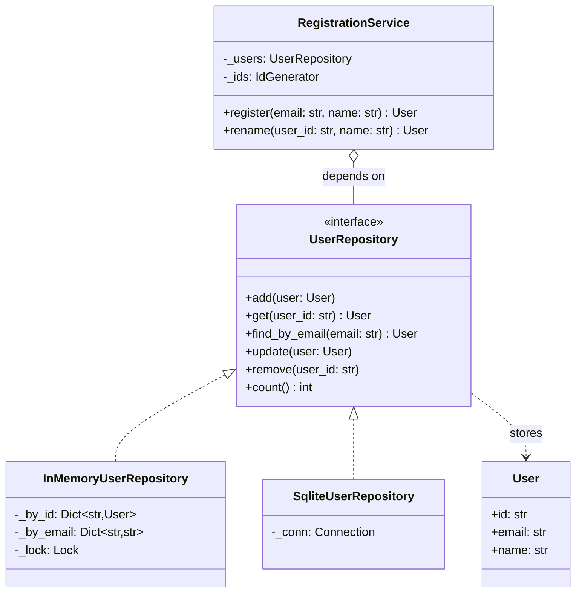

# Repository

## Intent

Give domain code a collection-like object (`add`, `get`, `find_by_email`, `remove`) that hides where entities live and how they are fetched. The service that registers a user never sees SQL, connections or row mapping; it sees a contract, and the same service runs over an in-memory dict in tests and over a database in production.

## When to use and when not to

**Use it when**

- Your LLD problem has entities that outlive a request (users, tickets, orders, accounts) and the interviewer will ask "where does this persist?"; the repository is the one-line answer and the seam where a database plugs in later.
- You want tests of business rules that need no database: the dict-backed fake is the reason the pattern exists.
- Several callers need the same queries (`find_by_email`, `find_overdue`); the repository names each query once and keeps query logic out of services.
- Storage exceptions must become domain exceptions (`ConflictError`, `NotFoundError`) so callers branch on meaning, not on driver classes.

**Leave it out when**

- The state is process-local and short-lived (a cache, a game board, a parser's stack): a dict or a list *is* the design, not a missing abstraction.
- There is one entity, one `get` and nothing to protect with tests; wrapping a dict in a class buys nothing yet.
- An ORM session already is the repository (Django managers, SQLAlchemy `Session`); add your own layer only to narrow the interface, never to mirror it.
- The query is a report across many entity types with joins; repositories work per entity, a read model or query object works for reporting.

## Structure

**Four roles: the entity, the collection-like contract, one implementation per storage technology, and the service that depends on the contract alone.**



`RegistrationService` holds a `UserRepository` and cannot tell the implementations apart. The dotted arrows are realisation: both classes qualify by shape. The contract includes the errors each method may raise, which is what makes the implementations interchangeable rather than merely similar.

## Canonical example in Python

Entity and contract first (`code/patterns/repository.py`, tested by `code/patterns/tests/test_repository.py`):

```python title="code/patterns/repository.py — the entity and the contract"
--8<-- "code/patterns/repository.py:contract"
```

Three decisions to say out loud:

- **The contract names the errors.** `add` raises `ConflictError` for a taken id or email; `update` and `remove` raise `NotFoundError`. An interface that lists only method names lets each implementation invent its own failure mode, and the fake then diverges from production exactly where the tests matter.
- **The entity is a frozen value.** If `get` handed out a mutable object, the in-memory fake would "persist" a caller's mutation without `update`, while the SQL implementation would not. Frozen entities force `replace` plus `update` on both, so a test that passes on the fake passes on the database.
- **Queries are methods, not filters.** `find_by_email` is a named query with a stable meaning; a `filter(**kwargs)` escape hatch leaks the storage schema into every caller.

The in-memory implementation is the test fake and a legitimate small-scale store. The lock makes the uniqueness check plus the insert one atomic step, the way a UNIQUE index does for the SQL version:

```python title="code/patterns/repository.py — the dict-backed implementation"
--8<-- "code/patterns/repository.py:in_memory"
```

The SQLite implementation translates `sqlite3.IntegrityError` into `ConflictError` and uses `rowcount` to detect a missing row. The connection is injected, so whoever owns the transaction decides when the writes become visible; that owner is the Unit of Work.

```python title="code/patterns/repository.py — the sqlite3 implementation"
--8<-- "code/patterns/repository.py:sqlite"
```

The service depends on the contract alone. Its email check gives a friendly error, but the repository's `add` is the authoritative guard: two registrations can pass the check at the same moment, and only the repository (its lock, or its index) sees both.

```python title="code/patterns/repository.py — the domain service"
--8<-- "code/patterns/repository.py:service"
```

Running `python -m patterns.repository` prints:

```text
--- registration over the in-memory repository ---
registered user-1 as ada@example.com
rejected: email ada@example.com is already registered
renamed user-1 to 'Ada Lovelace'; 1 user(s) stored
rejected: user user-99 does not exist
--- registration over the sqlite repository ---
registered user-1 as ada@example.com
rejected: email ada@example.com is already registered
renamed user-1 to 'Ada Lovelace'; 1 user(s) stored
rejected: user user-99 does not exist
--- generic dict-backed repository, keyed by a function ---
2 books; isinstance(books, Repository) is True
  978-0201633610: Design Patterns
  978-0321127426: Patterns of Enterprise Application Architecture
```

## Pythonic variant

Python 3.12 lets you write the shared shape once as a generic Protocol and build a single dict-backed implementation for every entity type:

```python title="code/patterns/repository.py — Repository[T] and one fake for all entities"
--8<-- "code/patterns/repository.py:generic"
```

- **`Repository[T]` in PEP 695 syntax.** `class Repository[T](Protocol)` declares the type parameter inline; `InMemoryRepository[Book](key=lambda book: book.isbn)` reads like a typed collection.
- **A key function instead of a base class.** Entities need not inherit from `Entity` or expose `.id`; the repository is told how to identify them.
- **`__iter__` and `__len__`** make the repository feel like the collection it stands in for: `for user in users`, `len(users)`, `any(...)`.

When is the generic fake enough? For services whose needs are `add`, `get` and `remove`. The moment a service needs `find_by_email` with a uniqueness rule, write the entity-specific Protocol: the query and the invariant are part of the contract, and production must enforce them too.

| Reach for | When |
|---|---|
| A plain `dict` | Process-local state with no persistence story |
| `InMemoryRepository[T]` | Tests and demos for any entity that only needs add, get and remove |
| An entity-specific Protocol such as `UserRepository` | Named queries and uniqueness rules that every implementation must honour |
| A SQL implementation behind the same Protocol | The interviewer asks "and in production?" |

## Real-world usage

- **Django managers and QuerySets.** `User.objects.get(pk=...)` is a repository attached to the model class; a custom manager such as `Article.published` is a named query.
- **SQLAlchemy `Session`.** `session.add(obj)` and `session.get(User, id)` make the session a repository plus a unit of work. Cosmic Python (Percival and Gregory) puts an explicit `AbstractRepository` in front of it so the domain never imports the ORM; that is the shape used here.
- **Standard library.** `shelve` and `dbm` give dict-shaped persistence; `collections.abc.MutableMapping` is the collection contract a repository imitates.

## Related patterns and confusions

| Looks like Repository | How to tell them apart |
|---|---|
| **DAO (Data Access Object)** | A DAO mirrors a table (`insert_row`, `update_row`) and exposes storage concepts; a repository mirrors a collection of domain objects and hides them. If the method names contain SQL verbs, you wrote a DAO. |
| **Unit of Work** | The repository says *what* is stored; the unit of work says *when* the writes become visible, together. A repository that commits inside `add` cannot take part in a multi-repository transaction. |
| **Active Record** | The entity saves itself (`user.save()`); a repository keeps persistence out of the entity. Django models are Active Record with a repository (the manager) attached. |
| **Data Mapper** | The code that turns rows into objects; `_to_user` is a small one. A repository *uses* a mapper, it is not one. |
| **Cache** | A cache may forget; a repository may not. A cache in front of a repository is a Proxy, not a second repository. |
| **Dependency Injection** | DI is how the chosen repository reaches the service; the repository is what gets injected. |

## Where it appears in LLD problems

- [Design a library management system](../problems/library-management.md) — `BookRepository`, `MemberRepository` and `LoanRepository`; `find_overdue` is a named query.
- [Design Splitwise](../problems/splitwise.md) — expenses and balances sit behind repositories so settlement logic is tested on dicts.
- [Design Amazon (cart, order, inventory, payment)](../problems/ecommerce-order-inventory.md) — order and inventory repositories coordinated by one unit of work.
- [Design a payment gateway and digital wallet](../problems/payment-gateway-wallet.md) — the ledger repository is append-only; its contract has no `update`.
- Almost every other problem: the repository is the persistence boundary you name once and then stop talking about.

## Interview tips

!!! tip "Interview tip"
    Introduce it as a sentence, not a diagram: "persistence sits behind a `UserRepository` Protocol; I implement it with a dict now, and the same tests prove a SQL version later." Then add the two things that mark an SDE2: the domain errors belong in the contract, and a contract test runs against every implementation.

!!! warning "Common mistake"
    A repository that leaks its storage: returning cursors or ORM rows, exposing `filter(**kwargs)`, letting `sqlite3.IntegrityError` reach callers, or growing a `save()` that silently upserts. Runner-up: a fake that is friendlier than production (accepts duplicates, hands out shared mutable objects), so the tests pass and the database raises.

## Related

- [Unit of Work](unit-of-work.md) — owns the transaction the repositories write inside
- [Dependency Injection](dependency-injection.md) — how the repository reaches the service
- [Interfaces, contracts and service APIs in LLD](../fundamentals/interfaces-and-contracts.md) — designing the small Protocol
- [Design a library management system](../problems/library-management.md) — repositories in a full problem
- Martin Fowler, *Patterns of Enterprise Application Architecture* (2002), Repository
- [Cosmic Python, chapter 2: Repository Pattern](https://www.cosmicpython.com/book/chapter_02_repository.html)
- [Python documentation: sqlite3](https://docs.python.org/3/library/sqlite3.html)
