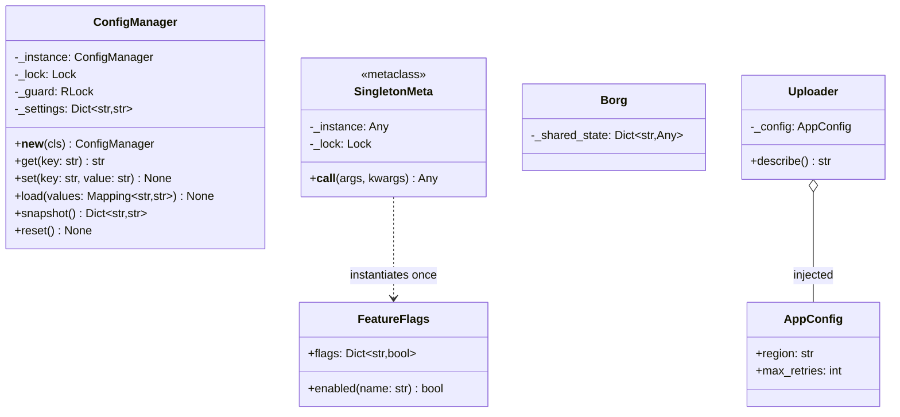

# Singleton

## Intent

Guarantee that a class has exactly one instance and give every caller a known way to reach it. Two problems hide in that sentence: a resource that is genuinely singular (one registry of loggers, one device handle, one settings object) and a construction that must happen at most once even when several threads ask at the same moment.

## When to use and when not to

**Use it when**

- Two instances would be a *bug*, not a waste: a registry keyed by name, a process-wide metrics sink, the handle to one piece of hardware.
- Callers are many and scattered with no composition root to thread an object through; library code such as `logging` lives here.
- You are wrapping a framework that already works this way and want one access path rather than two.

**Leave it out when**

- "There is one of them today." One parking lot, one elevator controller, one scheduler: that is one instance *by convention*, built in `main` and injected, so a second lot is a second object and a test builds its own.
- The object holds mutable state that tests need fresh. The `reset` hook appears, then the test-ordering bug.
- What you want is global *access*, not single *existence*. That is a global variable wearing a class; pass the object instead.
- You are counting on "one" across processes. A Singleton is per interpreter: a server with eight worker processes has eight of them.

## Structure

**The classic form keeps its instance in a class attribute; the metaclass form moves that logic out of the class; the injected form does not enforce anything.**



`_instance` and `_lock` are class-level in both forms. `ConfigManager` does the work in `__new__`; `SingletonMeta` intercepts the call before `__new__` or `__init__` run, so `FeatureFlags` is an ordinary class. `Borg` shares state, not identity. `Uploader` is the contrast: it takes an `AppConfig` and never asks whether another exists.

## Canonical example in Python

The classic form first (`code/patterns/singleton.py`, tested by `code/patterns/tests/test_singleton.py`):

```python title="code/patterns/singleton.py — __new__ with double-checked locking"
--8<-- "code/patterns/singleton.py:classic"
```

Three decisions to say out loud:

- **`__new__`, never `__init__`.** Python calls `__init__` on *every* `ConfigManager()` call, including the ones where `__new__` handed back the existing object, so state set up there would be wiped on each access. `_init_once` runs under the lock, exactly once, and the class has no `__init__` at all.
- **Check, lock, check again, publish last.** The first check skips the lock on every call after the first; the second stops the thread that lost the race; assigning `cls._instance` *after* `_init_once` means no reader sees a half-built object. The lock itself is cheap (an uncontended mutex is about 17 ns on the latency ladder: 100k accesses a second spend 100,000 x 17 ns = 1.7 ms in it), so the fast path is about contention during a burst of first calls, not speed.
- **Two locks, two jobs.** `_lock` (class level) protects creation; `_guard` (instance level, re-entrant) protects `_settings`. Say which lock covers what: `set` cannot race with `__new__` because it needs an instance that only a finished `__new__` returns.

`reset` exists because the tests needed it. That is the tell: a Singleton meeting a test suite grows a back door, and every test becomes order-dependent.

Running `python -m patterns.singleton` prints:

```text
--- classic: every ConfigManager() call returns the same object ---
first is second: True; second.get('region') -> eu-west-1
--- 16 threads race to create the first instance ---
distinct instances: 1
--- metaclass: __init__ runs once, later arguments are ignored ---
flags is again: True; beta enabled: True
--- cached factory and Borg ---
default_config() is default_config(): True
left is right: False; right.theme: dark
--- injection: one instance by convention, built in main ---
upload to eu-west-1 with 5 retries
a test builds its own: upload to local with 0 retries
```

## Pythonic variant

The shortest Singleton in Python is a module. `import` runs it once and caches it in `sys.modules`, so a module-level object is created once and shared by every importer, with no lock and no `__new__`:

```python
# settings.py: the module is the singleton; import caches it in sys.modules
from patterns.singleton import AppConfig

config = AppConfig(region="eu-west-1")

# anywhere else
from settings import config
```

Three more forms, each fixing one weakness of the classic:

```python title="code/patterns/singleton.py — metaclass, cached factory, Borg"
--8<-- "code/patterns/singleton.py:pythonic"
```

- **Metaclass.** `SingletonMeta.__call__` runs before `__new__` and `__init__`, so `__init__` executes once and the class body stays clean. Each class gets its own `_instance`: a subclass is a second singleton, where the `__new__` form would hand a subclass its parent's object. The trap: later constructor arguments are silently ignored.
- **`@cache` on a factory.** The function is the access point and the cache is the store. No lock guards the first call, which is harmless for a frozen `AppConfig` and wrong for anything owning a connection or a thread.
- **Borg.** Many instances, one `__dict__`: identity differs, state agrees. Know it; it is global mutable state with extra steps.

The answer this handbook prefers enforces nothing:

```python title="code/patterns/singleton.py — one instance by convention"
--8<-- "code/patterns/singleton.py:injected"
```

`main` builds one `AppConfig` and passes it to `Uploader`; a test builds a different one. Nothing enforces uniqueness and nothing needs to: the shared object was the point, never the guarantee.

| Reach for | When |
|---|---|
| A module-level instance | Immutable configuration or a stateless helper |
| Constructor injection | Mutable state, anything a test wants fresh; the default |
| `__new__` with a lock or a metaclass | Construction at most once under concurrency, with no composition root |
| `@cache` on a zero-argument factory | A lazily built immutable value |

## Real-world usage

- **`logging.getLogger(name)`** is the pattern done well: one `Manager` maps names to loggers and creates them under `logging._lock`, so the same name always yields the same logger. The *registry* is singular; the loggers are many.
- **`sys.modules`** makes every module a singleton, which is why Django's `django.conf.settings` is a module-level `LazySettings` object that configures itself on first attribute access.
- **Interned values.** `None`, `True`, `False`, `Ellipsis` and the empty tuple are singletons; `x is None` is correct only because of that guarantee.
- **`functools.cache`** on a factory is the stdlib's one-line memoised constructor, as in `default_config` above.

## Related patterns and confusions

| Looks like Singleton | How to tell them apart |
|---|---|
| **Dependency Injection** | The alternative, not a relative: every collaborator gets the same object without any class enforcing it, and the enforcement is what makes Singletons hard to test. |
| **Module** | Python's native Singleton: one object per import, no lock needed because the import system serialises module execution. |
| **Borg (Monostate)** | Same state, different identities; `a is b` is false, `a.x == b.x` is true. |
| **Flyweight** | Many objects sharing *intrinsic* state, not one object; interned strings and `Enum` members are flyweights. |
| **Object Pool** | One becomes N: a bounded set of reusable instances with acquire and release. The pool is often the only Singleton a system needs. |
| **Factory Method** | A factory decides *which* class to build; a Singleton access point decides *whether* to build at all. `getLogger` is both. |

## Where it appears in LLD problems

- [Design a parking lot](../problems/parking-lot.md) — deliberately *not* used: the lot is built in `main` and injected into the gates, and saying so is worth more in the room than the pattern.
- [Design an elevator system](../problems/elevator-system.md) — one controller per building tempts a Singleton; it is a Mediator built once and handed to the cars.
- [Design a vending machine (and a coffee machine)](../problems/vending-machine.md) — one machine by convention; the tests build dozens.
- [Design a logging framework](../problems/logging-framework.md) — the legitimate case: a `LogManager` registry returning the same logger for the same name, as the stdlib does.
- [Design a task scheduler (cron, LLD)](../problems/task-scheduler.md) — a process-wide scheduler, injected with its `Clock` so tests can move time by hand.

## Interview tips

!!! tip "Interview tip"
    Give the three-sentence answer before you are asked: "`ConfigManager` is a Singleton, `__new__` with double-checked locking and no `__init__`; in Python I would write it as a module-level instance; here I would build one in `main` and inject it, because the tests want their own." Naming the thread-safe form proves you can write it; choosing not to proves judgement.

!!! warning "Common mistake"
    Putting state in `__init__`. It runs on every call, so the second `ConfigManager()` silently resets the first one's settings and the bug shows up as "config sometimes empty" far from the cause. Runner-up: believing the guarantee survives `fork`; one instance per process means eight instances under eight workers.

## Related

- [Dependency Injection](dependency-injection.md) — the default answer when "one instance" is a convention
- [Concurrency for LLD in Python](../fundamentals/concurrency-for-lld.md) — locks, the GIL and why double-checked locking holds
- [Object Pool](object-pool.md) — one instance becomes a bounded set
- [Design a parking lot](../problems/parking-lot.md) — a Singleton rejected on purpose
- [Design a logging framework](../problems/logging-framework.md) — the registry that earns the pattern
- Gamma, Helm, Johnson and Vlissides, *Design Patterns* (1994), Singleton
- [Python documentation: `logging` — `getLogger`](https://docs.python.org/3/library/logging.html#logging.getLogger)
- [Python documentation: Data model — `object.__new__`](https://docs.python.org/3/reference/datamodel.html#object.__new__)
