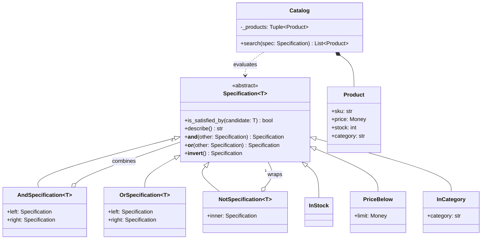

# Specification

## Intent

Encapsulate a business rule as an object that answers one question, `is_satisfied_by(candidate)`, and combine rules with *and*, *or* and *not* into bigger rules that have the same interface. The client filters with *a* rule and never learns how many leaves it has; a new rule is a new leaf, not another condition inside a `matches()` function that every caller shares.

## When to use and when not to

**Use it when**

- Rules are assembled at runtime from parts somebody else picks (a filter panel, a search form, a promotion editor); the combination is data you receive, not code you wrote.
- One rule is needed in several places (validate before saving, filter in search, select for a report), so it needs a name, equality and a single definition.
- You must do more than evaluate the rule: log it, explain a rejection, translate it to SQL. A tree of objects can be walked; a lambda is opaque.

**Leave it out when**

- There is one condition in one place: `if product.stock > 0 and product.price < limit` beats three objects.
- The "rule" produces a result (a price, an ordering) rather than a verdict; that is Strategy.
- Rules arrive as text and need parsing; that is Interpreter, of which Specification is the fixed-grammar special case.

## Structure

**A Composite of rules: each leaf answers one question, three nodes implement the algebra, and the client evaluates whichever tree it is handed.**



The composites hold other specifications and nothing else; they are the only place *and*, *or* and *not* occur. Leaves hold configuration and one comparison. `Catalog` depends on the abstract type alone; the dotted arrow says it never builds rules, only receives them.

## Canonical example in Python

The base class carries the algebra; the three composites are the whole of it (`code/patterns/specification.py`, tested by `code/patterns/tests/test_specification.py`):

```python title="code/patterns/specification.py — the interface, the operators and the three composites"
--8<-- "code/patterns/specification.py:specification"
```

Four decisions to say out loud:

- **`ABC`, not `Protocol`, and the operators are the reason.** Strategy's interface is one method, so structural typing wins there. Here every rule must also *compose*, and the three operator methods are shared code: an ABC hands them to every subclass, including one defined inside a test.
- **`&`, `|`, `~` because `and`, `or`, `not` cannot be overloaded.** PEP 335 proposed it and was rejected; Django's `Q` and SQLAlchemy's clauses made the same choice for the same reason.
- **Frozen dataclasses make rules values.** `InStock() & PriceBelow(x) == InStock() & PriceBelow(x)`, so you can memoise by rule, deduplicate filter trees and share one rule across every request thread without a lock.
- **`describe()` is abstract on purpose.** The tree is data: the walk that renders `(in_stock AND price < 100.00 USD)` can just as well render `WHERE stock > 0 AND price < 10000` and push the work to the database. Three leaves over 1M products is 3M evaluations; at the 100 ns of one memory reference each that is 0.3 s before interpreter overhead, against one indexed query.

The leaves, the client and the fold come next:

```python title="code/patterns/specification.py — leaves, the client and reduce over &"
--8<-- "code/patterns/specification.py:leaves"
```

`Catalog.search` is the only loop in the module. `all_of` folds whatever a filter panel collected with `reduce(and_, specs)`: three ticked boxes become one tree. Short-circuiting is inherited from Python's `and`, so put the cheap leaf on the left.

Running `python -m patterns.specification` prints:

```text
--- (in_stock AND price < 100.00 USD) ---
  B-1  Python Cookbook   45.00 USD
  T-2  Chess Set         60.00 USD
  E-2  USB-C Hub         25.00 USD
--- (((in_stock AND price < 100.00 USD) AND NOT category = electronics) OR category = books) ---
  B-1  Python Cookbook   45.00 USD
  B-2  Collectors Atlas  180.00 USD
  T-2  Chess Set         60.00 USD
--- a filter panel folds its selections with all_of(...) ---
  ((in_stock AND price < 100.00 USD) AND category = electronics)
  matches: ['E-2']
  rules are values: rebuilt tree == panel -> True
--- functional variant: plain predicates, same answers ---
  bargain  classes and predicates agree: True
  gift     classes and predicates agree: True
```

## Pythonic variant

A rule with one method is a function. `Callable[[T], bool]` is the whole interface, closures carry the configuration that dataclass fields carried above, and three tiny combinators replace the composite classes:

```python title="code/patterns/specification.py — the same rules as predicates"
--8<-- "code/patterns/specification.py:functional"
```

- **`filter(pred, products)` is the catalogue**, and `every`/`some` are `all`/`any` with the candidate bound later.
- **The two forms mix.** A specification is callable, so `every(in_stock, InStock() & under_100)` works.
- **What you give up** is everything that made the tree data: two identical lambdas are unequal, nothing can be printed or translated, and a failing rule cannot say which leaf failed.

| Reach for | When |
|---|---|
| An inline `and`/`or` expression | One condition, one call site |
| Predicates plus `every`, `some`, `negate` | Several reusable conditions, evaluated in-process only |
| Frozen dataclass leaves with `&`, `|`, `~` | Rules built from user input, shared across services, or needing a name, equality or a log line |
| Leaves plus a translator (Visitor or `match`) | The same rule must run inside a database or a search engine |

Draw the class diagram, then say "in Python I would start with predicates and promote them to specifications the day a rule has to be named, compared or translated".

## Real-world usage

- **Django `Q` objects**: `Product.objects.filter(Q(stock__gt=0) & Q(price__lt=100) | ~Q(category="toys"))`. The tree is never evaluated in Python; the ORM walks it and emits SQL. Same operators, same rejected PEP behind them.
- **SQLAlchemy** clauses (`and_`, `or_`, `not_`, or `&`, `|`, `~` on columns) and **pandas** masks (`df[(df.stock > 0) & (df.price < 100)]`) use the same trick, with the trap that `&` binds tighter than `<`, hence the parentheses.
- **Standard library**: `pytest -k "cart and not slow"` is a specification over test names; `logging.Filter` is a leaf rule over records; `fnmatch` and `re` compile a textual rule into a predicate; `functools.reduce` with `operator.and_` is the fold.
- **Domain-driven design**: Evans and Fowler's paper named the pattern and split its uses into selection, validation and construction-to-order.

## Related patterns and confusions

| Looks like Specification | How to tell them apart |
|---|---|
| **Strategy** | A strategy computes a result (a price, an ordering); a specification returns a verdict and composes with other verdicts. A specification often chooses *which* strategy applies. |
| **Interpreter** | Specification is an Interpreter with a fixed grammar (and, or, not over leaves) built with operators rather than parsed from text. When the rules arrive as strings from a config file, add a parser and you are in Interpreter. |
| **Composite** | The structure *is* Composite: `AndSpecification` is the composite node, the leaves are leaves, the client treats both alike. Specification is Composite applied to predicates, plus the operator overloads. |
| **Chain of Responsibility** | A chain passes a request along handlers until one *handles* it; no specification node owns the candidate, every node is asked and the answers are combined. |
| **Decorator** | `NotSpecification` wraps one rule behind the same interface, like a Decorator, but it inverts the answer instead of adding a responsibility; the point is the algebra, not the wrapping. |
| **Visitor** | The moment you render the tree as SQL as well as evaluating it, you want a second operation over the same nodes without editing them: Visitor, or `match` on the node type. |

## Where it appears in LLD problems

- [Design Stack Overflow](../problems/stack-overflow.md) — search filters (tagged, unanswered, score above a threshold) that users combine freely; the "bounty eligible" rule shared by the UI and a nightly job.
- [Design LinkedIn (social network)](../problems/linkedin.md) — people search such as second-degree connections at the same company, and feed eligibility rules.
- [Design Amazon (cart, order, inventory, payment)](../problems/ecommerce-order-inventory.md) — catalogue filters and promotion eligibility (`CartTotalAbove(x) & ~ContainsGiftCard()`).
- [Design a rate limiter (LLD)](../problems/rate-limiter-lld.md) — matching a request to its rule (`PathMatches("/api/*") & ClientTier("free")`) before a limit is applied.

## Interview tips

!!! tip "Interview tip"
    Start with the leaf and the question: "every rule answers `is_satisfied_by(product)`; the filter panel combines leaves with `&` and `|` into one rule the catalogue evaluates." Then show what the tree buys: print it for the audit log, translate it to SQL so the database does the work, test each leaf alone. Close with the Python caveat: `and`/`or` cannot be overloaded.

!!! warning "Common mistake"
    A `matches(product, filters: dict)` function that grows an `if "max_price" in filters` branch per filter. It is the ladder the pattern removes, and it cannot express *or* or *not* without another rewrite. Runner-up: leaves that query a database or mutate state. A specification must be a pure function of its candidate, or equality, memoisation and thread-safety are gone.

## Related

- [Interpreter](interpreter.md) — the same tree with a parser and an open grammar
- [Strategy](strategy.md) — an algorithm with a result, not a verdict
- [Composite](composite.md) — the structure underneath the algebra
- [Design Stack Overflow](../problems/stack-overflow.md) — user-combined search filters
- [Design Amazon (cart, order, inventory, payment)](../problems/ecommerce-order-inventory.md) — catalogue and promotion rules
- [Eric Evans and Martin Fowler, *Specifications* (1997)](https://martinfowler.com/apsupp/spec.pdf)
- [Django documentation: Complex lookups with Q objects](https://docs.djangoproject.com/en/stable/topics/db/queries/#complex-lookups-with-q-objects)
- [PEP 335 — Overloadable Boolean Operators (rejected)](https://peps.python.org/pep-0335/)
