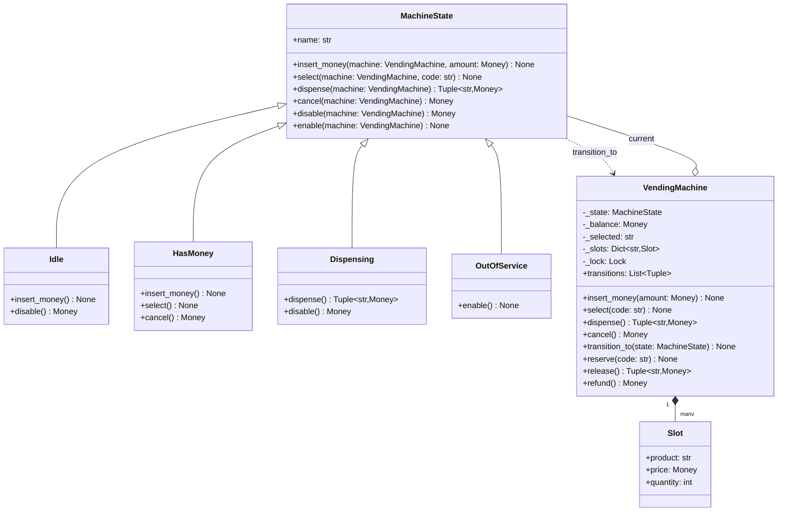
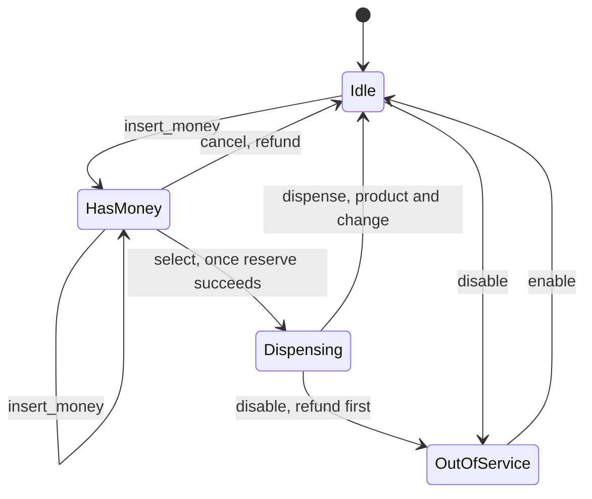

# State

## Intent

Let an object behave differently as its lifecycle moves, without a growing `if self.status == ...` ladder in every method. Each state is an object that accepts the events legal for it, rejects the rest, and moves the context to its successor. The transitions become explicit, drawable and testable, which is what the interviewer really wants once an entity has three or more statuses.

## When to use and when not to

**Use it when**

- The entity has three or more statuses and the legal events differ per status: a vending machine, an order, an ATM session, a traffic light.
- The same event means different things in different states: `disable` on an idle machine switches it off; mid-dispense it must refund first.
- Illegal events must be rejected loudly, with a message naming the current state.
- The follow-up "what if they press cancel while it is dispensing" should be answered by one method on one class.

**Leave it out when**

- Two states and a boolean covers it (`is_open`).
- Only a label varies, not behaviour: a status enum plus a transition table is enough.
- The client picks the variant and it never moves by itself: that is Strategy.
- The transitions live in a workflow engine or another service; model the table, not the classes.

## Structure

**Three roles: the Context that owns the data, a State base class that rejects every event, and one subclass per state that accepts its events and triggers the transition.**



`MachineState` rejects every event with `InvalidStateError`; each subclass overrides only the cells of the state-event matrix it accepts, so the matrix is readable from the class bodies. States hold no data, so a fresh `Idle()` per transition is correct and cheap.

**The same machine as a lifecycle: every arrow is one overriding method, every missing arrow is a rejection.**



## Canonical example in Python

The states come first (`code/patterns/state.py`, tested by `code/patterns/tests/test_state.py`):

```python title="code/patterns/state.py — the base state and the four concrete states"
--8<-- "code/patterns/state.py:states"
```

Three decisions to say out loud:

- **The base class rejects; subclasses accept.** Adding `OutOfService` to an `if/elif` design touches every event method; here it is one new class and two overrides. The rejection names the state, which is the message a test asserts.
- **Validate before you transition.** `HasMoney.select` asks the machine to `reserve` the slot first; a bad code, an empty slot or a short balance raises, and the machine stays in `HasMoney` with its balance intact. The transition is the last statement of a handler, never the first.
- **States are stateless.** Balance, stock and the selection live on the machine, so states never need resetting. `Dispensing` reads the selected code from the machine, which is why the machine is passed into every handler.

The context does two jobs, holding the data and serialising events:

```python title="code/patterns/state.py — the context"
--8<-- "code/patterns/state.py:context"
```

Each public event is one delegation under `_lock`, so check-and-transition is atomic: sixty-four threads racing to `select` produce exactly one `Dispensing`, which is the concurrency test. The helpers below the events run with the lock already held and must not lock again. `transitions` records every move as a pair for tests to assert.

Running `python -m patterns.state` prints:

```text
--- happy path: coins in, a selection, the motor confirms ---
insert 1.00 USD          -> HasMoney, balance 1.00 USD
insert 1.00 USD          -> HasMoney, balance 2.00 USD
select A1 (cola 1.50)    -> Dispensing
dispense                 -> Idle, tray: cola, change 0.50 USD
--- every other event is refused by the state, not by an if-ladder in the machine ---
select A1                rejected: cannot select while Idle (still Idle)
dispense                 rejected: cannot dispense while Idle (still Idle)
insert 0.50 USD          -> HasMoney, balance 0.50 USD
select B2 (sold out)     rejected: chips is sold out (still HasMoney)
select A1 (cola 1.50)    rejected: insert 1.00 USD more for cola (still HasMoney)
cancel                   -> Idle, refunded 0.50 USD
--- maintenance: only an idle machine can be taken offline ---
disable                  -> OutOfService
insert 1.00 USD          rejected: cannot insert money while OutOfService (still OutOfService)
enable                   -> Idle
transitions: Idle -> HasMoney -> Dispensing -> Idle -> HasMoney -> Idle -> OutOfService -> Idle
--- the same lifecycle as an Enum and a transition table ---
idle + insert -> has_money
has_money + select -> dispensing
dispensing + dispense -> idle
idle + dispense -> rejected: cannot dispense while idle
has_money + select with 0.50 USD against 1.50 USD -> rejected: insert 1.00 USD more
```

## Pythonic variant

When the per-state behaviour is a line or two, four classes are ceremony. The whole lifecycle fits in a table, and an `Enum` plus a table is the form most production code uses:

```python title="code/patterns/state.py — the lifecycle as an Enum and a transition table"
--8<-- "code/patterns/state.py:table"
```

- **The table is the specification.** A reviewer reads eight lines and sees every legal move; the state diagram above is a rendering of this mapping. A missing key is the rejection, so there is no default branch to forget.
- **`match` when a transition has a guard.** `next_status_guarded` keeps the table for the unguarded cells and adds the balance check to one case. Guards are where classes start earning their keep again, because a guard needs data the table does not hold.
- **The data stays with the caller.** `next_status` is pure; a machine in this style keeps `status: Status` and assigns the result after its own validation. `StrEnum` prints and persists as the string the database column holds.

| Reach for | When |
|---|---|
| A boolean | Two states, no illegal event worth naming |
| `Enum` + transition table | Three or more states, thin behaviour, a table that must be reviewed or persisted |
| `match` on (status, event) | A few guarded transitions on top of the table |
| One class per state | Entry and exit actions, per-state data, or handlers long enough to want their own tests |

Draw the state diagram first whichever form you write; it is the artefact the interviewer checks your code against.

## Real-world usage

- **TCP** is the textbook machine (`LISTEN`, `SYN-SENT`, `ESTABLISHED`, `TIME-WAIT`): the same segment means different things per state, and the kernel implements the table.
- **`http.client.HTTPConnection`** tracks idle, request-started and request-sent, and raises `CannotSendRequest` or `ResponseNotReady` for out-of-order calls: the enum-plus-rejection form in the standard library.
- **`concurrent.futures.Future` and `asyncio.Future`**: pending, running, cancelled, finished; `set_result` on a finished future raises `InvalidStateError`, the same error name this handbook uses.
- **Workflow engines**: a persisted `status` column plus a transition table; django-fsm's `@transition(source, target)` and AWS Step Functions definitions are reviewable tables.

## Related patterns and confusions

| Looks like State | How to tell them apart |
|---|---|
| **Strategy** | The same picture, a context delegating to a swappable object, so ask *who switches*. With Strategy the client picks a rule up front and the rules do not know each other exist; with State the object switches itself as events arrive, and each state knows its successors. |
| **Template Method** | Varies the steps of one algorithm by subclassing, fixed when the class is written. State varies the whole response to an event, at runtime, by swapping the delegate. |
| **Memento** | State swaps behaviour as the lifecycle moves; Memento swaps data back to an earlier snapshot. A memento may well contain the status enum. |
| **Chain of Responsibility** | One current object handles every event and switches itself; nothing is forwarded along a line. |
| **A status field with checks** | `if self.status == Status.IDLE` inside every method is the ladder this pattern removes. The table form centralises the checks; the class form deletes them. |

## Where it appears in LLD problems

- [Design a vending machine (and a coffee machine)](../problems/vending-machine.md) — these four states are the core.
- [Design an ATM](../problems/atm.md) — a six-state session; the PIN-attempt counter lives on the session, not the state.
- [Design a traffic signal controller](../problems/traffic-signal.md) — timed `RED`, `GREEN`, `YELLOW` with a no-conflicting-greens guard.
- [Design an elevator system](../problems/elevator-system.md) — idle, moving and doors-open per car.
- [Design a movie ticket booking system (BookMyShow)](../problems/movie-ticket-booking.md) — a seat held, booked or released on a timer.
- [Design Amazon (cart, order, inventory, payment)](../problems/ecommerce-order-inventory.md) — the order lifecycle as a persisted table.
- [Design a payment gateway and digital wallet](../problems/payment-gateway-wallet.md) — payment statuses with idempotent retries.

## Interview tips

!!! tip "Interview tip"
    Draw the state diagram before the class diagram, and put the rejections on it as well as the arrows: "cancel while dispensing is refused; disable while dispensing refunds first." Then say which form you would write, "an Enum and a table, promoted to classes if a state grows entry actions or its own data", and name the test: every (state, event) pair, legal ones move, the rest raise `InvalidStateError`.

!!! warning "Common mistake"
    `if self.status == Status.HAS_MONEY:` repeated inside every method. It is the ladder with extra steps: transitions are scattered, a new state touches every method, and nobody can see which pairs are legal. Put the pairs in one place, a table or a class per state. Runner-up: transitioning before validating, so a failed selection leaves the machine in `Dispensing` with nothing to dispense.

## Related

- [Strategy](strategy.md) — the delegate the client switches
- [Template Method](template-method.md) — variation by subclassing, fixed when the class is written
- [Design a vending machine (and a coffee machine)](../problems/vending-machine.md) — this machine inside a full problem
- [Design an ATM](../problems/atm.md) — a six-state session with the same shape
- [Design a traffic signal controller](../problems/traffic-signal.md) — timed transitions with a safety guard
- Gamma, Helm, Johnson and Vlissides, *Design Patterns* (1994), State
- [RFC 9293 — Transmission Control Protocol (TCP), state machine overview](https://www.rfc-editor.org/rfc/rfc9293)
- [Python documentation: `enum` — `StrEnum`](https://docs.python.org/3/library/enum.html#enum.StrEnum)
