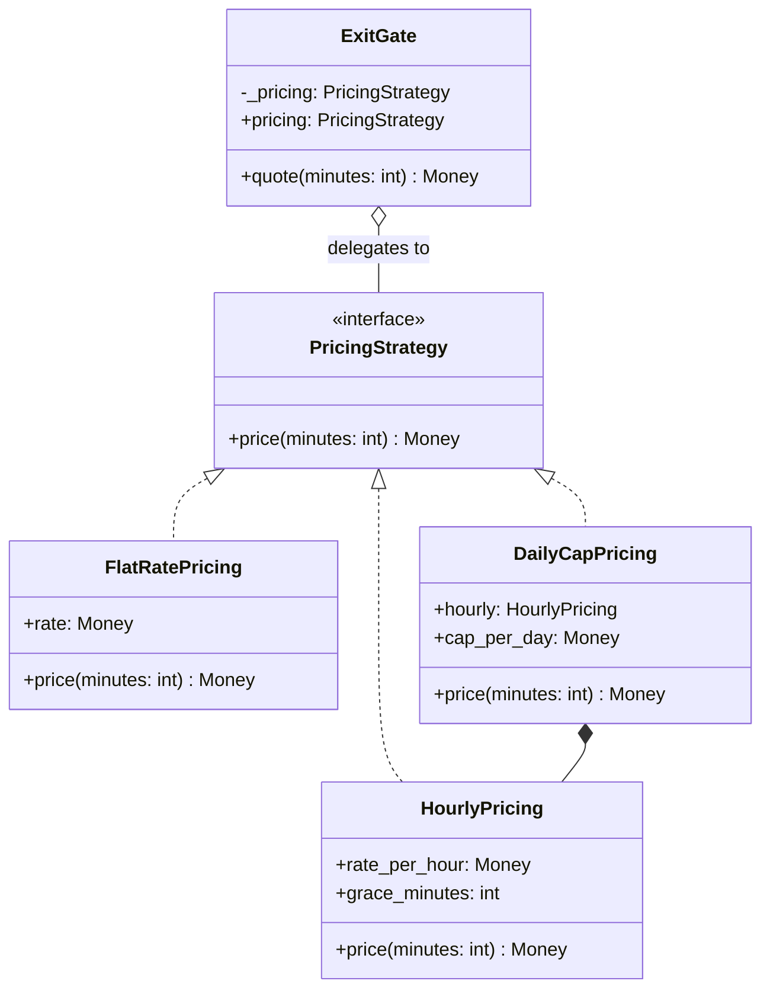

# Strategy

## Intent

Define a family of interchangeable algorithms, give every member the same interface, and let the caller pick one at runtime. The code that *uses* the algorithm stops changing when you add a variant: a new pricing rule is a new class (or function), not another branch in an `if/elif` ladder that every gate in the building shares.

## When to use and when not to

**Use it when**

- The follow-up is predictable ("now add a daily cap", "now prefer spots near the gate"): what the interviewer will ask you to change goes behind a Strategy.
- You want to test the algorithm in isolation or swap in a fake; a `RecordingStrategy` in a test is the same move as `FlatRatePricing` in production.
- Each variant carries configuration (rates, caps, grace periods) to validate once, at construction.

**Leave it out when**

- There is one algorithm and no credible second; add the seam when the second rule arrives.
- The variation is a parameter, not an algorithm: hourly at 3.00 and hourly at 4.00 are one strategy with one argument.
- The variant needs the context's private state; then the algorithm belongs in the context, or you want Template Method hooks.
- Behaviour changes with the object's lifecycle (active, paying, paid): that is State, where the object switches itself.

## Structure

**Three roles: the Strategy interface, one concrete class per rule, and a Context that holds a reference and delegates.**



`ExitGate` never asks which rule it holds; it calls `price` and trusts the answer. `DailyCapPricing` composes `HourlyPricing` rather than subclassing it: a cap is a rule wrapped around hourly pricing, not a kind of it. The dotted arrows are realisation, not inheritance; Python checks the shape, not the parent.

## Canonical example in Python

The interface and the three rules come first (`code/patterns/strategy.py`, tested by `code/patterns/tests/test_strategy.py`):

```python title="code/patterns/strategy.py — the interface and three concrete strategies"
--8<-- "code/patterns/strategy.py:strategy"
```

Three decisions to say out loud:

- **`Protocol`, not `ABC`.** The rules never inherit from `PricingStrategy`; they qualify by having a matching `price` method, and so does a test double defined inside a test. `@runtime_checkable` lets a test assert `isinstance(HourlyPricing(), PricingStrategy)`.
- **Frozen dataclasses as strategies.** A strategy is configuration plus one method. `frozen=True` makes it a value: hashable, comparable, a readable `repr`, and safe to share across gates and threads because nothing on it changes after construction.
- **Composition for the cap.** `DailyCapPricing` holds an `HourlyPricing` and calls it for the leftover hours of the last day; subclassing would weld the cap to one hourly implementation.

The Context is deliberately thin:

```python title="code/patterns/strategy.py — the context"
--8<-- "code/patterns/strategy.py:context"
```

It validates once, so no rule repeats the check, and exposes the rule as a property so an operator can switch from the weekday rule to the event rule while cars are queuing. The swap is one attribute assignment and needs no lock, because the rules hold no mutable state; a quote in flight finishes with the rule it started with.

Running `python -m patterns.strategy` prints:

```text
--- a 2h35m stay, priced by each rule ---
   HourlyPricing: 9.00 USD
 FlatRatePricing: 10.00 USD
 DailyCapPricing: 9.00 USD
--- a 26h00m stay, priced by each rule ---
   HourlyPricing: 78.00 USD
 FlatRatePricing: 10.00 USD
 DailyCapPricing: 26.00 USD
--- event night: the same gate switches rules at runtime ---
weekday rule: 2h35m -> 9.00 USD
event rule:   2h35m -> 10.00 USD
--- functional variant: the rules as callables, ranked with sorted(key=) ---
      flat: 10.00 USD
 daily_cap: 26.00 USD
    hourly: 78.00 USD
rejected: a stay cannot be negative
```

## Pythonic variant

A Strategy with one method is a function. Python supplies the interface, `Callable[[int], Money]`, and closures carry the configuration that dataclass fields carried above:

```python title="code/patterns/strategy.py — the same rules as callables"
--8<-- "code/patterns/strategy.py:functional"
```

- **Closures replace constructors.** `hourly(rate, grace_minutes)` captures its configuration and returns the rule; the call site cannot tell the two forms apart.
- **Dict dispatch replaces the factory.** `rules_by_name()` maps a configuration string to a rule; a new rule is a new entry.
- **`sorted(key=)` is the Strategy you already use.** The key function is an injected ordering algorithm; `ranked` passes `operator.itemgetter(1)`, and every `key=lambda` you have written was a strategy handed to a context.

A bound method is a callable too, so the two forms compose without an adapter:

```python
capped = daily_cap(HourlyPricing().price, cap=Money.of("20.00"))
assert capped(26 * 60) == DailyCapPricing().price(26 * 60)
```

When is the function enough?

| Reach for | When |
|---|---|
| A plain function or lambda | One method, no configuration, no name needed in logs or diagrams |
| A closure such as `hourly(rate)` | One method plus configuration fixed at creation |
| A frozen dataclass with `price` | You want equality, a readable `repr`, validation in `__post_init__`, or a second method |
| A `Protocol` declaring `__call__` | Instances and plain functions must satisfy one type hint |

Draw the class diagram, then say "in Python I would start with a callable and promote it to a class when it grows configuration or a second method".

## Real-world usage

- **`json`** ships both forms: `json.dumps(obj, cls=MyEncoder)` injects a `JSONEncoder` subclass whose `default` method decides how unknown objects serialise; `json.dumps(obj, default=fn)` injects the same decision as a function.
- **`logging.Formatter`** is a `Handler`'s rendering strategy: `handler.setFormatter(JsonFormatter())` changes how every record renders, at runtime, and the handler never learns what changed. `logging.Filter` does the same for the accept-or-drop decision.
- **`sorted`, `min`, `max`, `heapq.nlargest`** take `key=`; `functools.cmp_to_key` adapts a comparator strategy into a key strategy.
- **Frameworks**: Django's `PASSWORD_HASHERS` and cache backends, Django REST Framework's `pagination_class` and `throttle_classes`, SQLAlchemy's `poolclass`.

## Related patterns and confusions

| Looks like Strategy | How to tell them apart |
|---|---|
| **State** | Both delegate to a swappable object, so ask *who switches*. With Strategy the client picks a rule and the rules do not know each other exist; with State the object switches itself as events arrive (a vending machine going idle, has-coin, dispensing). |
| **Template Method** | Same goal, opposite mechanism: a skeleton in a base class (`BoardGame.play`) with steps overridden per subclass, fixed when the class is written. Strategy replaces the whole algorithm by composition, at runtime. |
| **Bridge** | The same picture, an abstraction holding an implementor, but Bridge lets *two* hierarchies vary independently. One axis of variation is Strategy; two is Bridge. |
| **Command** | A command is a request (verb plus arguments, often with `undo`) that can be queued or logged; a strategy is one way of performing a single operation. |
| **Decorator** | `DailyCapPricing` wrapping `HourlyPricing` is half a Decorator: same interface, one extra rule. A true Decorator stacks on *any* implementation; the cap wraps one specific inner type. |
| **Null Object** | A `FreeParking` rule whose `price` returns zero deletes every `if pricing is None` from the gate: a strategy that does nothing. |
| **Factory Method** | The factory *chooses* a strategy from a name; the strategy *is* the behaviour. The dict in `rules_by_name` is the smallest factory there is. |

## Where it appears in LLD problems

- [Design a parking lot](../problems/parking-lot.md) — `PricingStrategy` and `SpotAllocationStrategy`; every extensibility answer there is a new strategy.
- [Design Splitwise](../problems/splitwise.md) — `SplitStrategy` for equal, exact, percentage and share-based splits.
- [Design an in-memory cache (LRU, LFU, TTL)](../problems/in-memory-cache.md) — `EvictionPolicy` (LRU, LFU, FIFO) behind `get` and `put`.
- [Design a rate limiter (LLD)](../problems/rate-limiter-lld.md) — token bucket, fixed window and sliding window behind one `allow(key)`.
- [Design an elevator system](../problems/elevator-system.md) — `DispatchStrategy` (FCFS, SCAN/LOOK, nearest car) in the controller.
- [Design a food delivery system (Swiggy, Zomato, DoorDash)](../problems/food-delivery.md) — `AssignmentStrategy` for couriers, `DiscountStrategy` for coupons.
- [Design Uber (LLD) with driver matching](../problems/ride-sharing-lld.md) — `MatchingStrategy` (nearest, ETA, rating) and surge pricing.

## Interview tips

!!! tip "Interview tip"
    Name the axis of change before you name the pattern: "pricing is what they will ask me to change, so it goes behind a `PricingStrategy` Protocol injected into the gate." Then add the two sentences that mark an SDE2: which test you would write for the next rule, and when a plain callable would do instead.

!!! warning "Common mistake"
    Moving the `if/elif` ladder instead of removing it. A context whose `quote` does `if self.mode == "hourly": ...` has three classes' worth of ceremony and none of the benefit. Selection happens once, in the composition root (`main`, a settings file, a dict lookup); the context only ever calls `price`. Runner-up: a strategy with mutable per-call state shared across threads.

## Related

- [State](state.md) — the delegate that switches itself
- [Template Method](template-method.md) — the inheritance-based alternative
- [Null Object](null-object.md) — a strategy that does nothing
- [Dependency Injection](dependency-injection.md) — how the chosen strategy reaches the context
- [Design a parking lot](../problems/parking-lot.md) — pricing and allocation strategies in a full problem
- [Design Splitwise](../problems/splitwise.md) — split strategies over money
- Gamma, Helm, Johnson and Vlissides, *Design Patterns* (1994), Strategy
- [PEP 544 — Protocols: Structural subtyping](https://peps.python.org/pep-0544/)
- [Python documentation: Sorting Techniques](https://docs.python.org/3/howto/sorting.html)
