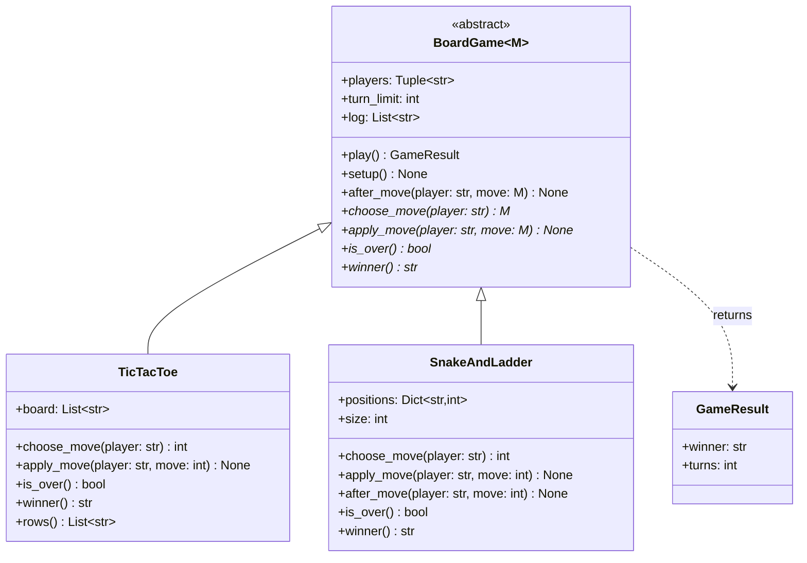

# Template Method

## Intent

Define the skeleton of an algorithm once, in a base-class method, and defer the steps that vary to subclasses. `BoardGame.play` decides that every game sets up, alternates turns until it is over and reports a result; tic-tac-toe and snake and ladder decide only what a move is, how it is applied and when the game ends. The order is fixed where it is written, never in a subclass.

## When to use and when not to

**Use it when**

- Several implementations share one sequence of steps and differ in one or two of them: games, request handlers, test cases, batch jobs.
- An invariant must run every time and must not be left to the implementer: the turn limit, the log, the lock, the setup and teardown pair.
- You hand a framework to others and keep the control flow: they write `do_GET`, you own `handle`.

**Leave it out when**

- The variable step is one function and there is no shared state: pass a callable (the `play_turns` form below).
- Steps must be swapped at runtime or combined freely: Strategy composes; inheritance fixes the combination when the class is written.
- You are adding a hook for a second subclass that does not exist yet; inheritance is the hardest seam to undo.
- The template has grown a dozen hooks with ordering rules between them; that is a pipeline or a workflow engine.

## Structure

**Three roles: the abstract class with the template method, the primitive operations it calls (abstract steps and hooks), and one concrete subclass per variant.**



`play` is the template method: it calls four abstract steps (starred) and two hooks, and nothing else about the flow is visible. `TicTacToe` takes the hooks' defaults; `SnakeAndLadder` overrides `after_move` to log positions. `M` is the move type, so each game's steps are typed with its own moves.

## Canonical example in Python

The skeleton comes first (`code/patterns/template_method.py`, tested by `code/patterns/tests/test_template_method.py`):

```python title="code/patterns/template_method.py — the template method, its hooks and its abstract steps"
--8<-- "code/patterns/template_method.py:template"
```

Three decisions to say out loud:

- **Abstract steps versus hooks.** `choose_move`, `apply_move`, `is_over` and `winner` are `@abstractmethod`: a game that forgets one fails at construction with `TypeError`, not at turn forty. `setup` and `after_move` are hooks with a harmless default; a subclass overrides them only when it cares, and calls `super()` when it wants the default as well.
- **The invariant lives in the skeleton.** Turn rotation, the turn limit and the log are written once. A game that cannot end (every roll overshoots the last square) hits `turn_limit` and raises from the base class; no subclass had to think about it.
- **`play` is never overridden.** The runtime does not enforce `final`; `typing.final` tells the type checker and the docstring tells the human. The contract is "override the steps, not the sequence".

The games are only their rules:

```python title="code/patterns/template_method.py — two games, one skeleton"
--8<-- "code/patterns/template_method.py:games"
```

`TicTacToe` overrides `setup` to reset the board and calls `super().setup()` so the log is cleared too, the hook-with-super idiom. `SnakeAndLadder` validates its jumps in the constructor (off the board, chained into another jump) so the steps can trust them. A third game is another subclass, and the turn limit and the log come for free.

Running `python -m patterns.template_method` prints:

```text
--- tic-tac-toe: the skeleton runs a scripted game ---
  OOX
   XX
  O X
log: X -> 4, O -> 0, X -> 2, O -> 6, X -> 5, O -> 1, X -> 8
result: X wins after 7 turns
a full board with no line: winner=None after 9 turns
--- snake and ladder: the same skeleton, different steps, seeded dice ---
  Ann rolled 6 -> 6
  Bob rolled 1 -> 1
  Ann rolled 1 -> 7
  ... 61 more turns
result: Bob wins after 64 turns
--- closures: the skeleton as a function, same seed, same game ---
result: Bob wins after 64 turns
--- a rule violation surfaces from a step; the skeleton stays untouched ---
rejected: cell 4 is taken
```

## Pythonic variant

When the variable part is a step or two and there is no state to share between steps, a function that takes the steps as arguments is the same pattern with less ceremony:

```python title="code/patterns/template_method.py — the skeleton as a function"
--8<-- "code/patterns/template_method.py:functional"
```

- **Callables instead of overrides.** `play_turns` is `BoardGame.play` with the steps as parameters. The closure form of snake and ladder is a dozen lines and plays exactly the game the class plays; the test runs both with the same seed.
- **Closures replace `self`.** `positions` is captured, not stored; there is no class to name and no hook to document.
- **`functools.partial` is the smallest configured step.** `partial(random.Random(42).randint, 1, 6)` is a seeded die in one expression.

| Reach for | When |
|---|---|
| A function taking callables | One or two variable steps, no shared mutable state, nothing to override later |
| A context manager | The skeleton is setup, work, teardown: `with` already is the template |
| An ABC with abstract steps and hooks | Several steps sharing state, or a framework others will extend |
| Strategy objects inside a concrete class | The steps must be swapped at runtime or tested in isolation |

## Real-world usage

- **`unittest.TestCase.run`** calls `setUp`, the test method and `tearDown` in a fixed order; you override the hooks, never `run`.
- **`http.server.BaseHTTPRequestHandler`**: `handle` parses the request and dispatches to `do_GET` or `do_POST` by name; a missing verb gets a 501. `socketserver.BaseRequestHandler` runs `setup`, `handle`, `finish` the same way.
- **`collections.abc.MutableMapping`**: implement `__getitem__`, `__setitem__`, `__delitem__`, `__iter__` and `__len__`, and `pop`, `setdefault`, `update` and `clear` arrive as template methods written in terms of them.
- **`logging.Handler.handle`** filters the record, takes the handler lock and calls your `emit`; the lock is the invariant, `emit` is the step.
- **Frameworks**: Django class-based views (`dispatch` calls `get` or `post`; `get_queryset` and `get_context_data` are hooks), Django REST Framework's generic views.

## Related patterns and confusions

| Looks like Template Method | How to tell them apart |
|---|---|
| **Strategy** | Same goal, opposite mechanism. Template Method varies steps by inheritance, fixed when the class is written; Strategy replaces the whole algorithm by composition, at runtime. `choose_move` delegating to a `MoveStrategy` is both at once: the skeleton is a template, the move policy is a strategy. |
| **State** | State varies the whole response to an event by swapping the delegate at runtime, and each state knows its successors. A template's subclass is chosen once and never changes during `play`. |
| **Factory Method** | A Factory Method is a Template Method whose variable step *creates an object*: a `new_board` hook returning the subclass's board would be one. |
| **Hook versus abstract step** | An abstract step has no sensible default and every subclass writes it; a hook has a default and most subclasses ignore it. Confusing them gives either `NotImplementedError` at runtime or hooks nobody knows exist. |
| **Decorator** | Adds behaviour around a call from the outside and stacks; a template adds behaviour around steps from the inside, fixed at class level. |

## Where it appears in LLD problems

- [Design tic-tac-toe (an extensible board game)](../problems/tic-tac-toe.md) — `BoardGame.play` with a `WinChecker` behind `is_over` and a `MoveStrategy` behind `choose_move`.
- [Design snake and ladder](../problems/snake-and-ladder.md) — the same base; the dice is a strategy and jumps are applied in `apply_move`.
- [Design a bowling alley](../problems/bowling-alley.md) — the frame loop and tenth-frame bonus rolls as the skeleton, scoring as a step.
- [Design an ATM](../problems/atm.md) — validate, perform, print receipt, shared by withdrawal, deposit and transfer.
- [Design a payment gateway and digital wallet](../problems/payment-gateway-wallet.md) — validate, reserve, call the provider, record the outcome: the same four steps for card, UPI and wallet.

## Interview tips

!!! tip "Interview tip"
    When two problems share a loop, say the base-class sentence first: "`play` owns setup, turn rotation, the end check and the turn limit; each game implements `choose_move`, `apply_move`, `is_over` and `winner`." Then pre-empt the objection: "the move policy inside `choose_move` is a Strategy, so bots and humans are injected, not subclassed." Star the abstract methods on the diagram.

!!! warning "Common mistake"
    Putting the variation in the wrong place. A subclass that overrides `play` to "just tweak the loop" has thrown the pattern away; the next subclass copies the tweak and the invariant drifts. Keep the skeleton closed and add a hook with a default instead. Runner-up: a tower of templates (game, board game, grid game, tic-tac-toe) where nobody can tell which level calls which; two levels is the limit, beyond it compose.

## Related

- [Strategy](strategy.md) — the composition-based alternative
- [State](state.md) — the delegate that switches itself
- [Design tic-tac-toe (an extensible board game)](../problems/tic-tac-toe.md) — the shared `BoardGame` base in a full problem
- [Design snake and ladder](../problems/snake-and-ladder.md) — the second game on the same skeleton
- [Design an ATM](../problems/atm.md) — a transaction skeleton shared by every transaction type
- Gamma, Helm, Johnson and Vlissides, *Design Patterns* (1994), Template Method
- [Python documentation: `abc` — Abstract Base Classes](https://docs.python.org/3/library/abc.html)
- [Python documentation: `unittest` — `TestCase.setUp` and `tearDown`](https://docs.python.org/3/library/unittest.html#unittest.TestCase.setUp)
