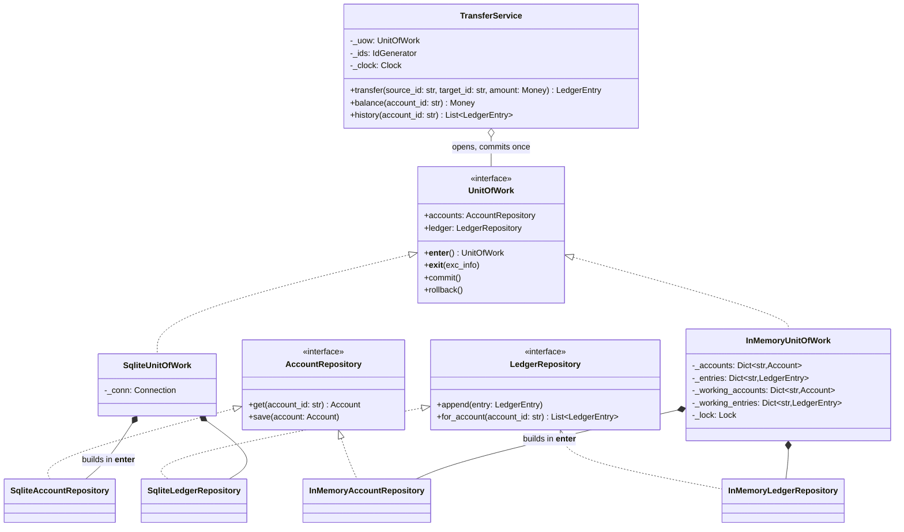
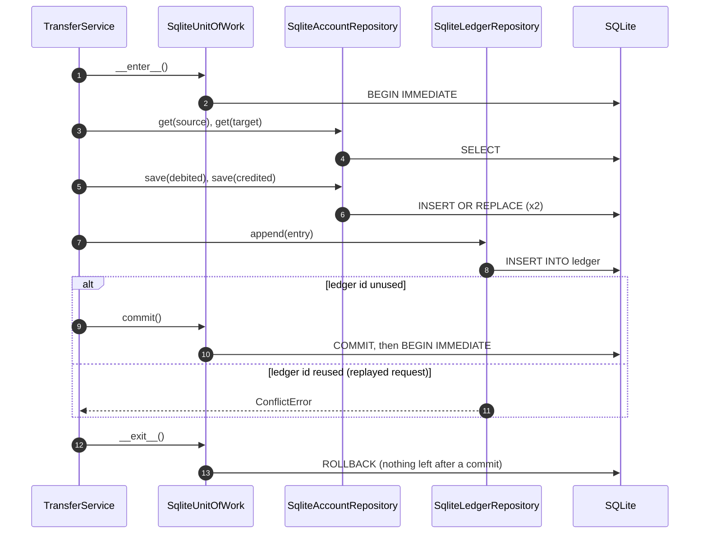

# Unit of Work

## Intent

Track everything one business operation changes and make those changes visible together or not at all. The service opens a unit of work, writes through the repositories it hands out and calls `commit()` once; the unit of work owns BEGIN, COMMIT and ROLLBACK, so domain code never spells them and can never leave a transfer half done.

## When to use and when not to

**Use it when**

- One operation writes through two or more repositories (debit, credit, ledger) and a failure between them must leave no trace.
- Your repositories commit nothing themselves, as the [Repository](repository.md) page recommends; one small class should own the transaction, not every service.
- You want a fake as atomic as production: a dict-backed unit of work that really discards uncommitted writes lets a test prove the rollback path.

**Leave it out when**

- The operation writes one entity through one repository; its atomic `add` or `update` already is the transaction.
- The writes span services or databases. No single transaction exists there; you need a saga or 2PC, and your commit becomes a compensating action.
- You want to group writes for throughput. That is buffering; a queue or a bulk insert names it honestly.

## Structure

**Four roles: the unit-of-work contract, one implementation per storage technology, the repositories each implementation binds to its open transaction, and the service that opens the boundary and commits once.**



`TransferService` holds one `UnitOfWork` and cannot tell the implementations apart. Each implementation builds its repositories inside `__enter__`, bound to the transaction it just opened, which is why they hang off the unit of work instead of being injected separately. `__exit__` always rolls back; only an explicit `commit()` lets work survive the block.

## Canonical example in Python

Entities, repository contracts and the boundary come first (`code/patterns/unit_of_work.py`, tested by `code/patterns/tests/test_unit_of_work.py`):

```python title="code/patterns/unit_of_work.py — entities, repository contracts and the boundary"
--8<-- "code/patterns/unit_of_work.py:model"
```

Three decisions to say out loud:

- **Explicit commit, implicit rollback.** `__exit__` rolls back unconditionally, so a block that forgets `commit()` loses its work loudly in the first test instead of writing half a transfer in production. The opposite convention, commit on a clean exit, is what the `@contextmanager` version below does; name the one you chose.
- **The repositories belong to the unit of work.** They are created in `__enter__` against the open transaction and deleted in `__exit__`, so nobody can hold a repository that writes outside a boundary.
- **The ledger id is the idempotency key.** A replayed request reuses it, `append` raises after both balances were written, and the rollback is all that stands between you and a double debit.

The SQLite implementation is the one place that spells the transaction:

```python title="code/patterns/unit_of_work.py — the sqlite3 implementation"
--8<-- "code/patterns/unit_of_work.py:sqlite"
```

`connect` uses `autocommit=True`, switching off the driver's implicit transactions so that BEGIN, COMMIT and ROLLBACK appear in exactly one class. `BEGIN IMMEDIATE` takes the write lock when the block opens, so a lock upgrade cannot fail after the debit. `commit()` then opens a fresh transaction: a write after a commit still needs its own commit, the rule the fake enforces too.

The in-memory implementation is why the pattern earns its keep in tests. Writes go to a working copy of the committed dicts; `commit()` replaces the committed dicts with the copy and `rollback()` rebuilds the copy from them:

```python title="code/patterns/unit_of_work.py — the dict-backed implementation"
--8<-- "code/patterns/unit_of_work.py:in_memory"
```

The lock is held for the whole block, serialising units of work the way `BEGIN IMMEDIATE` serialises SQLite writers; every test runs against both classes, so the fake cannot drift into being friendlier than the database.

The service sees neither `sqlite3` nor dicts:

```python title="code/patterns/unit_of_work.py — the use case"
--8<-- "code/patterns/unit_of_work.py:service"
```

Validation runs before the block opens, so a bad request never takes the write lock. There is one `commit()`, on the last line; anything that raises before it, `InsufficientFundsError` included, leaves through `__exit__` and is rolled back.

**A transfer step by step: the commit path, and the replayed request that rolls back.**



Running `python -m patterns.unit_of_work` prints:

```text
--- transfers over the sqlite unit of work ---
txn-1: alice -> bob 30.00 USD; alice=70.00 USD bob=50.00 USD
rejected before any write: bob holds 50.00 USD, cannot debit 500.00 USD
rolled back after two writes: ledger entry txn-1 already exists
unchanged: alice=70.00 USD bob=50.00 USD
ledger for bob: ['txn-1']
--- transfers over the in-memory unit of work ---
txn-1: alice -> bob 30.00 USD; alice=70.00 USD bob=50.00 USD
rejected before any write: bob holds 50.00 USD, cannot debit 500.00 USD
rolled back after two writes: ledger entry txn-1 already exists
unchanged: alice=70.00 USD bob=50.00 USD
ledger for bob: ['txn-1']
--- @contextmanager variant: the boundary alone ---
block failed: power cut before commit
alice still has 70.00 USD
```

## Pythonic variant

When the boundary is all you need, a generator-based context manager is the whole pattern:

```python title="code/patterns/unit_of_work.py — the boundary alone"
--8<-- "code/patterns/unit_of_work.py:functional"
```

- **Commit on success, rollback on exception**, decided once by `try/except/else`; the body mentions neither.
- **`except BaseException`, not `Exception`**: a `KeyboardInterrupt` inside the block must roll back too.
- **The stdlib ships one.** `with conn:` on a `sqlite3.Connection` in its default transaction mode commits on a clean exit and rolls back on an exception; it does not close the connection.

| Reach for | When |
|---|---|
| `with conn:` | One connection, one repository, the driver's default transactions |
| `@contextmanager` `transaction(conn)` | BEGIN and COMMIT spelled out, or a fixed policy such as `BEGIN IMMEDIATE` |
| A `UnitOfWork` class | Several repositories share the transaction, or tests need an atomic fake |
| A saga | The writes cross a service boundary |


## Real-world usage

- **SQLAlchemy `Session`** uses the name: it tracks loaded objects in an identity map and `session.commit()` flushes every change as one transaction; `with Session(engine) as session, session.begin():` is the context-manager form.
- **Django `transaction.atomic()`** is a context manager and a decorator; nested blocks become savepoints.
- **`sqlite3.Connection`** as a context manager, plus the `autocommit` attribute added in Python 3.12 that this page relies on.
- **Cosmic Python's `AbstractUnitOfWork`** is the shape used here: repositories as attributes, explicit `commit()`, rollback in `__exit__`.

## Related patterns and confusions

| Looks like Unit of Work | How to tell them apart |
|---|---|
| **Repository** | The repository says *what* is stored; the unit of work says *when* the writes become visible, together. A repository that commits inside `add` cannot take part in one. |
| **A bare transaction** | `with conn:` is a transaction. A unit of work adds the repositories bound to it and, in ORMs, change tracking, so you never call `save` at all. |
| **Saga** | Compensating actions across services, because no shared transaction exists to roll back. A unit of work lives inside one database. |
| **Memento** | Memento snapshots one object to restore it; a unit of work collects many writes to discard them. |
| **Command with undo** | Undo replays an inverse operation after the fact; rollback discards writes that were never published. Undo is for users, rollback is for failures. |

## Where it appears in LLD problems

- [Design a payment gateway and digital wallet](../problems/payment-gateway-wallet.md) — this page's example: debit, credit and ledger entry commit together.
- [Design Splitwise](../problems/splitwise.md) — adding an expense updates the expense store and every member's balance in one unit of work.
- [Design Amazon (cart, order, inventory, payment)](../problems/ecommerce-order-inventory.md) — the other way round from what you might guess: checkout keeps inventory *outside* the unit of work and compensates with `release`, while `pay` wraps the gateway call, the payment row and the order transition in one `UnitOfWork`.
- [Design an in-memory key-value store with transactions](../problems/kv-store-transactions.md) — `BEGIN`, `COMMIT` and `ROLLBACK` over a dict: the working-copy technique, generalised to nested transactions.
- [Design a stock brokerage system](../problems/stock-brokerage.md) — a fill updates position, cash and trade log together.

## Interview tips

!!! tip "Interview tip"
    Name the boundary in one sentence: "the transfer is one unit of work: debit, credit and ledger append commit together or roll back together; the service opens it with `with` and commits once." Then add the two sentences that mark an SDE2: which test proves the rollback (fail after the second write, assert the first is gone) and what changes when the writes cross a service boundary (a saga, not a bigger transaction).

!!! warning "Common mistake"
    Repositories that commit inside `add`, so the second write can no longer be undone. Runner-up: a fake unit of work whose `rollback()` is `pass`, which keeps the tests green while the production rollback path stays untested.

## Related

- [Repository](repository.md) — the collections the unit of work binds to its transaction
- [Transactions, 2PC, sagas and idempotency](../../hld/fundamentals/transactions-and-distributed-transactions.md) — what replaces the commit when the writes cross services
- [Design Splitwise](../problems/splitwise.md) — expense plus balances in one unit of work
- [Design a payment gateway and digital wallet](../problems/payment-gateway-wallet.md) — the wallet transfer in a full problem
- [Dependency Injection](dependency-injection.md) — how the unit of work reaches the service
- Martin Fowler, *Patterns of Enterprise Application Architecture* (2002), Unit of Work
- [Cosmic Python, chapter 6: Unit of Work Pattern](https://www.cosmicpython.com/book/chapter_06_uow.html)
- [Python documentation: sqlite3 transaction control](https://docs.python.org/3/library/sqlite3.html#transaction-control)
